# Design Prompt Collection

High-refined prompts for **landing pages**, **animations**, and **design concepts**.

Each entry has a shared prompt brief; **model runs** live under `runs/<model-slug>/` (demo + screenshot) so models never overwrite each other.

| Entries | Model runs | Polished | Draft |
|--------:|-----------:|---------:|------:|
| 15 | 1 | 15 | 0 |

## Quick start

```bash
npm run ai:new -- -c landing-pages -n 3
npm run pipeline    # ai:build → shots → pages → README
```

README + `index.json` + `catalog.json` are **auto-generated** by `npm run build` / `shots` / `pipeline`.

Machine index: [`index.json`](./index.json) · Agents: [`AGENTS.md`](./AGENTS.md) · Automation: [`automation/README.md`](./automation/README.md)

---

## Landing Pages

### Forge and Roast Coffee Lab

A dark, industrial coffee-roaster landing page with ember-red accents, hard grid rules, product close-ups, and a quiet scroll sequence.

**Status:** polished · `coffee` `retail` `product` `industrial` `landing`

[prompt](prompts/landing-pages/forge-and-roast-coffee-lab/prompt.md) · [extended](prompts/landing-pages/forge-and-roast-coffee-lab/prompt.full.md)

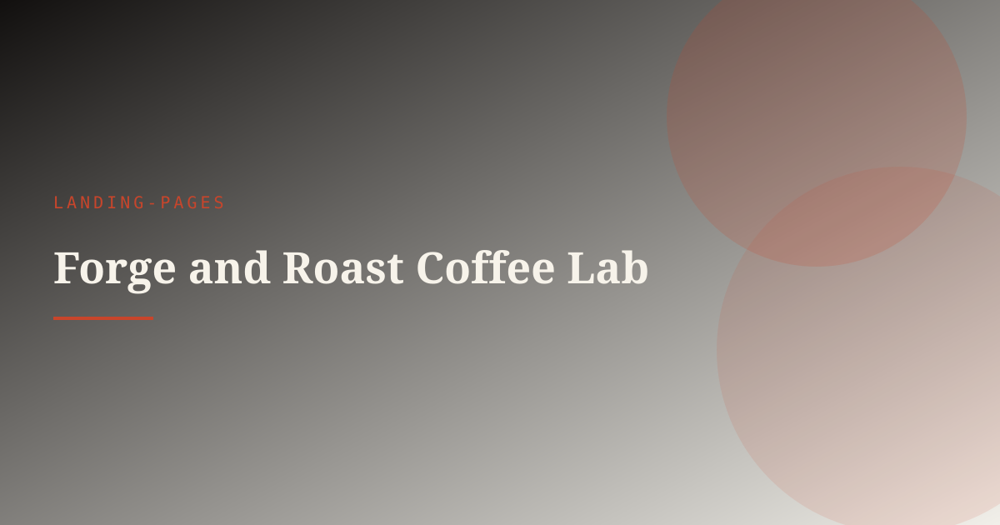

_No model runs yet — `npm run ai:build` then `npm run shots`._

---

### Halyard Marine Forecast

A weather-intelligence landing page for Halyard, a marine routing startup, built around a live route ribbon and cold, technical typography.

**Status:** polished · `maritime` `weather` `data-viz` `landing` `motion`

[prompt](prompts/landing-pages/halyard-marine-forecast/prompt.md) · [extended](prompts/landing-pages/halyard-marine-forecast/prompt.full.md)

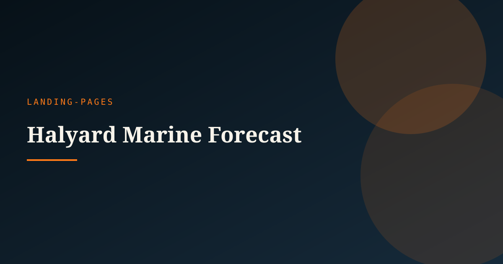

_No model runs yet — `npm run ai:build` then `npm run shots`._

---

### Kiln Commerce Drop

Product-drop landing for Kiln ceramics: object as full-bleed hero, restrained type, one purchase CTA — craft heat without rustic cliché.

**Status:** polished · `commerce` `product` `warm` `craft` `launch`

[prompt](prompts/landing-pages/kiln-commerce-drop/prompt.md) · [extended](prompts/landing-pages/kiln-commerce-drop/prompt.full.md)

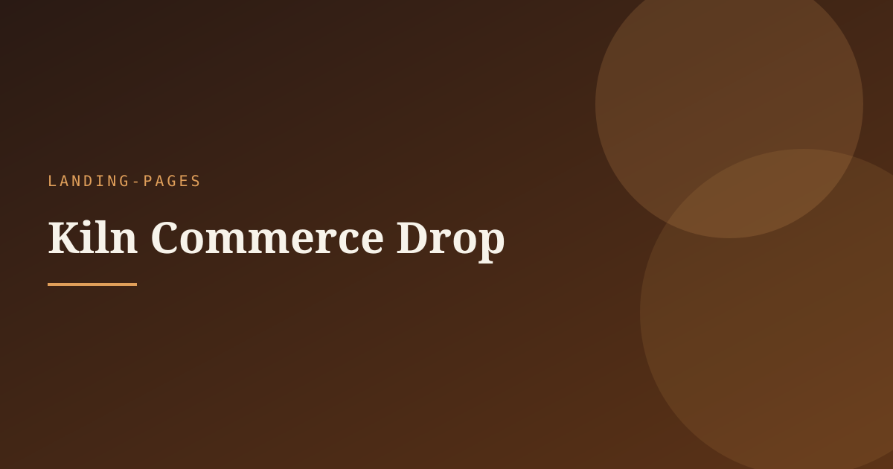

_No model runs yet — `npm run ai:build` then `npm run shots`._

---

### Northline Fintech Clarity

Trust-forward fintech landing: crisp north-light atmosphere, brand-led hero, one clarity promise — no purple glow, no dashboard soup.

**Status:** polished · `fintech` `clarity` `light` `trust` `saas`

[prompt](prompts/landing-pages/northline-fintech-clarity/prompt.md) · [extended](prompts/landing-pages/northline-fintech-clarity/prompt.full.md)

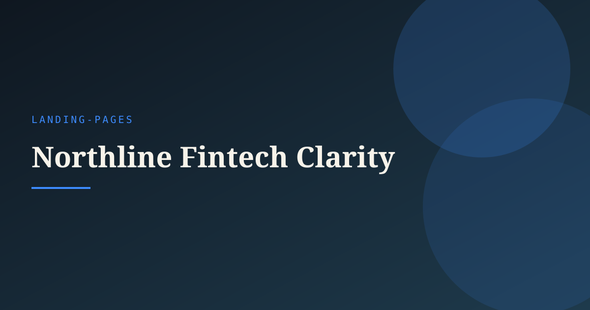

_No model runs yet — `npm run ai:build` then `npm run shots`._

---

### PulseLane Urban Mobility

A city mobility landing page for PulseLane, featuring animated route paths, kinetic type, and a high-contrast asphalt palette.

**Status:** polished · `urban` `transit` `maps` `motion` `landing`

[prompt](prompts/landing-pages/pulselane-urban-mobility/prompt.md) · [extended](prompts/landing-pages/pulselane-urban-mobility/prompt.full.md)

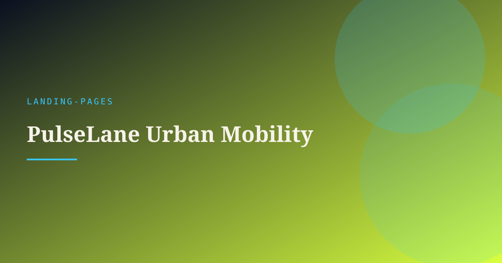

_No model runs yet — `npm run ai:build` then `npm run shots`._

---

### Tidal Studio Hero

Full-bleed coastal agency hero: brand-first, tide-line motion, no cards — only type, CTA, and water as the visual plane.

**Status:** polished · `agency` `hero` `ocean` `editorial` `motion`

[prompt](prompts/landing-pages/tidal-studio-hero/prompt.md) · [extended](prompts/landing-pages/tidal-studio-hero/prompt.full.md)

#### Model runs

| Preview | Model | Demo |
|:-------:|-------|------|
| 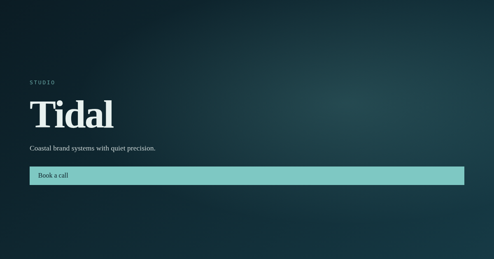 | `legacy` **(default)** | [open](prompts/landing-pages/tidal-studio-hero/runs/legacy/demo/index.html) |

---

## Animations

### Axiom Foundry Logo Morph

Brand motion for Axiom Foundry morphing a circular monogram into a wordmark with crisp SVG interpolation and metallic light sweep.

**Status:** polished · `logo-morph` `svg-animation` `brand-motion` `path-animation` `identity`

[prompt](prompts/animations/axiom-foundry-logo-morph/prompt.md) · [extended](prompts/animations/axiom-foundry-logo-morph/prompt.full.md)

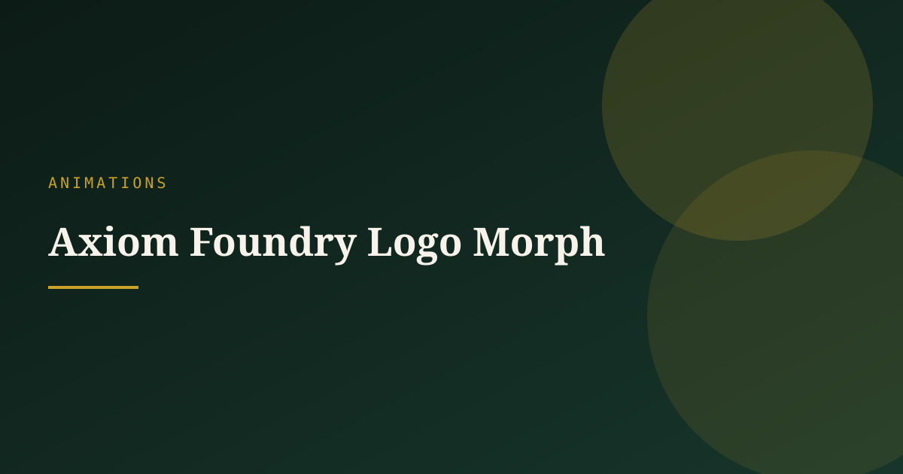

_No model runs yet — `npm run ai:build` then `npm run shots`._

---

### Magnetic Cursor Orbit

Nav labels gently orbit/attract toward the cursor with spring damping — tactile, premium, never gimmicky.

**Status:** polished · `cursor` `magnetic` `microinteraction` `nav` `js`

[prompt](prompts/animations/magnetic-cursor-orbit/prompt.md) · [extended](prompts/animations/magnetic-cursor-orbit/prompt.full.md)

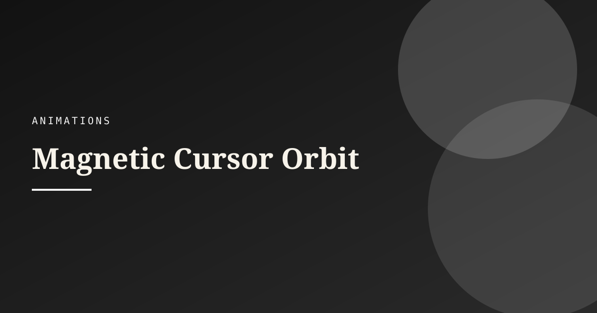

_No model runs yet — `npm run ai:build` then `npm run shots`._

---

### Magnetic Nav Rail

Cursor-bound navigation rail for Vector Harbor where items lean, scale, and magnetically dock under the pointer with elastic easing.

**Status:** polished · `magnetic-nav` `cursor-interaction` `navigation` `ui-motion` `web-animation`

[prompt](prompts/animations/magnetic-nav-rail/prompt.md) · [extended](prompts/animations/magnetic-nav-rail/prompt.full.md)

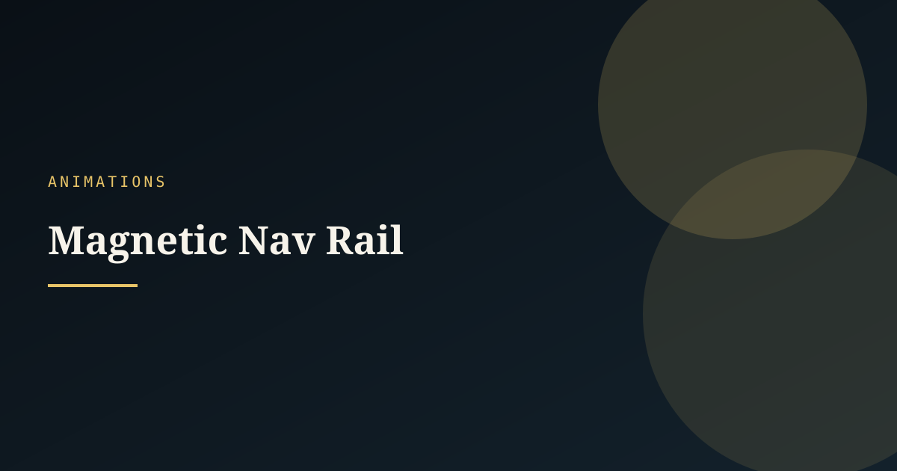

_No model runs yet — `npm run ai:build` then `npm run shots`._

---

### Obsidian Loom Mask Reveal

Scroll-driven mask reveal for Obsidian Loom where woven headline strips unfold from dark ink bands into a high-contrast product story.

**Status:** polished · `mask-reveal` `scroll-reveal` `editorial` `typography` `web-animation`

[prompt](prompts/animations/obsidian-loom-mask-reveal/prompt.md) · [extended](prompts/animations/obsidian-loom-mask-reveal/prompt.full.md)

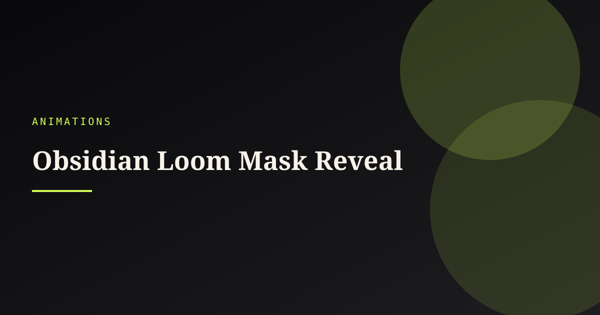

_No model runs yet — `npm run ai:build` then `npm run shots`._

---

### Parallax Depth Layers

Three-plane scroll parallax with depth fog — landscape storytelling that stays smooth and reduced-motion safe.

**Status:** polished · `parallax` `scroll` `depth` `landscape` `performance`

[prompt](prompts/animations/parallax-depth-layers/prompt.md) · [extended](prompts/animations/parallax-depth-layers/prompt.full.md)

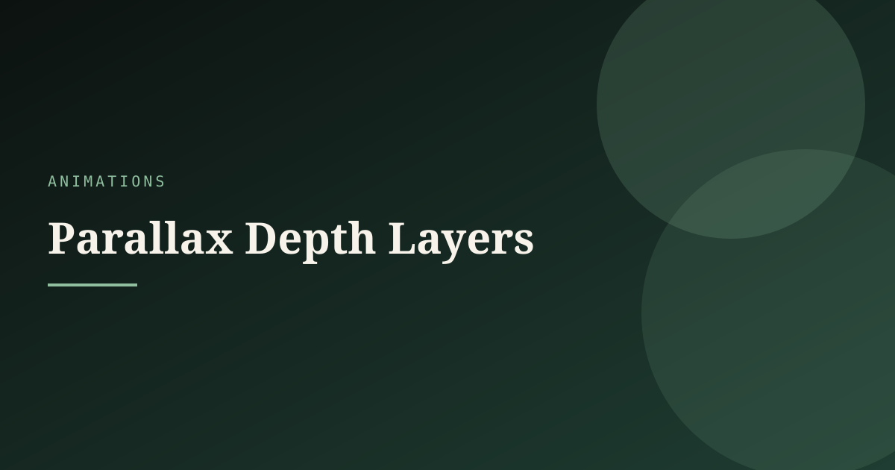

_No model runs yet — `npm run ai:build` then `npm run shots`._

---

### Staggered Mask Reveal

Editorial headline reveal via line masks and stagger — cinematic entrance without cheap fade templates.

**Status:** polished · `typography` `mask` `scroll` `entrance` `editorial`

[prompt](prompts/animations/staggered-mask-reveal/prompt.md) · [extended](prompts/animations/staggered-mask-reveal/prompt.full.md)

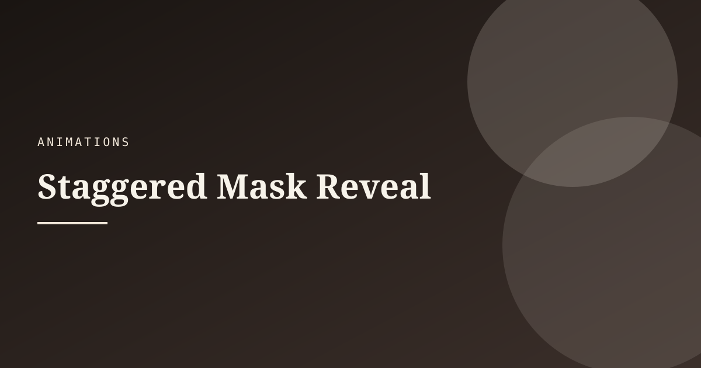

_No model runs yet — `npm run ai:build` then `npm run shots`._

---

## Concepts

### Editorial Brutalist System

Art-direction system: modular editorial brutalism — concrete grid, ink type, rules as structure, not decoration.

**Status:** polished · `system` `brutalist` `editorial` `type` `grid`

[prompt](prompts/concepts/editorial-brutalist-system/prompt.md) · [extended](prompts/concepts/editorial-brutalist-system/prompt.full.md)

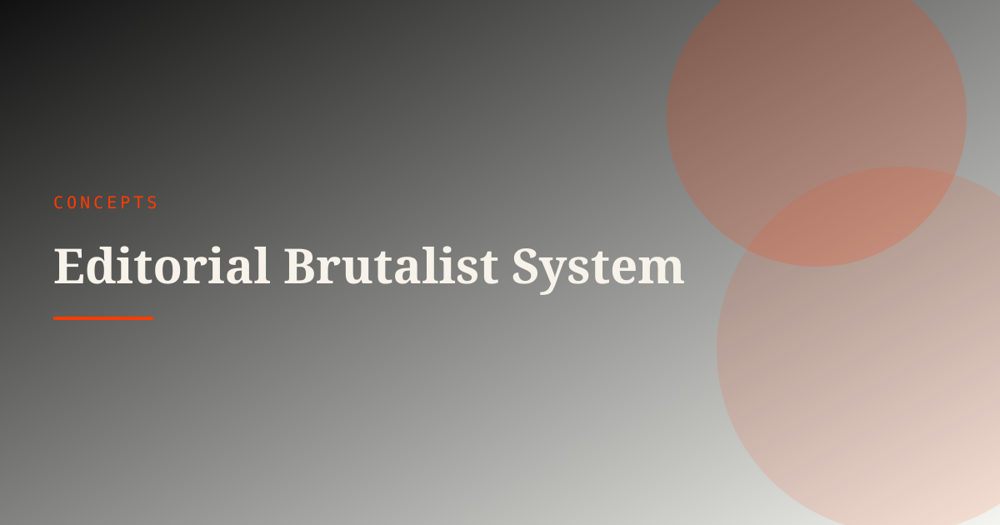

_No model runs yet — `npm run ai:build` then `npm run shots`._

---

### Nocturnal Garden Moodboard

Night-garden brand moodboard for Lumenflora: bioluminescent botanicals, velvet dark, restrained type specimens.

**Status:** polished · `moodboard` `garden` `nocturnal` `atmosphere` `brand`

[prompt](prompts/concepts/nocturnal-garden-moodboard/prompt.md) · [extended](prompts/concepts/nocturnal-garden-moodboard/prompt.full.md)

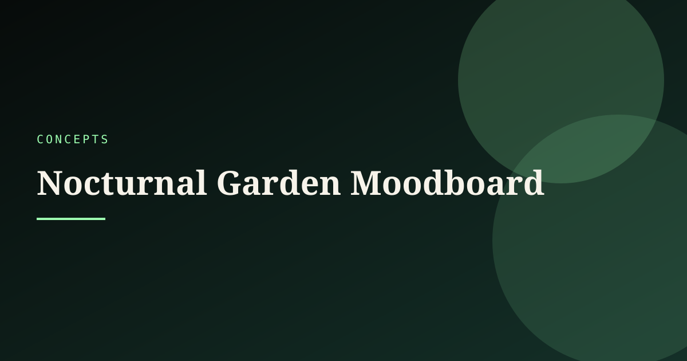

_No model runs yet — `npm run ai:build` then `npm run shots`._

---

### Soft Industrial Toolkit

Design toolkit blending soft UI radii with industrial material cues — aluminum, porcelain, quiet warning stripes.

**Status:** polished · `system` `industrial` `soft` `product` `tokens`

[prompt](prompts/concepts/soft-industrial-toolkit/prompt.md) · [extended](prompts/concepts/soft-industrial-toolkit/prompt.full.md)

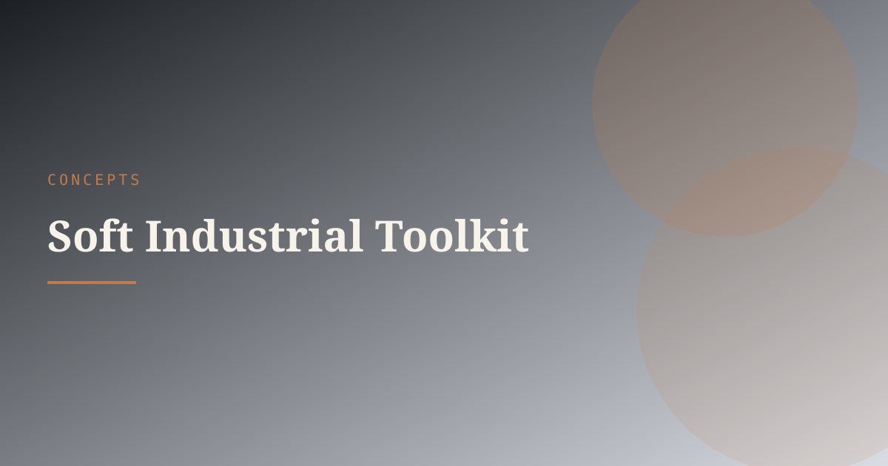

_No model runs yet — `npm run ai:build` then `npm run shots`._

---

## Repo layout

```
prompts/<category>/<id>/
  meta.yaml
  prompt.md / prompt.full.md
  preview.svg                 # placeholder until first shot
  runs/<model-slug>/
    meta.yaml                 # model + provider + timestamps
    demo/index.html           # implementation for THAT model
    preview.png               # screenshot for THAT model
```

## Automation

| Command | Purpose |
|---------|---------|
| `npm run ai:new` | New prompt briefs (stores `source_model`) |
| `npm run ai:build` | Build `runs/<model>/` demo (no overwrite across models) |
| `npm run shots` | Screenshot each run → README |
| `npm run pages` | Static site `site/dist` |
| `npm run pipeline` | build → shots → pages → index |
| `npm run build` | validate + regenerate README / index / catalog |

Other AIs should read `AGENTS.md` and write entries that pass `npm run build`.
