# Design Prompt Collection

High-refined prompts for **landing pages**, **animations**, **concepts**, **games**, **webgl**, **editorial**, and **interfaces**.

Each entry has a shared prompt brief; **model runs** live under `runs/<model-slug>/` (demo + screenshot) so models never overwrite each other.

| Entries | Model runs | Polished | Draft |
|--------:|-----------:|---------:|------:|
| 186 | 185 | 154 | 32 |

## Quick start

```bash
npm run ai:new -- -c landing-pages -n 3
npm run pipeline    # ai:build → shots → pages → README
```

README + `index.json` + `catalog.json` are **auto-generated** by `npm run build` / `shots` / `pipeline`.

Machine index: [`index.json`](./index.json) · Agents: [`AGENTS.md`](./AGENTS.md) · Automation: [`automation/README.md`](./automation/README.md)

---

## Landing Pages

### Anodized Aluminum Heatsink Fins

A landing page for 'Thermal Flow', a high-end audio amplifier brand, where the hero is a macro view of aluminum heatsink fins that gently sway like wind chimes when hovered, visualizing airflow and cooling capacity.

**Status:** polished · `thermal` `aluminum` `cooling` `geometry` `industrial-design` `heat-dissipation` `matte-grey` · brief by `Qwen3.8-Flash-Next-UD-Q4_K_XL`

[prompt](prompts/landing-pages/anodized-aluminum-heatsink-fins/prompt.md) · [extended](prompts/landing-pages/anodized-aluminum-heatsink-fins/prompt.full.md)

#### Model runs

| Preview | Model | Engine | Think | Ctx | In | Out | TTFT | Gen | Score | Demo |
|:-------:|-------|--------|:-----:|----:|---:|----:|-----:|----:|------:|------|
| 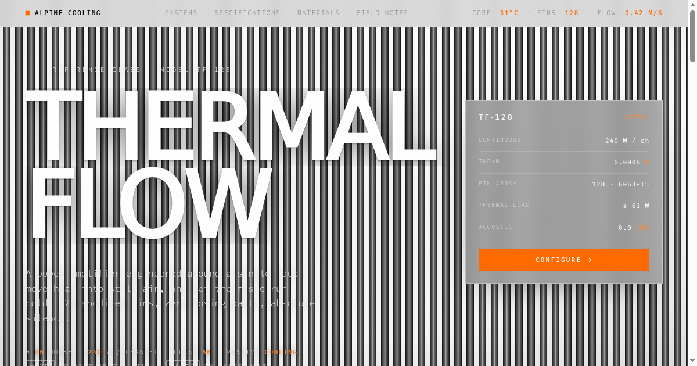 | `Qwen3.8-Flash-Next-UD-Q4_K_XL` | [gufo](https://github.com/gufo-org/gufo) | off | — | — | — | 372ms | 248s | 6 | [open](prompts/landing-pages/anodized-aluminum-heatsink-fins/runs/qwen3-8-flash-next-ud-q4-k-xl/demo/index.html) · default |

---

### Apothecary Cabinet Organization

A landing page for 'Cabinet & Code', a digital knowledge management tool. The interface mimics a physical library card catalog or apothecary cabinet with sliding drawers and precise indexing.

**Status:** polished · `library` `cabinet` `organization` `north-light` `serif` `trust` `indexing` · brief by `Qwen3.8-Flash-Next-UD-Q4_K_XL`

[prompt](prompts/landing-pages/apothecary-cabinet-organization/prompt.md) · [extended](prompts/landing-pages/apothecary-cabinet-organization/prompt.full.md)

#### Model runs

| Preview | Model | Engine | Think | Ctx | In | Out | TTFT | Gen | Score | Demo |
|:-------:|-------|--------|:-----:|----:|---:|----:|-----:|----:|------:|------|
| 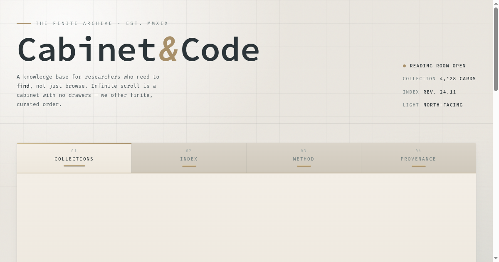 | `Qwen3.8-Flash-Next-UD-Q4_K_XL` | [gufo](https://github.com/gufo-org/gufo) | off | — | — | — | 166ms | 390s | 6 | [open](prompts/landing-pages/apothecary-cabinet-organization/runs/qwen3-8-flash-next-ud-q4-k-xl/demo/index.html) · default |

---

### Archer Scope Stabilization

A precision archery gear site where the hero is a scope view. Content is blurred until the user 'breathes' (click/hold) to stabilize the image into sharp focus.

**Status:** polished · `archery` `focus` `blur` `green` `black` `target` `zen` · brief by `Qwen3.8-Flash-Next-UD-Q4_K_XL`

[prompt](prompts/landing-pages/archer-scope-stabilization/prompt.md) · [extended](prompts/landing-pages/archer-scope-stabilization/prompt.full.md)

#### Model runs

| Preview | Model | Engine | Think | Ctx | In | Out | TTFT | Gen | Score | Demo |
|:-------:|-------|--------|:-----:|----:|---:|----:|-----:|----:|------:|------|
| 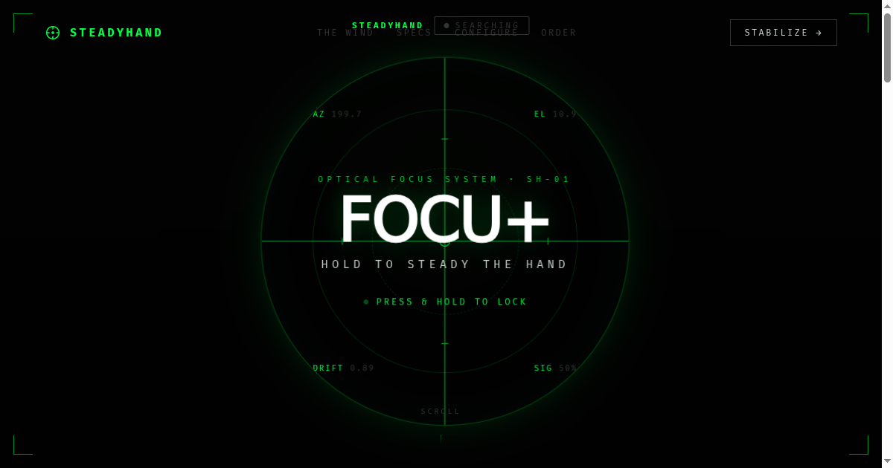 | `Qwen3.8-Flash-Next-UD-Q4_K_XL` | [gufo](https://github.com/gufo-org/gufo) | off | — | — | — | 1.3s | 409s | 9 | [open](prompts/landing-pages/archer-scope-stabilization/runs/qwen3-8-flash-next-ud-q4-k-xl/demo/index.html) · default |

---

### Barista Pour-Over Precision

A high-end coffee equipment landing page focused on the physics of pour-over brewing. Features fluid dynamics animations, technical specs, and a sterile, clinical aesthetic with steam accents.

**Status:** polished · `coffee` `pour-over` `precision` `flow` `water` `minimal` `hospitality` · brief by `Qwen3.8-Flash-Next-UD-Q4_K_XL`

[prompt](prompts/landing-pages/barista-pour-over-precision/prompt.md) · [extended](prompts/landing-pages/barista-pour-over-precision/prompt.full.md)

#### Model runs

| Preview | Model | Engine | Think | Ctx | In | Out | TTFT | Gen | Score | Demo |
|:-------:|-------|--------|:-----:|----:|---:|----:|-----:|----:|------:|------|
| 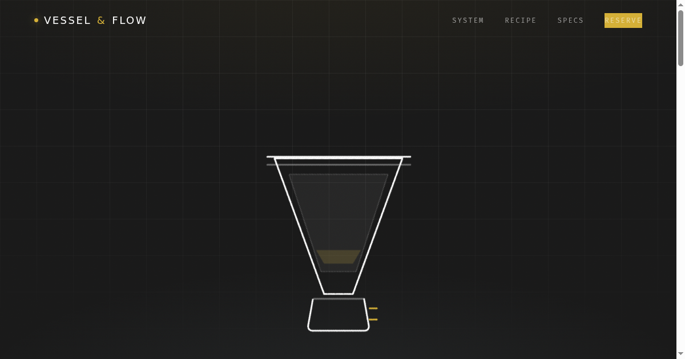 | `Qwen3.8-Flash-Next-UD-Q4_K_XL` | [gufo](https://github.com/gufo-org/gufo) | off | — | — | — | 1.5s | 198s | 6 | [open](prompts/landing-pages/barista-pour-over-precision/runs/qwen3-8-flash-next-ud-q4-k-xl/demo/index.html) · default |

---

### Beacon Signal Nav

A dark-mode navigation landing page using rotating light beams, radar-like interfaces, and high-visibility safety greens.

**Status:** polished · `maritime` `navigation` `signal` `light` `minimalist` · brief by `qwen3.8-flash-next`

[prompt](prompts/landing-pages/beacon-signal-nav/prompt.md) · [extended](prompts/landing-pages/beacon-signal-nav/prompt.full.md)

#### Model runs

| Preview | Model | Engine | Think | Ctx | In | Out | TTFT | Gen | Score | Demo |
|:-------:|-------|--------|:-----:|----:|---:|----:|-----:|----:|------:|------|
|  | `Qwen3.8-Flash-Next-UD-Q4_K_XL` | [gufo](https://github.com/gufo-org/gufo) | off | — | — | — | — | 5.7s | 9 | [open](prompts/landing-pages/beacon-signal-nav/runs/qwen3-8-flash-next-ud-q4-k-xl/demo/index.html) · default |

---

### Blueprint Titling Block

A landing page for 'Draft & Scale', a structural engineering firm, using the strict formatting of an architectural drawing's titling block to organize content.

**Status:** polished · `blueprint` `engineering` `titling-block` `technical` `cyan` `grid` `drafting` `structured` · brief by `Qwen3.8-Flash-Next-UD-Q4_K_XL`

[prompt](prompts/landing-pages/blueprint-titling-block/prompt.md) · [extended](prompts/landing-pages/blueprint-titling-block/prompt.full.md)

#### Model runs

| Preview | Model | Engine | Think | Ctx | In | Out | TTFT | Gen | Score | Demo |
|:-------:|-------|--------|:-----:|----:|---:|----:|-----:|----:|------:|------|
| 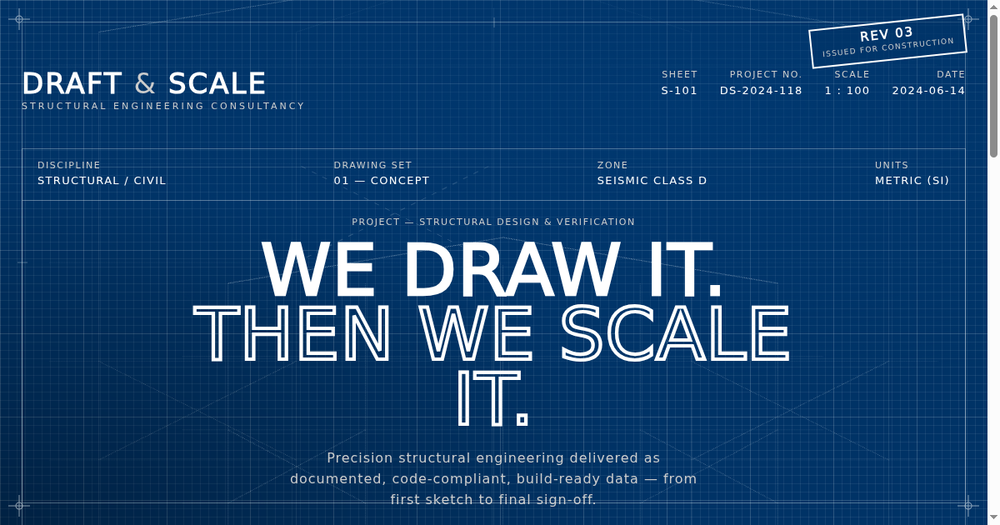 | `Qwen3.8-Flash-Next-UD-Q4_K_XL` | [gufo](https://github.com/gufo-org/gufo) | off | — | — | — | 1.3s | 387s | 8 | [open](prompts/landing-pages/blueprint-titling-block/runs/qwen3-8-flash-next-ud-q4-k-xl/demo/index.html) · default |

---

### Boulangerie Crumb Structure

A bakery landing page visualizing bread crumb structure as architecture, using warm beige tones, irregular grids, and soft, airy motion to convey lightness and fermentation time.

**Status:** polished · `bread` `bakery` `crumb` `porous` `warm` `tactile` `artisanal` · brief by `Qwen3.8-Flash-Next-UD-Q4_K_XL`

[prompt](prompts/landing-pages/boulangerie-crumb-structure/prompt.md) · [extended](prompts/landing-pages/boulangerie-crumb-structure/prompt.full.md)

#### Model runs

| Preview | Model | Engine | Think | Ctx | In | Out | TTFT | Gen | Score | Demo |
|:-------:|-------|--------|:-----:|----:|---:|----:|-----:|----:|------:|------|
| 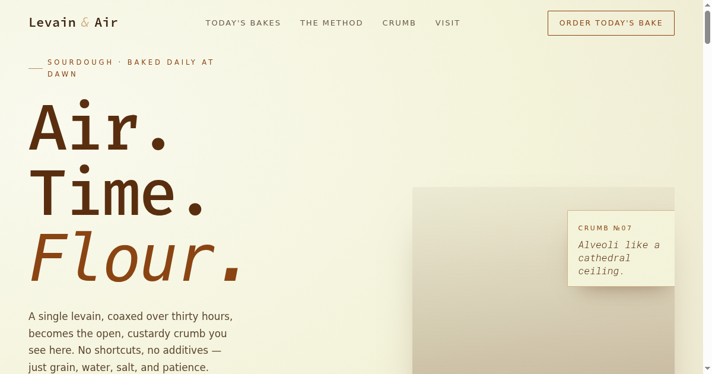 | `Qwen3.8-Flash-Next-UD-Q4_K_XL` | [gufo](https://github.com/gufo-org/gufo) | off | — | — | — | 1.6s | 226s | 6 | [open](prompts/landing-pages/boulangerie-crumb-structure/runs/qwen3-8-flash-next-ud-q4-k-xl/demo/index.html) · default |

---

### Broadsheet Column Cascade

A landing page for 'The Daily Wire' news aggregator. Multi-column newspaper layout with justified text, drop caps, and 'breaking news' ticker tape.

**Status:** polished · `newspaper` `columns` `typography` `editorial` `news` `monochrome` `layout` · brief by `Qwen3.8-Flash-Next-UD-Q4_K_XL`

[prompt](prompts/landing-pages/broadsheet-column-cascade/prompt.md) · [extended](prompts/landing-pages/broadsheet-column-cascade/prompt.full.md)

#### Model runs

| Preview | Model | Engine | Think | Ctx | In | Out | TTFT | Gen | Score | Demo |
|:-------:|-------|--------|:-----:|----:|---:|----:|-----:|----:|------:|------|
| 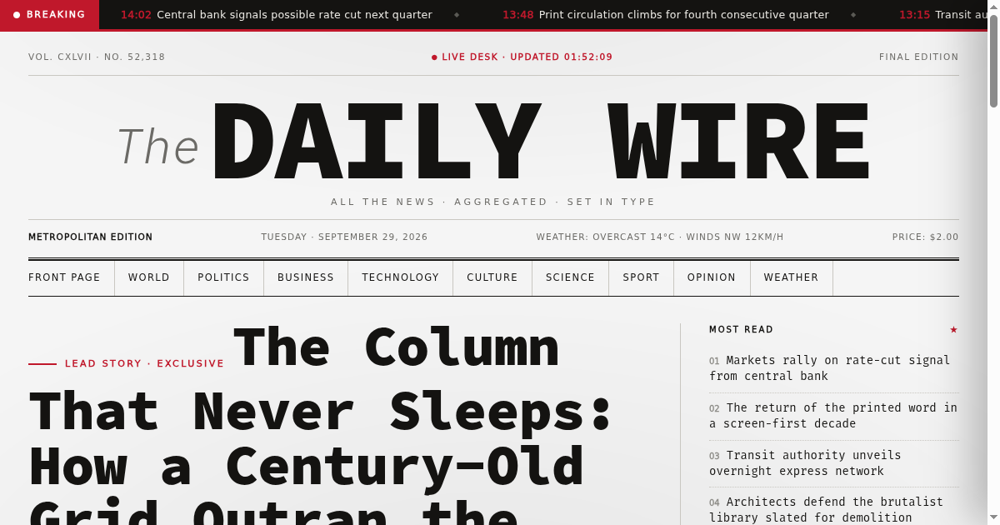 | `Qwen3.8-Flash-Next-UD-Q4_K_XL` | [gufo](https://github.com/gufo-org/gufo) | off | — | — | — | 1.1s | 677s | 9 | [open](prompts/landing-pages/broadsheet-column-cascade/runs/qwen3-8-flash-next-ud-q4-k-xl/demo/index.html) · default |

---

### Brushed Steel Knob Rail

A landing page for 'Rail & Knob', a premium cabinet hardware brand. The hero features a horizontal rail with draggable steel knobs that snap into place with magnetic resistance, revealing product details on click.

**Status:** polished · `hardware` `knobs` `brushed-steel` `rail` `interactive` `industrial` `tactile` `monochrome` · brief by `Qwen3.8-Flash-Next-UD-Q4_K_XL`

[prompt](prompts/landing-pages/brushed-steel-knob-rail/prompt.md) · [extended](prompts/landing-pages/brushed-steel-knob-rail/prompt.full.md)

#### Model runs

| Preview | Model | Engine | Think | Ctx | In | Out | TTFT | Gen | Score | Demo |
|:-------:|-------|--------|:-----:|----:|---:|----:|-----:|----:|------:|------|
| 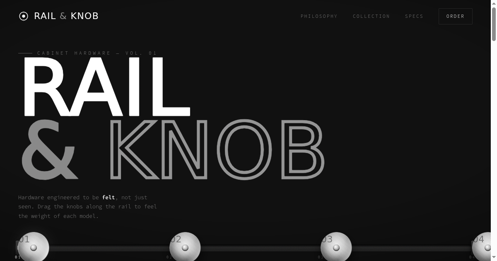 | `Qwen3.8-Flash-Next-UD-Q4_K_XL` | [gufo](https://github.com/gufo-org/gufo) | off | — | — | — | 1.6s | 601s | 9 | [open](prompts/landing-pages/brushed-steel-knob-rail/runs/qwen3-8-flash-next-ud-q4-k-xl/demo/index.html) · default |

---

### Butcher Block Grain Map

A landing page for 'Cleaver & Co.', a professional knife brand, using wood grain topography as a visual map where knives 'cut' through the texture to reveal product details.

**Status:** polished · `butcher` `wood-grain` `knife` `steel` `topography` `cut` `precision` · brief by `Qwen3.8-Flash-Next-UD-Q4_K_XL`

[prompt](prompts/landing-pages/butcher-block-grain-map/prompt.md) · [extended](prompts/landing-pages/butcher-block-grain-map/prompt.full.md)

#### Model runs

| Preview | Model | Engine | Think | Ctx | In | Out | TTFT | Gen | Score | Demo |
|:-------:|-------|--------|:-----:|----:|---:|----:|-----:|----:|------:|------|
| 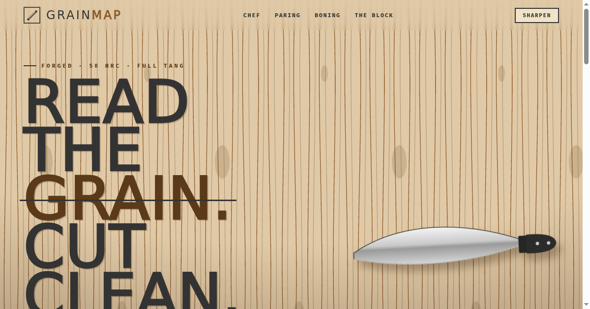 | `Qwen3.8-Flash-Next-UD-Q4_K_XL` | [gufo](https://github.com/gufo-org/gufo) | off | — | — | — | 1.3s | 611s | 6 | [open](prompts/landing-pages/butcher-block-grain-map/runs/qwen3-8-flash-next-ud-q4-k-xl/demo/index.html) · default |

---

### Cactus Core Eco

A landing page for 'Cactus Core', an eco-conscious product brand using cactus-based materials. Features organic shapes, vibrant cactus-green accents, and macro photography of plant textures on a clay background.

**Status:** polished · `botanical` `desert` `eco` `product` `nature` · brief by `qwen3.8-flash-next`

[prompt](prompts/landing-pages/cactus-core-eco/prompt.md) · [extended](prompts/landing-pages/cactus-core-eco/prompt.full.md)

#### Model runs

| Preview | Model | Engine | Think | Ctx | In | Out | TTFT | Gen | Score | Demo |
|:-------:|-------|--------|:-----:|----:|---:|----:|-----:|----:|------:|------|
|  | `Qwen3.8-Flash-Next-UD-Q4_K_XL` | [gufo](https://github.com/gufo-org/gufo) | off | — | — | — | — | 7.9s | 6 | [open](prompts/landing-pages/cactus-core-eco/runs/qwen3-8-flash-next-ud-q4-k-xl/demo/index.html) · default |

---

### Cast Iron Seasoning Gloss

Landing page for 'Iron & Fire' cookware. Deep black backgrounds with subtle, oily specular highlights that react to cursor movement, simulating a seasoned pan surface.

**Status:** polished · `cast-iron` `seasoning` `gloss` `kitchen` `heat` `black` `tactile` · brief by `Qwen3.8-Flash-Next-UD-Q4_K_XL`

[prompt](prompts/landing-pages/cast-iron-seasoning-gloss/prompt.md) · [extended](prompts/landing-pages/cast-iron-seasoning-gloss/prompt.full.md)

#### Model runs

| Preview | Model | Engine | Think | Ctx | In | Out | TTFT | Gen | Score | Demo |
|:-------:|-------|--------|:-----:|----:|---:|----:|-----:|----:|------:|------|
| 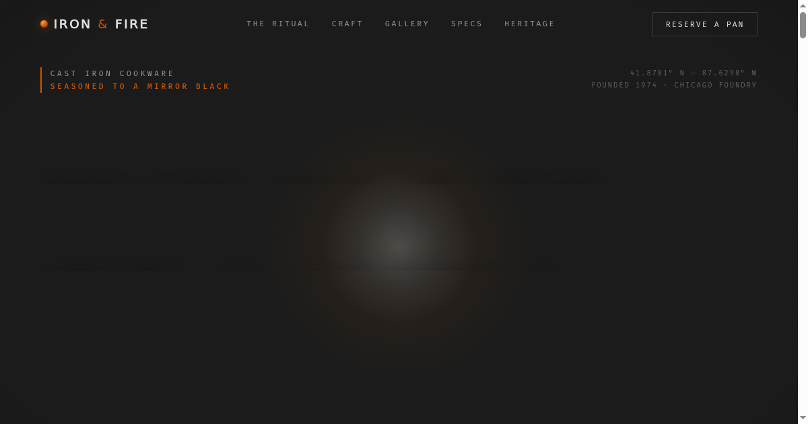 | `Qwen3.8-Flash-Next-UD-Q4_K_XL` | [gufo](https://github.com/gufo-org/gufo) | off | — | — | — | 1.3s | 628s | 6 | [open](prompts/landing-pages/cast-iron-seasoning-gloss/runs/qwen3-8-flash-next-ud-q4-k-xl/demo/index.html) · default |

---

### Caviar Shell Luxe Plate

An ultra-luxury caviar brand landing page using pearl-like textures, deep blacks, and gold accents. Focuses on the spherical perfection of the product and the ritual of serving.

**Status:** polished · `caviar` `luxury` `gastronomy` `pearl` `black` `gold` `fine-dining` · brief by `Qwen3.8-Flash-Next-UD-Q4_K_XL`

[prompt](prompts/landing-pages/caviar-shell-luxe-plate/prompt.md) · [extended](prompts/landing-pages/caviar-shell-luxe-plate/prompt.full.md)

#### Model runs

| Preview | Model | Engine | Think | Ctx | In | Out | TTFT | Gen | Score | Demo |
|:-------:|-------|--------|:-----:|----:|---:|----:|-----:|----:|------:|------|
| 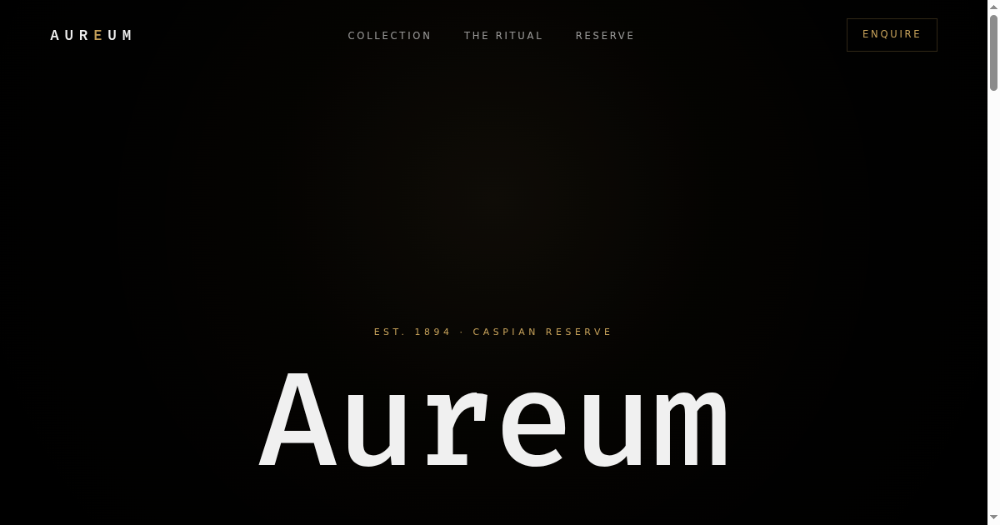 | `Qwen3.8-Flash-Next-UD-Q4_K_XL` | [gufo](https://github.com/gufo-org/gufo) | off | — | — | — | 235ms | 338s | 6 | [open](prompts/landing-pages/caviar-shell-luxe-plate/runs/qwen3-8-flash-next-ud-q4-k-xl/demo/index.html) · default |

---

### Ceramic Insulator Curve

A landing page for 'Porcelain & Flux', a supplier of high-voltage ceramic insulators. The hero visualizes the hysteresis loop of ceramic material properties using elegant, warm-toned data graphics.

**Status:** polished · `ceramic` `insulation` `electrical` `data-visualization` `hysteresis` `industrial` `warm-neutral` `engineering` · brief by `Qwen3.8-Flash-Next-UD-Q4_K_XL`

[prompt](prompts/landing-pages/ceramic-insulator-hysteresis/prompt.md) · [extended](prompts/landing-pages/ceramic-insulator-hysteresis/prompt.full.md)

#### Model runs

| Preview | Model | Engine | Think | Ctx | In | Out | TTFT | Gen | Score | Demo |
|:-------:|-------|--------|:-----:|----:|---:|----:|-----:|----:|------:|------|
| 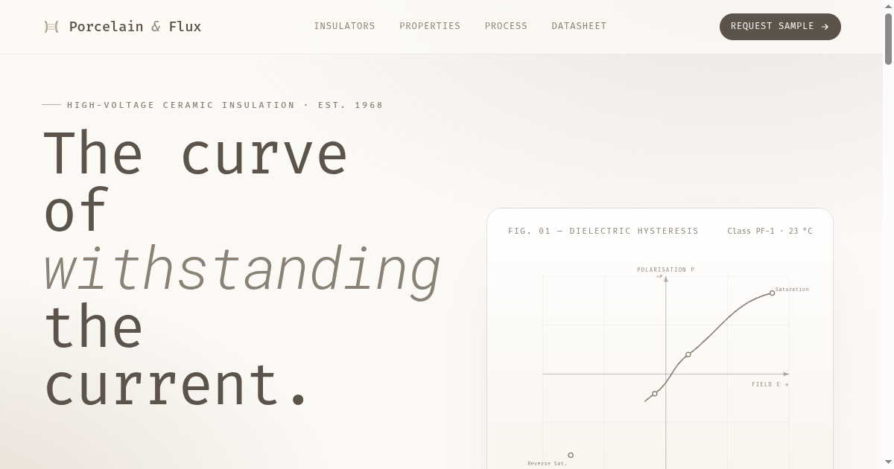 | `Qwen3.8-Flash-Next-UD-Q4_K_XL` | [gufo](https://github.com/gufo-org/gufo) | off | — | — | — | 1.3s | 542s | 8 | [open](prompts/landing-pages/ceramic-insulator-hysteresis/runs/qwen3-8-flash-next-ud-q4-k-xl/demo/index.html) · default |

---

### Charcoal Grill Ember Grid

A high-end BBQ equipment landing page where the hero is a dark steel grate. Hovering over 'grates' reveals glowing embers beneath, simulating heat intensity and airflow control.

**Status:** polished · `bbq` `ember` `grill` `heat` `grid` `smoke` `industrial` `night` · brief by `Qwen3.8-Flash-Next-UD-Q4_K_XL`

[prompt](prompts/landing-pages/charcoal-grill-ember-grid/prompt.md) · [extended](prompts/landing-pages/charcoal-grill-ember-grid/prompt.full.md)

#### Model runs

| Preview | Model | Engine | Think | Ctx | In | Out | TTFT | Gen | Score | Demo |
|:-------:|-------|--------|:-----:|----:|---:|----:|-----:|----:|------:|------|
| 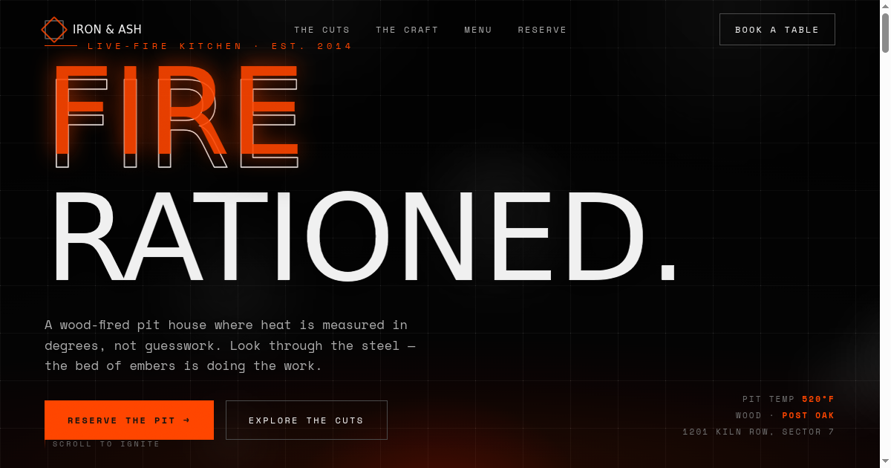 | `Qwen3.8-Flash-Next-UD-Q4_K_XL` | [gufo](https://github.com/gufo-org/gufo) | off | — | — | — | 2.3s | 458s | 9 | [open](prompts/landing-pages/charcoal-grill-ember-grid/runs/qwen3-8-flash-next-ud-q4-k-xl/demo/index.html) · default |

---

### Chime Resonance Brand

A sonic branding landing page for Chime, where typography vibrates with audio frequencies and letters act as resonant chambers.

**Status:** polished · `audio` `haptic` `sonic` `identity` `landing` `kinetic-type` · brief by `qwen3.8-flash-next`

[prompt](prompts/landing-pages/chime-resonance-brand/prompt.md) · [extended](prompts/landing-pages/chime-resonance-brand/prompt.full.md)

#### Model runs

| Preview | Model | Engine | Think | Ctx | In | Out | TTFT | Gen | Score | Demo |
|:-------:|-------|--------|:-----:|----:|---:|----:|-----:|----:|------:|------|
|  | `Qwen3.8-Flash-Next-UD-Q4_K_XL` | [gufo](https://github.com/gufo-org/gufo) | off | — | — | — | — | 8.0s | 9 | [open](prompts/landing-pages/chime-resonance-brand/runs/qwen3-8-flash-next-ud-q4-k-xl/demo/index.html) · default |

---

### Code Canvas Dev Tool

A landing page for 'Code Canvas', a new developer tool. The hero is a live code editor simulation where comments turn into UI elements.

**Status:** polished · `developer` `code` `monospace` `terminal` `landing` `dark-mode` · brief by `qwen3.8-flash-next`

[prompt](prompts/landing-pages/code-canvas-dev-tool/prompt.md) · [extended](prompts/landing-pages/code-canvas-dev-tool/prompt.full.md)

#### Model runs

| Preview | Model | Engine | Think | Ctx | In | Out | TTFT | Gen | Score | Demo |
|:-------:|-------|--------|:-----:|----:|---:|----:|-----:|----:|------:|------|
|  | `Qwen3.8-Flash-Next-UD-Q4_K_XL` | [gufo](https://github.com/gufo-org/gufo) | off | — | — | — | — | 7.0s | 6 | [open](prompts/landing-pages/code-canvas-dev-tool/runs/qwen3-8-flash-next-ud-q4-k-xl/demo/index.html) · default |

---

### Codex Leaf Gold Illumination

A landing page for a digital manuscript archive, featuring gold-leaf drop caps, vellum textures, and static, dignified typography that evokes the permanence of handwritten records.

**Status:** polished · `illuminated-manuscript` `gold-leaf` `digital-archive` `historical-tech` `trust` `serif` `static` · brief by `qwen3.8-flash-next`

[prompt](prompts/landing-pages/codex-leaf-gold-illumination/prompt.md) · [extended](prompts/landing-pages/codex-leaf-gold-illumination/prompt.full.md)

#### Model runs

| Preview | Model | Engine | Think | Ctx | In | Out | TTFT | Gen | Score | Demo |
|:-------:|-------|--------|:-----:|----:|---:|----:|-----:|----:|------:|------|
| 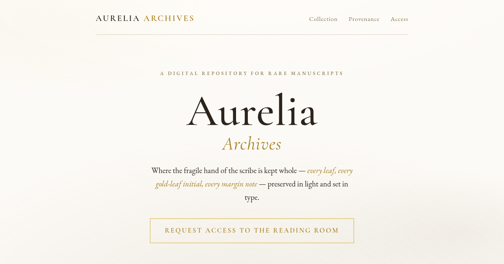 | `Qwen3.8-Flash-Next-UD-Q4_K_XL` | [gufo](https://github.com/gufo-org/gufo) | off | — | — | — | — | 6.3s | 9 | [open](prompts/landing-pages/codex-leaf-gold-illumination/runs/qwen3-8-flash-next-ud-q4-k-xl/demo/index.html) · default |

---

### Coffee Roast Airflow Turbulence

A coffee roaster landing page visualizing the thermodynamics of the roast profile using airflow vector fields and heat maps.

**Status:** polished · `coffee` `roasting` `airflow` `heat` `industrial` `orange` `black` `physics` · brief by `Qwen3.8-Flash-Next-UD-Q4_K_XL`

[prompt](prompts/landing-pages/coffee-roast-airflow-turbulence/prompt.md) · [extended](prompts/landing-pages/coffee-roast-airflow-turbulence/prompt.full.md)

#### Model runs

| Preview | Model | Engine | Think | Ctx | In | Out | TTFT | Gen | Score | Demo |
|:-------:|-------|--------|:-----:|----:|---:|----:|-----:|----:|------:|------|
| 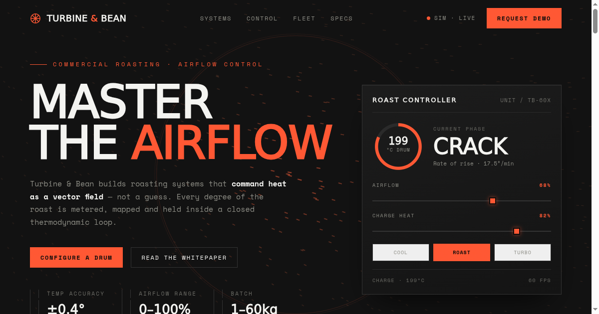 | `Qwen3.8-Flash-Next-UD-Q4_K_XL` | [gufo](https://github.com/gufo-org/gufo) | off | — | — | — | 248ms | 629s | 8 | [open](prompts/landing-pages/coffee-roast-airflow-turbulence/runs/qwen3-8-flash-next-ud-q4-k-xl/demo/index.html) · default |

---

### Cold Brew Drip Rhythm

A minimalist landing page for 'Slow Drip Coffee'. The hero visualizes the slow drip process: a single drop falls every 2 seconds, creating ripples that reveal product info. Dark, clean, precise.

**Status:** polished · `coffee` `cold-brew` `drip` `rhythm` `time` `minimal` `clean` `dark` · brief by `Qwen3.8-Flash-Next-UD-Q4_K_XL`

[prompt](prompts/landing-pages/cold-brew-drip-rhythm/prompt.md) · [extended](prompts/landing-pages/cold-brew-drip-rhythm/prompt.full.md)

#### Model runs

| Preview | Model | Engine | Think | Ctx | In | Out | TTFT | Gen | Score | Demo |
|:-------:|-------|--------|:-----:|----:|---:|----:|-----:|----:|------:|------|
| 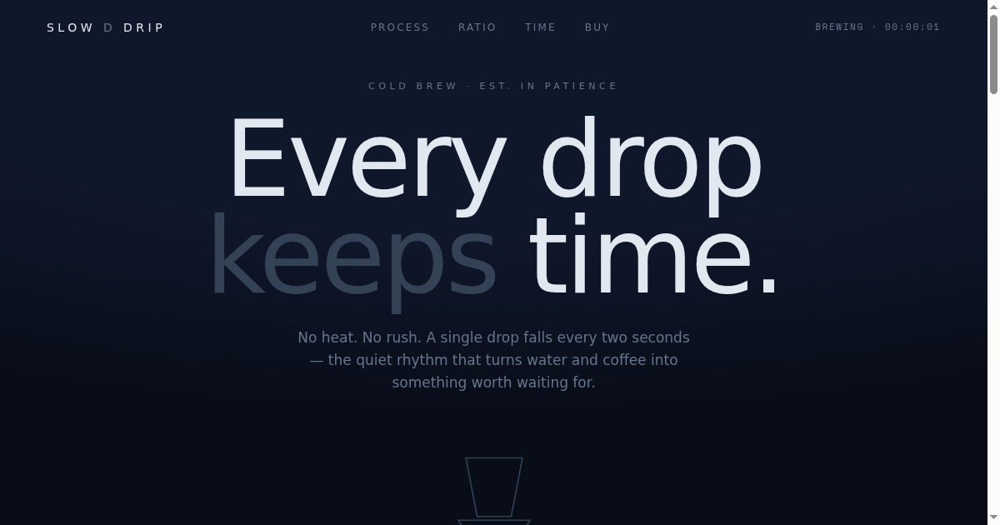 | `Qwen3.8-Flash-Next-UD-Q4_K_XL` | [gufo](https://github.com/gufo-org/gufo) | off | — | — | — | 2.9s | 292s | 8 | [open](prompts/landing-pages/cold-brew-drip-rhythm/runs/qwen3-8-flash-next-ud-q4-k-xl/demo/index.html) · default |

---

### Cold Chain Logistics

A utility landing page for 'FrostLine', a temperature-sensitive logistics provider, using frost patterns, warning labels, and industrial stencil typography.

**Status:** polished · `logistics` `cold-chain` `utility` `warning` `infrastructure` `monospace` `stencil` · brief by `qwen3.8-flash-next`

[prompt](prompts/landing-pages/cold-chain-logistics/prompt.md) · [extended](prompts/landing-pages/cold-chain-logistics/prompt.full.md)

#### Model runs

| Preview | Model | Engine | Think | Ctx | In | Out | TTFT | Gen | Score | Demo |
|:-------:|-------|--------|:-----:|----:|---:|----:|-----:|----:|------:|------|
| 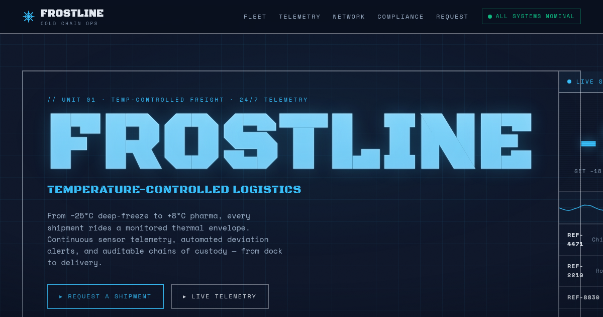 | `Qwen3.8-Flash-Next-UD-Q4_K_XL` | [gufo](https://github.com/gufo-org/gufo) | off | — | — | — | — | 6.7s | 9 | [open](prompts/landing-pages/cold-chain-logistics/runs/qwen3-8-flash-next-ud-q4-k-xl/demo/index.html) · default |

---

### Cyanotype Indexing System

A data indexing interface styled as a large-format cyanotype print, where user interactions act as a UV light source, revealing hidden layers of information through chemical bleaching effects.

**Status:** polished · `cyanotype` `blueprint` `indexing` `light-etching` `trust` `archive` `prussian-blue` · brief by `Qwen3.8-Flash-Next-UD-Q4_K_XL`

[prompt](prompts/landing-pages/cyanotype-indexing-system/prompt.md) · [extended](prompts/landing-pages/cyanotype-indexing-system/prompt.full.md)

#### Model runs

| Preview | Model | Engine | Think | Ctx | In | Out | TTFT | Gen | Score | Demo |
|:-------:|-------|--------|:-----:|----:|---:|----:|-----:|----:|------:|------|
| 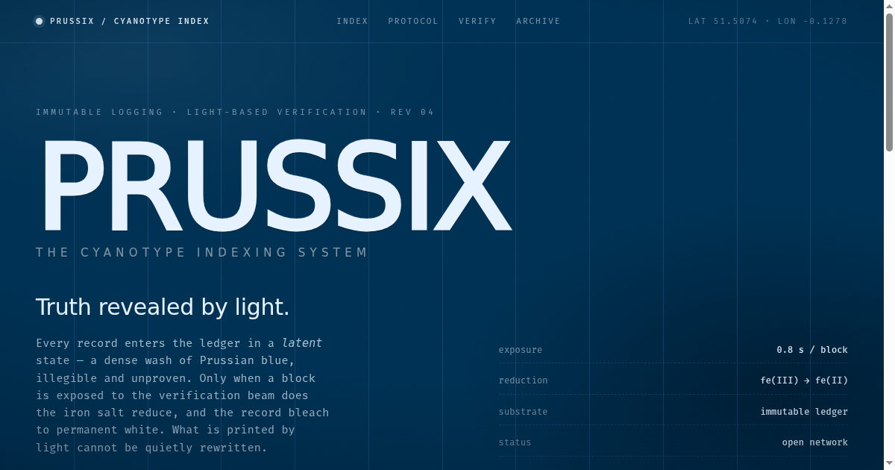 | `Qwen3.8-Flash-Next-UD-Q4_K_XL` | [gufo](https://github.com/gufo-org/gufo) | off | — | — | — | 345ms | 321s | 8 | [open](prompts/landing-pages/cyanotype-indexing-system/runs/qwen3-8-flash-next-ud-q4-k-xl/demo/index.html) · default |

---

### Fermentation Clock Timer

A landing page for 'Yeast & Time', a home fermentation kit brand, using a real-time clock visualization where bubbles rise to indicate the progress of a batch.

**Status:** draft · `fermentation` `time` `clock` `bubbles` `patience` `craft` `amber` · brief by `Qwen3.8-Flash-Next-UD-Q4_K_XL`

[prompt](prompts/landing-pages/fermentation-clock-timer/prompt.md) · [extended](prompts/landing-pages/fermentation-clock-timer/prompt.full.md)

#### Model runs

| Preview | Model | Engine | Think | Ctx | In | Out | TTFT | Gen | Score | Demo |
|:-------:|-------|--------|:-----:|----:|---:|----:|-----:|----:|------:|------|
| — | `Qwen3.8-Flash-Next-UD-Q4_K_XL` | [gufo](https://github.com/gufo-org/gufo) | off | — | — | — | 321ms | 510s | — | — |

---

### Fermentation Vault

Landing page for 'Microbe & Time', a fermentation supply brand. Dark, mysterious aesthetic with glowing amber lights inside glass jars, emphasizing the slow, living process.

**Status:** polished · `fermentation` `kobo` `dark-mode` `time` `microbial` `craft` `amber` · brief by `qwen3.8-flash-next`

[prompt](prompts/landing-pages/fermentation-vault/prompt.md) · [extended](prompts/landing-pages/fermentation-vault/prompt.full.md)

#### Model runs

| Preview | Model | Engine | Think | Ctx | In | Out | TTFT | Gen | Score | Demo |
|:-------:|-------|--------|:-----:|----:|---:|----:|-----:|----:|------:|------|
|  | `Qwen3.8-Flash-Next-UD-Q4_K_XL` | [gufo](https://github.com/gufo-org/gufo) | off | — | — | — | — | 6.5s | 9 | [open](prompts/landing-pages/fermentation-vault/runs/qwen3-8-flash-next-ud-q4-k-xl/demo/index.html) · default |

---

### Firefly Swarm Choreography

A landing page for 'Lumina Nights', a luxury outdoor event planning service. Features a dark canvas where user interaction guides a swarm of glowing fireflies, forming patterns that reveal event details.

**Status:** polished · `fireflies` `swarm` `particles` `night-sky` `interactive` `romantic` `minimal` · brief by `Qwen3.8-Flash-Next-UD-Q4_K_XL`

[prompt](prompts/landing-pages/firefly-swarm-choreography/prompt.md) · [extended](prompts/landing-pages/firefly-swarm-choreography/prompt.full.md)

#### Model runs

| Preview | Model | Engine | Think | Ctx | In | Out | TTFT | Gen | Score | Demo |
|:-------:|-------|--------|:-----:|----:|---:|----:|-----:|----:|------:|------|
|  | `Qwen3.8-Flash-Next-UD-Q4_K_XL` | [gufo](https://github.com/gufo-org/gufo) | off | — | — | — | 1.2s | 302s | 8 | [open](prompts/landing-pages/firefly-swarm-choreography/runs/qwen3-8-flash-next-ud-q4-k-xl/demo/index.html) · default |

---

### Forge and Roast Coffee Lab

A dark, industrial coffee-roaster landing page with ember-red accents, hard grid rules, product close-ups, and a quiet scroll sequence.

**Status:** draft · `coffee` `retail` `product` `industrial` `landing`

[prompt](prompts/landing-pages/forge-and-roast-coffee-lab/prompt.md) · [extended](prompts/landing-pages/forge-and-roast-coffee-lab/prompt.full.md)

#### Model runs

| Preview | Model | Engine | Think | Ctx | In | Out | TTFT | Gen | Score | Demo |
|:-------:|-------|--------|:-----:|----:|---:|----:|-----:|----:|------:|------|
| 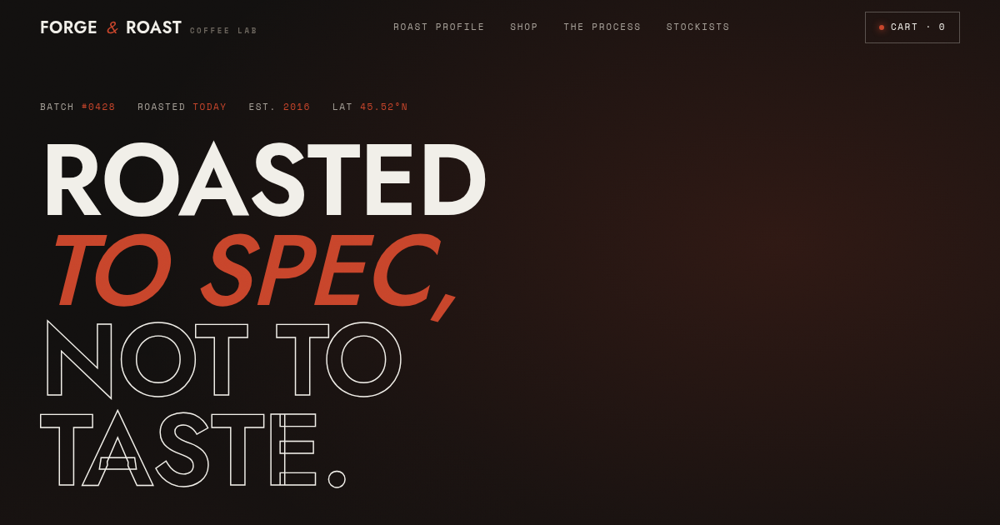 | `Qwen3.8-Flash-Next-UD-Q4_K_XL` | [gufo](https://github.com/gufo-org/gufo) | off | — | — | — | — | 5.9s | 8 | [open](prompts/landing-pages/forge-and-roast-coffee-lab/runs/qwen3-8-flash-next-ud-q4-k-xl/demo/index.html) · default |

---

### Glyph Foundry Typespecimen

A typeface foundry landing page for 'Glyph', where the hero is a live, editable specimen. Users can change weight, width, and case in real-time.

**Status:** polished · `typography` `typeface` `editorial` `specimen` `landing` `minimalist` · brief by `qwen3.8-flash-next`

[prompt](prompts/landing-pages/glyph-foundry-typespecimen/prompt.md) · [extended](prompts/landing-pages/glyph-foundry-typespecimen/prompt.full.md)

#### Model runs

| Preview | Model | Engine | Think | Ctx | In | Out | TTFT | Gen | Score | Demo |
|:-------:|-------|--------|:-----:|----:|---:|----:|-----:|----:|------:|------|
|  | `Qwen3.8-Flash-Next-UD-Q4_K_XL` | [gufo](https://github.com/gufo-org/gufo) | off | — | — | — | — | 6.1s | 9 | [open](prompts/landing-pages/glyph-foundry-typespecimen/runs/qwen3-8-flash-next-ud-q4-k-xl/demo/index.html) · default |

---

### Gridlock Transit Alert

A high-contrast transit disruption landing page using hazard stripes, monospaced status labels, and urgent but calm signal logic.

**Status:** polished · `transit` `utility` `warning` `infrastructure` `high-contrast` · brief by `qwen3.8-flash-next`

[prompt](prompts/landing-pages/gridlock-transit-alert/prompt.md) · [extended](prompts/landing-pages/gridlock-transit-alert/prompt.full.md)

#### Model runs

| Preview | Model | Engine | Think | Ctx | In | Out | TTFT | Gen | Score | Demo |
|:-------:|-------|--------|:-----:|----:|---:|----:|-----:|----:|------:|------|
|  | `Qwen3.8-Flash-Next-UD-Q4_K_XL` | [gufo](https://github.com/gufo-org/gufo) | off | — | — | — | — | 4.2s | 9 | [open](prompts/landing-pages/gridlock-transit-alert/runs/qwen3-8-flash-next-ud-q4-k-xl/demo/index.html) · default |

---

### Gym Rack Iron Structure

A strength training equipment site built around a visible steel rack grid. Content snaps into the grid lines with heavy, magnetic precision.

**Status:** polished · `weightlifting` `steel` `grid` `heavy` `grey` `structural` `strength` · brief by `Qwen3.8-Flash-Next-UD-Q4_K_XL`

[prompt](prompts/landing-pages/gym-rack-iron-structure/prompt.md) · [extended](prompts/landing-pages/gym-rack-iron-structure/prompt.full.md)

#### Model runs

| Preview | Model | Engine | Think | Ctx | In | Out | TTFT | Gen | Score | Demo |
|:-------:|-------|--------|:-----:|----:|---:|----:|-----:|----:|------:|------|
| 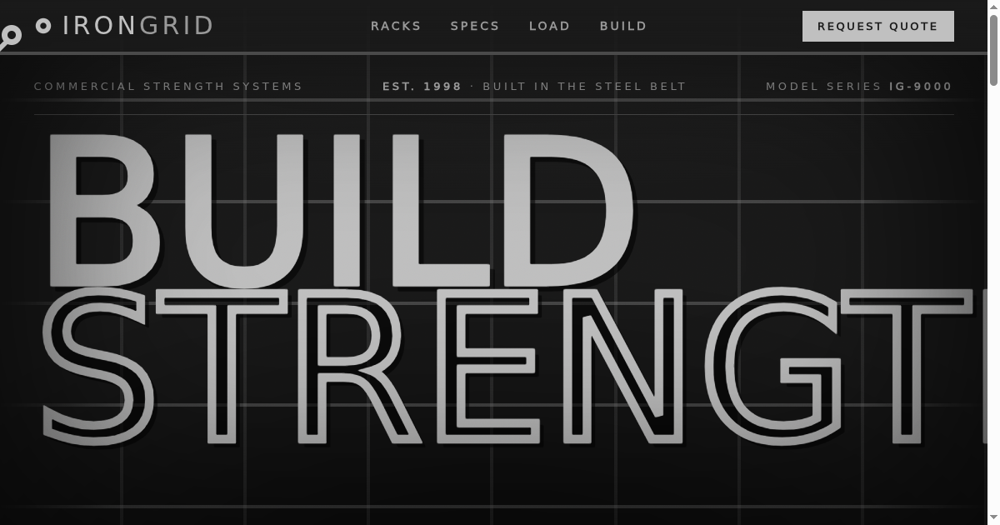 | `Qwen3.8-Flash-Next-UD-Q4_K_XL` | [gufo](https://github.com/gufo-org/gufo) | off | — | — | — | 1.6s | 435s | 8 | [open](prompts/landing-pages/gym-rack-iron-structure/runs/qwen3-8-flash-next-ud-q4-k-xl/demo/index.html) · default |

---

### Halyard Marine Forecast

A weather-intelligence landing page for Halyard, a marine routing startup, built around a live route ribbon and cold, technical typography.

**Status:** draft · `maritime` `weather` `data-viz` `landing` `motion`

[prompt](prompts/landing-pages/halyard-marine-forecast/prompt.md) · [extended](prompts/landing-pages/halyard-marine-forecast/prompt.full.md)

#### Model runs

| Preview | Model | Engine | Think | Ctx | In | Out | TTFT | Gen | Score | Demo |
|:-------:|-------|--------|:-----:|----:|---:|----:|-----:|----:|------:|------|
| 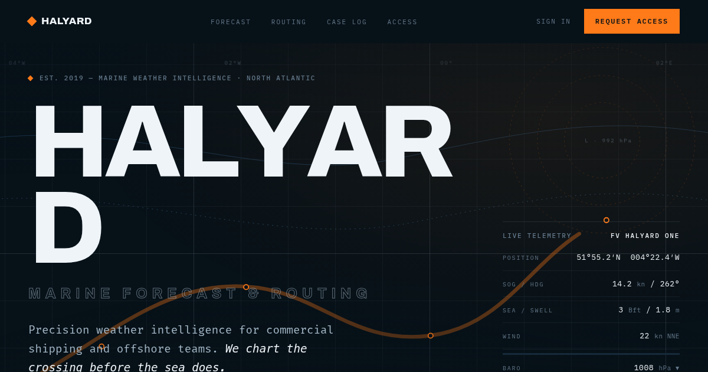 | `Qwen3.8-Flash-Next-UD-Q4_K_XL` | [gufo](https://github.com/gufo-org/gufo) | off | — | — | — | — | 4.5s | 8 | [open](prompts/landing-pages/halyard-marine-forecast/runs/qwen3-8-flash-next-ud-q4-k-xl/demo/index.html) · default |

---

### Hand-Thrown Pottery Wheel

Interactive landing page for 'Clay & Core' pottery studio. A central spinning wheel element responds to mouse drag, mimicking the resistance of wet clay.

**Status:** polished · `ceramics` `pottery` `clay` `spinning` `tactile` `craft` `wheel` · brief by `Qwen3.8-Flash-Next-UD-Q4_K_XL`

[prompt](prompts/landing-pages/hand-thrown-pottery-wheel/prompt.md) · [extended](prompts/landing-pages/hand-thrown-pottery-wheel/prompt.full.md)

#### Model runs

| Preview | Model | Engine | Think | Ctx | In | Out | TTFT | Gen | Score | Demo |
|:-------:|-------|--------|:-----:|----:|---:|----:|-----:|----:|------:|------|
| 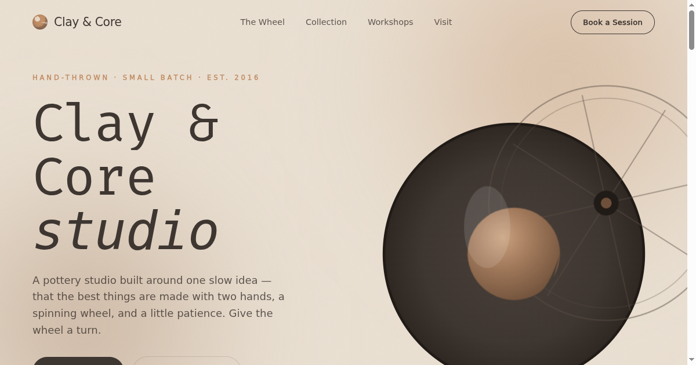 | `Qwen3.8-Flash-Next-UD-Q4_K_XL` | [gufo](https://github.com/gufo-org/gufo) | off | — | — | — | 1.6s | 541s | 7 | [open](prompts/landing-pages/hand-thrown-pottery-wheel/runs/qwen3-8-flash-next-ud-q4-k-xl/demo/index.html) · default |

---

### High Voltage Grid

A landing page for 'VoltEdge', an energy grid management software, featuring hazard stripes, electrical warning icons, and a stark, high-contrast utility aesthetic.

**Status:** polished · `energy` `infrastructure` `warning` `hazard` `electric` `monospace` `stamps` · brief by `qwen3.8-flash-next`

[prompt](prompts/landing-pages/high-voltage-grid/prompt.md) · [extended](prompts/landing-pages/high-voltage-grid/prompt.full.md)

#### Model runs

| Preview | Model | Engine | Think | Ctx | In | Out | TTFT | Gen | Score | Demo |
|:-------:|-------|--------|:-----:|----:|---:|----:|-----:|----:|------:|------|
|  | `Qwen3.8-Flash-Next-UD-Q4_K_XL` | [gufo](https://github.com/gufo-org/gufo) | off | — | — | — | — | 6.8s | 8 | [open](prompts/landing-pages/high-voltage-grid/runs/qwen3-8-flash-next-ud-q4-k-xl/demo/index.html) · default |

---

### Index Card Sort System

A landing page for \\\"SortWell,\\\" a research organization tool, using a stacked index card aesthetic, hand-drawn underlines, and a clean, paper-like background to evoke organized thinking.

**Status:** polished · `index-card` `research` `physical` `stack` `handwritten` `organization` `minimal` `trust` · brief by `qwen3.8-flash-next`

[prompt](prompts/landing-pages/index-card-sort-system/prompt.md) · [extended](prompts/landing-pages/index-card-sort-system/prompt.full.md)

#### Model runs

| Preview | Model | Engine | Think | Ctx | In | Out | TTFT | Gen | Score | Demo |
|:-------:|-------|--------|:-----:|----:|---:|----:|-----:|----:|------:|------|
| 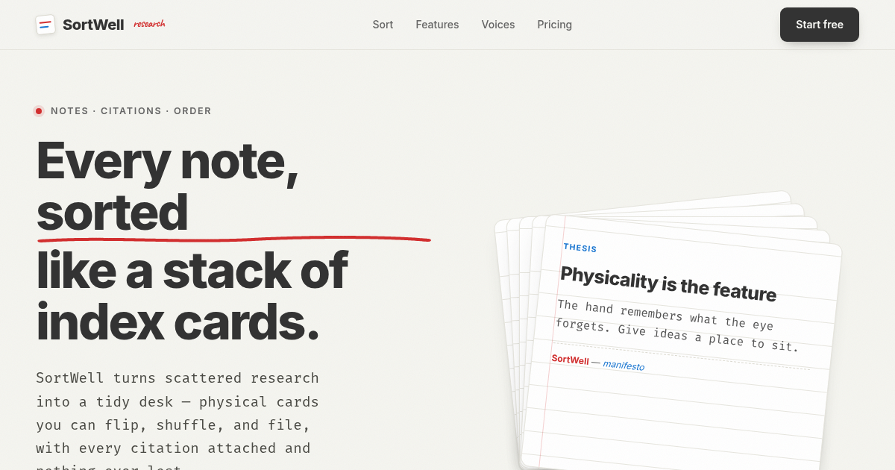 | `Qwen3.8-Flash-Next-UD-Q4_K_XL` | [gufo](https://github.com/gufo-org/gufo) | off | — | — | — | — | 7.3s | 9 | [open](prompts/landing-pages/index-card-sort-system/runs/qwen3-8-flash-next-ud-q4-k-xl/demo/index.html) · default |

---

### Kiln Commerce Drop

Product-drop landing for Kiln ceramics: object as full-bleed hero, restrained type, one purchase CTA — craft heat without rustic cliché.

**Status:** draft · `commerce` `product` `warm` `craft` `launch`

[prompt](prompts/landing-pages/kiln-commerce-drop/prompt.md) · [extended](prompts/landing-pages/kiln-commerce-drop/prompt.full.md)

#### Model runs

| Preview | Model | Engine | Think | Ctx | In | Out | TTFT | Gen | Score | Demo |
|:-------:|-------|--------|:-----:|----:|---:|----:|-----:|----:|------:|------|
|  | `Qwen3.8-Flash-Next-UD-Q4_K_XL` | [gufo](https://github.com/gufo-org/gufo) | off | — | — | — | — | 5.2s | 9 | [open](prompts/landing-pages/kiln-commerce-drop/runs/qwen3-8-flash-next-ud-q4-k-xl/demo/index.html) · default |

---

### Knife Edge Facet Refraction

A premium kitchen knife landing page where the hero is a razor-thin blade edge catching and refracting light in a dark void.

**Status:** polished · `knife` `steel` `sharp` `light` `reflection` `minimal` `silver` `black` · brief by `Qwen3.8-Flash-Next-UD-Q4_K_XL`

[prompt](prompts/landing-pages/knife-edge-facet-refraction/prompt.md) · [extended](prompts/landing-pages/knife-edge-facet-refraction/prompt.full.md)

#### Model runs

| Preview | Model | Engine | Think | Ctx | In | Out | TTFT | Gen | Score | Demo |
|:-------:|-------|--------|:-----:|----:|---:|----:|-----:|----:|------:|------|
| 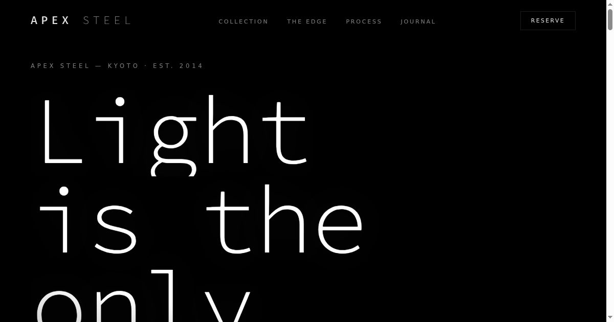 | `Qwen3.8-Flash-Next-UD-Q4_K_XL` | [gufo](https://github.com/gufo-org/gufo) | off | — | — | — | 1.6s | 629s | 6 | [open](prompts/landing-pages/knife-edge-facet-refraction/runs/qwen3-8-flash-next-ud-q4-k-xl/demo/index.html) · default |

---

### Knife & Grit Surface

Landing page for 'Edge & Stone', a knife sharpening and blade care brand. Focuses on the tactile experience of steel and stone with high-contrast macro photography and sharp geometry.

**Status:** polished · `knife` `steel` `sharpening` `stone` `sharp` `craft` `monochrome` · brief by `qwen3.8-flash-next`

[prompt](prompts/landing-pages/knife-grit-surface/prompt.md) · [extended](prompts/landing-pages/knife-grit-surface/prompt.full.md)

#### Model runs

| Preview | Model | Engine | Think | Ctx | In | Out | TTFT | Gen | Score | Demo |
|:-------:|-------|--------|:-----:|----:|---:|----:|-----:|----:|------:|------|
|  | `Qwen3.8-Flash-Next-UD-Q4_K_XL` | [gufo](https://github.com/gufo-org/gufo) | off | — | — | — | — | 7.2s | 8 | [open](prompts/landing-pages/knife-grit-surface/runs/qwen3-8-flash-next-ud-q4-k-xl/demo/index.html) · default |

---

### Ledger Blueprint Reconciliation

A landing page for \\\"VeriLedger,\\\" an audit software platform, using blueprint grid lines, checkmark animations, and a clean, white-paper aesthetic to convey financial transparency.

**Status:** polished · `ledger` `blueprint` `accounting` `trust` `grid` `technical` `audit` `clarity` · brief by `qwen3.8-flash-next`

[prompt](prompts/landing-pages/ledger-blueprint-reconciliation/prompt.md) · [extended](prompts/landing-pages/ledger-blueprint-reconciliation/prompt.full.md)

#### Model runs

| Preview | Model | Engine | Think | Ctx | In | Out | TTFT | Gen | Score | Demo |
|:-------:|-------|--------|:-----:|----:|---:|----:|-----:|----:|------:|------|
| 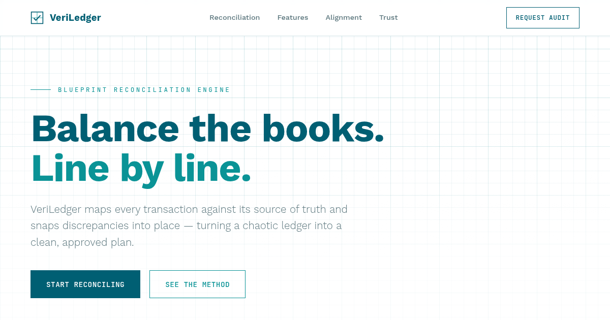 | `Qwen3.8-Flash-Next-UD-Q4_K_XL` | [gufo](https://github.com/gufo-org/gufo) | off | — | — | — | — | 7.8s | 6 | [open](prompts/landing-pages/ledger-blueprint-reconciliation/runs/qwen3-8-flash-next-ud-q4-k-xl/demo/index.html) · default |

---

### Ledger Punch Card Holes

A landing page for 'Punch Logic', a data processing service, using the visual metaphor of a vintage punch card, where data is represented by holes and perforations.

**Status:** polished · `punch-card` `mainframe` `retro-tech` `data` `perforation` `monochrome` `industrial` `grid` · brief by `Qwen3.8-Flash-Next-UD-Q4_K_XL`

[prompt](prompts/landing-pages/ledger-punch-card-holes/prompt.md) · [extended](prompts/landing-pages/ledger-punch-card-holes/prompt.full.md)

#### Model runs

| Preview | Model | Engine | Think | Ctx | In | Out | TTFT | Gen | Score | Demo |
|:-------:|-------|--------|:-----:|----:|---:|----:|-----:|----:|------:|------|
| 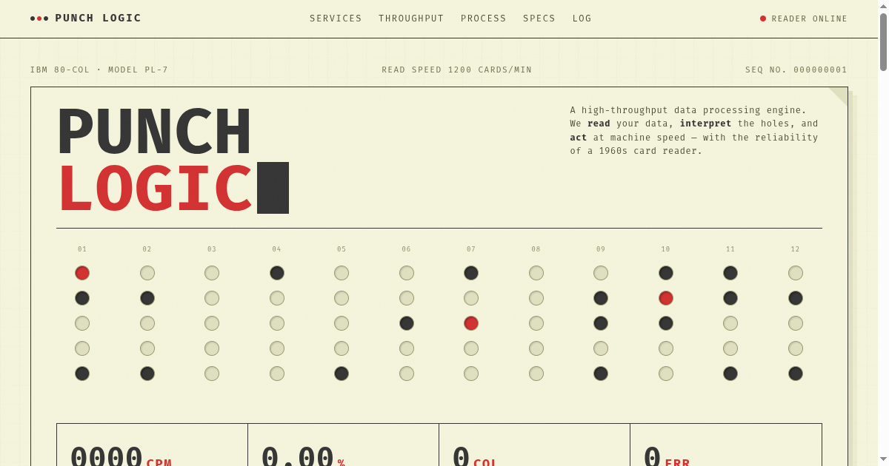 | `Qwen3.8-Flash-Next-UD-Q4_K_XL` | [gufo](https://github.com/gufo-org/gufo) | off | — | — | — | 3.0s | 591s | 9 | [open](prompts/landing-pages/ledger-punch-card-holes/runs/qwen3-8-flash-next-ud-q4-k-xl/demo/index.html) · default |

---

### Ledger Rule Alignment

A financial transparency landing page where content elements snap into a visible ruled ledger grid, emphasizing precision, balance, and the physical act of recording data in accounting books.

**Status:** polished · `ledger` `accounting` `grid` `alignment` `finance` `precision` `paper` · brief by `Qwen3.8-Flash-Next-UD-Q4_K_XL`

[prompt](prompts/landing-pages/ledger-rule-alignment/prompt.md) · [extended](prompts/landing-pages/ledger-rule-alignment/prompt.full.md)

#### Model runs

| Preview | Model | Engine | Think | Ctx | In | Out | TTFT | Gen | Score | Demo |
|:-------:|-------|--------|:-----:|----:|---:|----:|-----:|----:|------:|------|
| 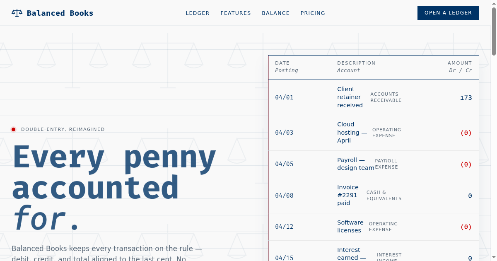 | `Qwen3.8-Flash-Next-UD-Q4_K_XL` | [gufo](https://github.com/gufo-org/gufo) | off | — | — | — | 1.8s | 448s | 8 | [open](prompts/landing-pages/ledger-rule-alignment/runs/qwen3-8-flash-next-ud-q4-k-xl/demo/index.html) · default |

---

### Letterpress Ink Bite Tactility

A landing page for 'Press & Bite' print studio. Simulates the physical depth of letterpress printing with shadows, highlights, and heavy serif type on textured cotton paper.

**Status:** polished · `letterpress` `emboss` `deboss` `tactile` `serif` `paper` `craft` · brief by `Qwen3.8-Flash-Next-UD-Q4_K_XL`

[prompt](prompts/landing-pages/letterpress-ink-bite-tactility/prompt.md) · [extended](prompts/landing-pages/letterpress-ink-bite-tactility/prompt.full.md)

#### Model runs

| Preview | Model | Engine | Think | Ctx | In | Out | TTFT | Gen | Score | Demo |
|:-------:|-------|--------|:-----:|----:|---:|----:|-----:|----:|------:|------|
| 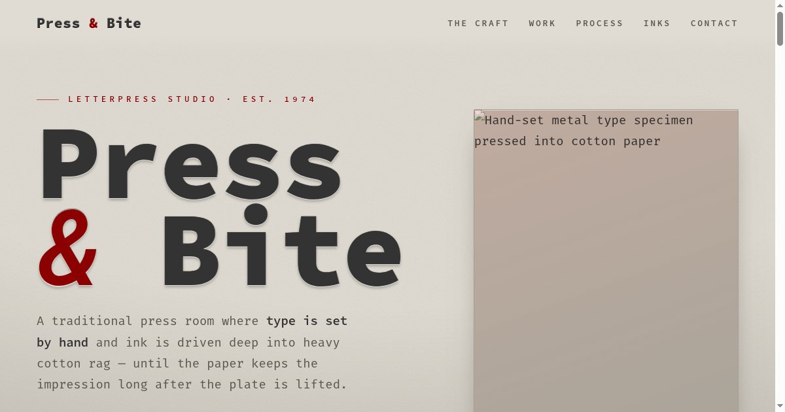 | `Qwen3.8-Flash-Next-UD-Q4_K_XL` | [gufo](https://github.com/gufo-org/gufo) | off | — | — | — | 187ms | 462s | 6 | [open](prompts/landing-pages/letterpress-ink-bite-tactility/runs/qwen3-8-flash-next-ud-q4-k-xl/demo/index.html) · default |

---

### Load Bearing Structure

An engineering firm landing page using blueprint aesthetics, visible grid systems, and annotated technical diagrams.

**Status:** polished · `construction` `engineering` `blueprint` `grid` `technical` · brief by `qwen3.8-flash-next`

[prompt](prompts/landing-pages/load-bearing-structure/prompt.md) · [extended](prompts/landing-pages/load-bearing-structure/prompt.full.md)

#### Model runs

| Preview | Model | Engine | Think | Ctx | In | Out | TTFT | Gen | Score | Demo |
|:-------:|-------|--------|:-----:|----:|---:|----:|-----:|----:|------:|------|
|  | `Qwen3.8-Flash-Next-UD-Q4_K_XL` | [gufo](https://github.com/gufo-org/gufo) | off | — | — | — | — | 6.3s | 9 | [open](prompts/landing-pages/load-bearing-structure/runs/qwen3-8-flash-next-ud-q4-k-xl/demo/index.html) · default |

---

### Lunar Cycle Bloom Calendar

A landing page for 'Selene & Stem', a rare seed bank, using an interactive lunar calendar where night-blooming flowers open in sync with real-time moon phases against a deep indigo sky.

**Status:** polished · `botanical` `lunar-phase` `time-lapse` `nocturnal-flora` `data-viz` `romantic-dark` `slow-motion` · brief by `Qwen3.8-Flash-Next-UD-Q4_K_XL`

[prompt](prompts/landing-pages/lunar-cycle-bloom-calendar/prompt.md) · [extended](prompts/landing-pages/lunar-cycle-bloom-calendar/prompt.full.md)

#### Model runs

| Preview | Model | Engine | Think | Ctx | In | Out | TTFT | Gen | Score | Demo |
|:-------:|-------|--------|:-----:|----:|---:|----:|-----:|----:|------:|------|
| 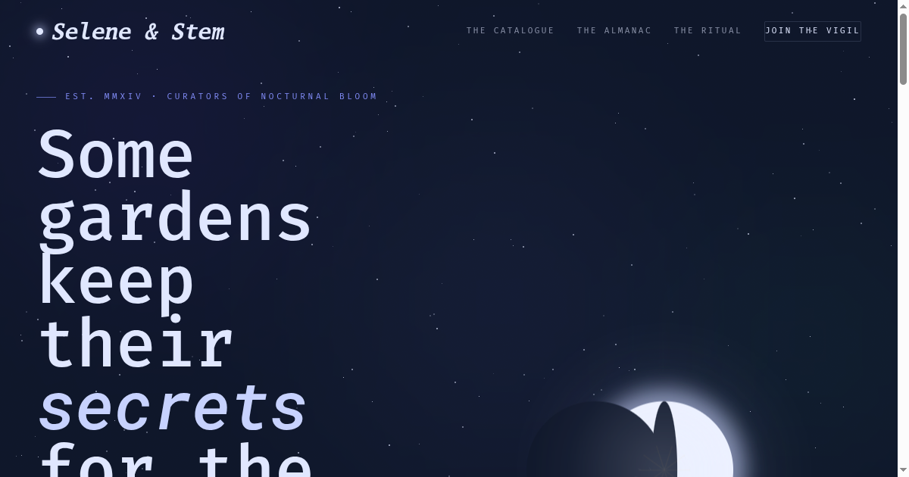 | `Qwen3.8-Flash-Next-UD-Q4_K_XL` | [gufo](https://github.com/gufo-org/gufo) | off | — | — | — | 1.6s | 544s | 6 | [open](prompts/landing-pages/lunar-cycle-bloom-calendar/runs/qwen3-8-flash-next-ud-q4-k-xl/demo/index.html) · default |

---

### Microfiche Scan Archive

A landing page for \\\"MicroSearch,\\\" a digital archive service, using a high-contrast black-and-white aesthetic with scanline effects, search bars that mimic microfiche readers, and a sense of discovery.

**Status:** polished · `microfiche` `retro-tech` `library` `scanline` `high-contrast` `search` `noir` `access` · brief by `qwen3.8-flash-next`

[prompt](prompts/landing-pages/microfiche-scan-archive/prompt.md) · [extended](prompts/landing-pages/microfiche-scan-archive/prompt.full.md)

#### Model runs

| Preview | Model | Engine | Think | Ctx | In | Out | TTFT | Gen | Score | Demo |
|:-------:|-------|--------|:-----:|----:|---:|----:|-----:|----:|------:|------|
|  | `Qwen3.8-Flash-Next-UD-Q4_K_XL` | [gufo](https://github.com/gufo-org/gufo) | off | — | — | — | — | 8.0s | 9 | [open](prompts/landing-pages/microfiche-scan-archive/runs/qwen3-8-flash-next-ud-q4-k-xl/demo/index.html) · default |

---

### Microfilm Focus Reader

An archival document viewer where text and images are initially blurred, requiring users to 'adjust the focus' via scroll or drag interactions to reveal sharp, legible content, mimicking a physical microfilm reader.

**Status:** polished · `microfilm` `archive` `focus` `blurriness` `scanline` `retro-tech` `discovery` · brief by `Qwen3.8-Flash-Next-UD-Q4_K_XL`

[prompt](prompts/landing-pages/microfilm-focus-reader/prompt.md) · [extended](prompts/landing-pages/microfilm-focus-reader/prompt.full.md)

#### Model runs

| Preview | Model | Engine | Think | Ctx | In | Out | TTFT | Gen | Score | Demo |
|:-------:|-------|--------|:-----:|----:|---:|----:|-----:|----:|------:|------|
| 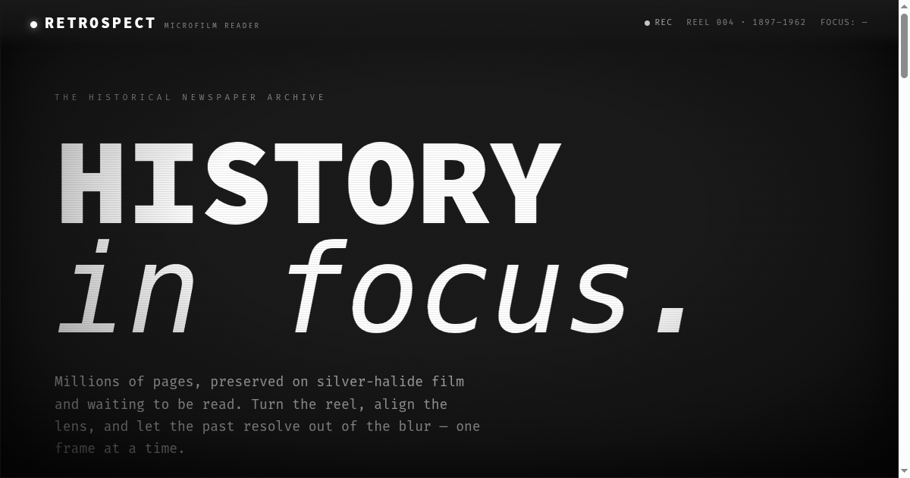 | `Qwen3.8-Flash-Next-UD-Q4_K_XL` | [gufo](https://github.com/gufo-org/gufo) | off | — | — | — | 3.6s | 328s | 8 | [open](prompts/landing-pages/microfilm-focus-reader/runs/qwen3-8-flash-next-ud-q4-k-xl/demo/index.html) · default |

---

### Microfilm Splice Reel

A landing page for 'Splice Studio', a data migration service, visualizing old records as a filmstrip that is physically spliced together, using high-contrast monochrome and mechanical precision.

**Status:** polished · `microfilm` `splice` `reel` `filmstrip` `archive` `monochrome` `mechanical` `precision` · brief by `Qwen3.8-Flash-Next-UD-Q4_K_XL`

[prompt](prompts/landing-pages/microfilm-splice-reel/prompt.md) · [extended](prompts/landing-pages/microfilm-splice-reel/prompt.full.md)

#### Model runs

| Preview | Model | Engine | Think | Ctx | In | Out | TTFT | Gen | Score | Demo |
|:-------:|-------|--------|:-----:|----:|---:|----:|-----:|----:|------:|------|
| 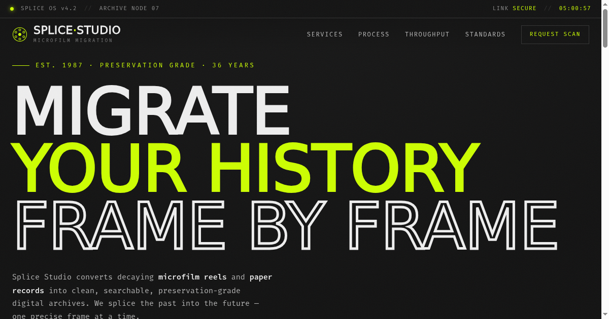 | `Qwen3.8-Flash-Next-UD-Q4_K_XL` | [gufo](https://github.com/gufo-org/gufo) | off | — | — | — | 3.0s | 587s | 8 | [open](prompts/landing-pages/microfilm-splice-reel/runs/qwen3-8-flash-next-ud-q4-k-xl/demo/index.html) · default |

---

### Mirage Fabric Studio

A landing page for 'Mirage Fabric Studio', a luxury textile designer. Uses heat-haze effects, flowing fabric animations, and a palette of sand, sun-bleached white, and deep shadow to evoke desert fashion.

**Status:** polished · `textile` `fashion` `desert` `minimal` `texture` · brief by `qwen3.8-flash-next`

[prompt](prompts/landing-pages/mirage-fabric-studio/prompt.md) · [extended](prompts/landing-pages/mirage-fabric-studio/prompt.full.md)

#### Model runs

| Preview | Model | Engine | Think | Ctx | In | Out | TTFT | Gen | Score | Demo |
|:-------:|-------|--------|:-----:|----:|---:|----:|-----:|----:|------:|------|
|  | `Qwen3.8-Flash-Next-UD-Q4_K_XL` | [gufo](https://github.com/gufo-org/gufo) | off | — | — | — | — | 7.7s | 8 | [open](prompts/landing-pages/mirage-fabric-studio/runs/qwen3-8-flash-next-ud-q4-k-xl/demo/index.html) · default |

---

### Mixology Ice Sphere Geometry

A cocktail bar landing page focused on the precision of ice. Features clear, geometric shapes, frost textures, and a cool, blue-toned palette that conveys clarity and chill.

**Status:** polished · `cocktails` `ice` `geometry` `sphere` `bar` `chilled` `clarity` · brief by `Qwen3.8-Flash-Next-UD-Q4_K_XL`

[prompt](prompts/landing-pages/mixology-ice-sphere-geometry/prompt.md) · [extended](prompts/landing-pages/mixology-ice-sphere-geometry/prompt.full.md)

#### Model runs

| Preview | Model | Engine | Think | Ctx | In | Out | TTFT | Gen | Score | Demo |
|:-------:|-------|--------|:-----:|----:|---:|----:|-----:|----:|------:|------|
| 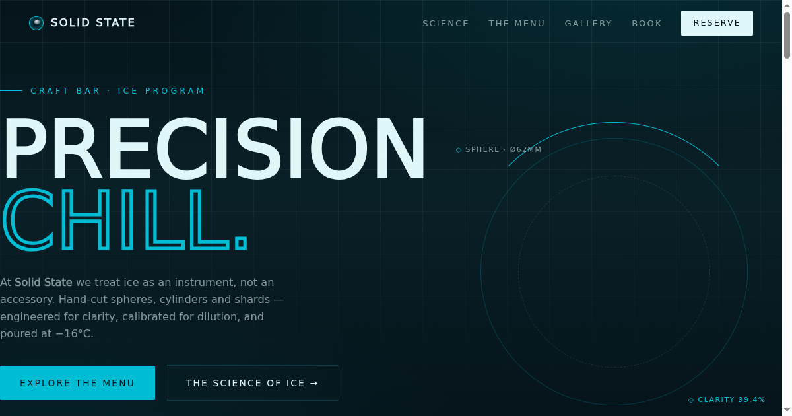 | `Qwen3.8-Flash-Next-UD-Q4_K_XL` | [gufo](https://github.com/gufo-org/gufo) | off | — | — | — | 1.4s | 481s | 8 | [open](prompts/landing-pages/mixology-ice-sphere-geometry/runs/qwen3-8-flash-next-ud-q4-k-xl/demo/index.html) · default |

---

### Mycelium Network Glow Map

A landing page for 'RhizoNet', a bio-computing infrastructure startup. Features a live, glowing mycelial network visualization where nodes pulse with data, mimicking fungal communication in a dark, damp aesthetic.

**Status:** polished · `mycelium` `networking` `bioluminescence` `underground` `tech` `fungal` `data-flow` · brief by `Qwen3.8-Flash-Next-UD-Q4_K_XL`

[prompt](prompts/landing-pages/mycelium-network-glow-map/prompt.md) · [extended](prompts/landing-pages/mycelium-network-glow-map/prompt.full.md)

#### Model runs

| Preview | Model | Engine | Think | Ctx | In | Out | TTFT | Gen | Score | Demo |
|:-------:|-------|--------|:-----:|----:|---:|----:|-----:|----:|------:|------|
| 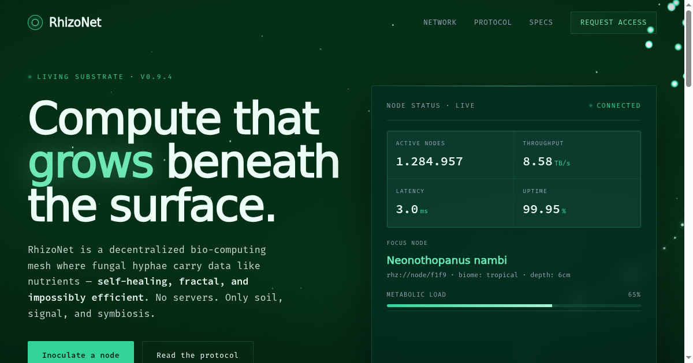 | `Qwen3.8-Flash-Next-UD-Q4_K_XL` | [gufo](https://github.com/gufo-org/gufo) | off | — | — | — | 1.6s | 433s | 8 | [open](prompts/landing-pages/mycelium-network-glow-map/runs/qwen3-8-flash-next-ud-q4-k-xl/demo/index.html) · default |

---

### Noodle Hydrocolloid Shear

A premium pasta kitchen landing page where the hero visualizes dough hydration through slow-motion fluid shear and steel extrusion lines.

**Status:** polished · `pasta` `viscosity` `chef-precision` `fluid-dynamics` `steel` `linen` `white` `motion` · brief by `Qwen3.8-Flash-Next-UD-Q4_K_XL`

[prompt](prompts/landing-pages/noodle-hydrocolloid-shear/prompt.md) · [extended](prompts/landing-pages/noodle-hydrocolloid-shear/prompt.full.md)

#### Model runs

| Preview | Model | Engine | Think | Ctx | In | Out | TTFT | Gen | Score | Demo |
|:-------:|-------|--------|:-----:|----:|---:|----:|-----:|----:|------:|------|
| 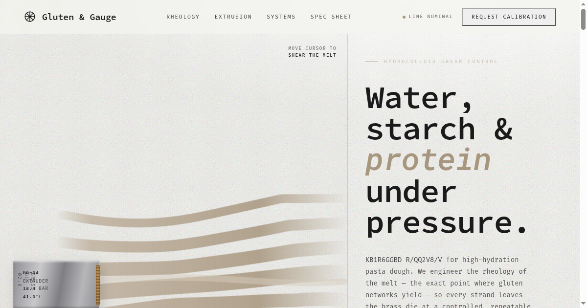 | `Qwen3.8-Flash-Next-UD-Q4_K_XL` | [gufo](https://github.com/gufo-org/gufo) | off | — | — | — | 3.3s | 818s | 8 | [open](prompts/landing-pages/noodle-hydrocolloid-shear/runs/qwen3-8-flash-next-ud-q4-k-xl/demo/index.html) · default |

---

### Northline Fintech Clarity

Trust-forward fintech landing: crisp north-light atmosphere, brand-led hero, one clarity promise — no purple glow, no dashboard soup.

**Status:** draft · `fintech` `clarity` `light` `trust` `saas`

[prompt](prompts/landing-pages/northline-fintech-clarity/prompt.md) · [extended](prompts/landing-pages/northline-fintech-clarity/prompt.full.md)

#### Model runs

| Preview | Model | Engine | Think | Ctx | In | Out | TTFT | Gen | Score | Demo |
|:-------:|-------|--------|:-----:|----:|---:|----:|-----:|----:|------:|------|
| 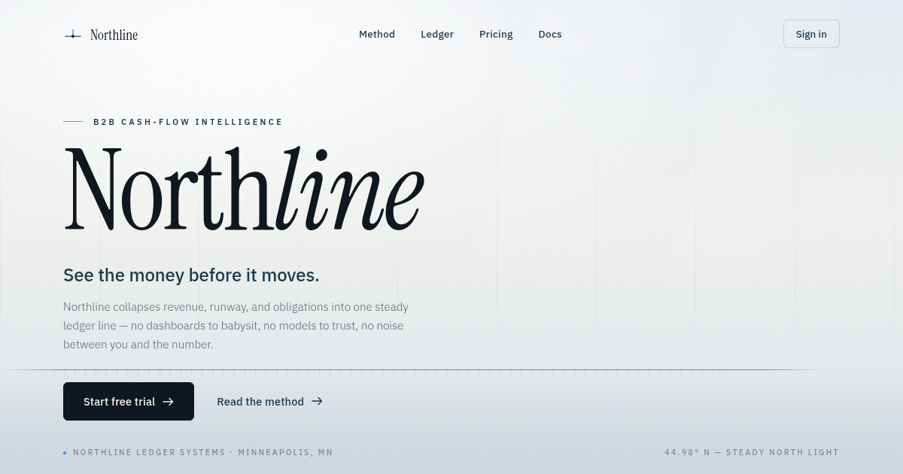 | `Qwen3.8-Flash-Next-UD-Q4_K_XL` | [gufo](https://github.com/gufo-org/gufo) | off | — | — | — | — | 4.3s | 9 | [open](prompts/landing-pages/northline-fintech-clarity/runs/qwen3-8-flash-next-ud-q4-k-xl/demo/index.html) · default |

---

### Nylon Gear Tolerance

A landing page for 'Polymer & Pitch', a supplier of precision nylon gears. The hero shows a close-up of gear teeth with a tolerance map overlay, emphasizing smooth, quiet operation.

**Status:** polished · `nylon` `gears` `tolerance` `manufacturing` `precision` `soft-machine` `engineering` `calm` · brief by `Qwen3.8-Flash-Next-UD-Q4_K_XL`

[prompt](prompts/landing-pages/nylon-gear-tolerance-map/prompt.md) · [extended](prompts/landing-pages/nylon-gear-tolerance-map/prompt.full.md)

#### Model runs

| Preview | Model | Engine | Think | Ctx | In | Out | TTFT | Gen | Score | Demo |
|:-------:|-------|--------|:-----:|----:|---:|----:|-----:|----:|------:|------|
| 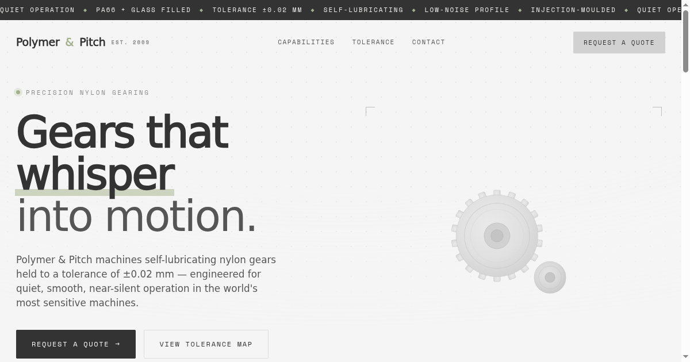 | `Qwen3.8-Flash-Next-UD-Q4_K_XL` | [gufo](https://github.com/gufo-org/gufo) | off | — | — | — | 1.6s | 496s | 8 | [open](prompts/landing-pages/nylon-gear-tolerance-map/runs/qwen3-8-flash-next-ud-q4-k-xl/demo/index.html) · default |

---

### Oxidized Copper Roofing

Landing page for Verdigris Architects, featuring matte oxidized copper textures, slow weathering animations, and architectural precision.

**Status:** polished · `architecture` `patina` `verdigris` `weathering` `matte` `roofing` `metal` · brief by `Qwen3.8-Flash-Next-UD-Q4_K_XL`

[prompt](prompts/landing-pages/oxidized-copper-roofing-matte/prompt.md) · [extended](prompts/landing-pages/oxidized-copper-roofing-matte/prompt.full.md)

#### Model runs

| Preview | Model | Engine | Think | Ctx | In | Out | TTFT | Gen | Score | Demo |
|:-------:|-------|--------|:-----:|----:|---:|----:|-----:|----:|------:|------|
| 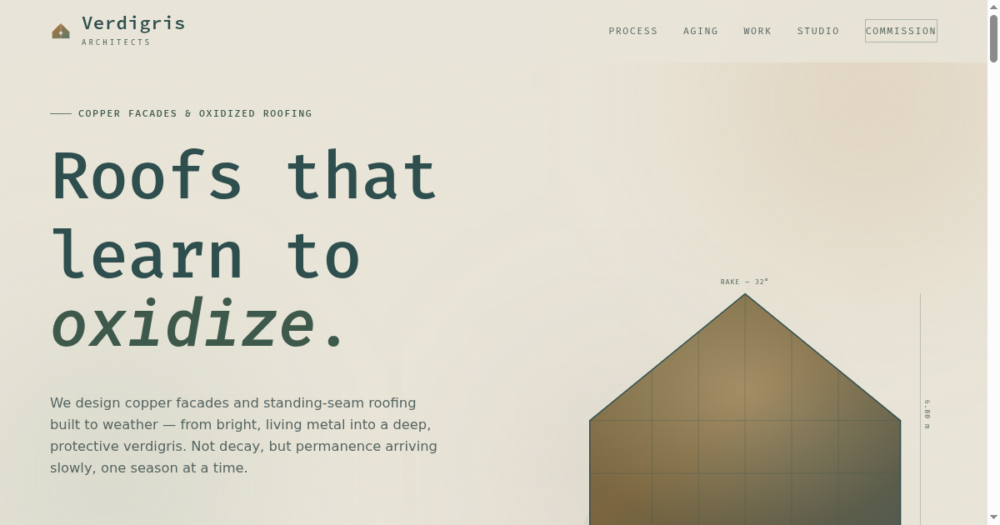 | `Qwen3.8-Flash-Next-UD-Q4_K_XL` | [gufo](https://github.com/gufo-org/gufo) | off | — | — | — | 2.1s | 594s | 9 | [open](prompts/landing-pages/oxidized-copper-roofing-matte/runs/qwen3-8-flash-next-ud-q4-k-xl/demo/index.html) · default |

---

### Porcelain Siphon Tea Set

A landing page for 'Kettle & Kiln', a luxury porcelain tea set, featuring a central interactive siphon mechanism where clicking 'brew' animates water rising into the upper chamber, turning translucent white to amber.

**Status:** polished · `porcelain` `tea` `siphon` `glass` `translucent` `soft-machine` `minimalist` `warm-neutral` · brief by `Qwen3.8-Flash-Next-UD-Q4_K_XL`

[prompt](prompts/landing-pages/porcelain-siphon-tea-set/prompt.md) · [extended](prompts/landing-pages/porcelain-siphon-tea-set/prompt.full.md)

#### Model runs

| Preview | Model | Engine | Think | Ctx | In | Out | TTFT | Gen | Score | Demo |
|:-------:|-------|--------|:-----:|----:|---:|----:|-----:|----:|------:|------|
| 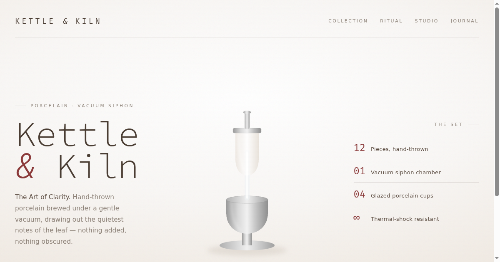 | `Qwen3.8-Flash-Next-UD-Q4_K_XL` | [gufo](https://github.com/gufo-org/gufo) | off | — | — | — | 2.0s | 302s | 8 | [open](prompts/landing-pages/porcelain-siphon-tea-set/runs/qwen3-8-flash-next-ud-q4-k-xl/demo/index.html) · default |

---

### PulseLane Urban Mobility

A city mobility landing page for PulseLane, featuring animated route paths, kinetic type, and a high-contrast asphalt palette.

**Status:** draft · `urban` `transit` `maps` `motion` `landing`

[prompt](prompts/landing-pages/pulselane-urban-mobility/prompt.md) · [extended](prompts/landing-pages/pulselane-urban-mobility/prompt.full.md)

#### Model runs

| Preview | Model | Engine | Think | Ctx | In | Out | TTFT | Gen | Score | Demo |
|:-------:|-------|--------|:-----:|----:|---:|----:|-----:|----:|------:|------|
|  | `Qwen3.8-Flash-Next-UD-Q4_K_XL` | [gufo](https://github.com/gufo-org/gufo) | off | — | — | — | — | 5.7s | 9 | [open](prompts/landing-pages/pulselane-urban-mobility/runs/qwen3-8-flash-next-ud-q4-k-xl/demo/index.html) · default |

---

### Radio Scan Archive

A landing page for 'ScanArchive', a digital radio signal archive, using CRT scanlines, tuning dials, and 'Signal Found' status indicators in a retro-utility style.

**Status:** polished · `radio` `archive` `signal` `warning` `monospace` `retro` `ui` · brief by `qwen3.8-flash-next`

[prompt](prompts/landing-pages/radio-scan-archive/prompt.md) · [extended](prompts/landing-pages/radio-scan-archive/prompt.full.md)

#### Model runs

| Preview | Model | Engine | Think | Ctx | In | Out | TTFT | Gen | Score | Demo |
|:-------:|-------|--------|:-----:|----:|---:|----:|-----:|----:|------:|------|
| 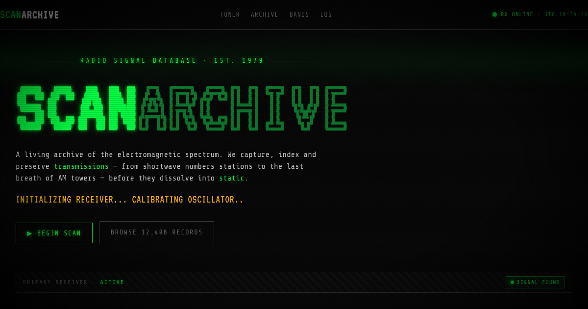 | `Qwen3.8-Flash-Next-UD-Q4_K_XL` | [gufo](https://github.com/gufo-org/gufo) | off | — | — | — | — | 7.5s | 8 | [open](prompts/landing-pages/radio-scan-archive/runs/qwen3-8-flash-next-ud-q4-k-xl/demo/index.html) · default |

---

### SwitchPoint: Mechanical Rail Lock Interface

Full-bleed macro of a steel rail switch. Drag a heavy lever to physically shift rails into a locked position with magnetic resistance, revealing route data in a tactile industrial interface.

**Status:** polished · `landing-page` `railway` `industrial-safety` `interactive` `monochrome` `heavy-ui` `physics` `html5` `css3` `js` · brief by `Qwen3.8-Flash-Next-UD-Q4_K_XL`

[prompt](prompts/landing-pages/rail-switch-mechanical-lock/prompt.md) · [extended](prompts/landing-pages/rail-switch-mechanical-lock/prompt.full.md)

_No shot preview yet._

_No model runs yet — `npm run ai:build` then `npm run shots`._

---

### Ramen Broth Turbidity Scale

A landing page for 'Tonkotsu & Time', a premium instant ramen brand, visualizing broth richness through opacity gradients and slow-motion emulsion dynamics.

**Status:** polished · `ramen` `broth` `turbidity` `opacity` `chef-precision` `warmth` `depth` · brief by `Qwen3.8-Flash-Next-UD-Q4_K_XL`

[prompt](prompts/landing-pages/ramen-broth-turbidity-scale/prompt.md) · [extended](prompts/landing-pages/ramen-broth-turbidity-scale/prompt.full.md)

#### Model runs

| Preview | Model | Engine | Think | Ctx | In | Out | TTFT | Gen | Score | Demo |
|:-------:|-------|--------|:-----:|----:|---:|----:|-----:|----:|------:|------|
| 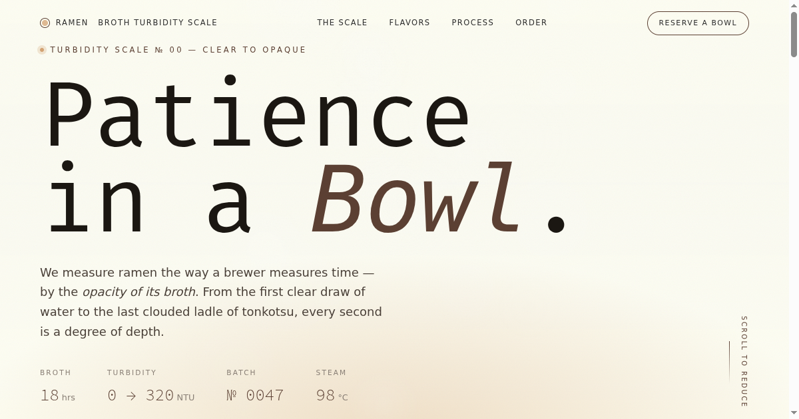 | `Qwen3.8-Flash-Next-UD-Q4_K_XL` | [gufo](https://github.com/gufo-org/gufo) | off | — | — | — | 1.7s | 518s | 6 | [open](prompts/landing-pages/ramen-broth-turbidity-scale/runs/qwen3-8-flash-next-ud-q4-k-xl/demo/index.html) · default |

---

### Risograph Overprint Archive

A landing page for 'Fluoro Press' zine archive. Features authentic Riso overprint effects (fluorescent pink & blue), paper grain textures, and slight registration misalignment.

**Status:** polished · `risograph` `overprint` `print-shop` `fluorescent` `paper-grain` `zine` `offset` · brief by `Qwen3.8-Flash-Next-UD-Q4_K_XL`

[prompt](prompts/landing-pages/risograph-overprint-archive/prompt.md) · [extended](prompts/landing-pages/risograph-overprint-archive/prompt.full.md)

#### Model runs

| Preview | Model | Engine | Think | Ctx | In | Out | TTFT | Gen | Score | Demo |
|:-------:|-------|--------|:-----:|----:|---:|----:|-----:|----:|------:|------|
| 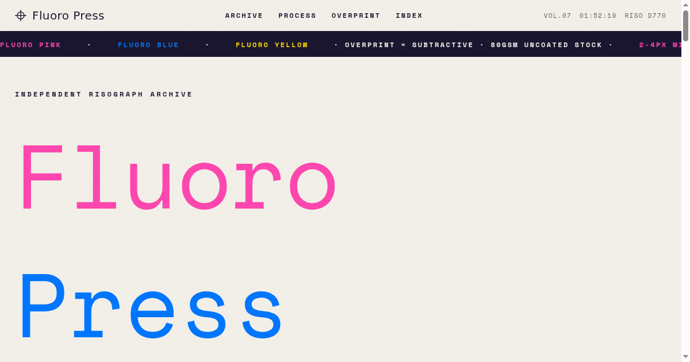 | `Qwen3.8-Flash-Next-UD-Q4_K_XL` | [gufo](https://github.com/gufo-org/gufo) | off | — | — | — | 1.5s | 458s | 6 | [open](prompts/landing-pages/risograph-overprint-archive/runs/qwen3-8-flash-next-ud-q4-k-xl/demo/index.html) · default |

---

### Silicone Sealant Cure

A landing page for 'Seal & Set', a high-performance industrial adhesive brand. The hero visualizes the chemical cure process of silicone, transitioning from glossy liquid to matte solid rubber.

**Status:** polished · `silicone` `curing` `industrial-design` `material-science` `soft-touch` `calm-tech` `manufacturing` `time` · brief by `Qwen3.8-Flash-Next-UD-Q4_K_XL`

[prompt](prompts/landing-pages/silicone-sealant-cure-timer/prompt.md) · [extended](prompts/landing-pages/silicone-sealant-cure-timer/prompt.full.md)

#### Model runs

| Preview | Model | Engine | Think | Ctx | In | Out | TTFT | Gen | Score | Demo |
|:-------:|-------|--------|:-----:|----:|---:|----:|-----:|----:|------:|------|
| 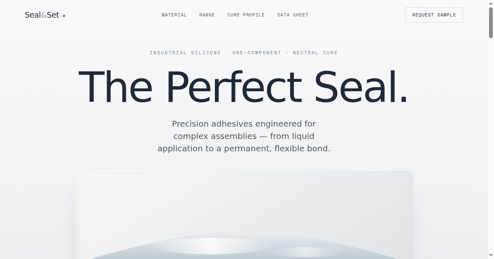 | `Qwen3.8-Flash-Next-UD-Q4_K_XL` | [gufo](https://github.com/gufo-org/gufo) | off | — | — | — | 1.5s | 473s | 6 | [open](prompts/landing-pages/silicone-sealant-cure-timer/runs/qwen3-8-flash-next-ud-q4-k-xl/demo/index.html) · default |

---

### Solaris Energy Dune

A landing page for Solaris Energy, a desert-focused solar power startup, using dune-like curves, bright solar-yellow accents, and data-driven visuals against a bone-white background.

**Status:** draft · `energy` `solar` `dune` `tech` `sustainable` · brief by `qwen3.8-flash-next`

[prompt](prompts/landing-pages/solaris-energy-dune/prompt.md) · [extended](prompts/landing-pages/solaris-energy-dune/prompt.full.md)

#### Model runs

| Preview | Model | Engine | Think | Ctx | In | Out | TTFT | Gen | Score | Demo |
|:-------:|-------|--------|:-----:|----:|---:|----:|-----:|----:|------:|------|
| — | `Qwen3.8-Flash-Next-UD-Q4_K_XL` | [gufo](https://github.com/gufo-org/gufo) | off | — | — | — | — | 329s | — | — |

---

### Sous-Vide Precision Lab

Landing page for 'Vapor & Steel', a sous-vide equipment brand. Features vacuum-sealed aesthetics, digital temperature overlays, and a sterile, high-tech kitchen atmosphere.

**Status:** polished · `culinary` `science` `sous-vide` `lab-glass` `precision` `chef-tools` `cyan` · brief by `qwen3.8-flash-next`

[prompt](prompts/landing-pages/sous-vide-precision-lab/prompt.md) · [extended](prompts/landing-pages/sous-vide-precision-lab/prompt.full.md)

#### Model runs

| Preview | Model | Engine | Think | Ctx | In | Out | TTFT | Gen | Score | Demo |
|:-------:|-------|--------|:-----:|----:|---:|----:|-----:|----:|------:|------|
|  | `Qwen3.8-Flash-Next-UD-Q4_K_XL` | [gufo](https://github.com/gufo-org/gufo) | off | — | — | — | — | 6.7s | 8 | [open](prompts/landing-pages/sous-vide-precision-lab/runs/qwen3-8-flash-next-ud-q4-k-xl/demo/index.html) · default |

---

### Spice Mill Grind Torque

A landing page for 'Torque & Spice', a high-end electric spice grinder. The hero features a 3D-style grinder that rotates as you scroll. Ground spice particles fall and form text. Dark, metallic, aromatic.

**Status:** polished · `spices` `grinder` `torque` `rotation` `aroma` `dark` `industrial` `kitchen` · brief by `Qwen3.8-Flash-Next-UD-Q4_K_XL`

[prompt](prompts/landing-pages/spice-mill-grind-torque/prompt.md) · [extended](prompts/landing-pages/spice-mill-grind-torque/prompt.full.md)

#### Model runs

| Preview | Model | Engine | Think | Ctx | In | Out | TTFT | Gen | Score | Demo |
|:-------:|-------|--------|:-----:|----:|---:|----:|-----:|----:|------:|------|
| 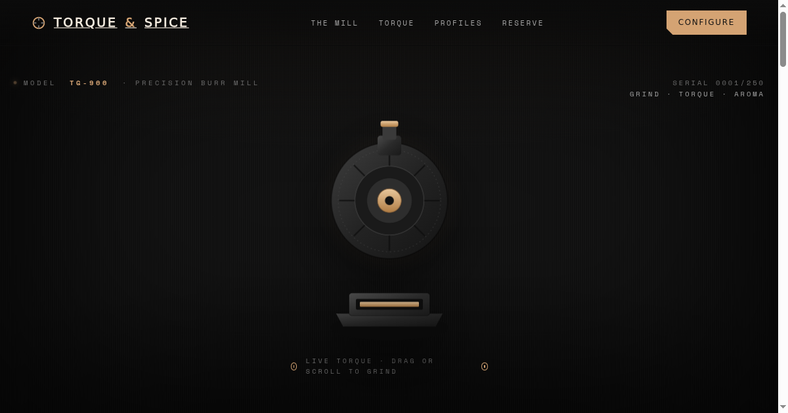 | `Qwen3.8-Flash-Next-UD-Q4_K_XL` | [gufo](https://github.com/gufo-org/gufo) | off | — | — | — | 1.6s | 584s | 8 | [open](prompts/landing-pages/spice-mill-grind-torque/runs/qwen3-8-flash-next-ud-q4-k-xl/demo/index.html) · default |

---

### Steam Circuit Kitchen

Landing page for 'Circuit & Steam', a modern steamboat restaurant. Merges traditional steam imagery with digital circuit board motifs, creating a 'network of heat' aesthetic.

**Status:** polished · `steam` `steamboat` `circuit` `digital` `hot` `minimal` `red` · brief by `qwen3.8-flash-next`

[prompt](prompts/landing-pages/steam-circuit-kitchen/prompt.md) · [extended](prompts/landing-pages/steam-circuit-kitchen/prompt.full.md)

#### Model runs

| Preview | Model | Engine | Think | Ctx | In | Out | TTFT | Gen | Score | Demo |
|:-------:|-------|--------|:-----:|----:|---:|----:|-----:|----:|------:|------|
| 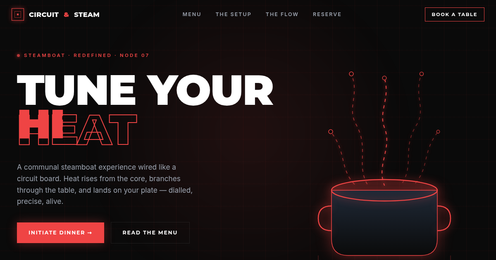 | `Qwen3.8-Flash-Next-UD-Q4_K_XL` | [gufo](https://github.com/gufo-org/gufo) | off | — | — | — | — | 5.5s | 9 | [open](prompts/landing-pages/steam-circuit-kitchen/runs/qwen3-8-flash-next-ud-q4-k-xl/demo/index.html) · default |

---

### Structural Load Report

A landing page for 'LoadSafe', a structural monitoring service, using blueprint grids, load-bearing warnings, and 'Approved' stamp aesthetics in a technical utility style.

**Status:** polished · `engineering` `warning` `infrastructure` `monospace` `stamps` `data` `utility` · brief by `qwen3.8-flash-next`

[prompt](prompts/landing-pages/structural-load-report/prompt.md) · [extended](prompts/landing-pages/structural-load-report/prompt.full.md)

#### Model runs

| Preview | Model | Engine | Think | Ctx | In | Out | TTFT | Gen | Score | Demo |
|:-------:|-------|--------|:-----:|----:|---:|----:|-----:|----:|------:|------|
| 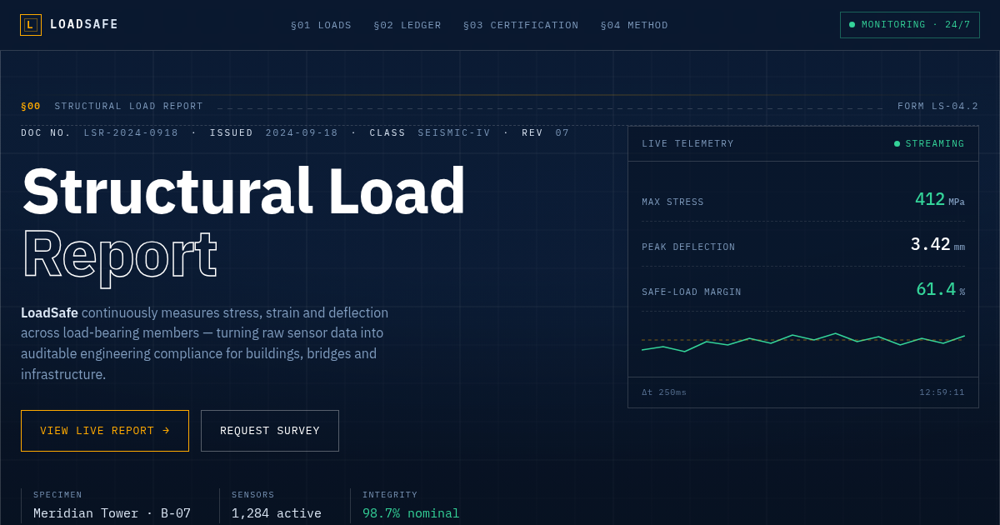 | `Qwen3.8-Flash-Next-UD-Q4_K_XL` | [gufo](https://github.com/gufo-org/gufo) | off | — | — | — | — | 6.3s | 9 | [open](prompts/landing-pages/structural-load-report/runs/qwen3-8-flash-next-ud-q4-k-xl/demo/index.html) · default |

---

### Sushi Neta Ice Crystal Matrix

A premium fish supplier landing page where products are encased in a digital ice-crystal matrix, emphasizing temperature control and freshness.

**Status:** polished · `sushi` `fish` `ice` `preservation` `blue` `transparent` `luxury` `minimal` · brief by `Qwen3.8-Flash-Next-UD-Q4_K_XL`

[prompt](prompts/landing-pages/sushi-neta-ice-crystal-matrix/prompt.md) · [extended](prompts/landing-pages/sushi-neta-ice-crystal-matrix/prompt.full.md)

#### Model runs

| Preview | Model | Engine | Think | Ctx | In | Out | TTFT | Gen | Score | Demo |
|:-------:|-------|--------|:-----:|----:|---:|----:|-----:|----:|------:|------|
| 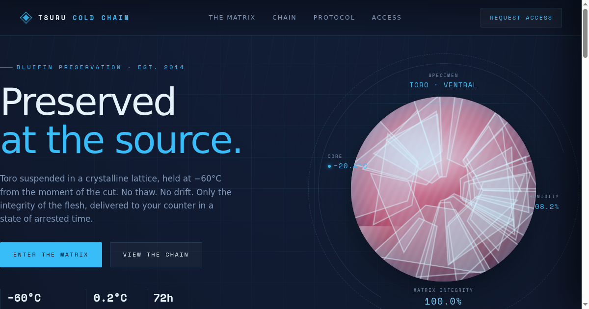 | `Qwen3.8-Flash-Next-UD-Q4_K_XL` | [gufo](https://github.com/gufo-org/gufo) | off | — | — | — | 1.8s | 552s | 8 | [open](prompts/landing-pages/sushi-neta-ice-crystal-matrix/runs/qwen3-8-flash-next-ud-q4-k-xl/demo/index.html) · default |

---

### Swim Lane Caustics Flow

An aquatic sports landing page featuring animated caustic light patterns on the 'floor' of the browser, with content floating gently as if submerged.

**Status:** polished · `swimming` `water` `blue` `caustics` `fluid` `underwater` `calm` · brief by `Qwen3.8-Flash-Next-UD-Q4_K_XL`

[prompt](prompts/landing-pages/swim-lane-caustics-flow/prompt.md) · [extended](prompts/landing-pages/swim-lane-caustics-flow/prompt.full.md)

#### Model runs

| Preview | Model | Engine | Think | Ctx | In | Out | TTFT | Gen | Score | Demo |
|:-------:|-------|--------|:-----:|----:|---:|----:|-----:|----:|------:|------|
| 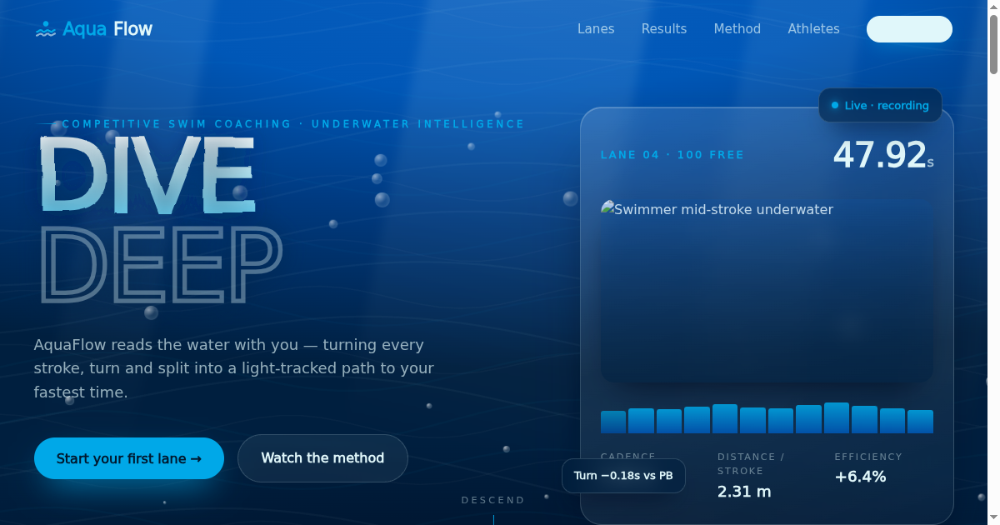 | `Qwen3.8-Flash-Next-UD-Q4_K_XL` | [gufo](https://github.com/gufo-org/gufo) | off | — | — | — | 371ms | 275s | 6 | [open](prompts/landing-pages/swim-lane-caustics-flow/runs/qwen3-8-flash-next-ud-q4-k-xl/demo/index.html) · default |

---

### Swiss Poster Grid Reconstruction

A landing page for 'Grid Theory' design studio. Strict adherence to International Typographic Style with red accents, asymmetric grids, and geometric abstraction.

**Status:** polished · `swiss-design` `international-style` `grid-system` `helvetica` `poster` `geometry` `monochrome` · brief by `Qwen3.8-Flash-Next-UD-Q4_K_XL`

[prompt](prompts/landing-pages/swiss-poster-grid-reconstruction/prompt.md) · [extended](prompts/landing-pages/swiss-poster-grid-reconstruction/prompt.full.md)

#### Model runs

| Preview | Model | Engine | Think | Ctx | In | Out | TTFT | Gen | Score | Demo |
|:-------:|-------|--------|:-----:|----:|---:|----:|-----:|----:|------:|------|
| — | `Qwen3.8-Flash-Next-UD-Q4_K_XL` | — | — | — | — | — | — | — | — | — |

---

### Terra Forma Adobe

A landing page for Terra Forma, an adobe-brick architectural studio, using raw material textures, warm earth tones, and stark, geometric layouts inspired by desert vernacular.

**Status:** polished · `architecture` `adobe` `sustainable` `earthy` `minimal` · brief by `qwen3.8-flash-next`

[prompt](prompts/landing-pages/terra-forma-adobe/prompt.md) · [extended](prompts/landing-pages/terra-forma-adobe/prompt.full.md)

#### Model runs

| Preview | Model | Engine | Think | Ctx | In | Out | TTFT | Gen | Score | Demo |
|:-------:|-------|--------|:-----:|----:|---:|----:|-----:|----:|------:|------|
|  | `Qwen3.8-Flash-Next-UD-Q4_K_XL` | [gufo](https://github.com/gufo-org/gufo) | off | — | — | — | — | 6.1s | 9 | [open](prompts/landing-pages/terra-forma-adobe/runs/qwen3-8-flash-next-ud-q4-k-xl/demo/index.html) · default |

---

### Tidal Studio Hero

Full-bleed coastal agency hero: brand-first, tide-line motion, no cards — only type, CTA, and water as the visual plane.

**Status:** polished · `agency` `hero` `ocean` `editorial` `motion`

[prompt](prompts/landing-pages/tidal-studio-hero/prompt.md) · [extended](prompts/landing-pages/tidal-studio-hero/prompt.full.md)

#### Model runs

| Preview | Model | Engine | Think | Ctx | In | Out | TTFT | Gen | Score | Demo |
|:-------:|-------|--------|:-----:|----:|---:|----:|-----:|----:|------:|------|
|  | `Qwen3.8-Flash-Next-UD-Q4_K_XL` | [gufo](https://github.com/gufo-org/gufo) | off | — | — | — | — | 5.9s | 8 | [open](prompts/landing-pages/tidal-studio-hero/runs/qwen3-8-flash-next-ud-q4-k-xl/demo/index.html) · default |

---

### Track Lane Split Timing

A sprint analytics landing page where scrolling triggers a photo-finish line sweep, revealing split times and velocity data in stark red-and-white high contrast.

**Status:** polished · `athletics` `sprinting` `photo-finish` `red` `white` `speed` `analysis` · brief by `Qwen3.8-Flash-Next-UD-Q4_K_XL`

[prompt](prompts/landing-pages/track-lane-split-timing/prompt.md) · [extended](prompts/landing-pages/track-lane-split-timing/prompt.full.md)

#### Model runs

| Preview | Model | Engine | Think | Ctx | In | Out | TTFT | Gen | Score | Demo |
|:-------:|-------|--------|:-----:|----:|---:|----:|-----:|----:|------:|------|
| 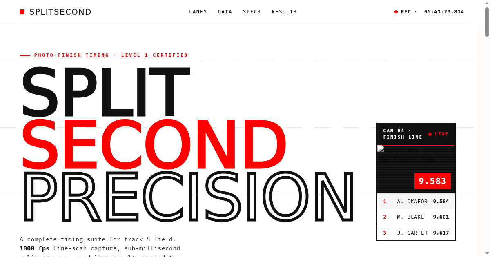 | `Qwen3.8-Flash-Next-UD-Q4_K_XL` | [gufo](https://github.com/gufo-org/gufo) | off | — | — | — | 315ms | 255s | 8 | [open](prompts/landing-pages/track-lane-split-timing/runs/qwen3-8-flash-next-ud-q4-k-xl/demo/index.html) · default |

---

### Vacuum-Form Blister

A landing page for 'Form & Void', a custom vacuum-forming manufacturer. The hero uses layered SVGs to simulate the depth and transparency of vacuum-formed plastic packaging.

**Status:** polished · `vacuum-forming` `packaging` `industrial` `transparency` `depth` `manufacturing` `clean` `product` · brief by `Qwen3.8-Flash-Next-UD-Q4_K_XL`

[prompt](prompts/landing-pages/vacuum-form-plastic-blister/prompt.md) · [extended](prompts/landing-pages/vacuum-form-plastic-blister/prompt.full.md)

#### Model runs

| Preview | Model | Engine | Think | Ctx | In | Out | TTFT | Gen | Score | Demo |
|:-------:|-------|--------|:-----:|----:|---:|----:|-----:|----:|------:|------|
| 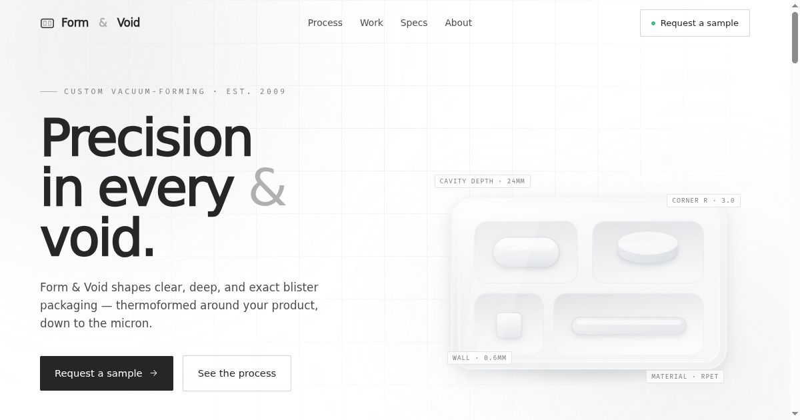 | `Qwen3.8-Flash-Next-UD-Q4_K_XL` | [gufo](https://github.com/gufo-org/gufo) | off | — | — | — | 1.7s | 539s | 8 | [open](prompts/landing-pages/vacuum-form-plastic-blister/runs/qwen3-8-flash-next-ud-q4-k-xl/demo/index.html) · default |

---

### Vault Archive Stamp

A digital archive landing page featuring rubber-stamp aesthetics, paper-textured backgrounds, and stamped verification badges.

**Status:** polished · `archive` `document` `stamp` `bureaucracy` `retro-modern` · brief by `qwen3.8-flash-next`

[prompt](prompts/landing-pages/vault-archive-stamp/prompt.md) · [extended](prompts/landing-pages/vault-archive-stamp/prompt.full.md)

#### Model runs

| Preview | Model | Engine | Think | Ctx | In | Out | TTFT | Gen | Score | Demo |
|:-------:|-------|--------|:-----:|----:|---:|----:|-----:|----:|------:|------|
|  | `Qwen3.8-Flash-Next-UD-Q4_K_XL` | [gufo](https://github.com/gufo-org/gufo) | off | — | — | — | — | 5.1s | 9 | [open](prompts/landing-pages/vault-archive-stamp/runs/qwen3-8-flash-next-ud-q4-k-xl/demo/index.html) · default |

---

### Vellum Scribe Marginalia

A landing page for 'Ink & Vellum', a high-end calligraphy service, featuring handwritten marginalia that annotates the main text, warm parchment tones, and static, dignified typography.

**Status:** draft · `vellum` `handwriting` `marginalia` `manuscript` `annotation` `warm-neutral` `serif` `static` · brief by `Qwen3.8-Flash-Next-UD-Q4_K_XL`

[prompt](prompts/landing-pages/vellum-scribe-marginalia/prompt.md) · [extended](prompts/landing-pages/vellum-scribe-marginalia/prompt.full.md)

#### Model runs

| Preview | Model | Engine | Think | Ctx | In | Out | TTFT | Gen | Score | Demo |
|:-------:|-------|--------|:-----:|----:|---:|----:|-----:|----:|------:|------|
| — | `Qwen3.8-Flash-Next-UD-Q4_K_XL` | [gufo](https://github.com/gufo-org/gufo) | off | — | — | — | 172ms | 136s | — | — |

---

### Velour Cinema Poster

A movie release landing page for 'Velour', a noir film. The hero is a dynamic poster where title text interacts with light beams and shadows.

**Status:** polished · `cinema` `film` `poster` `noir` `kinetic-type` `landing` · brief by `qwen3.8-flash-next`

[prompt](prompts/landing-pages/velour-cinema-poster/prompt.md) · [extended](prompts/landing-pages/velour-cinema-poster/prompt.full.md)

#### Model runs

| Preview | Model | Engine | Think | Ctx | In | Out | TTFT | Gen | Score | Demo |
|:-------:|-------|--------|:-----:|----:|---:|----:|-----:|----:|------:|------|
| 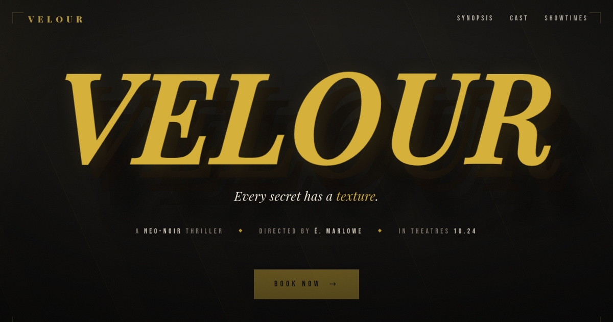 | `Qwen3.8-Flash-Next-UD-Q4_K_XL` | [gufo](https://github.com/gufo-org/gufo) | off | — | — | — | — | 7.6s | 9 | [open](prompts/landing-pages/velour-cinema-poster/runs/qwen3-8-flash-next-ud-q4-k-xl/demo/index.html) · default |

---

### Woven Copper Heat Exchanger

A landing page for 'WeaveWorks', a heat exchanger manufacturer. The hero is a complex, animated SVG of woven copper pipes that pulse with heat (orange glow) and tighten/loosen to demonstrate efficiency.

**Status:** draft · `copper` `weave` `heat` `engineering` `textile` `industrial` `warm` `complex-geometry` · brief by `Qwen3.8-Flash-Next-UD-Q4_K_XL`

[prompt](prompts/landing-pages/woven-copper-heat-exchanger/prompt.md) · [extended](prompts/landing-pages/woven-copper-heat-exchanger/prompt.full.md)

#### Model runs

| Preview | Model | Engine | Think | Ctx | In | Out | TTFT | Gen | Score | Demo |
|:-------:|-------|--------|:-----:|----:|---:|----:|-----:|----:|------:|------|
| — | `Qwen3.8-Flash-Next-UD-Q4_K_XL` | [gufo](https://github.com/gufo-org/gufo) | off | — | — | — | 284ms | 295s | — | — |

---

### Woven Rattan Lattice

Landing page for 'Loom & Light', a furniture brand. Uses complex SVG weaving patterns that reveal content through interlaced strands, playing with light and shadow.

**Status:** polished · `rattan` `weaving` `basketry` `pattern` `light` `shadow` `organic` · brief by `Qwen3.8-Flash-Next-UD-Q4_K_XL`

[prompt](prompts/landing-pages/woven-rattan-lattice/prompt.md) · [extended](prompts/landing-pages/woven-rattan-lattice/prompt.full.md)

#### Model runs

| Preview | Model | Engine | Think | Ctx | In | Out | TTFT | Gen | Score | Demo |
|:-------:|-------|--------|:-----:|----:|---:|----:|-----:|----:|------:|------|
| 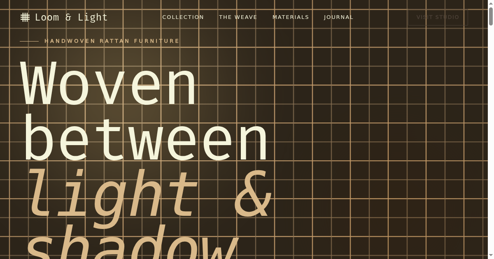 | `Qwen3.8-Flash-Next-UD-Q4_K_XL` | [gufo](https://github.com/gufo-org/gufo) | off | — | — | — | 371ms | 470s | 6 | [open](prompts/landing-pages/woven-rattan-lattice/runs/qwen3-8-flash-next-ud-q4-k-xl/demo/index.html) · default |

---

## Animations

### Aluminum Knob Torque

A brushed anodized aluminum knob rotates with weighted inertia and magnetic detents, providing visual feedback of torque and resistance.

**Status:** polished · `soft-machine` `anodized-aluminum` `interaction` `spring-damping` `ui-control` `industrial-design` `minimal` · brief by `Qwen3.8-Flash-Next-UD-Q4_K_XL`

[prompt](prompts/animations/aluminum-knob-torque/prompt.md) · [extended](prompts/animations/aluminum-knob-torque/prompt.full.md)

#### Model runs

| Preview | Model | Engine | Think | Ctx | In | Out | TTFT | Gen | Score | Demo |
|:-------:|-------|--------|:-----:|----:|---:|----:|-----:|----:|------:|------|
| 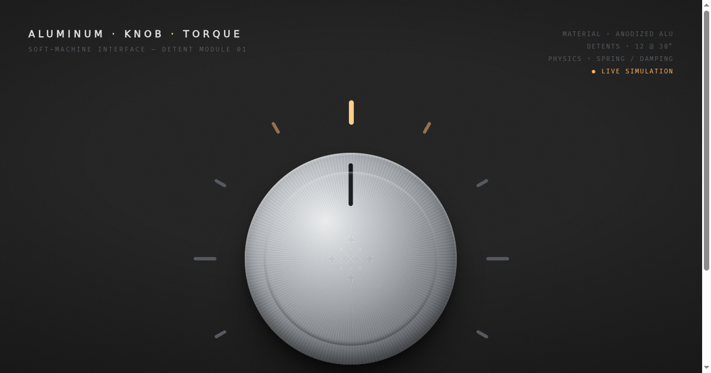 | `Qwen3.8-Flash-Next-UD-Q4_K_XL` | [gufo](https://github.com/gufo-org/gufo) | off | — | — | — | 1.4s | 234s | 9 | [open](prompts/animations/aluminum-knob-torque/runs/qwen3-8-flash-next-ud-q4-k-xl/demo/index.html) · default |

---

### Aquamarine Silk Drape Tide

Weighted aquamarine silk ripples like gentle water, catching refracted light to reveal typography through subsurface scattering.

**Status:** polished · `aquatic-depth` `silk-texture` `cloth-sim` `saline-palette` `liquid-motion` `quiet-luxury` `refraction` · brief by `Qwen3.8-Flash-Next-UD-Q4_K_XL`

[prompt](prompts/animations/aquamarine-silk-drape-tide/prompt.md) · [extended](prompts/animations/aquamarine-silk-drape-tide/prompt.full.md)

#### Model runs

| Preview | Model | Engine | Think | Ctx | In | Out | TTFT | Gen | Score | Demo |
|:-------:|-------|--------|:-----:|----:|---:|----:|-----:|----:|------:|------|
| 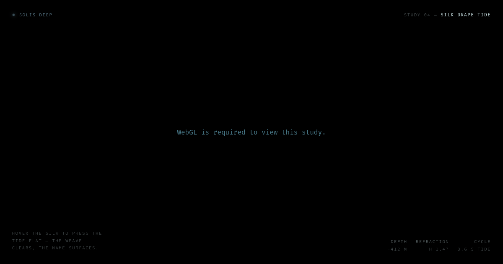 | `Qwen3.8-Flash-Next-UD-Q4_K_XL` | [gufo](https://github.com/gufo-org/gufo) | off | — | — | — | 186ms | 207s | 2 | [open](prompts/animations/aquamarine-silk-drape-tide/runs/qwen3-8-flash-next-ud-q4-k-xl/demo/index.html) · default |

---

### Asphalt Lane Marking Reveal

A top-down view of a gray asphalt texture where a bright yellow lane marking sprays onto the surface, revealing text as the paint line cuts through grain and imperfections.

**Status:** polished · `infrastructure` `road-safety` `paint-spray` `texture-overlay` `motion-path` `high-vis` `urban` · brief by `Qwen3.8-Flash-Next-UD-Q4_K_XL`

[prompt](prompts/animations/asphalt-lane-marking-reveal/prompt.md) · [extended](prompts/animations/asphalt-lane-marking-reveal/prompt.full.md)

#### Model runs

| Preview | Model | Engine | Think | Ctx | In | Out | TTFT | Gen | Score | Demo |
|:-------:|-------|--------|:-----:|----:|---:|----:|-----:|----:|------:|------|
| 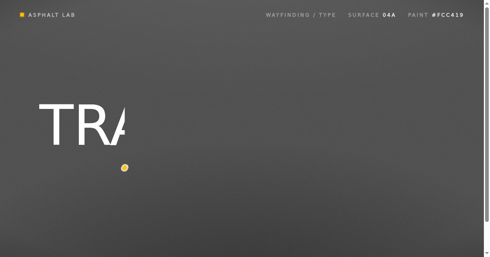 | `Qwen3.8-Flash-Next-UD-Q4_K_XL` | [gufo](https://github.com/gufo-org/gufo) | off | — | — | — | 336ms | 89s | 6 | [open](prompts/animations/asphalt-lane-marking-reveal/runs/qwen3-8-flash-next-ud-q4-k-xl/demo/index.html) · default |

---

### Axiom Foundry Logo Morph

Brand motion for Axiom Foundry morphing a circular monogram into a wordmark with crisp SVG interpolation and metallic light sweep.

**Status:** draft · `logo-morph` `svg-animation` `brand-motion` `path-animation` `identity`

[prompt](prompts/animations/axiom-foundry-logo-morph/prompt.md) · [extended](prompts/animations/axiom-foundry-logo-morph/prompt.full.md)

#### Model runs

| Preview | Model | Engine | Think | Ctx | In | Out | TTFT | Gen | Score | Demo |
|:-------:|-------|--------|:-----:|----:|---:|----:|-----:|----:|------:|------|
|  | `Qwen3.8-Flash-Next-UD-Q4_K_XL` | [gufo](https://github.com/gufo-org/gufo) | off | — | — | — | — | 5.6s | 8 | [open](prompts/animations/axiom-foundry-logo-morph/runs/qwen3-8-flash-next-ud-q4-k-xl/demo/index.html) · default |

---

### Basalt Column Cooling

A top-down view of molten basalt cooling into hexagonal columns, with thermal cracks propagating through stone under harsh desert light.

**Status:** polished · `geology` `cooling-cracks` `arid-minimal` `columnar-jointing` `thermal` `stone-texture` `slow-motion` · brief by `Qwen3.8-Flash-Next-UD-Q4_K_XL`

[prompt](prompts/animations/basalt-column-cooling/prompt.md) · [extended](prompts/animations/basalt-column-cooling/prompt.full.md)

#### Model runs

| Preview | Model | Engine | Think | Ctx | In | Out | TTFT | Gen | Score | Demo |
|:-------:|-------|--------|:-----:|----:|---:|----:|-----:|----:|------:|------|
| 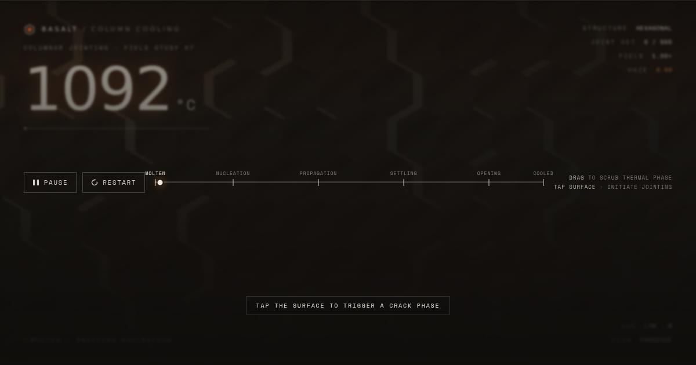 | `Qwen3.8-Flash-Next-UD-Q4_K_XL` | [gufo](https://github.com/gufo-org/gufo) | off | — | — | — | 1.6s | 412s | 6 | [open](prompts/animations/basalt-column-cooling/runs/qwen3-8-flash-next-ud-q4-k-xl/demo/index.html) · default |

---

### Bone Dust Spiral

Microscopic bone-white dust particles caught in a thermal updraft, spiraling upward in a dense, tactile column against a blurred dune background.

**Status:** draft · `dust` `particles` `wind` `arid` `micro-detail` `physics` `desert` · brief by `qwen3.8-flash-next`

[prompt](prompts/animations/bone-dust-spiral/prompt.md) · [extended](prompts/animations/bone-dust-spiral/prompt.full.md)

#### Model runs

| Preview | Model | Engine | Think | Ctx | In | Out | TTFT | Gen | Score | Demo |
|:-------:|-------|--------|:-----:|----:|---:|----:|-----:|----:|------:|------|
| 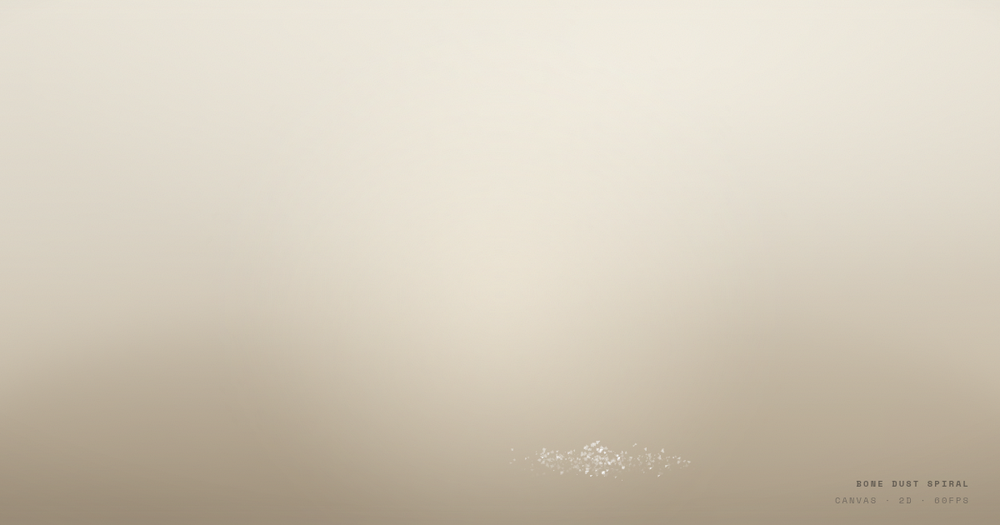 | `Qwen3.8-Flash-Next-UD-Q4_K_XL` | [gufo](https://github.com/gufo-org/gufo) | off | — | — | — | — | 149s | 6 | [open](prompts/animations/bone-dust-spiral/runs/qwen3-8-flash-next-ud-q4-k-xl/demo/index.html) · default |

---

### Brine Evaporation Surface Tension

Macro view of saline solution evaporating. Water recedes, revealing sharp salt crystals forming at the meniscus, emphasizing surface tension and geometric precision.

**Status:** polished · `fluid-sim` `saline` `macro` `surface-tension` `crystal-nucleation` `evaporation` `high-key` · brief by `Qwen3.8-Flash-Next-UD-Q4_K_XL`

[prompt](prompts/animations/brine-evaporation-surface-tension/prompt.md) · [extended](prompts/animations/brine-evaporation-surface-tension/prompt.full.md)

#### Model runs

| Preview | Model | Engine | Think | Ctx | In | Out | TTFT | Gen | Score | Demo |
|:-------:|-------|--------|:-----:|----:|---:|----:|-----:|----:|------:|------|
| 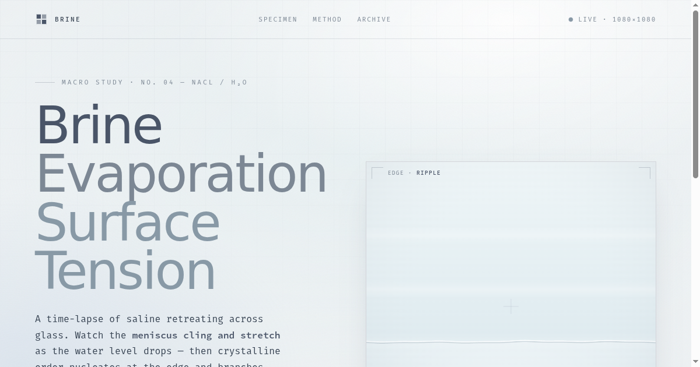 | `Qwen3.8-Flash-Next-UD-Q4_K_XL` | [gufo](https://github.com/gufo-org/gufo) | off | — | — | — | 1.4s | 407s | 6 | [open](prompts/animations/brine-evaporation-surface-tension/runs/qwen3-8-flash-next-ud-q4-k-xl/demo/index.html) · default |

---

### Card Catalog Drawer Slide

A wooden library card catalog drawer slides out smoothly. Inside, hundreds of index cards are visible, slightly fanned. A single card glows faintly, indicating the active record, before the drawer slides back shut.

**Status:** polished · `library-science` `drawer` `indexing` `wood-grain` `mechanical` `loop` `archival` · brief by `Qwen3.8-Flash-Next-UD-Q4_K_XL`

[prompt](prompts/animations/card-catalog-drawer-slide/prompt.md) · [extended](prompts/animations/card-catalog-drawer-slide/prompt.full.md)

#### Model runs

| Preview | Model | Engine | Think | Ctx | In | Out | TTFT | Gen | Score | Demo |
|:-------:|-------|--------|:-----:|----:|---:|----:|-----:|----:|------:|------|
| 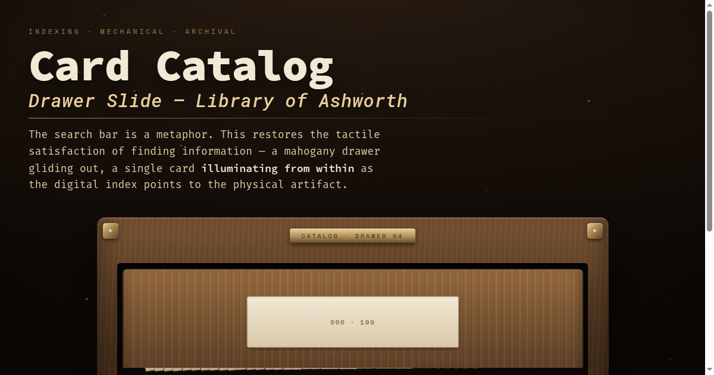 | `Qwen3.8-Flash-Next-UD-Q4_K_XL` | [gufo](https://github.com/gufo-org/gufo) | off | — | — | — | 1.5s | 295s | 6 | [open](prompts/animations/card-catalog-drawer-slide/runs/qwen3-8-flash-next-ud-q4-k-xl/demo/index.html) · default |

---

### Caustic Light Refraction Tile

Sunlight filtering through rippling water casts dancing caustic patterns on a tiled pool floor. Seamless loop of light and shadow, evoking cool, submerged calm.

**Status:** draft · `caustics` `water-surface` `light-play` `ambient` `refraction` `tileable` `calm` · brief by `Qwen3.8-Flash-Next-UD-Q4_K_XL`

[prompt](prompts/animations/caustic-light-refraction-tile/prompt.md) · [extended](prompts/animations/caustic-light-refraction-tile/prompt.full.md)

#### Model runs

| Preview | Model | Engine | Think | Ctx | In | Out | TTFT | Gen | Score | Demo |
|:-------:|-------|--------|:-----:|----:|---:|----:|-----:|----:|------:|------|
| — | `Qwen3.8-Flash-Next-UD-Q4_K_XL` | [gufo](https://github.com/gufo-org/gufo) | off | — | — | — | 332ms | 262s | — | — |

---

### Concrete Pour Vibration Settle

Grey wet concrete slurry settles into a wooden form, with vibrating rebar rods expelling air bubbles until the surface transforms into a smooth, hardened slab.

**Status:** polished · `fluid-solid` `construction` `aggregate` `texture-transition` `physics-sim` `raw-material` `structural-integrity` · brief by `Qwen3.8-Flash-Next-UD-Q4_K_XL`

[prompt](prompts/animations/concrete-pour-vibration-settle/prompt.md) · [extended](prompts/animations/concrete-pour-vibration-settle/prompt.full.md)

#### Model runs

| Preview | Model | Engine | Think | Ctx | In | Out | TTFT | Gen | Score | Demo |
|:-------:|-------|--------|:-----:|----:|---:|----:|-----:|----:|------:|------|
| 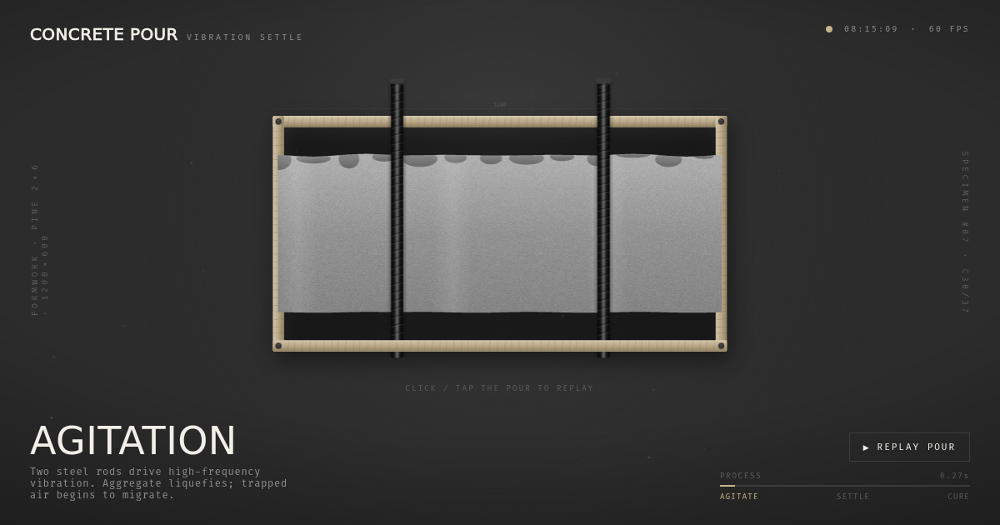 | `Qwen3.8-Flash-Next-UD-Q4_K_XL` | [gufo](https://github.com/gufo-org/gufo) | off | — | — | — | 1.6s | 429s | 9 | [open](prompts/animations/concrete-pour-vibration-settle/runs/qwen3-8-flash-next-ud-q4-k-xl/demo/index.html) · default |

---

### Conveyor Belt Hazard Stripe

A rhythmic, seamless loop of black rubber conveyor belt moving diagonally, interrupted by a bright yellow hazard stripe that passes over a fixed scanner gate.

**Status:** polished · `logistics` `motion-loop` `industrial-safety` `yellow-black` `rhythm` `mechanical` · brief by `Qwen3.8-Flash-Next-UD-Q4_K_XL`

[prompt](prompts/animations/conveyor-belt-hazard-stripe/prompt.md) · [extended](prompts/animations/conveyor-belt-hazard-stripe/prompt.full.md)

#### Model runs

| Preview | Model | Engine | Think | Ctx | In | Out | TTFT | Gen | Score | Demo |
|:-------:|-------|--------|:-----:|----:|---:|----:|-----:|----:|------:|------|
| 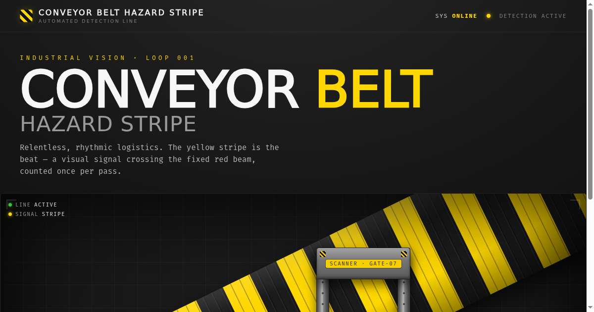 | `Qwen3.8-Flash-Next-UD-Q4_K_XL` | [gufo](https://github.com/gufo-org/gufo) | off | — | — | — | 3.1s | 304s | 8 | [open](prompts/animations/conveyor-belt-hazard-stripe/runs/qwen3-8-flash-next-ud-q4-k-xl/demo/index.html) · default |

---

### Conveyor Gate Scan Sync

A rhythmic animation of a green laser scan line moving over a package barcode, triggering a digital status update. Features precise timing, mechanical shutter sounds, and a clean utility UI.

**Status:** polished · `logistics` `barcode` `scanning-line` `mechanical-timing` `industrial-green` `monospace` `data-feed` · brief by `Qwen3.8-Flash-Next-UD-Q4_K_XL`

[prompt](prompts/animations/conveyor-gate-scan-sync/prompt.md) · [extended](prompts/animations/conveyor-gate-scan-sync/prompt.full.md)

#### Model runs

| Preview | Model | Engine | Think | Ctx | In | Out | TTFT | Gen | Score | Demo |
|:-------:|-------|--------|:-----:|----:|---:|----:|-----:|----:|------:|------|
| 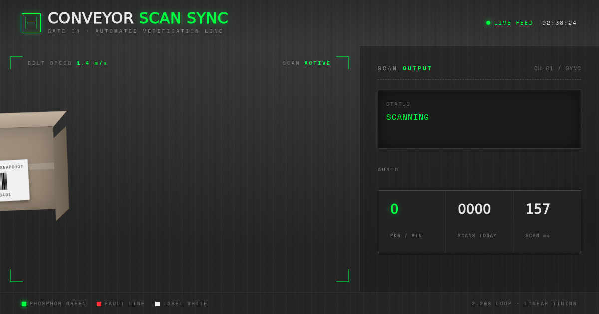 | `Qwen3.8-Flash-Next-UD-Q4_K_XL` | [gufo](https://github.com/gufo-org/gufo) | off | — | — | — | 2.0s | 320s | 8 | [open](prompts/animations/conveyor-gate-scan-sync/runs/qwen3-8-flash-next-ud-q4-k-xl/demo/index.html) · default |

---

### Cutout Collage Layer Shift

A dynamic composition of torn and cut paper layers sliding past each other in a Z-axis parallax, revealing hidden text and imagery beneath with the crispness of scissors and glue.

**Status:** polished · `collage` `paper-cut` `layering` `editorial` `dada` `parallax` `sharp-edge` `hand-crafted` · brief by `Qwen3.8-Flash-Next-UD-Q4_K_XL`

[prompt](prompts/animations/cutout-collage-layer-shift/prompt.md) · [extended](prompts/animations/cutout-collage-layer-shift/prompt.full.md)

#### Model runs

| Preview | Model | Engine | Think | Ctx | In | Out | TTFT | Gen | Score | Demo |
|:-------:|-------|--------|:-----:|----:|---:|----:|-----:|----:|------:|------|
| 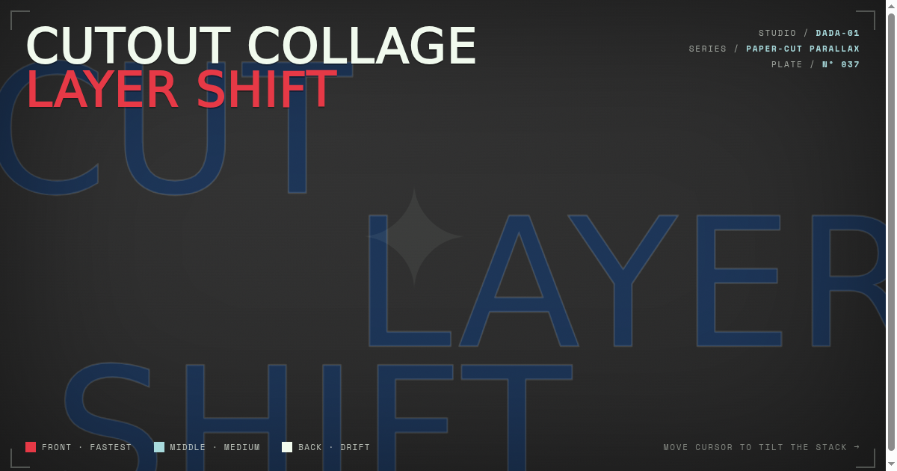 | `Qwen3.8-Flash-Next-UD-Q4_K_XL` | [gufo](https://github.com/gufo-org/gufo) | off | — | — | — | 1.6s | 273s | 6 | [open](prompts/animations/cutout-collage-layer-shift/runs/qwen3-8-flash-next-ud-q4-k-xl/demo/index.html) · default |

---

### Deep Sea Siphonophore Pulse

A translucent siphonophore bell expands and contracts in the crushing dark, emitting rhythmic pulses of cold blue bioluminescence that ripple through saline fluid.

**Status:** polished · `bioluminescence` `fluid-dynamics` `abyssal` `jellyfish` `slow-motion` `pressure` `dark-mode` · brief by `Qwen3.8-Flash-Next-UD-Q4_K_XL`

[prompt](prompts/animations/deep-sea-siphonophore-pulse/prompt.md) · [extended](prompts/animations/deep-sea-siphonophore-pulse/prompt.full.md)

#### Model runs

| Preview | Model | Engine | Think | Ctx | In | Out | TTFT | Gen | Score | Demo |
|:-------:|-------|--------|:-----:|----:|---:|----:|-----:|----:|------:|------|
| 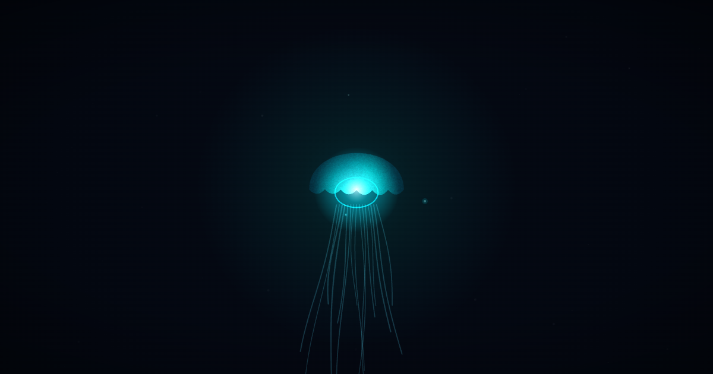 | `Qwen3.8-Flash-Next-UD-Q4_K_XL` | [gufo](https://github.com/gufo-org/gufo) | off | — | — | — | 1.5s | 204s | 8 | [open](prompts/animations/deep-sea-siphonophore-pulse/runs/qwen3-8-flash-next-ud-q4-k-xl/demo/index.html) · default |

---

### Dewey Decimal Orbit

Numerical classification codes orbit a central void in concentric rings, representing the hierarchical structure of knowledge. Hovering a ring expands its metadata in a clean, north-light interface.

**Status:** draft · `classification` `library` `orbit` `data-viz` `minimalist` `archival` `interaction` · brief by `Qwen3.8-Flash-Next-UD-Q4_K_XL`

[prompt](prompts/animations/dewey-decimal-orbit/prompt.md) · [extended](prompts/animations/dewey-decimal-orbit/prompt.full.md)

#### Model runs

| Preview | Model | Engine | Think | Ctx | In | Out | TTFT | Gen | Score | Demo |
|:-------:|-------|--------|:-----:|----:|---:|----:|-----:|----:|------:|------|
| — | `Qwen3.8-Flash-Next-UD-Q4_K_XL` | [gufo](https://github.com/gufo-org/gufo) | off | — | — | — | 374ms | 93s | — | — |

---

### Dust Devil Shadow Play

A minimalist composition where the shadow of a passing dust devil stretches and distorts across a flat, bone-white desert floor.

**Status:** draft · `wind` `shadow` `arid-minimal` `dust-devil` `negative-space` `motion-blur` `desert` · brief by `Qwen3.8-Flash-Next-UD-Q4_K_XL`

[prompt](prompts/animations/dust-devil-shadow-play/prompt.md) · [extended](prompts/animations/dust-devil-shadow-play/prompt.full.md)

#### Model runs

| Preview | Model | Engine | Think | Ctx | In | Out | TTFT | Gen | Score | Demo |
|:-------:|-------|--------|:-----:|----:|---:|----:|-----:|----:|------:|------|
| — | `Qwen3.8-Flash-Next-UD-Q4_K_XL` | [gufo](https://github.com/gufo-org/gufo) | off | — | — | — | 377ms | 292s | — | — |

---

### Emergency Stop Circuit Break

A heavy-duty red mushroom-head emergency stop button depresses with weighted resistance, snapping internal copper contacts apart to cut power.

**Status:** polished · `safety-protocol` `electrical` `hazard` `mechanical-switch` `status-change` `industrial-ui` · brief by `Qwen3.8-Flash-Next-UD-Q4_K_XL`

[prompt](prompts/animations/emergency-stop-circuit-break/prompt.md) · [extended](prompts/animations/emergency-stop-circuit-break/prompt.full.md)

#### Model runs

| Preview | Model | Engine | Think | Ctx | In | Out | TTFT | Gen | Score | Demo |
|:-------:|-------|--------|:-----:|----:|---:|----:|-----:|----:|------:|------|
| 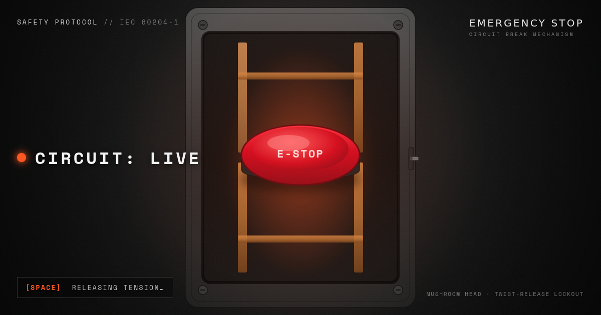 | `Qwen3.8-Flash-Next-UD-Q4_K_XL` | [gufo](https://github.com/gufo-org/gufo) | off | — | — | — | 2.2s | 246s | 8 | [open](prompts/animations/emergency-stop-circuit-break/runs/qwen3-8-flash-next-ud-q4-k-xl/demo/index.html) · default |

---

### Fibrous Paper Tear

A heavy, textured paper layer tears open to reveal a hidden layer, emphasizing the fibrous, tactile nature of the tear edge.

**Status:** polished · `paper` `tear` `fiber` `stop-motion` `texture` `organic` `reveal` · brief by `qwen3.8-flash-next`

[prompt](prompts/animations/fibrous-paper-tear/prompt.md) · [extended](prompts/animations/fibrous-paper-tear/prompt.full.md)

#### Model runs

| Preview | Model | Engine | Think | Ctx | In | Out | TTFT | Gen | Score | Demo |
|:-------:|-------|--------|:-----:|----:|---:|----:|-----:|----:|------:|------|
|  | `Qwen3.8-Flash-Next-UD-Q4_K_XL` | [gufo](https://github.com/gufo-org/gufo) | off | — | — | — | — | 7.0s | 9 | [open](prompts/animations/fibrous-paper-tear/runs/qwen3-8-flash-next-ud-q4-k-xl/demo/index.html) · default |

---

### Fuse Blowout Arc Break

A macro view of a ceramic fuse wire heating, glowing white-hot, then snapping with a brief, brilliant arc flash before the circuit goes dark and silent.

**Status:** polished · `electrical-safety` `circuit-break` `arc-flash` `thermal-glow` `industrial-hazard` `micro-detail` `status-change` · brief by `Qwen3.8-Flash-Next-UD-Q4_K_XL`

[prompt](prompts/animations/fuse-blowout-arc-break/prompt.md) · [extended](prompts/animations/fuse-blowout-arc-break/prompt.full.md)

#### Model runs

| Preview | Model | Engine | Think | Ctx | In | Out | TTFT | Gen | Score | Demo |
|:-------:|-------|--------|:-----:|----:|---:|----:|-----:|----:|------:|------|
| 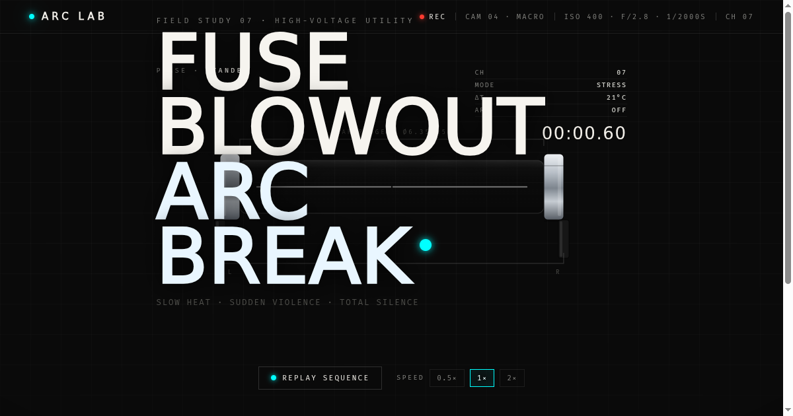 | `Qwen3.8-Flash-Next-UD-Q4_K_XL` | [gufo](https://github.com/gufo-org/gufo) | off | — | — | — | 1.7s | 427s | 8 | [open](prompts/animations/fuse-blowout-arc-break/runs/qwen3-8-flash-next-ud-q4-k-xl/demo/index.html) · default |

---

### Gas Mask Filter Canvas

A top-down macro view of a heavy-duty gas mask filter cartridge, where the fabric mesh ripples slightly as simulated air passes through, showing filtration efficiency.

**Status:** polished · `safety-gear` `textile` `filter` `airflow` `industrial-safety` `macro` · brief by `Qwen3.8-Flash-Next-UD-Q4_K_XL`

[prompt](prompts/animations/gas-mask-filter-canvas/prompt.md) · [extended](prompts/animations/gas-mask-filter-canvas/prompt.full.md)

#### Model runs

| Preview | Model | Engine | Think | Ctx | In | Out | TTFT | Gen | Score | Demo |
|:-------:|-------|--------|:-----:|----:|---:|----:|-----:|----:|------:|------|
| 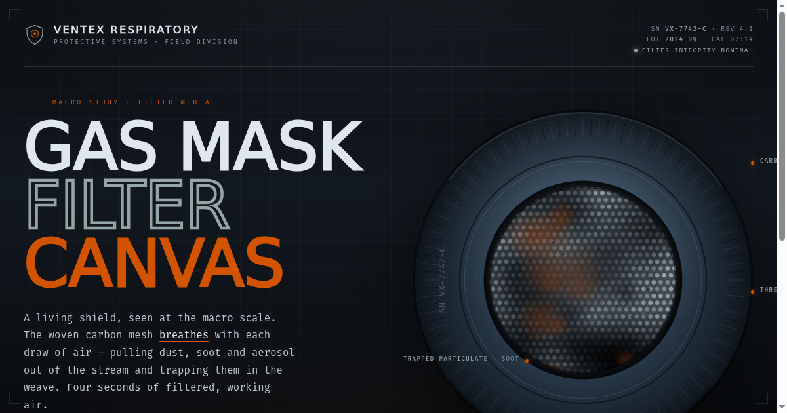 | `Qwen3.8-Flash-Next-UD-Q4_K_XL` | [gufo](https://github.com/gufo-org/gufo) | off | — | — | — | 1.5s | 391s | 9 | [open](prompts/animations/gas-mask-filter-canvas/runs/qwen3-8-flash-next-ud-q4-k-xl/demo/index.html) · default |

---

### Gasket Compression Seal

A macro view of a red rubber gasket being compressed between two aluminum plates, showing realistic deformation and the moment of airtight sealing.

**Status:** polished · `soft-machine` `rubber` `sealing` `material-stress` `industrial` `physics` `loop` · brief by `Qwen3.8-Flash-Next-UD-Q4_K_XL`

[prompt](prompts/animations/gasket-compression-seal/prompt.md) · [extended](prompts/animations/gasket-compression-seal/prompt.full.md)

#### Model runs

| Preview | Model | Engine | Think | Ctx | In | Out | TTFT | Gen | Score | Demo |
|:-------:|-------|--------|:-----:|----:|---:|----:|-----:|----:|------:|------|
| 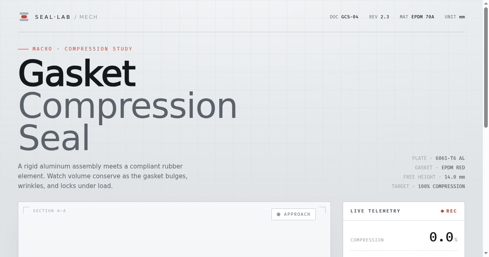 | `Qwen3.8-Flash-Next-UD-Q4_K_XL` | [gufo](https://github.com/gufo-org/gufo) | off | — | — | — | 436ms | 212s | 6 | [open](prompts/animations/gasket-compression-seal/runs/qwen3-8-flash-next-ud-q4-k-xl/demo/index.html) · default |

---

### Glass Buoy Fresnel Focus

A rotating glass Fresnel lens buoy distorts the background water texture, focusing light into sharp, readable text as it aligns with the viewer.

**Status:** polished · `aquatic-depth` `optics` `refraction` `maritime` `interaction` `glass-texture` `quiet-luxury` · brief by `Qwen3.8-Flash-Next-UD-Q4_K_XL`

[prompt](prompts/animations/glass-buoy-fresnel-focus/prompt.md) · [extended](prompts/animations/glass-buoy-fresnel-focus/prompt.full.md)

#### Model runs

| Preview | Model | Engine | Think | Ctx | In | Out | TTFT | Gen | Score | Demo |
|:-------:|-------|--------|:-----:|----:|---:|----:|-----:|----:|------:|------|
| 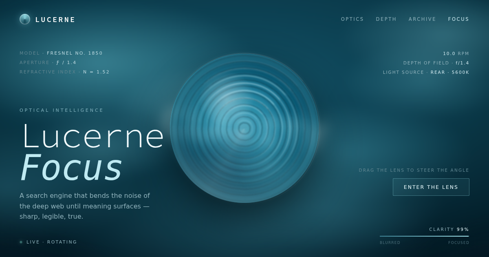 | `Qwen3.8-Flash-Next-UD-Q4_K_XL` | [gufo](https://github.com/gufo-org/gufo) | off | — | — | — | 232ms | 274s | 8 | [open](prompts/animations/glass-buoy-fresnel-focus/runs/qwen3-8-flash-next-ud-q4-k-xl/demo/index.html) · default |

---

### Glazed Porcelain Crackle

Macro animation of white porcelain cooling, revealing intricate crackle glaze patterns with a shifting subsurface light reflection.

**Status:** draft · `porcelain` `crackle` `glaze` `texture-animation` `ceramic` `macro` `haptic` · brief by `qwen3.8-flash-next`

[prompt](prompts/animations/glazed-porcelain-crackle/prompt.md) · [extended](prompts/animations/glazed-porcelain-crackle/prompt.full.md)

#### Model runs

| Preview | Model | Engine | Think | Ctx | In | Out | TTFT | Gen | Score | Demo |
|:-------:|-------|--------|:-----:|----:|---:|----:|-----:|----:|------:|------|
| — | `Qwen3.8-Flash-Next-UD-Q4_K_XL` | [gufo](https://github.com/gufo-org/gufo) | off | — | — | — | — | 96s | — | — |

---

### Halftone Moiré Scan

Overlapping CMYK halftone dot grids rotate slowly, creating hypnotic moiré interference patterns that resolve into a clear image or text.

**Status:** polished · `halftone` `moir-pattern` `rotational` `optical-art` `print-process` `cyan-magenta-yellow` `raster` · brief by `qwen3.8-flash-next`

[prompt](prompts/animations/halftone-moir-scan/prompt.md) · [extended](prompts/animations/halftone-moir-scan/prompt.full.md)

#### Model runs

| Preview | Model | Engine | Think | Ctx | In | Out | TTFT | Gen | Score | Demo |
|:-------:|-------|--------|:-----:|----:|---:|----:|-----:|----:|------:|------|
| 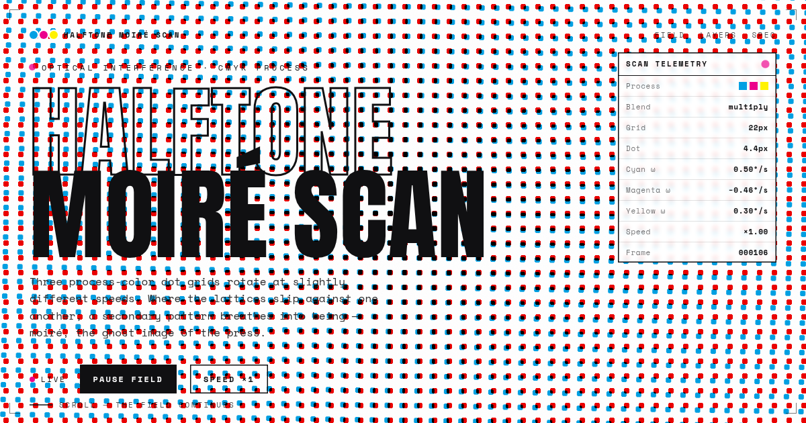 | `Qwen3.8-Flash-Next-UD-Q4_K_XL` | [gufo](https://github.com/gufo-org/gufo) | off | — | — | — | — | 8.8s | 8 | [open](prompts/animations/halftone-moir-scan/runs/qwen3-8-flash-next-ud-q4-k-xl/demo/index.html) · default |

---

### Halocline Density Layer

Abstract visualization of ocean haloclines where fresh and salt water mix, visualizing data flow through shifting density bands and refractive boundaries.

**Status:** polished · `aquatic-depth` `fluid-dynamics` `density-stratification` `data-viz` `saline-palette` `ambient` `abstraction` · brief by `Qwen3.8-Flash-Next-UD-Q4_K_XL`

[prompt](prompts/animations/halocline-density-layer/prompt.md) · [extended](prompts/animations/halocline-density-layer/prompt.full.md)

#### Model runs

| Preview | Model | Engine | Think | Ctx | In | Out | TTFT | Gen | Score | Demo |
|:-------:|-------|--------|:-----:|----:|---:|----:|-----:|----:|------:|------|
| 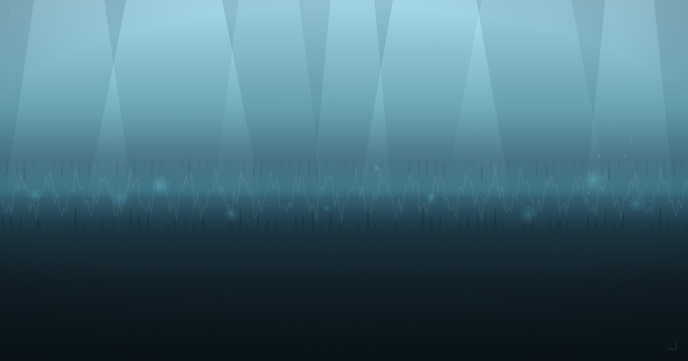 | `Qwen3.8-Flash-Next-UD-Q4_K_XL` | [gufo](https://github.com/gufo-org/gufo) | off | — | — | — | 1.7s | 309s | 8 | [open](prompts/animations/halocline-density-layer/runs/qwen3-8-flash-next-ud-q4-k-xl/demo/index.html) · default |

---

### Hammered Copper Pulse

A sheet of hammered copper reacts to invisible forces, rippling with liquid-metal physics and catching warm, industrial light.

**Status:** polished · `copper` `metal` `hammered` `liquid-metal` `physics` `tactile` `industrial` · brief by `qwen3.8-flash-next`

[prompt](prompts/animations/hammered-copper-pulse/prompt.md) · [extended](prompts/animations/hammered-copper-pulse/prompt.full.md)

#### Model runs

| Preview | Model | Engine | Think | Ctx | In | Out | TTFT | Gen | Score | Demo |
|:-------:|-------|--------|:-----:|----:|---:|----:|-----:|----:|------:|------|
|  | `Qwen3.8-Flash-Next-UD-Q4_K_XL` | [gufo](https://github.com/gufo-org/gufo) | off | — | — | — | — | 6.0s | 8 | [open](prompts/animations/hammered-copper-pulse/runs/qwen3-8-flash-next-ud-q4-k-xl/demo/index.html) · default |

---

### Hammered Tin Hull

Close-up of soft tin sheet being hammered into a curved hull, showing progressive dents, stretching, and dull metallic sheen.

**Status:** polished · `tin` `metal-forming` `hammering` `soft-metal` `dents` `industrial-craft` `reflective` · brief by `qwen3.8-flash-next`

[prompt](prompts/animations/hammered-tin-hull/prompt.md) · [extended](prompts/animations/hammered-tin-hull/prompt.full.md)

#### Model runs

| Preview | Model | Engine | Think | Ctx | In | Out | TTFT | Gen | Score | Demo |
|:-------:|-------|--------|:-----:|----:|---:|----:|-----:|----:|------:|------|
| 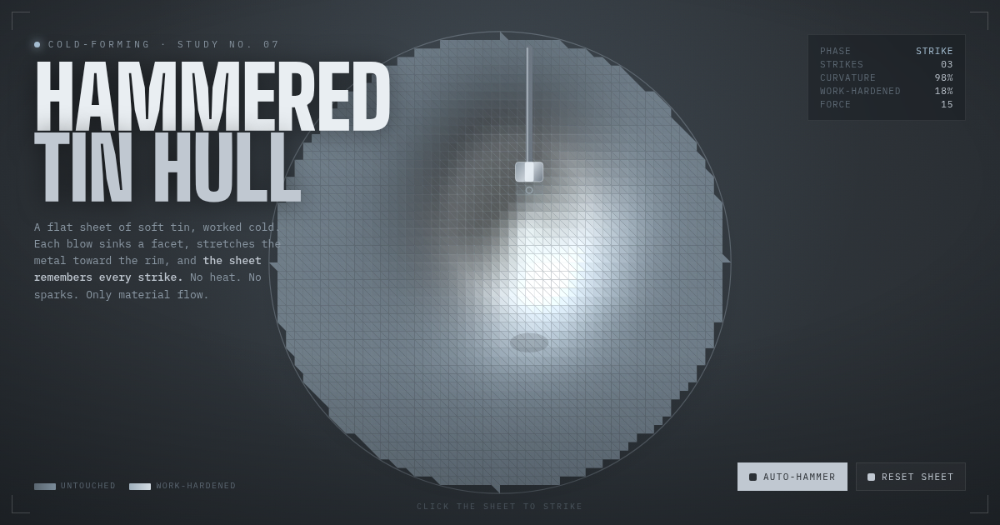 | `Qwen3.8-Flash-Next-UD-Q4_K_XL` | [gufo](https://github.com/gufo-org/gufo) | off | — | — | — | — | 7.5s | 9 | [open](prompts/animations/hammered-tin-hull/runs/qwen3-8-flash-next-ud-q4-k-xl/demo/index.html) · default |

---

### Hydraulic Relay Lockout

A macro animation of a red hydraulic safety latch engaging a silver relay, featuring heavy mechanical resistance, a sharp click sound, and a status light switching from amber to solid green.

**Status:** polished · `utility` `safety-protocol` `mechanical-lock` `red-hazard` `industrial-ui` `click-feedback` `monochrome` · brief by `Qwen3.8-Flash-Next-UD-Q4_K_XL`

[prompt](prompts/animations/hydraulic-relay-lockout/prompt.md) · [extended](prompts/animations/hydraulic-relay-lockout/prompt.full.md)

#### Model runs

| Preview | Model | Engine | Think | Ctx | In | Out | TTFT | Gen | Score | Demo |
|:-------:|-------|--------|:-----:|----:|---:|----:|-----:|----:|------:|------|
| 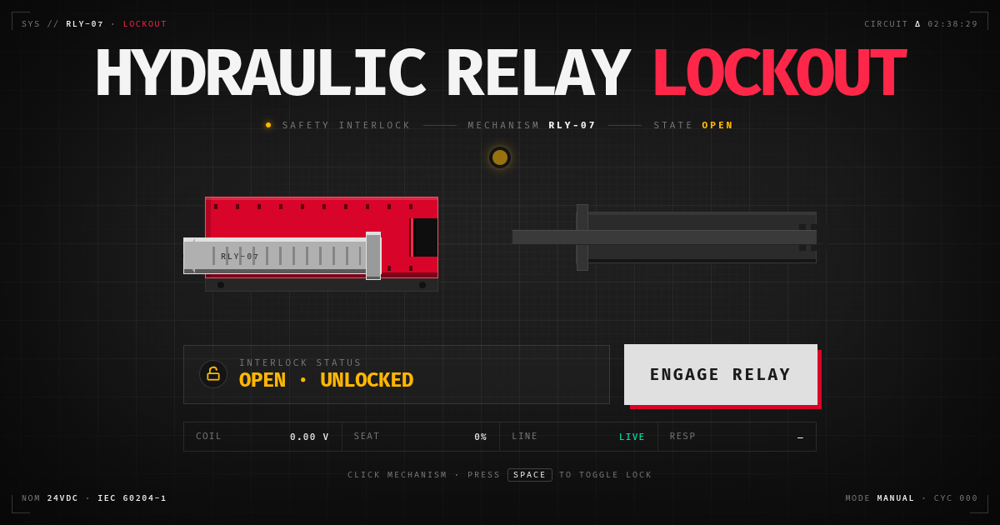 | `Qwen3.8-Flash-Next-UD-Q4_K_XL` | [gufo](https://github.com/gufo-org/gufo) | off | — | — | — | 1.7s | 368s | 9 | [open](prompts/animations/hydraulic-relay-lockout/runs/qwen3-8-flash-next-ud-q4-k-xl/demo/index.html) · default |

---

### Ink Brush Lifting

The precise moment an ink brush lifts from paper, showing the ink's viscosity, the thread-like strand breaking, and the wet texture of the stroke.

**Status:** polished · `calligraphy` `ink` `paper` `lifting` `viscosity` `traditional-art` `negative-space` · brief by `qwen3.8-flash-next`

[prompt](prompts/animations/ink-brush-lifting/prompt.md) · [extended](prompts/animations/ink-brush-lifting/prompt.full.md)

#### Model runs

| Preview | Model | Engine | Think | Ctx | In | Out | TTFT | Gen | Score | Demo |
|:-------:|-------|--------|:-----:|----:|---:|----:|-----:|----:|------:|------|
|  | `Qwen3.8-Flash-Next-UD-Q4_K_XL` | [gufo](https://github.com/gufo-org/gufo) | off | — | — | — | — | 8.8s | 6 | [open](prompts/animations/ink-brush-lifting/runs/qwen3-8-flash-next-ud-q4-k-xl/demo/index.html) · default |

---

### Ink Well Precision Drip

A single drop of black ink forms on the tip of a glass dip pen. It hangs, trembling with surface tension, then falls slowly into a white ink well, creating a perfect, slow-radiating ripple that resolves into text.

**Status:** polished · `ink` `fluid-dynamics` `typography` `calligraphy` `viscosity` `north-light` `minimal` · brief by `Qwen3.8-Flash-Next-UD-Q4_K_XL`

[prompt](prompts/animations/ink-well-precision-drip/prompt.md) · [extended](prompts/animations/ink-well-precision-drip/prompt.full.md)

#### Model runs

| Preview | Model | Engine | Think | Ctx | In | Out | TTFT | Gen | Score | Demo |
|:-------:|-------|--------|:-----:|----:|---:|----:|-----:|----:|------:|------|
| 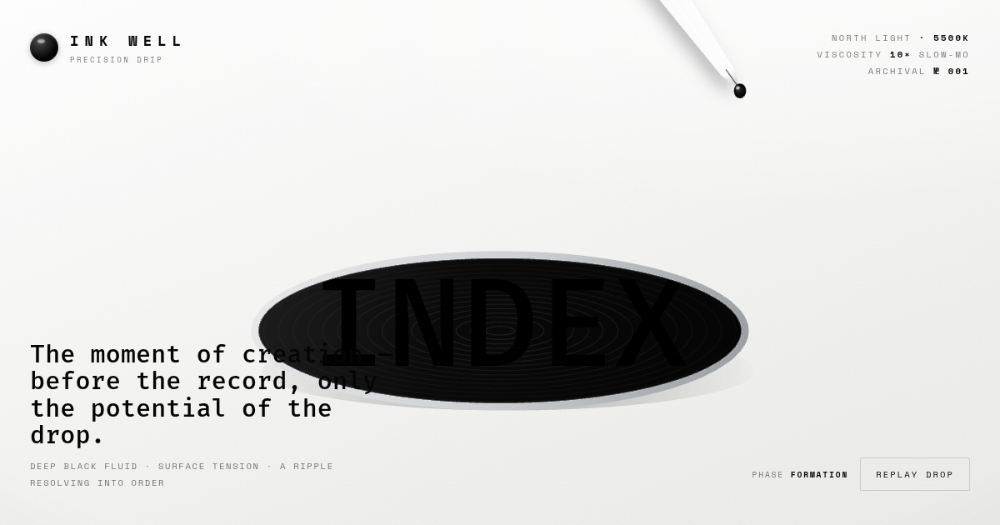 | `Qwen3.8-Flash-Next-UD-Q4_K_XL` | [gufo](https://github.com/gufo-org/gufo) | off | — | — | — | 1.5s | 304s | 8 | [open](prompts/animations/ink-well-precision-drip/runs/qwen3-8-flash-next-ud-q4-k-xl/demo/index.html) · default |

---

### Ledger Line Justification

A typographic animation where loose ledger entries snap into perfect justification and alignment, simulating the quiet order of archival indexing under cool north light.

**Status:** polished · `ledger` `justification` `typography` `north-light` `indexing` `motion-typography` `archival` · brief by `Qwen3.8-Flash-Next-UD-Q4_K_XL`

[prompt](prompts/animations/ledger-line-justification/prompt.md) · [extended](prompts/animations/ledger-line-justification/prompt.full.md)

#### Model runs

| Preview | Model | Engine | Think | Ctx | In | Out | TTFT | Gen | Score | Demo |
|:-------:|-------|--------|:-----:|----:|---:|----:|-----:|----:|------:|------|
| 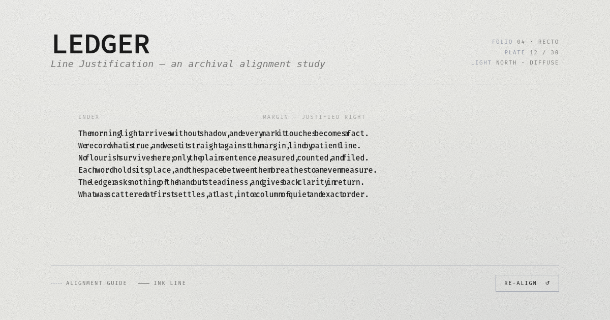 | `Qwen3.8-Flash-Next-UD-Q4_K_XL` | [gufo](https://github.com/gufo-org/gufo) | off | — | — | — | 234ms | 176s | 6 | [open](prompts/animations/ledger-line-justification/runs/qwen3-8-flash-next-ud-q4-k-xl/demo/index.html) · default |

---

### Letterpress Emboss Deform

Simulating the physical compression of paper under a heavy letterpress block. Text presses into the substrate, creating dynamic shadows and highlights.

**Status:** polished · `letterpress` `deboss` `emboss` `paper-compression` `tactile` `3d-transform` `shadow-play` · brief by `qwen3.8-flash-next`

[prompt](prompts/animations/letterpress-emboss-deform/prompt.md) · [extended](prompts/animations/letterpress-emboss-deform/prompt.full.md)

#### Model runs

| Preview | Model | Engine | Think | Ctx | In | Out | TTFT | Gen | Score | Demo |
|:-------:|-------|--------|:-----:|----:|---:|----:|-----:|----:|------:|------|
|  | `Qwen3.8-Flash-Next-UD-Q4_K_XL` | [gufo](https://github.com/gufo-org/gufo) | off | — | — | — | — | 5.0s | 9 | [open](prompts/animations/letterpress-emboss-deform/runs/qwen3-8-flash-next-ud-q4-k-xl/demo/index.html) · default |

---

### Linen Press Tension

A macro animation of high-thread-count linen being pressed by a clean, white ceramic plate. The fabric compresses, creating soft shadows and revealing the weave.

**Status:** polished · `fabric` `linen` `physics` `texture` `compression` `craft` `soft-body` · brief by `qwen3.8-flash-next`

[prompt](prompts/animations/linen-press-tension/prompt.md) · [extended](prompts/animations/linen-press-tension/prompt.full.md)

#### Model runs

| Preview | Model | Engine | Think | Ctx | In | Out | TTFT | Gen | Score | Demo |
|:-------:|-------|--------|:-----:|----:|---:|----:|-----:|----:|------:|------|
| 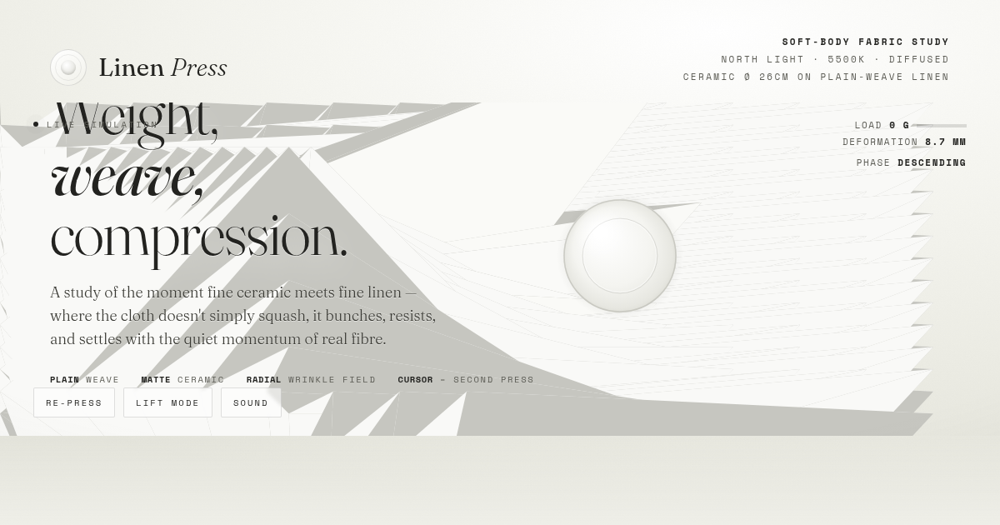 | `Qwen3.8-Flash-Next-UD-Q4_K_XL` | [gufo](https://github.com/gufo-org/gufo) | off | — | — | — | — | 7.1s | 8 | [open](prompts/animations/linen-press-tension/runs/qwen3-8-flash-next-ud-q4-k-xl/demo/index.html) · default |

---

### Magnetic Cursor Orbit

Nav labels gently orbit/attract toward the cursor with spring damping — tactile, premium, never gimmicky.

**Status:** draft · `cursor` `magnetic` `microinteraction` `nav` `js`

[prompt](prompts/animations/magnetic-cursor-orbit/prompt.md) · [extended](prompts/animations/magnetic-cursor-orbit/prompt.full.md)

#### Model runs

| Preview | Model | Engine | Think | Ctx | In | Out | TTFT | Gen | Score | Demo |
|:-------:|-------|--------|:-----:|----:|---:|----:|-----:|----:|------:|------|
| 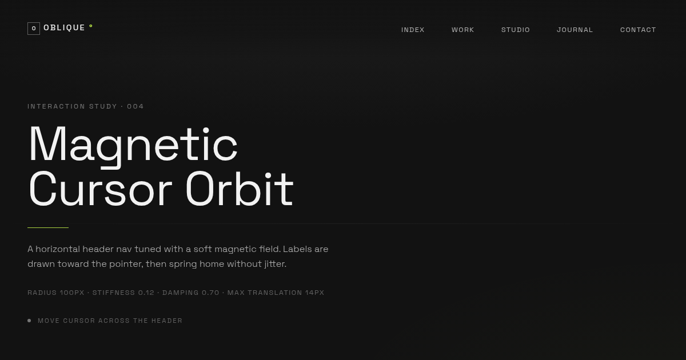 | `Qwen3.8-Flash-Next-UD-Q4_K_XL` | [gufo](https://github.com/gufo-org/gufo) | off | — | — | — | — | 7.5s | 6 | [open](prompts/animations/magnetic-cursor-orbit/runs/qwen3-8-flash-next-ud-q4-k-xl/demo/index.html) · default |

---

### Magnetic Ferrofluid Kerning

Black liquid metal letters deform and spike under simulated magnetic attraction, pulling towards a cursor with viscous, organic physics before snapping back into rigid typography.

**Status:** polished · `ferrofluid` `magnetic-type` `organic-deform` `kerning` `dark-mode` `viscosity` `soft-body` · brief by `Qwen3.8-Flash-Next-UD-Q4_K_XL`

[prompt](prompts/animations/magnetic-ferrofluid-kerning/prompt.md) · [extended](prompts/animations/magnetic-ferrofluid-kerning/prompt.full.md)

#### Model runs

| Preview | Model | Engine | Think | Ctx | In | Out | TTFT | Gen | Score | Demo |
|:-------:|-------|--------|:-----:|----:|---:|----:|-----:|----:|------:|------|
| 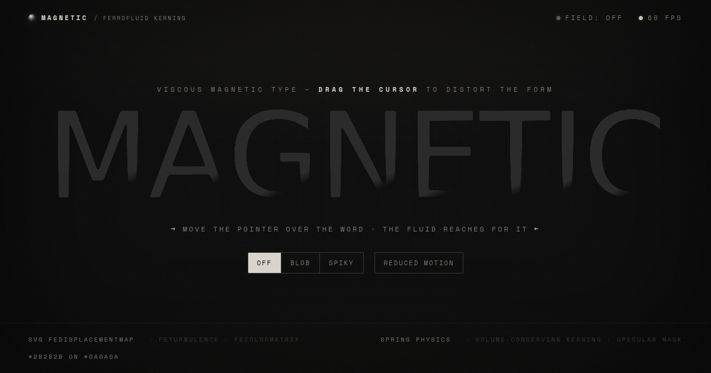 | `Qwen3.8-Flash-Next-UD-Q4_K_XL` | [gufo](https://github.com/gufo-org/gufo) | off | — | — | — | 2.1s | 282s | 8 | [open](prompts/animations/magnetic-ferrofluid-kerning/runs/qwen3-8-flash-next-ud-q4-k-xl/demo/index.html) · default |

---

### Magnetic Nav Rail

Cursor-bound navigation rail for Vector Harbor where items lean, scale, and magnetically dock under the pointer with elastic easing.

**Status:** draft · `magnetic-nav` `cursor-interaction` `navigation` `ui-motion` `web-animation`

[prompt](prompts/animations/magnetic-nav-rail/prompt.md) · [extended](prompts/animations/magnetic-nav-rail/prompt.full.md)

#### Model runs

| Preview | Model | Engine | Think | Ctx | In | Out | TTFT | Gen | Score | Demo |
|:-------:|-------|--------|:-----:|----:|---:|----:|-----:|----:|------:|------|
|  | `Qwen3.8-Flash-Next-UD-Q4_K_XL` | [gufo](https://github.com/gufo-org/gufo) | off | — | — | — | — | 9.1s | 6 | [open](prompts/animations/magnetic-nav-rail/runs/qwen3-8-flash-next-ud-q4-k-xl/demo/index.html) · default |

---

### Microfilm Reel Focus

A UI component that mimics the physical act of focusing a microfilm reader. Text shifts from heavy Gaussian blur to sharp clarity as the user scrolls or interacts, revealing archival records.

**Status:** polished · `microfilm` `focus` `archival` `scan` `blur` `analog-tech` `ui` · brief by `Qwen3.8-Flash-Next-UD-Q4_K_XL`

[prompt](prompts/animations/microfilm-reel-focus/prompt.md) · [extended](prompts/animations/microfilm-reel-focus/prompt.full.md)

#### Model runs

| Preview | Model | Engine | Think | Ctx | In | Out | TTFT | Gen | Score | Demo |
|:-------:|-------|--------|:-----:|----:|---:|----:|-----:|----:|------:|------|
| 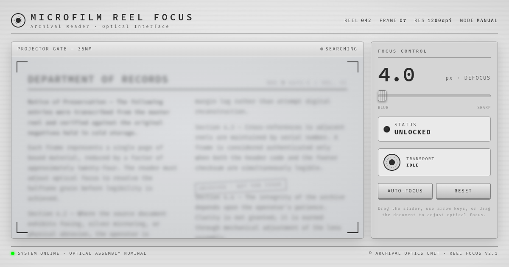 | `Qwen3.8-Flash-Next-UD-Q4_K_XL` | [gufo](https://github.com/gufo-org/gufo) | off | — | — | — | 1.6s | 323s | 9 | [open](prompts/animations/microfilm-reel-focus/runs/qwen3-8-flash-next-ud-q4-k-xl/demo/index.html) · default |

---

### Molten Glass Pour

High-speed slow-motion visualization of molten glass pouring, emphasizing extreme viscosity, light refraction, and thermal glow.

**Status:** polished · `glass` `viscosity` `refraction` `fluid-sim` `transparency` `tactile` `slow-motion` · brief by `qwen3.8-flash-next`

[prompt](prompts/animations/molten-glass-pour/prompt.md) · [extended](prompts/animations/molten-glass-pour/prompt.full.md)

#### Model runs

| Preview | Model | Engine | Think | Ctx | In | Out | TTFT | Gen | Score | Demo |
|:-------:|-------|--------|:-----:|----:|---:|----:|-----:|----:|------:|------|
|  | `Qwen3.8-Flash-Next-UD-Q4_K_XL` | [gufo](https://github.com/gufo-org/gufo) | off | — | — | — | — | 6.8s | 9 | [open](prompts/animations/molten-glass-pour/runs/qwen3-8-flash-next-ud-q4-k-xl/demo/index.html) · default |

---

### Neon Tube Ignition Logic

Words ignite one by one inside bent glass tubes, flickering with electrical hesitation before settling into a stable, warm neon glow along a dark circuit path.

**Status:** polished · `neon-glow` `electrical-ignition` `kinetic-type` `circuit-trace` `dark-ui` `vintage-tech` `signal-flow` · brief by `Qwen3.8-Flash-Next-UD-Q4_K_XL`

[prompt](prompts/animations/neon-tube-ignition-logic/prompt.md) · [extended](prompts/animations/neon-tube-ignition-logic/prompt.full.md)

#### Model runs

| Preview | Model | Engine | Think | Ctx | In | Out | TTFT | Gen | Score | Demo |
|:-------:|-------|--------|:-----:|----:|---:|----:|-----:|----:|------:|------|
| 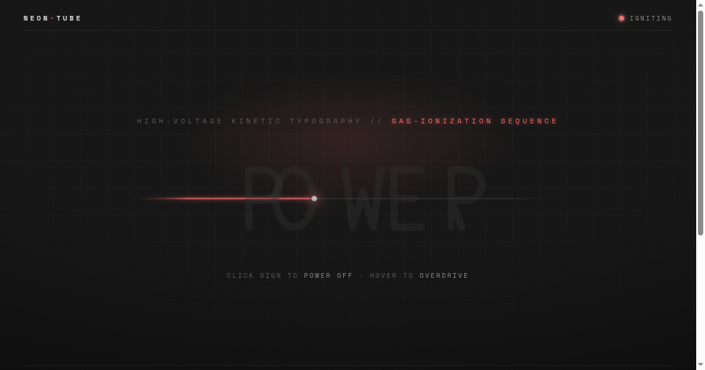 | `Qwen3.8-Flash-Next-UD-Q4_K_XL` | [gufo](https://github.com/gufo-org/gufo) | off | — | — | — | 349ms | 163s | 8 | [open](prompts/animations/neon-tube-ignition-logic/runs/qwen3-8-flash-next-ud-q4-k-xl/demo/index.html) · default |

---

### Obsidian Loom Mask Reveal

Scroll-driven mask reveal for Obsidian Loom where woven headline strips unfold from dark ink bands into a high-contrast product story.

**Status:** draft · `mask-reveal` `scroll-reveal` `editorial` `typography` `web-animation`

[prompt](prompts/animations/obsidian-loom-mask-reveal/prompt.md) · [extended](prompts/animations/obsidian-loom-mask-reveal/prompt.full.md)

#### Model runs

| Preview | Model | Engine | Think | Ctx | In | Out | TTFT | Gen | Score | Demo |
|:-------:|-------|--------|:-----:|----:|---:|----:|-----:|----:|------:|------|
| — | `Qwen3.8-Flash-Next-UD-Q4_K_XL` | [gufo](https://github.com/gufo-org/gufo) | — | — | — | — | — | — | — | — |

---

### Obsidian Sheer Slice

A block of obsidian fractures along conchoidal lines, revealing razor-sharp edges with high-contrast specular highlights and internal sheen.

**Status:** polished · `volcanic-glass` `fracture` `sharp-edge` `black-sheen` `conchoidal` `macro` `high-contrast` · brief by `qwen3.8-flash-next`

[prompt](prompts/animations/obsidian-sheer-slice/prompt.md) · [extended](prompts/animations/obsidian-sheer-slice/prompt.full.md)

#### Model runs

| Preview | Model | Engine | Think | Ctx | In | Out | TTFT | Gen | Score | Demo |
|:-------:|-------|--------|:-----:|----:|---:|----:|-----:|----:|------:|------|
|  | `Qwen3.8-Flash-Next-UD-Q4_K_XL` | [gufo](https://github.com/gufo-org/gufo) | off | — | — | — | — | 7.3s | 6 | [open](prompts/animations/obsidian-sheer-slice/runs/qwen3-8-flash-next-ud-q4-k-xl/demo/index.html) · default |

---

### Oxidized Brass Tarnish

A time-lapse animation of polished brass tarnishing, where dark verdigris blooms across the surface in organic, liquid-like patterns.

**Status:** polished · `brass` `oxidation` `time-lapse` `material-aging` `surface-tension` `tactile` `patina` · brief by `qwen3.8-flash-next`

[prompt](prompts/animations/oxidized-brass-tarnish/prompt.md) · [extended](prompts/animations/oxidized-brass-tarnish/prompt.full.md)

#### Model runs

| Preview | Model | Engine | Think | Ctx | In | Out | TTFT | Gen | Score | Demo |
|:-------:|-------|--------|:-----:|----:|---:|----:|-----:|----:|------:|------|
|  | `Qwen3.8-Flash-Next-UD-Q4_K_XL` | [gufo](https://github.com/gufo-org/gufo) | off | — | — | — | — | 6.8s | 8 | [open](prompts/animations/oxidized-brass-tarnish/runs/qwen3-8-flash-next-ud-q4-k-xl/demo/index.html) · default |

---

### Parallax Depth Layers

Three-plane scroll parallax with depth fog — landscape storytelling that stays smooth and reduced-motion safe.

**Status:** draft · `parallax` `scroll` `depth` `landscape` `performance`

[prompt](prompts/animations/parallax-depth-layers/prompt.md) · [extended](prompts/animations/parallax-depth-layers/prompt.full.md)

#### Model runs

| Preview | Model | Engine | Think | Ctx | In | Out | TTFT | Gen | Score | Demo |
|:-------:|-------|--------|:-----:|----:|---:|----:|-----:|----:|------:|------|
| 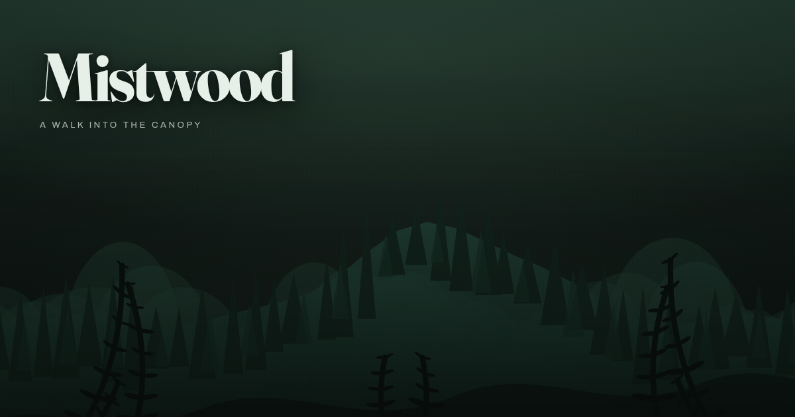 | `Qwen3.8-Flash-Next-UD-Q4_K_XL` | [gufo](https://github.com/gufo-org/gufo) | off | — | — | — | — | 5.3s | 8 | [open](prompts/animations/parallax-depth-layers/runs/qwen3-8-flash-next-ud-q4-k-xl/demo/index.html) · default |

---

### Photo Grain Developing Scan

A high-contrast black and white editorial image 'develops' from negative to positive through a moving scanline, accompanied by intense, animated film grain that settles as the image sharpens.

**Status:** polished · `photography` `film-grain` `darkroom` `reveal` `scanline` `monochrome` `editorial` `texture` · brief by `Qwen3.8-Flash-Next-UD-Q4_K_XL`

[prompt](prompts/animations/photo-grain-developing-scan/prompt.md) · [extended](prompts/animations/photo-grain-developing-scan/prompt.full.md)

#### Model runs

| Preview | Model | Engine | Think | Ctx | In | Out | TTFT | Gen | Score | Demo |
|:-------:|-------|--------|:-----:|----:|---:|----:|-----:|----:|------:|------|
| 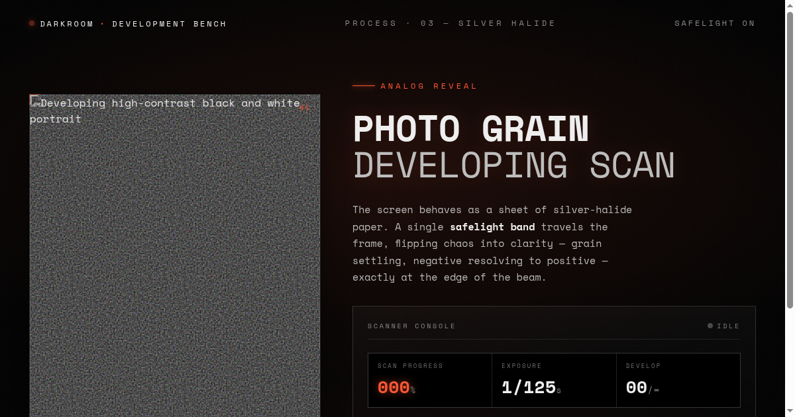 | `Qwen3.8-Flash-Next-UD-Q4_K_XL` | [gufo](https://github.com/gufo-org/gufo) | off | — | — | — | 1.8s | 290s | 6 | [open](prompts/animations/photo-grain-developing-scan/runs/qwen3-8-flash-next-ud-q4-k-xl/demo/index.html) · default |

---

### Porcelain Clasp Click

Two pristine white porcelain lugs rotate and engage with a satisfying, audible 'click', demonstrating the quiet precision of soft-machine mechanics.

**Status:** polished · `soft-machine` `porcelain` `micro-interaction` `ceramic-mechanism` `tactile-audio` `loop` `haptic` · brief by `Qwen3.8-Flash-Next-UD-Q4_K_XL`

[prompt](prompts/animations/porcelain-clasp-click/prompt.md) · [extended](prompts/animations/porcelain-clasp-click/prompt.full.md)

#### Model runs

| Preview | Model | Engine | Think | Ctx | In | Out | TTFT | Gen | Score | Demo |
|:-------:|-------|--------|:-----:|----:|---:|----:|-----:|----:|------:|------|
| 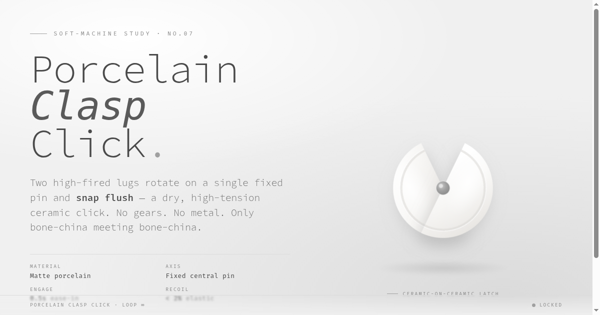 | `Qwen3.8-Flash-Next-UD-Q4_K_XL` | [gufo](https://github.com/gufo-org/gufo) | off | — | — | — | 1.5s | 276s | 8 | [open](prompts/animations/porcelain-clasp-click/runs/qwen3-8-flash-next-ud-q4-k-xl/demo/index.html) · default |

---

### Pressure Gauge Redline Fluctuation

A brass analog pressure gauge needle trembles and snaps against the redline zone, visualizing system stress and safety protocols with mechanical precision.

**Status:** draft · `analog-gauge` `safety-limit` `needle-physics` `utility-ui` `industrial-monitoring` `haptic-feedback` `status-alert` · brief by `Qwen3.8-Flash-Next-UD-Q4_K_XL`

[prompt](prompts/animations/pressure-gauge-redline-fluctuation/prompt.md) · [extended](prompts/animations/pressure-gauge-redline-fluctuation/prompt.full.md)

#### Model runs

| Preview | Model | Engine | Think | Ctx | In | Out | TTFT | Gen | Score | Demo |
|:-------:|-------|--------|:-----:|----:|---:|----:|-----:|----:|------:|------|
| — | `Qwen3.8-Flash-Next-UD-Q4_K_XL` | [gufo](https://github.com/gufo-org/gufo) | off | — | — | — | 201ms | 195s | — | — |

---

### Pressure Relief Valve Vent

A brass industrial pressure relief valve hisses, releasing a jet of white steam into a dark, cold atmosphere, with a gauge needle dropping to safe levels.

**Status:** polished · `steam` `mechanical` `utility` `safety` `thermal` `particle-system` · brief by `Qwen3.8-Flash-Next-UD-Q4_K_XL`

[prompt](prompts/animations/pressure-relief-valve-vent/prompt.md) · [extended](prompts/animations/pressure-relief-valve-vent/prompt.full.md)

#### Model runs

| Preview | Model | Engine | Think | Ctx | In | Out | TTFT | Gen | Score | Demo |
|:-------:|-------|--------|:-----:|----:|---:|----:|-----:|----:|------:|------|
| 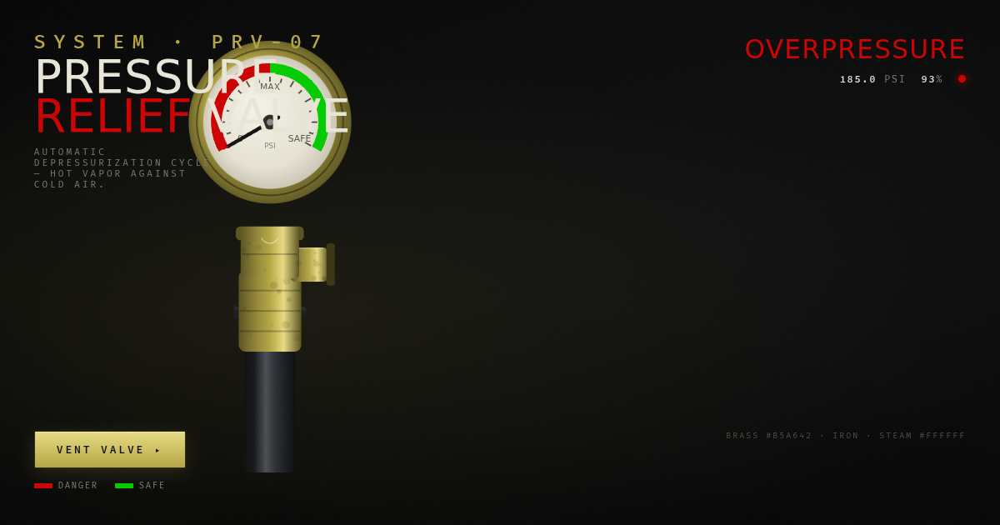 | `Qwen3.8-Flash-Next-UD-Q4_K_XL` | [gufo](https://github.com/gufo-org/gufo) | off | — | — | — | 1.7s | 350s | 6 | [open](prompts/animations/pressure-relief-valve-vent/runs/qwen3-8-flash-next-ud-q4-k-xl/demo/index.html) · default |

---

### Rail Switch Lock Mechanism

A close-up of a heavy iron rail switch lock engaging, showcasing the brutal precision of railway infrastructure with metallic sheen and tactile feedback.

**Status:** polished · `railway` `mechanism` `locking` `industrial-ui` `heavy-metal` `precision` · brief by `Qwen3.8-Flash-Next-UD-Q4_K_XL`

[prompt](prompts/animations/rail-switch-lock-mechanism/prompt.md) · [extended](prompts/animations/rail-switch-lock-mechanism/prompt.full.md)

#### Model runs

| Preview | Model | Engine | Think | Ctx | In | Out | TTFT | Gen | Score | Demo |
|:-------:|-------|--------|:-----:|----:|---:|----:|-----:|----:|------:|------|
| 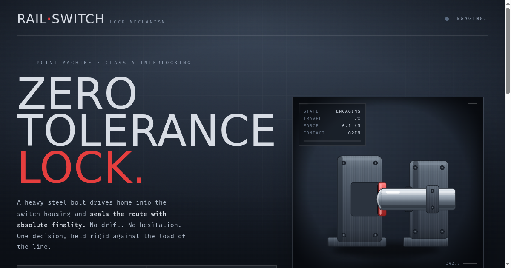 | `Qwen3.8-Flash-Next-UD-Q4_K_XL` | [gufo](https://github.com/gufo-org/gufo) | off | — | — | — | 2.2s | 513s | 8 | [open](prompts/animations/rail-switch-lock-mechanism/runs/qwen3-8-flash-next-ud-q4-k-xl/demo/index.html) · default |

---

### Riso Registration Shift

A continuous loop of two-color screen print shifting in and out of perfect registration, mimicking the tactile imperfection of Riso duplication.

**Status:** polished · `risograph` `print-misalignment` `duotone` `screen-print` `glitch-art` `editorial-print` `loop` · brief by `qwen3.8-flash-next`

[prompt](prompts/animations/riso-registration-shift/prompt.md) · [extended](prompts/animations/riso-registration-shift/prompt.full.md)

#### Model runs

| Preview | Model | Engine | Think | Ctx | In | Out | TTFT | Gen | Score | Demo |
|:-------:|-------|--------|:-----:|----:|---:|----:|-----:|----:|------:|------|
| 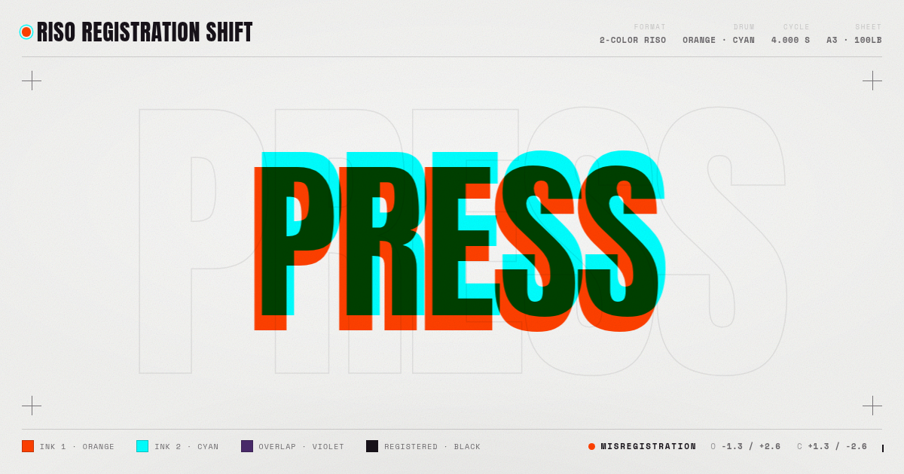 | `Qwen3.8-Flash-Next-UD-Q4_K_XL` | [gufo](https://github.com/gufo-org/gufo) | off | — | — | — | — | 7.1s | 9 | [open](prompts/animations/riso-registration-shift/runs/qwen3-8-flash-next-ud-q4-k-xl/demo/index.html) · default |

---

### Saffron Watercolor Bloom

A macro animation of saffron threads dissolving in clear water, creating intricate red and gold pigment blooms against a sterile white backdrop.

**Status:** polished · `fluid-sim` `spice` `color-theory` `macro` `culinary-art` `diffusion` `high-end` · brief by `qwen3.8-flash-next`

[prompt](prompts/animations/saffron-watercolor-bloom/prompt.md) · [extended](prompts/animations/saffron-watercolor-bloom/prompt.full.md)

#### Model runs

| Preview | Model | Engine | Think | Ctx | In | Out | TTFT | Gen | Score | Demo |
|:-------:|-------|--------|:-----:|----:|---:|----:|-----:|----:|------:|------|
| 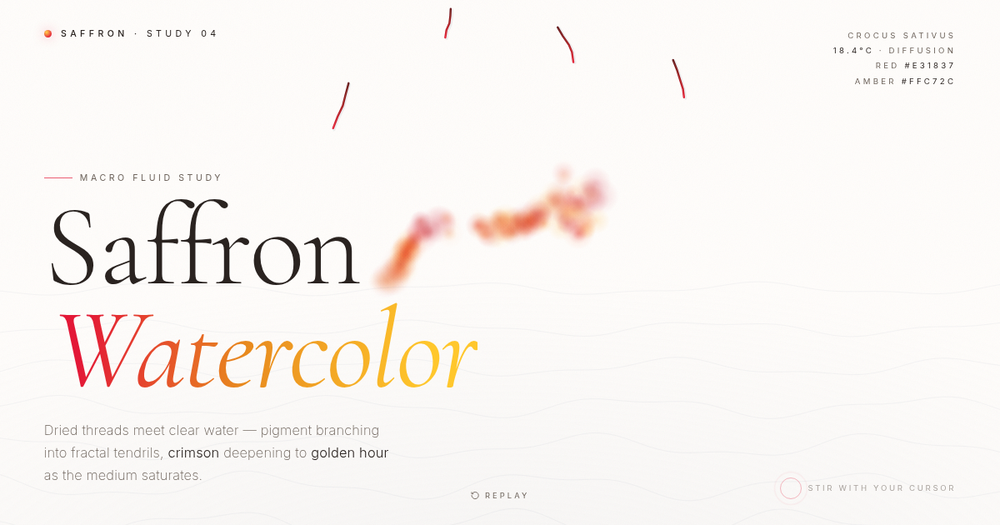 | `Qwen3.8-Flash-Next-UD-Q4_K_XL` | [gufo](https://github.com/gufo-org/gufo) | off | — | — | — | — | 7.6s | 8 | [open](prompts/animations/saffron-watercolor-bloom/runs/qwen3-8-flash-next-ud-q4-k-xl/demo/index.html) · default |

---

### Salt Pan Crystallization

A macro view of salt crystals rapidly forming from evaporating brine in a desert pan, creating sharp geometric spikes and white ridges.

**Status:** draft · `salt` `crystallization` `evaporation` `geometry` `white-desert` `loop` `arid` · brief by `qwen3.8-flash-next`

[prompt](prompts/animations/salt-pan-crystallization/prompt.md) · [extended](prompts/animations/salt-pan-crystallization/prompt.full.md)

#### Model runs

| Preview | Model | Engine | Think | Ctx | In | Out | TTFT | Gen | Score | Demo |
|:-------:|-------|--------|:-----:|----:|---:|----:|-----:|----:|------:|------|
| 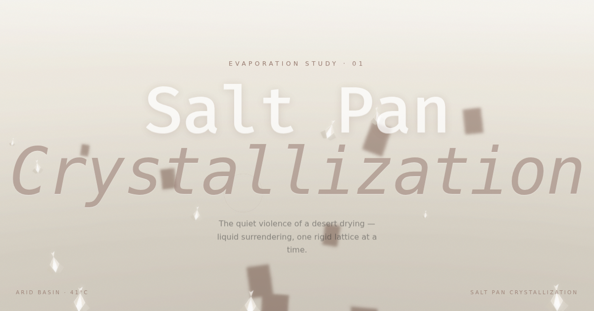 | `Qwen3.8-Flash-Next-UD-Q4_K_XL` | [gufo](https://github.com/gufo-org/gufo) | off | — | — | — | 312ms | 107s | 6 | [open](prompts/animations/salt-pan-crystallization/runs/qwen3-8-flash-next-ud-q4-k-xl/demo/index.html) · default |

---

### Screen Print Ink Bleed

Heavy serif type printed in thick black ink on rough cotton paper, where the ink slowly bleeds into the fibers, softening the sharp edges of the letters with a tactile, organic diffusion.

**Status:** polished · `screen-print` `ink-bleed` `editorial-print` `typography` `misregistration` `paper-texture` `viscous-fluid` · brief by `Qwen3.8-Flash-Next-UD-Q4_K_XL`

[prompt](prompts/animations/screen-print-ink-bleed-typography/prompt.md) · [extended](prompts/animations/screen-print-ink-bleed-typography/prompt.full.md)

#### Model runs

| Preview | Model | Engine | Think | Ctx | In | Out | TTFT | Gen | Score | Demo |
|:-------:|-------|--------|:-----:|----:|---:|----:|-----:|----:|------:|------|
| 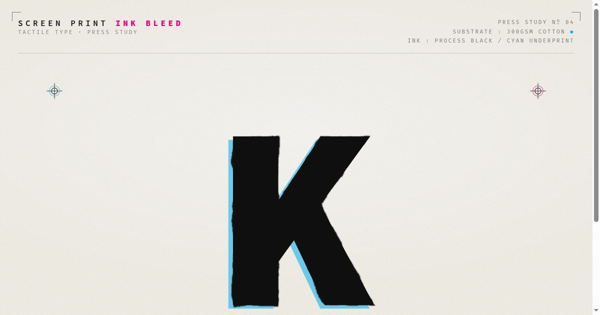 | `Qwen3.8-Flash-Next-UD-Q4_K_XL` | [gufo](https://github.com/gufo-org/gufo) | off | — | — | — | 354ms | 166s | 9 | [open](prompts/animations/screen-print-ink-bleed-typography/runs/qwen3-8-flash-next-ud-q4-k-xl/demo/index.html) · default |

---

### Shutter Scanline Decode

Text decodes from static noise into sharp clarity via a rolling green scanline, mimicking the refresh rate of an old CRT monitor resolving a signal.

**Status:** polished · `scanline` `monitor-glow` `analog-decode` `kinetic-type` `retro-tech` `noise` `reveal` · brief by `Qwen3.8-Flash-Next-UD-Q4_K_XL`

[prompt](prompts/animations/shutter-scanline-decode/prompt.md) · [extended](prompts/animations/shutter-scanline-decode/prompt.full.md)

#### Model runs

| Preview | Model | Engine | Think | Ctx | In | Out | TTFT | Gen | Score | Demo |
|:-------:|-------|--------|:-----:|----:|---:|----:|-----:|----:|------:|------|
| 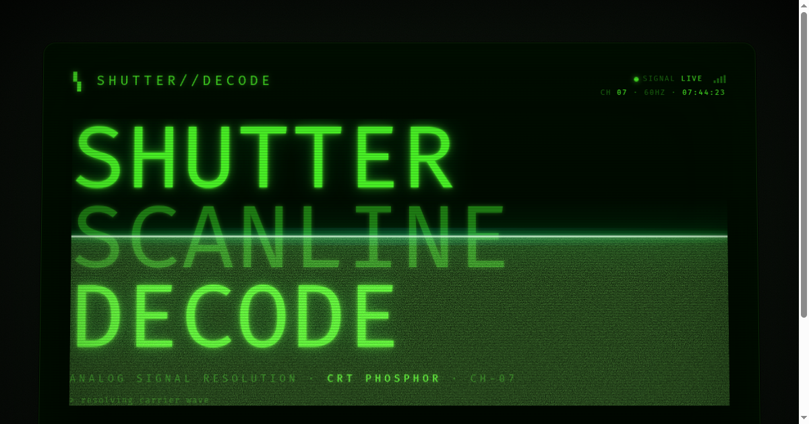 | `Qwen3.8-Flash-Next-UD-Q4_K_XL` | [gufo](https://github.com/gufo-org/gufo) | off | — | — | — | 334ms | 289s | 9 | [open](prompts/animations/shutter-scanline-decode/runs/qwen3-8-flash-next-ud-q4-k-xl/demo/index.html) · default |

---

### Staggered Mask Reveal

Editorial headline reveal via line masks and stagger — cinematic entrance without cheap fade templates.

**Status:** draft · `typography` `mask` `scroll` `entrance` `editorial`

[prompt](prompts/animations/staggered-mask-reveal/prompt.md) · [extended](prompts/animations/staggered-mask-reveal/prompt.full.md)

#### Model runs

| Preview | Model | Engine | Think | Ctx | In | Out | TTFT | Gen | Score | Demo |
|:-------:|-------|--------|:-----:|----:|---:|----:|-----:|----:|------:|------|
|  | `Qwen3.8-Flash-Next-UD-Q4_K_XL` | [gufo](https://github.com/gufo-org/gufo) | off | — | — | — | — | 6.4s | 8 | [open](prompts/animations/staggered-mask-reveal/runs/qwen3-8-flash-next-ud-q4-k-xl/demo/index.html) · default |

---

### Stainless Brushed Light Sweep

A macro shot of a brushed stainless steel surface where a moving light source reveals the micro-texture and anisotropic reflections of the metal.

**Status:** polished · `metal` `brushed-steel` `lighting` `surface` `minimalist` `industrial` `specular` · brief by `qwen3.8-flash-next`

[prompt](prompts/animations/stainless-brushed-light-sweep/prompt.md) · [extended](prompts/animations/stainless-brushed-light-sweep/prompt.full.md)

#### Model runs

| Preview | Model | Engine | Think | Ctx | In | Out | TTFT | Gen | Score | Demo |
|:-------:|-------|--------|:-----:|----:|---:|----:|-----:|----:|------:|------|
|  | `Qwen3.8-Flash-Next-UD-Q4_K_XL` | [gufo](https://github.com/gufo-org/gufo) | off | — | — | — | — | 7.3s | 6 | [open](prompts/animations/stainless-brushed-light-sweep/runs/qwen3-8-flash-next-ud-q4-k-xl/demo/index.html) · default |

---

### Substation Warning Flag Drop

A bright orange safety warning flag attached to a utility pole flutters violently in simulated wind, its fabric ripples catching harsh industrial light.

**Status:** polished · `infrastructure` `safety-flag` `wind-physics` `utility` `high-vis` `cloth-sim` · brief by `Qwen3.8-Flash-Next-UD-Q4_K_XL`

[prompt](prompts/animations/substation-warning-flag-drop/prompt.md) · [extended](prompts/animations/substation-warning-flag-drop/prompt.full.md)

#### Model runs

| Preview | Model | Engine | Think | Ctx | In | Out | TTFT | Gen | Score | Demo |
|:-------:|-------|--------|:-----:|----:|---:|----:|-----:|----:|------:|------|
| 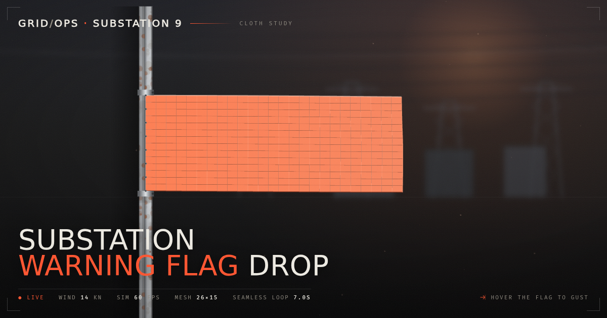 | `Qwen3.8-Flash-Next-UD-Q4_K_XL` | [gufo](https://github.com/gufo-org/gufo) | off | — | — | — | 1.4s | 453s | 8 | [open](prompts/animations/substation-warning-flag-drop/runs/qwen3-8-flash-next-ud-q4-k-xl/demo/index.html) · default |

---

### Sun-Bleached Rope Tension

A close-up of weathered, sun-bleached hemp rope under static load, highlighting individual frayed fibers and the stress of tension in harsh light.

**Status:** polished · `nautical` `rope-texture` `arid-minimal` `tension` `fiber-detail` `sun-bleached` `static-load` · brief by `Qwen3.8-Flash-Next-UD-Q4_K_XL`

[prompt](prompts/animations/sun-bleached-rope-tension/prompt.md) · [extended](prompts/animations/sun-bleached-rope-tension/prompt.full.md)

#### Model runs

| Preview | Model | Engine | Think | Ctx | In | Out | TTFT | Gen | Score | Demo |
|:-------:|-------|--------|:-----:|----:|---:|----:|-----:|----:|------:|------|
| 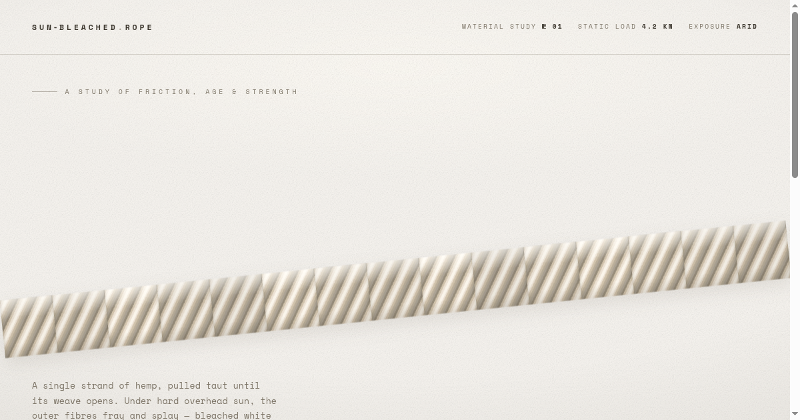 | `Qwen3.8-Flash-Next-UD-Q4_K_XL` | [gufo](https://github.com/gufo-org/gufo) | off | — | — | — | 247ms | 333s | 6 | [open](prompts/animations/sun-bleached-rope-tension/runs/qwen3-8-flash-next-ud-q4-k-xl/demo/index.html) · default |

---

### Sun-Cracked Mud Heal

A reverse-animation of sun-baked mud cracking, where the fissures knit themselves back together, smoothing out into wet, pliable earth.

**Status:** draft · `mud` `cracks` `healing` `reverse` `earth` `texture` `arid` · brief by `qwen3.8-flash-next`

[prompt](prompts/animations/sun-cracked-mud-heal/prompt.md) · [extended](prompts/animations/sun-cracked-mud-heal/prompt.full.md)

#### Model runs

| Preview | Model | Engine | Think | Ctx | In | Out | TTFT | Gen | Score | Demo |
|:-------:|-------|--------|:-----:|----:|---:|----:|-----:|----:|------:|------|
| 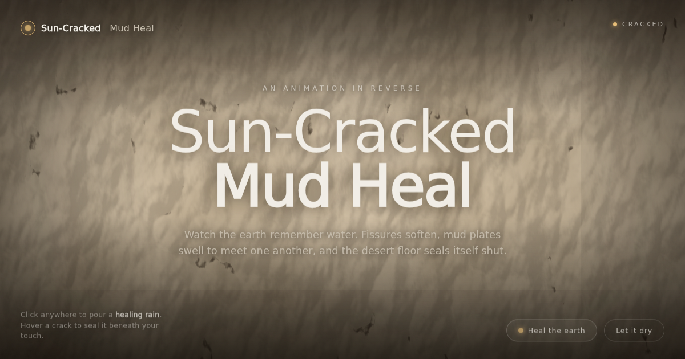 | `Qwen3.8-Flash-Next-UD-Q4_K_XL` | [gufo](https://github.com/gufo-org/gufo) | off | — | — | — | 320ms | 138s | 6 | [open](prompts/animations/sun-cracked-mud-heal/runs/qwen3-8-flash-next-ud-q4-k-xl/demo/index.html) · default |

---

### Vellum Fold Mechanism

A macro animation of archival vellum folding along pre-scored lines. The paper compresses slightly under the fold, casting soft, precise shadows under cool north light, revealing a hidden layer of text.

**Status:** polished · `archival` `paper-engineering` `fold-animation` `north-light` `trust` `structural` `material` · brief by `Qwen3.8-Flash-Next-UD-Q4_K_XL`

[prompt](prompts/animations/vellum-fold-mechanism/prompt.md) · [extended](prompts/animations/vellum-fold-mechanism/prompt.full.md)

#### Model runs

| Preview | Model | Engine | Think | Ctx | In | Out | TTFT | Gen | Score | Demo |
|:-------:|-------|--------|:-----:|----:|---:|----:|-----:|----:|------:|------|
| 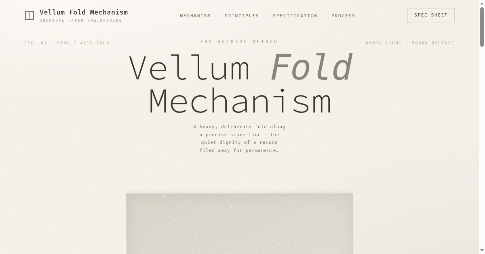 | `Qwen3.8-Flash-Next-UD-Q4_K_XL` | [gufo](https://github.com/gufo-org/gufo) | off | — | — | — | 334ms | 205s | 7 | [open](prompts/animations/vellum-fold-mechanism/runs/qwen3-8-flash-next-ud-q4-k-xl/demo/index.html) · default |

---

### Woven Reed Flex

A macro animation of woven reed strips bending under tension, showcasing the elasticity and interlocking tension of natural materials.

**Status:** polished · `wicker` `flexibility` `physics` `organic` `macro` `tactile` `structure` · brief by `qwen3.8-flash-next`

[prompt](prompts/animations/woven-reed-flex/prompt.md) · [extended](prompts/animations/woven-reed-flex/prompt.full.md)

#### Model runs

| Preview | Model | Engine | Think | Ctx | In | Out | TTFT | Gen | Score | Demo |
|:-------:|-------|--------|:-----:|----:|---:|----:|-----:|----:|------:|------|
| 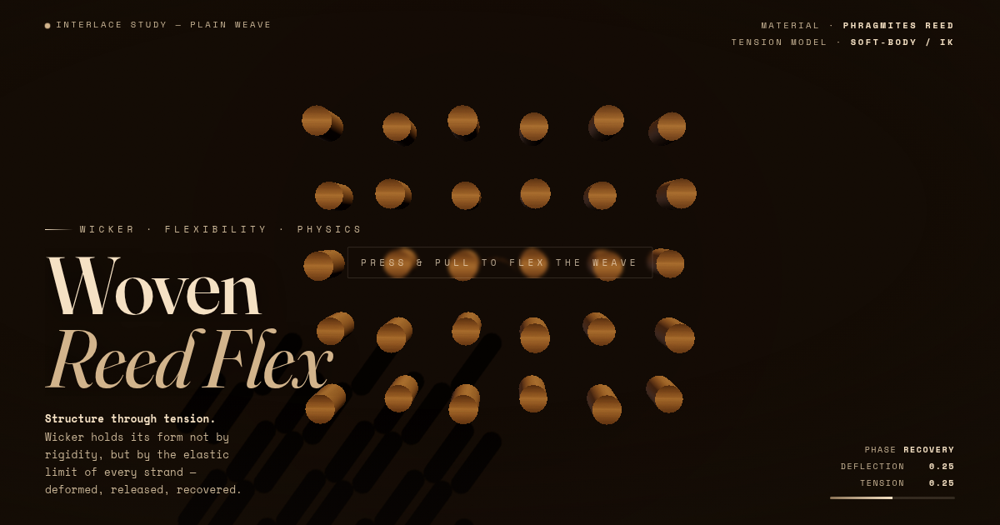 | `Qwen3.8-Flash-Next-UD-Q4_K_XL` | [gufo](https://github.com/gufo-org/gufo) | off | — | — | — | — | 8.1s | 6 | [open](prompts/animations/woven-reed-flex/runs/qwen3-8-flash-next-ud-q4-k-xl/demo/index.html) · default |

---

## Concepts

### Abyssal Pressure Depth Scale

A vertical data visualization simulating ocean depth, where UI elements compress and distort under simulated hydrostatic pressure, revealing submersible specs.

**Status:** polished · `deep-sea` `data-visualization` `pressure` `submersible` `cyan` `vertical-scroll` `scientific` `glass` · brief by `Qwen3.8-Flash-Next-UD-Q4_K_XL`

[prompt](prompts/concepts/abyssal-pressure-depth-scale/prompt.md) · [extended](prompts/concepts/abyssal-pressure-depth-scale/prompt.full.md)

#### Model runs

| Preview | Model | Engine | Think | Ctx | In | Out | TTFT | Gen | Score | Demo |
|:-------:|-------|--------|:-----:|----:|---:|----:|-----:|----:|------:|------|
| 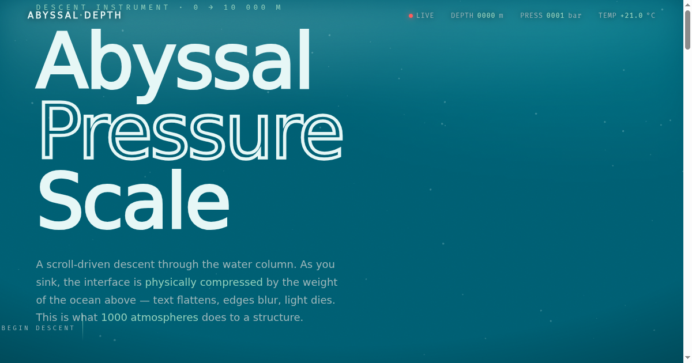 | `Qwen3.8-Flash-Next-UD-Q4_K_XL` | [gufo](https://github.com/gufo-org/gufo) | off | — | — | — | 2.7s | 398s | 8 | [open](prompts/concepts/abyssal-pressure-depth-scale/runs/qwen3-8-flash-next-ud-q4-k-xl/demo/index.html) · default |

---

### Anodized Titanium Blotter

A color selection interface where users 'anodize' a titanium plate by adjusting voltage, shifting its iridescent oxide layer from straw to blue to purple.

**Status:** polished · `titanium` `anodizing` `color-picker` `chemistry` `tool` `gradient` `calm` · brief by `Qwen3.8-Flash-Next-UD-Q4_K_XL`

[prompt](prompts/concepts/anodized-titanium-blotter/prompt.md) · [extended](prompts/concepts/anodized-titanium-blotter/prompt.full.md)

#### Model runs

| Preview | Model | Engine | Think | Ctx | In | Out | TTFT | Gen | Score | Demo |
|:-------:|-------|--------|:-----:|----:|---:|----:|-----:|----:|------:|------|
| 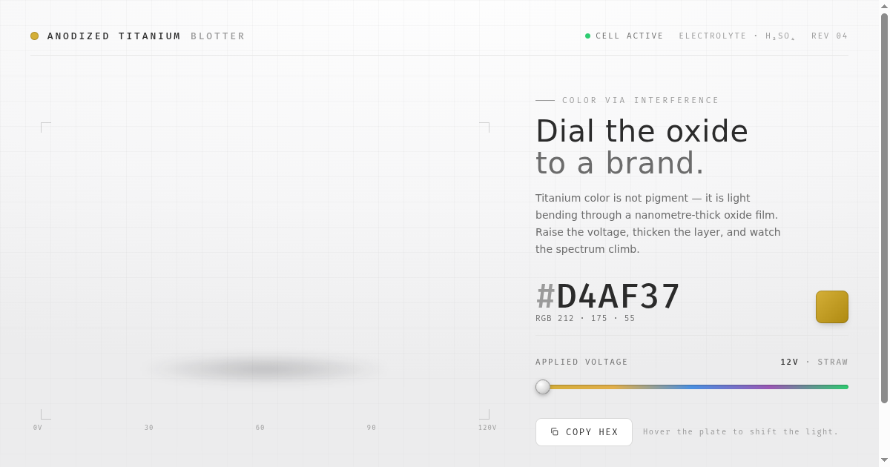 | `Qwen3.8-Flash-Next-UD-Q4_K_XL` | [gufo](https://github.com/gufo-org/gufo) | off | — | — | — | 1.6s | 326s | 6 | [open](prompts/concepts/anodized-titanium-blotter/runs/qwen3-8-flash-next-ud-q4-k-xl/demo/index.html) · default |

---

### Batik Wax Resist Flow

A generative textile pattern generator simulating the Batik process: hot wax applied to fabric resists dye, creating intricate, organic floral motifs.

**Status:** polished · `batik` `indonesia` `textile` `dye` `wax` `pattern` `fluid` `craft` · brief by `Qwen3.8-Flash-Next-UD-Q4_K_XL`

[prompt](prompts/concepts/batik-wax-resist-flow/prompt.md) · [extended](prompts/concepts/batik-wax-resist-flow/prompt.full.md)

#### Model runs

| Preview | Model | Engine | Think | Ctx | In | Out | TTFT | Gen | Score | Demo |
|:-------:|-------|--------|:-----:|----:|---:|----:|-----:|----:|------:|------|
| 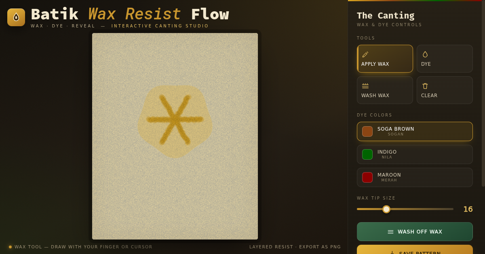 | `Qwen3.8-Flash-Next-UD-Q4_K_XL` | [gufo](https://github.com/gufo-org/gufo) | off | — | — | — | 1.8s | 368s | 8 | [open](prompts/concepts/batik-wax-resist-flow/runs/qwen3-8-flash-next-ud-q4-k-xl/demo/index.html) · default |

---

### Beeswax Coating Layer

A visual layering system where semi-translucent beeswax coats a dark substrate, revealing warm amber tones and grain as the coating thickens or melts.

**Status:** polished · `beeswax` `coating` `texture` `amber` `organic` `translucency` `warmth` `craft` · brief by `Qwen3.8-Flash-Next-UD-Q4_K_XL`

[prompt](prompts/concepts/beeswax-coating-layer/prompt.md) · [extended](prompts/concepts/beeswax-coating-layer/prompt.full.md)

#### Model runs

| Preview | Model | Engine | Think | Ctx | In | Out | TTFT | Gen | Score | Demo |
|:-------:|-------|--------|:-----:|----:|---:|----:|-----:|----:|------:|------|
| 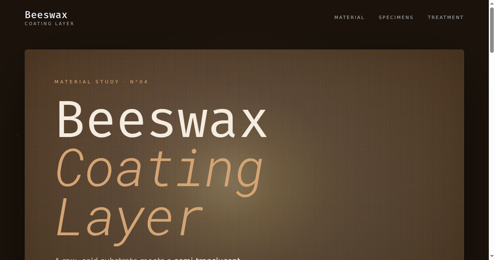 | `Qwen3.8-Flash-Next-UD-Q4_K_XL` | [gufo](https://github.com/gufo-org/gufo) | off | — | — | — | 1.6s | 275s | 7 | [open](prompts/concepts/beeswax-coating-layer/runs/qwen3-8-flash-next-ud-q4-k-xl/demo/index.html) · default |

---

### Bioluminescent Spore Dispersion

A generative visual where bioluminescent spores drift upward in a dark void, reacting to mouse proximity with gentle repulsion and light scattering.

**Status:** polished · `bioluminescence` `spore` `particle-system` `nocturnal` `dispersion` `glow` `organic` `simulation` · brief by `qwen3.8-flash-next`

[prompt](prompts/concepts/bioluminescent-spore-dispersion/prompt.md) · [extended](prompts/concepts/bioluminescent-spore-dispersion/prompt.full.md)

#### Model runs

| Preview | Model | Engine | Think | Ctx | In | Out | TTFT | Gen | Score | Demo |
|:-------:|-------|--------|:-----:|----:|---:|----:|-----:|----:|------:|------|
| 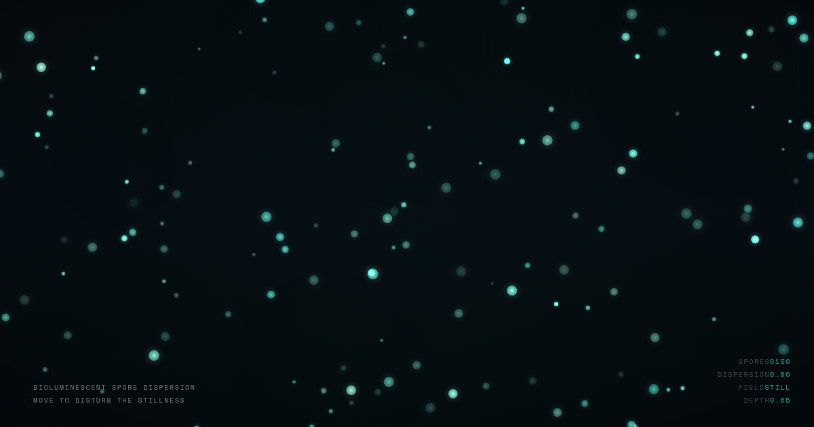 | `Qwen3.8-Flash-Next-UD-Q4_K_XL` | [gufo](https://github.com/gufo-org/gufo) | off | — | — | — | — | 6.8s | 8 | [open](prompts/concepts/bioluminescent-spore-dispersion/runs/qwen3-8-flash-next-ud-q4-k-xl/demo/index.html) · default |

---

### Carbon Fiber Weave Configurator

A product configurator where users change the layup of carbon fiber, with real-time texture shifts and directional light reflections indicating fiber orientation.

**Status:** polished · `carbon-fiber` `composite` `configurator` `tech` `tactile` `weave` `industrial` · brief by `qwen3.8-flash-next`

[prompt](prompts/concepts/carbon-fiber-weave-configurator/prompt.md) · [extended](prompts/concepts/carbon-fiber-weave-configurator/prompt.full.md)

#### Model runs

| Preview | Model | Engine | Think | Ctx | In | Out | TTFT | Gen | Score | Demo |
|:-------:|-------|--------|:-----:|----:|---:|----:|-----:|----:|------:|------|
|  | `Qwen3.8-Flash-Next-UD-Q4_K_XL` | [gufo](https://github.com/gufo-org/gufo) | off | — | — | — | — | 7.2s | 9 | [open](prompts/concepts/carbon-fiber-weave-configurator/runs/qwen3-8-flash-next-ud-q4-k-xl/demo/index.html) · default |

---

### Cargo Manifest Ink Stamp

A digital document interface where 'approval' is a physical rubber stamp action. Users drag, rotate, and press a stamp onto textured manifest paper, leaving imperfect ink bleeds.

**Status:** polished · `logistics` `shipping` `rubber-stamp` `paper-texture` `manual-process` `ink-bleed` `document` `industrial` · brief by `Qwen3.8-Flash-Next-UD-Q4_K_XL`

[prompt](prompts/concepts/cargo-manifest-ink-stamp/prompt.md) · [extended](prompts/concepts/cargo-manifest-ink-stamp/prompt.full.md)

#### Model runs

| Preview | Model | Engine | Think | Ctx | In | Out | TTFT | Gen | Score | Demo |
|:-------:|-------|--------|:-----:|----:|---:|----:|-----:|----:|------:|------|
| 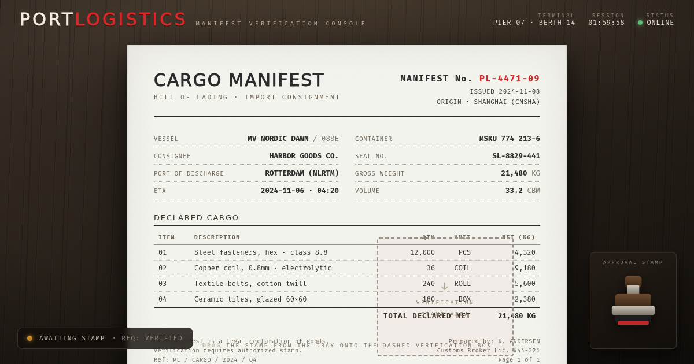 | `Qwen3.8-Flash-Next-UD-Q4_K_XL` | [gufo](https://github.com/gufo-org/gufo) | off | — | — | — | 396ms | 314s | 8 | [open](prompts/concepts/cargo-manifest-ink-stamp/runs/qwen3-8-flash-next-ud-q4-k-xl/demo/index.html) · default |

---

### Cast Iron Seasoning Layer

An interactive visualization of cast iron pan seasoning buildup, showing how heat and oil create a microscopic polymer layer over time.

**Status:** polished · `cast-iron` `seasoning` `culinary` `patina` `thermal` `industrial-kitchen` `material-science` · brief by `Qwen3.8-Flash-Next-UD-Q4_K_XL`

[prompt](prompts/concepts/cast-iron-seasoning-layer/prompt.md) · [extended](prompts/concepts/cast-iron-seasoning-layer/prompt.full.md)

#### Model runs

| Preview | Model | Engine | Think | Ctx | In | Out | TTFT | Gen | Score | Demo |
|:-------:|-------|--------|:-----:|----:|---:|----:|-----:|----:|------:|------|
| 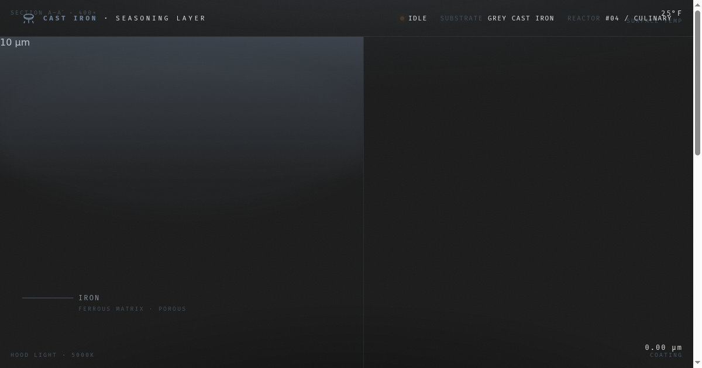 | `Qwen3.8-Flash-Next-UD-Q4_K_XL` | [gufo](https://github.com/gufo-org/gufo) | off | — | — | — | 1.7s | 550s | 6 | [open](prompts/concepts/cast-iron-seasoning-layer/runs/qwen3-8-flash-next-ud-q4-k-xl/demo/index.html) · default |

---

### Desert Varnish Patina Map

A data visualization where information is revealed by simulating the slow accumulation of desert varnish on rock surfaces, using time-based oxidation effects.

**Status:** polished · `desert-varnish` `patina` `rock-surface` `data-layer` `oxidation` `clay` `slow-reveal` `geology` · brief by `Qwen3.8-Flash-Next-UD-Q4_K_XL`

[prompt](prompts/concepts/desert-varnish-patina-map/prompt.md) · [extended](prompts/concepts/desert-varnish-patina-map/prompt.full.md)

#### Model runs

| Preview | Model | Engine | Think | Ctx | In | Out | TTFT | Gen | Score | Demo |
|:-------:|-------|--------|:-----:|----:|---:|----:|-----:|----:|------:|------|
| 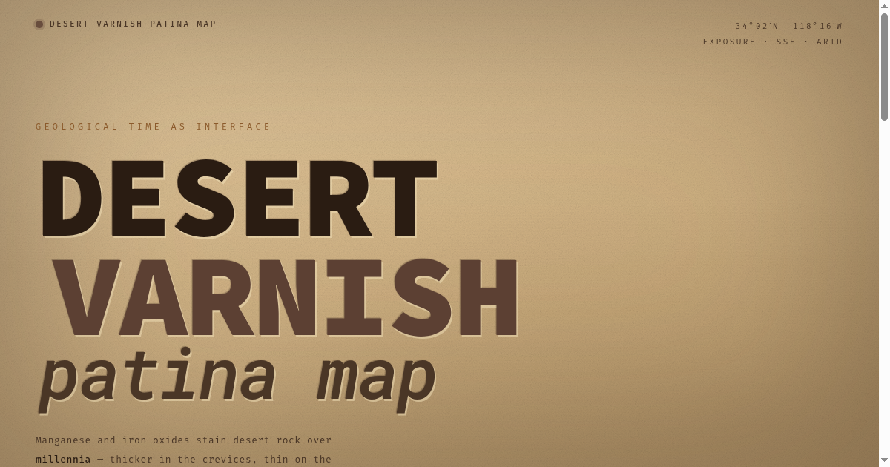 | `Qwen3.8-Flash-Next-UD-Q4_K_XL` | [gufo](https://github.com/gufo-org/gufo) | off | — | — | — | 1.5s | 411s | 8 | [open](prompts/concepts/desert-varnish-patina-map/runs/qwen3-8-flash-next-ud-q4-k-xl/demo/index.html) · default |

---

### Dune Strata Geology Map

An interactive topographical visualization of desert strata, featuring long, sharp shadows and heat-haze distortion on a bone-white background.

**Status:** polished · `geology` `minimalist` `topography` `arid` `interactive-map` `data-visualization` `bone-white` `long-shadows` · brief by `qwen3.8-flash-next`

[prompt](prompts/concepts/dune-strata-geology-map/prompt.md) · [extended](prompts/concepts/dune-strata-geology-map/prompt.full.md)

#### Model runs

| Preview | Model | Engine | Think | Ctx | In | Out | TTFT | Gen | Score | Demo |
|:-------:|-------|--------|:-----:|----:|---:|----:|-----:|----:|------:|------|
|  | `Qwen3.8-Flash-Next-UD-Q4_K_XL` | [gufo](https://github.com/gufo-org/gufo) | off | — | — | — | — | 5.8s | 9 | [open](prompts/concepts/dune-strata-geology-map/runs/qwen3-8-flash-next-ud-q4-k-xl/demo/index.html) · default |

---

### Editorial Brutalist System

Art-direction system: modular editorial brutalism — concrete grid, ink type, rules as structure, not decoration.

**Status:** draft · `system` `brutalist` `editorial` `type` `grid`

[prompt](prompts/concepts/editorial-brutalist-system/prompt.md) · [extended](prompts/concepts/editorial-brutalist-system/prompt.full.md)

#### Model runs

| Preview | Model | Engine | Think | Ctx | In | Out | TTFT | Gen | Score | Demo |
|:-------:|-------|--------|:-----:|----:|---:|----:|-----:|----:|------:|------|
|  | `Qwen3.8-Flash-Next-UD-Q4_K_XL` | [gufo](https://github.com/gufo-org/gufo) | off | — | — | — | — | 12s | 8 | [open](prompts/concepts/editorial-brutalist-system/runs/qwen3-8-flash-next-ud-q4-k-xl/demo/index.html) · default |

---

### Emulsion Breakpoint Visualizer

A generative visualization of sauce emulsion stability. Users adjust fat/oil ratios and agitation speed to see if the mixture holds or breaks.

**Status:** polished · `emulsion` `fluid-dynamics` `sauce` `physics` `culinary` `generative` `viscous` · brief by `Qwen3.8-Flash-Next-UD-Q4_K_XL`

[prompt](prompts/concepts/emulsion-breakpoint-visualizer/prompt.md) · [extended](prompts/concepts/emulsion-breakpoint-visualizer/prompt.full.md)

#### Model runs

| Preview | Model | Engine | Think | Ctx | In | Out | TTFT | Gen | Score | Demo |
|:-------:|-------|--------|:-----:|----:|---:|----:|-----:|----:|------:|------|
| 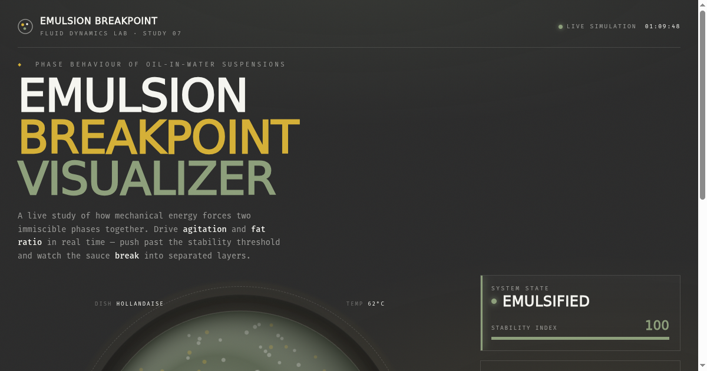 | `Qwen3.8-Flash-Next-UD-Q4_K_XL` | [gufo](https://github.com/gufo-org/gufo) | off | — | — | — | 1.6s | 374s | 8 | [open](prompts/concepts/emulsion-breakpoint-visualizer/runs/qwen3-8-flash-next-ud-q4-k-xl/demo/index.html) · default |

---

### Ferrofluid Magnetic Response

A viscous black ferrofluid pool that reacts to cursor movement, forming sharp spikes and flowing pools based on simulated magnetic field strength.

**Status:** polished · `ferrofluid` `physics-simulation` `viscous` `black-material` `interactive` `liquid` `magnetism` · brief by `Qwen3.8-Flash-Next-UD-Q4_K_XL`

[prompt](prompts/concepts/ferrofluid-magnetic-response/prompt.md) · [extended](prompts/concepts/ferrofluid-magnetic-response/prompt.full.md)

#### Model runs

| Preview | Model | Engine | Think | Ctx | In | Out | TTFT | Gen | Score | Demo |
|:-------:|-------|--------|:-----:|----:|---:|----:|-----:|----:|------:|------|
| 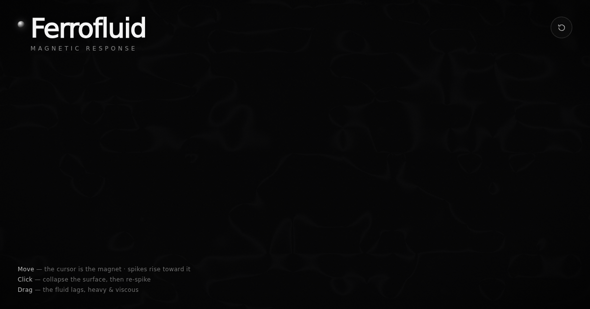 | `Qwen3.8-Flash-Next-UD-Q4_K_XL` | [gufo](https://github.com/gufo-org/gufo) | off | — | — | — | 319ms | 247s | 7 | [open](prompts/concepts/ferrofluid-magnetic-response/runs/qwen3-8-flash-next-ud-q4-k-xl/demo/index.html) · default |

---

### Gasket Compression Diagram

A cross-section visualization of a rubber gasket being compressed between two flanges, showing material deformation and seal integrity in a calm, slow motion.

**Status:** polished · `gasket` `compression` `mechanical` `sealing` `animation` `calm` `industrial` · brief by `Qwen3.8-Flash-Next-UD-Q4_K_XL`

[prompt](prompts/concepts/gasket-compression-diagram/prompt.md) · [extended](prompts/concepts/gasket-compression-diagram/prompt.full.md)

#### Model runs

| Preview | Model | Engine | Think | Ctx | In | Out | TTFT | Gen | Score | Demo |
|:-------:|-------|--------|:-----:|----:|---:|----:|-----:|----:|------:|------|
| 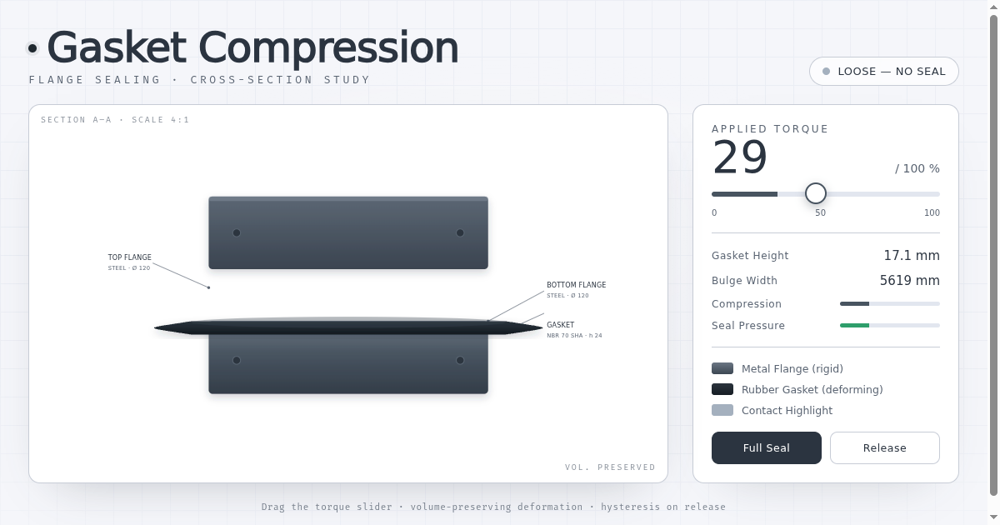 | `Qwen3.8-Flash-Next-UD-Q4_K_XL` | [gufo](https://github.com/gufo-org/gufo) | off | — | — | — | 1.5s | 245s | 8 | [open](prompts/concepts/gasket-compression-diagram/runs/qwen3-8-flash-next-ud-q4-k-xl/demo/index.html) · default |

---

### Glass Blown Syllable Expansion

Typography behaves like molten glass, expanding and cooling under simulated heat. Hovering a word heats it, causing it to swell and refract light before settling.

**Status:** polished · `glass-blowing` `kinetic-type` `thermal-expansion` `molten-material` `hierarchy` `physics` `transparent` `furnace` · brief by `Qwen3.8-Flash-Next-UD-Q4_K_XL`

[prompt](prompts/concepts/glass-blown-syllable-expansion/prompt.md) · [extended](prompts/concepts/glass-blown-syllable-expansion/prompt.full.md)

#### Model runs

| Preview | Model | Engine | Think | Ctx | In | Out | TTFT | Gen | Score | Demo |
|:-------:|-------|--------|:-----:|----:|---:|----:|-----:|----:|------:|------|
| 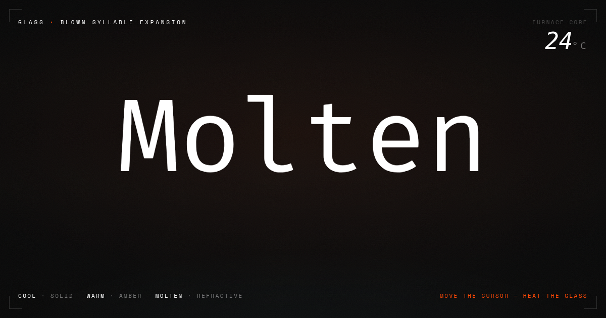 | `Qwen3.8-Flash-Next-UD-Q4_K_XL` | [gufo](https://github.com/gufo-org/gufo) | off | — | — | — | 1.8s | 197s | 8 | [open](prompts/concepts/glass-blown-syllable-expansion/runs/qwen3-8-flash-next-ud-q4-k-xl/demo/index.html) · default |

---

### Halftone Dot Mechanism

Interactive print simulation where images are formed by mechanical CMYK dot clusters. Hovering over text causes the halftone screen to rotate and scale, revealing the underlying photographic detail through dot gain.

**Status:** polished · `halftone` `screen-print` `mechanical` `monochrome` `raster` `editorial-print` `dot-gain` · brief by `Qwen3.8-Flash-Next-UD-Q4_K_XL`

[prompt](prompts/concepts/halftone-dot-mechanism/prompt.md) · [extended](prompts/concepts/halftone-dot-mechanism/prompt.full.md)

#### Model runs

| Preview | Model | Engine | Think | Ctx | In | Out | TTFT | Gen | Score | Demo |
|:-------:|-------|--------|:-----:|----:|---:|----:|-----:|----:|------:|------|
| 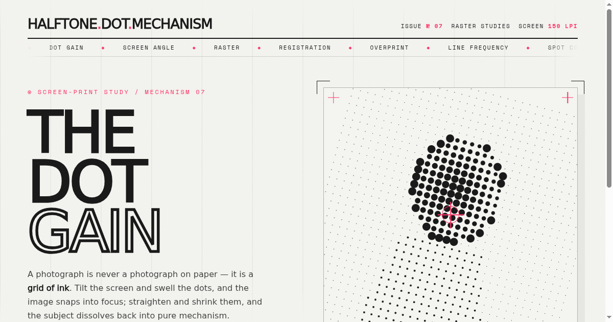 | `Qwen3.8-Flash-Next-UD-Q4_K_XL` | [gufo](https://github.com/gufo-org/gufo) | off | — | — | — | 1.6s | 223s | 9 | [open](prompts/concepts/halftone-dot-mechanism/runs/qwen3-8-flash-next-ud-q4-k-xl/demo/index.html) · default |

---

### Hazard Tape Peel Reveal

A UI layer covered in diagonal hazard tape that peels away to reveal safe, clean content underneath, emphasizing physical adhesive resistance and tearing physics.

**Status:** draft · `hazard-tape` `peel-motion` `construction` `sticky` `adhesive` `warning` `site-survey` `material-physics` · brief by `qwen3.8-flash-next`

[prompt](prompts/concepts/hazard-tape-peel-reveal/prompt.md) · [extended](prompts/concepts/hazard-tape-peel-reveal/prompt.full.md)

#### Model runs

| Preview | Model | Engine | Think | Ctx | In | Out | TTFT | Gen | Score | Demo |
|:-------:|-------|--------|:-----:|----:|---:|----:|-----:|----:|------:|------|
| 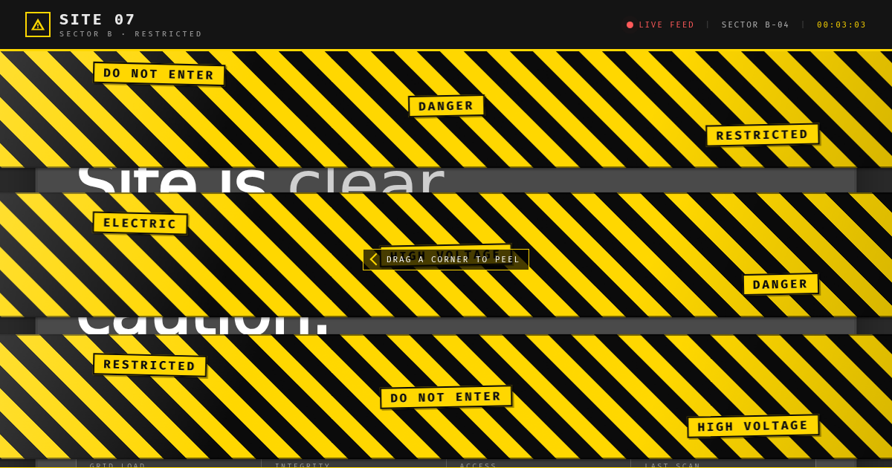 | `Qwen3.8-Flash-Next-UD-Q4_K_XL` | [gufo](https://github.com/gufo-org/gufo) | off | — | — | — | 1.6s | 171s | 6 | [open](prompts/concepts/hazard-tape-peel-reveal/runs/qwen3-8-flash-next-ud-q4-k-xl/demo/index.html) · default |

---

### Heat Haze Text Warp

Typography that vibrates and distorts via simulated heat haze, using SVG filters and displacement maps to mimic air refraction in a hot desert.

**Status:** polished · `heat-haze` `optical-distortion` `kinetic-type` `sun-bleached` `air-refraction` `minimal` `bone` `vibration` · brief by `Qwen3.8-Flash-Next-UD-Q4_K_XL`

[prompt](prompts/concepts/heat-haze-text-warp/prompt.md) · [extended](prompts/concepts/heat-haze-text-warp/prompt.full.md)

#### Model runs

| Preview | Model | Engine | Think | Ctx | In | Out | TTFT | Gen | Score | Demo |
|:-------:|-------|--------|:-----:|----:|---:|----:|-----:|----:|------:|------|
| 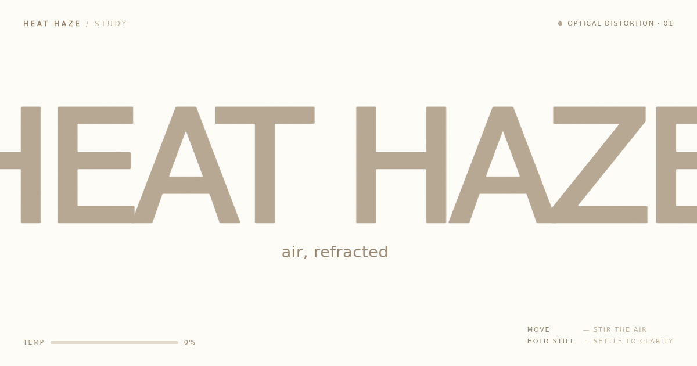 | `Qwen3.8-Flash-Next-UD-Q4_K_XL` | [gufo](https://github.com/gufo-org/gufo) | off | — | — | — | 1.5s | 159s | 9 | [open](prompts/concepts/heat-haze-text-warp/runs/qwen3-8-flash-next-ud-q4-k-xl/demo/index.html) · default |

---

### Kiln-Fired Glaze Sample

A color selection interface where hues are represented by physical ceramic glaze chips, with heat-warp transitions and kiln-lighting ambiance.

**Status:** polished · `ceramics` `glaze` `color-picker` `material` `tactile` `kiln` `sample` · brief by `qwen3.8-flash-next`

[prompt](prompts/concepts/kiln-fired-glaze-sample/prompt.md) · [extended](prompts/concepts/kiln-fired-glaze-sample/prompt.full.md)

#### Model runs

| Preview | Model | Engine | Think | Ctx | In | Out | TTFT | Gen | Score | Demo |
|:-------:|-------|--------|:-----:|----:|---:|----:|-----:|----:|------:|------|
|  | `Qwen3.8-Flash-Next-UD-Q4_K_XL` | [gufo](https://github.com/gufo-org/gufo) | off | — | — | — | — | 7.9s | 8 | [open](prompts/concepts/kiln-fired-glaze-sample/runs/qwen3-8-flash-next-ud-q4-k-xl/demo/index.html) · default |

---

### Kintsugi Gold Seam Heal

An interactive visualization of broken ceramic shards rejoined with lacquer and gold dust, illustrating resilience through visible, beautiful repair.

**Status:** polished · `kintsugi` `japan` `repair` `gold-leaf` `ceramics` `wabi-sabi` `resilience` `interactive` · brief by `Qwen3.8-Flash-Next-UD-Q4_K_XL`

[prompt](prompts/concepts/kintsugi-gold-seam-heal/prompt.md) · [extended](prompts/concepts/kintsugi-gold-seam-heal/prompt.full.md)

#### Model runs

| Preview | Model | Engine | Think | Ctx | In | Out | TTFT | Gen | Score | Demo |
|:-------:|-------|--------|:-----:|----:|---:|----:|-----:|----:|------:|------|
| 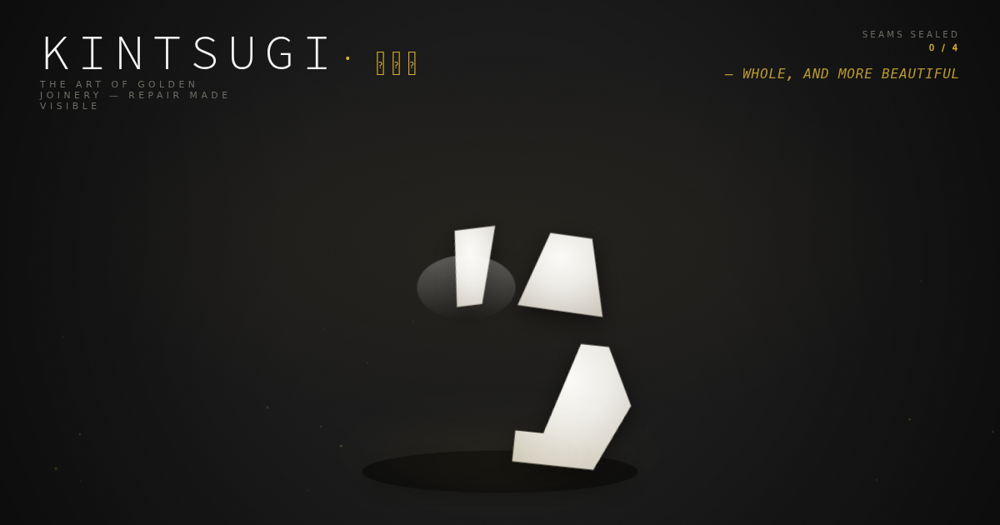 | `Qwen3.8-Flash-Next-UD-Q4_K_XL` | [gufo](https://github.com/gufo-org/gufo) | off | — | — | — | 337ms | 263s | 6 | [open](prompts/concepts/kintsugi-gold-seam-heal/runs/qwen3-8-flash-next-ud-q4-k-xl/demo/index.html) · default |

---

### Linen Fold Typography

Typography that behaves like folded linen. Text is printed on fabric that creases, folds, and drapes, creating soft shadows and depth.

**Status:** polished · `linen` `textile` `typography` `fold` `soft` `texture` `organic` · brief by `qwen3.8-flash-next`

[prompt](prompts/concepts/linen-fold-typography/prompt.md) · [extended](prompts/concepts/linen-fold-typography/prompt.full.md)

#### Model runs

| Preview | Model | Engine | Think | Ctx | In | Out | TTFT | Gen | Score | Demo |
|:-------:|-------|--------|:-----:|----:|---:|----:|-----:|----:|------:|------|
|  | `Qwen3.8-Flash-Next-UD-Q4_K_XL` | [gufo](https://github.com/gufo-org/gufo) | off | — | — | — | — | 8.9s | 6 | [open](prompts/concepts/linen-fold-typography/runs/qwen3-8-flash-next-ud-q4-k-xl/demo/index.html) · default |

---

### Magnetic Morph Wordmark

A brand wordmark where letters act like magnetic poles. On hover, adjacent letters are pulled toward the cursor, distorting the geometry before snapping back into perfect alignment.

**Status:** polished · `logo-motion` `svg-morphing` `magnetic-interaction` `branding` `fluid` `interactive` `vector` `identity` · brief by `qwen3.8-flash-next`

[prompt](prompts/concepts/magnetic-morph-wordmark/prompt.md) · [extended](prompts/concepts/magnetic-morph-wordmark/prompt.full.md)

#### Model runs

| Preview | Model | Engine | Think | Ctx | In | Out | TTFT | Gen | Score | Demo |
|:-------:|-------|--------|:-----:|----:|---:|----:|-----:|----:|------:|------|
| 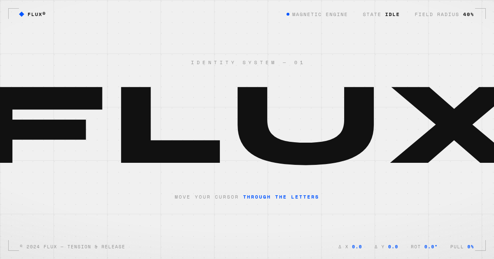 | `Qwen3.8-Flash-Next-UD-Q4_K_XL` | [gufo](https://github.com/gufo-org/gufo) | off | — | — | — | — | 5.7s | 9 | [open](prompts/concepts/magnetic-morph-wordmark/runs/qwen3-8-flash-next-ud-q4-k-xl/demo/index.html) · default |

---

### Mirage Optical Illusion Kit

A UI component library where elements appear to dissolve or warp due to simulated heat haze and optical refraction on a sun-bleached canvas.

**Status:** polished · `optical-illusion` `minimalist` `interactive` `desert` `heat-haze` `ui-kit` `experimental` `perspective` · brief by `qwen3.8-flash-next`

[prompt](prompts/concepts/mirage-optical-illusion-kit/prompt.md) · [extended](prompts/concepts/mirage-optical-illusion-kit/prompt.full.md)

#### Model runs

| Preview | Model | Engine | Think | Ctx | In | Out | TTFT | Gen | Score | Demo |
|:-------:|-------|--------|:-----:|----:|---:|----:|-----:|----:|------:|------|
| 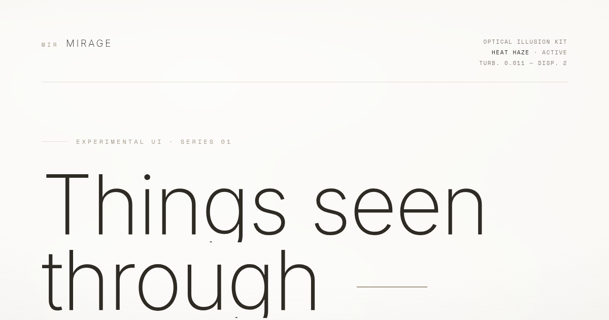 | `Qwen3.8-Flash-Next-UD-Q4_K_XL` | [gufo](https://github.com/gufo-org/gufo) | off | — | — | — | — | 7.4s | 6 | [open](prompts/concepts/mirage-optical-illusion-kit/runs/qwen3-8-flash-next-ud-q4-k-xl/demo/index.html) · default |

---

### Moroccan Tadelakt Polish

An interactive material study of Tadelakt, Moroccan lime plaster. Users 'polish' rough stone with a river stone to reveal a smooth, water-resistant, glossy surface.

**Status:** draft · `tadelakt` `morocco` `plaster` `polish` `stone` `texture` `interactive` `material` · brief by `Qwen3.8-Flash-Next-UD-Q4_K_XL`

[prompt](prompts/concepts/moroccan-tadelakt-polish/prompt.md) · [extended](prompts/concepts/moroccan-tadelakt-polish/prompt.full.md)

#### Model runs

| Preview | Model | Engine | Think | Ctx | In | Out | TTFT | Gen | Score | Demo |
|:-------:|-------|--------|:-----:|----:|---:|----:|-----:|----:|------:|------|
| — | `Qwen3.8-Flash-Next-UD-Q4_K_XL` | [gufo](https://github.com/gufo-org/gufo) | off | — | — | — | 368ms | 237s | — | — |

---

### Neon Tube Flicker Wiring

Typography as vintage neon tubes. Letters are outlined strokes that fill with light. Imperfect flickering, buzzing, and wiring delays create a nostalgic, electric atmosphere.

**Status:** polished · `neon-sign` `kinetic-type` `electrical` `night` `vintage` `glow` `imperfection` `urban` · brief by `Qwen3.8-Flash-Next-UD-Q4_K_XL`

[prompt](prompts/concepts/neon-tube-flicker-wiring/prompt.md) · [extended](prompts/concepts/neon-tube-flicker-wiring/prompt.full.md)

#### Model runs

| Preview | Model | Engine | Think | Ctx | In | Out | TTFT | Gen | Score | Demo |
|:-------:|-------|--------|:-----:|----:|---:|----:|-----:|----:|------:|------|
| 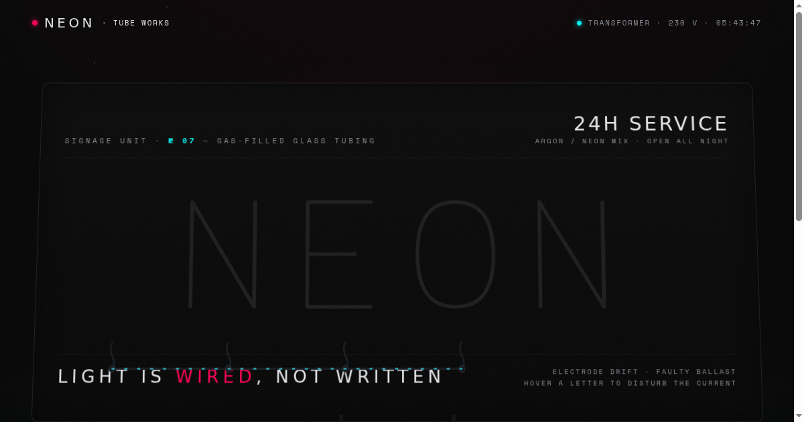 | `Qwen3.8-Flash-Next-UD-Q4_K_XL` | [gufo](https://github.com/gufo-org/gufo) | off | — | — | — | 1.7s | 313s | 6 | [open](prompts/concepts/neon-tube-flicker-wiring/runs/qwen3-8-flash-next-ud-q4-k-xl/demo/index.html) · default |

---

### Night Blooming Time-Lapse

A seamless loop animation of a night-blooming flower (like a Moonflower) unfurling under a moonlit sky, with soft focus and slow, deliberate motion.

**Status:** polished · `time-lapse` `botanical` `night-blooming` `animation` `nocturnal` `unfurl` `moonlight` `organic` · brief by `qwen3.8-flash-next`

[prompt](prompts/concepts/night-blooming-time-lapse/prompt.md) · [extended](prompts/concepts/night-blooming-time-lapse/prompt.full.md)

#### Model runs

| Preview | Model | Engine | Think | Ctx | In | Out | TTFT | Gen | Score | Demo |
|:-------:|-------|--------|:-----:|----:|---:|----:|-----:|----:|------:|------|
| 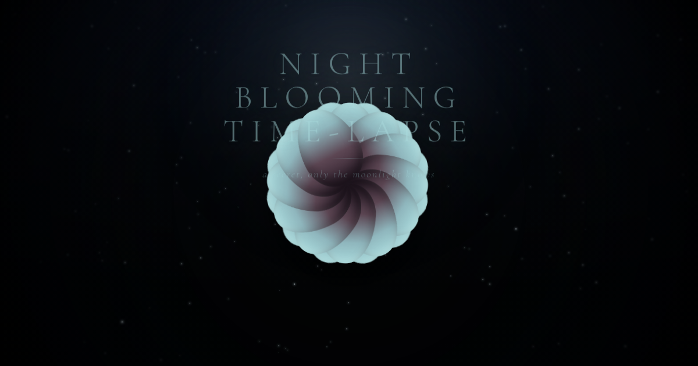 | `Qwen3.8-Flash-Next-UD-Q4_K_XL` | [gufo](https://github.com/gufo-org/gufo) | off | — | — | — | — | 8.7s | 6 | [open](prompts/concepts/night-blooming-time-lapse/runs/qwen3-8-flash-next-ud-q4-k-xl/demo/index.html) · default |

---

### Nocturnal Garden Moodboard

Night-garden brand moodboard for Lumenflora: bioluminescent botanicals, velvet dark, restrained type specimens.

**Status:** draft · `moodboard` `garden` `nocturnal` `atmosphere` `brand`

[prompt](prompts/concepts/nocturnal-garden-moodboard/prompt.md) · [extended](prompts/concepts/nocturnal-garden-moodboard/prompt.full.md)

#### Model runs

| Preview | Model | Engine | Think | Ctx | In | Out | TTFT | Gen | Score | Demo |
|:-------:|-------|--------|:-----:|----:|---:|----:|-----:|----:|------:|------|
| 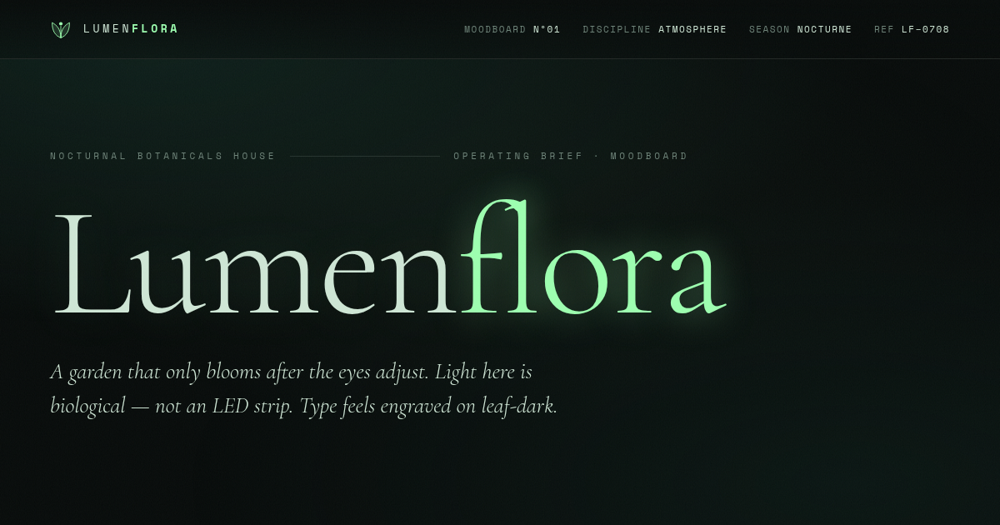 | `Qwen3.8-Flash-Next-UD-Q4_K_XL` | [gufo](https://github.com/gufo-org/gufo) | off | — | — | — | — | 5.9s | 8 | [open](prompts/concepts/nocturnal-garden-moodboard/runs/qwen3-8-flash-next-ud-q4-k-xl/demo/index.html) · default |

---

### Offset Plate Registration Error

A kinetic type system where text layers (C, M, Y, K) slide into perfect alignment on scroll, simulating the high-tension registration of a press.

**Status:** polished · `print-design` `offset-lithography` `color-separation` `misalignment` `cmyk` `ink-layer` `vintage-tech` `glitch-art` · brief by `Qwen3.8-Flash-Next-UD-Q4_K_XL`

[prompt](prompts/concepts/offset-plate-registration-error/prompt.md) · [extended](prompts/concepts/offset-plate-registration-error/prompt.full.md)

#### Model runs

| Preview | Model | Engine | Think | Ctx | In | Out | TTFT | Gen | Score | Demo |
|:-------:|-------|--------|:-----:|----:|---:|----:|-----:|----:|------:|------|
| 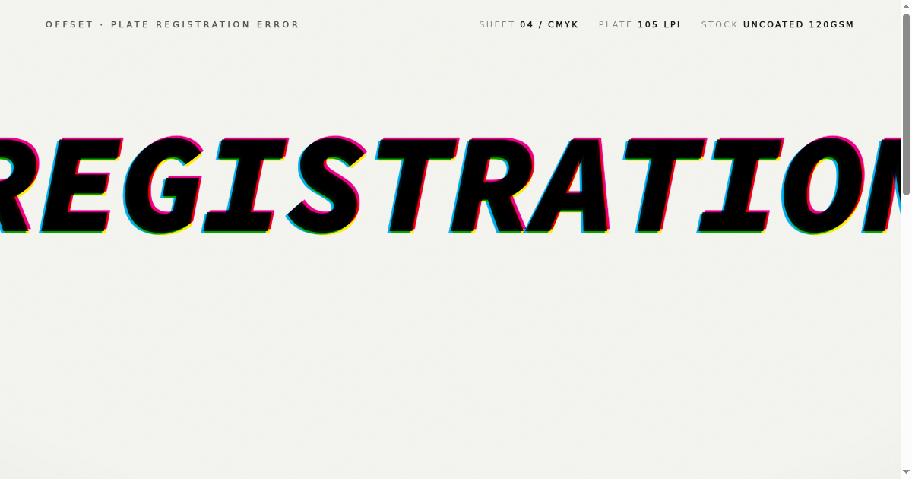 | `Qwen3.8-Flash-Next-UD-Q4_K_XL` | [gufo](https://github.com/gufo-org/gufo) | off | — | — | — | 2.1s | 317s | 8 | [open](prompts/concepts/offset-plate-registration-error/runs/qwen3-8-flash-next-ud-q4-k-xl/demo/index.html) · default |

---

### Oxidized Coin Valuation

A data card where the 'value' is revealed by cleaning a tarnished coin. Scrubbing the patina reveals the underlying metal and a numerical value.

**Status:** polished · `coin` `oxidation` `data` `finance` `texture` `patina` `interaction` `haptic` · brief by `qwen3.8-flash-next`

[prompt](prompts/concepts/oxidized-coin-valuation/prompt.md) · [extended](prompts/concepts/oxidized-coin-valuation/prompt.full.md)

#### Model runs

| Preview | Model | Engine | Think | Ctx | In | Out | TTFT | Gen | Score | Demo |
|:-------:|-------|--------|:-----:|----:|---:|----:|-----:|----:|------:|------|
|  | `Qwen3.8-Flash-Next-UD-Q4_K_XL` | [gufo](https://github.com/gufo-org/gufo) | off | — | — | — | — | 8.3s | 8 | [open](prompts/concepts/oxidized-coin-valuation/runs/qwen3-8-flash-next-ud-q4-k-xl/demo/index.html) · default |

---

### Photocopy Contrast Degradation

A high-contrast black-and-white interface where elements degrade into noisy, high-contrast photocopy artifacts the longer they are viewed or scrolled past.

**Status:** polished · `photocopy` `xerox` `high-contrast` `noise` `halftone` `punk` `zine` `distortion` · brief by `Qwen3.8-Flash-Next-UD-Q4_K_XL`

[prompt](prompts/concepts/photocopy-contrast-degradation/prompt.md) · [extended](prompts/concepts/photocopy-contrast-degradation/prompt.full.md)

#### Model runs

| Preview | Model | Engine | Think | Ctx | In | Out | TTFT | Gen | Score | Demo |
|:-------:|-------|--------|:-----:|----:|---:|----:|-----:|----:|------:|------|
| 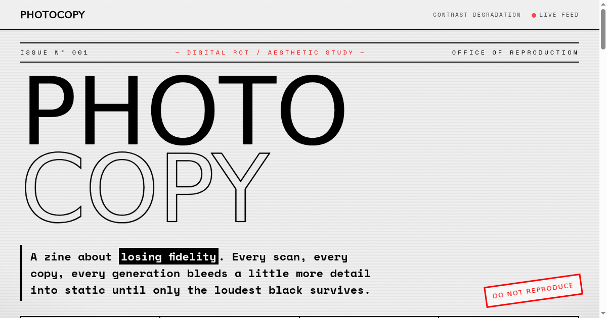 | `Qwen3.8-Flash-Next-UD-Q4_K_XL` | [gufo](https://github.com/gufo-org/gufo) | off | — | — | — | 1.7s | 352s | 8 | [open](prompts/concepts/photocopy-contrast-degradation/runs/qwen3-8-flash-next-ud-q4-k-xl/demo/index.html) · default |

---

### Piano Key Strike Cascade

Typography mimics piano keys. Letters are rectangular blocks that 'strike' down like hammers when triggered, creating a rhythmic, percussive text reveal.

**Status:** polished · `piano` `kinetic-type` `mechanical-motion` `staccato` `audio-visual` `percussive` `black-white` `rhythm` · brief by `Qwen3.8-Flash-Next-UD-Q4_K_XL`

[prompt](prompts/concepts/piano-key-strike-cascade/prompt.md) · [extended](prompts/concepts/piano-key-strike-cascade/prompt.full.md)

#### Model runs

| Preview | Model | Engine | Think | Ctx | In | Out | TTFT | Gen | Score | Demo |
|:-------:|-------|--------|:-----:|----:|---:|----:|-----:|----:|------:|------|
| 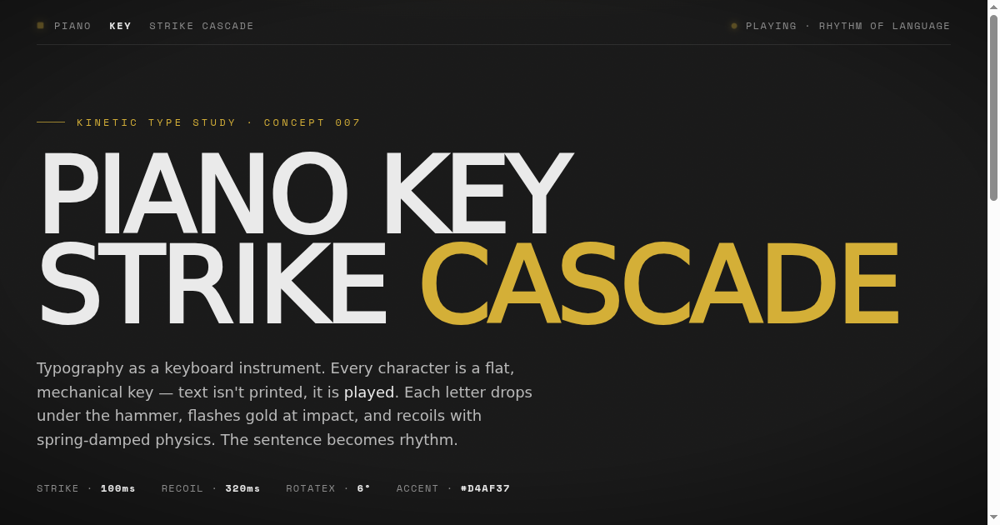 | `Qwen3.8-Flash-Next-UD-Q4_K_XL` | [gufo](https://github.com/gufo-org/gufo) | off | — | — | — | 2.8s | 308s | 6 | [open](prompts/concepts/piano-key-strike-cascade/runs/qwen3-8-flash-next-ud-q4-k-xl/demo/index.html) · default |

---

### Porcelain Insulator Hysteresis

A visualization of electrical hysteresis in porcelain insulators, where the loop is drawn as a smooth, white ceramic curve against a dark, quiet background.

**Status:** polished · `ceramic` `electrical-engineering` `hysteresis-loop` `data-viz` `calm` `industrial` `insulation` · brief by `Qwen3.8-Flash-Next-UD-Q4_K_XL`

[prompt](prompts/concepts/porcelain-insulator-hysteresis/prompt.md) · [extended](prompts/concepts/porcelain-insulator-hysteresis/prompt.full.md)

#### Model runs

| Preview | Model | Engine | Think | Ctx | In | Out | TTFT | Gen | Score | Demo |
|:-------:|-------|--------|:-----:|----:|---:|----:|-----:|----:|------:|------|
| 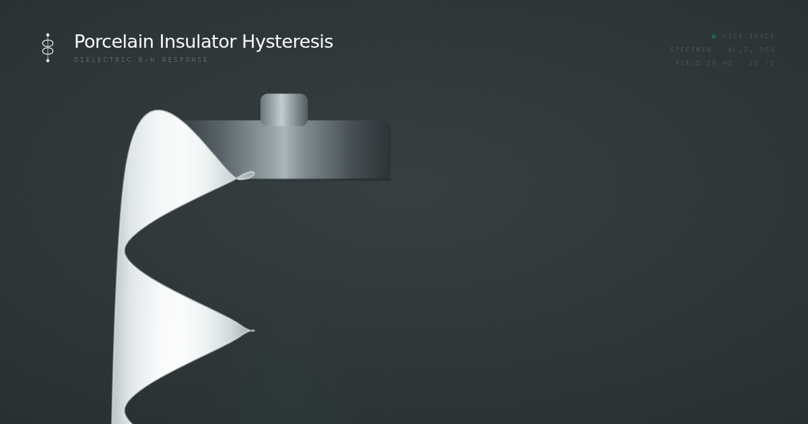 | `Qwen3.8-Flash-Next-UD-Q4_K_XL` | [gufo](https://github.com/gufo-org/gufo) | off | — | — | — | 292ms | 232s | 6 | [open](prompts/concepts/porcelain-insulator-hysteresis/runs/qwen3-8-flash-next-ud-q4-k-xl/demo/index.html) · default |

---

### Pressure Gauge Needle Sync

A multi-gauge dashboard where mechanical needles vibrate and sync based on simulated pressure loads. Steam bursts occur at critical thresholds, shaking the UI.

**Status:** draft · `analog-gauge` `pressure` `steam` `mechanical` `sync` `industrial` `steam` `vibration` · brief by `qwen3.8-flash-next`

[prompt](prompts/concepts/pressure-gauge-needle-sync/prompt.md) · [extended](prompts/concepts/pressure-gauge-needle-sync/prompt.full.md)

#### Model runs

| Preview | Model | Engine | Think | Ctx | In | Out | TTFT | Gen | Score | Demo |
|:-------:|-------|--------|:-----:|----:|---:|----:|-----:|----:|------:|------|
| 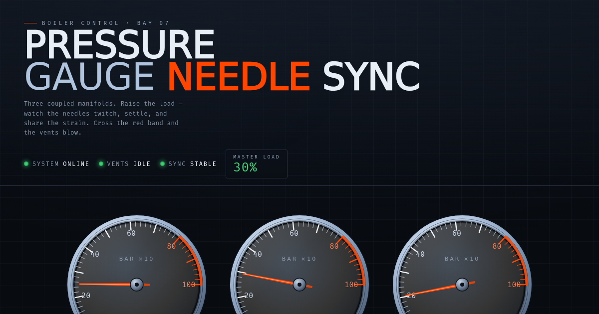 | `Qwen3.8-Flash-Next-UD-Q4_K_XL` | [gufo](https://github.com/gufo-org/gufo) | off | — | — | — | 1.7s | 211s | 8 | [open](prompts/concepts/pressure-gauge-needle-sync/runs/qwen3-8-flash-next-ud-q4-k-xl/demo/index.html) · default |

---

### Resonant Vowel Visualizer

Typography that reacts to vocal frequency. Letters expand, contract, and distort based on real-time audio input, visualizing the physics of sound through kinetic type.

**Status:** polished · `acoustic` `kinetic-type` `audio-reactive` `generative` `linguistics` `spring-physics` `dark-ui` `experimental` · brief by `qwen3.8-flash-next`

[prompt](prompts/concepts/resonant-vowel-visualizer/prompt.md) · [extended](prompts/concepts/resonant-vowel-visualizer/prompt.full.md)

#### Model runs

| Preview | Model | Engine | Think | Ctx | In | Out | TTFT | Gen | Score | Demo |
|:-------:|-------|--------|:-----:|----:|---:|----:|-----:|----:|------:|------|
|  | `Qwen3.8-Flash-Next-UD-Q4_K_XL` | [gufo](https://github.com/gufo-org/gufo) | off | — | — | — | — | 7.4s | 9 | [open](prompts/concepts/resonant-vowel-visualizer/runs/qwen3-8-flash-next-ud-q4-k-xl/demo/index.html) · default |

---

### Saline Crystal Growth Timer

A countdown UI where time is measured by the geometric growth of salt crystals in a solution. As the timer runs, intricate 3D crystal structures form.

**Status:** polished · `crystal` `saline` `timer` `generative` `macro` `geometric` `slow-motion` `ui-component` · brief by `Qwen3.8-Flash-Next-UD-Q4_K_XL`

[prompt](prompts/concepts/saline-crystal-growth-timer/prompt.md) · [extended](prompts/concepts/saline-crystal-growth-timer/prompt.full.md)

#### Model runs

| Preview | Model | Engine | Think | Ctx | In | Out | TTFT | Gen | Score | Demo |
|:-------:|-------|--------|:-----:|----:|---:|----:|-----:|----:|------:|------|
| 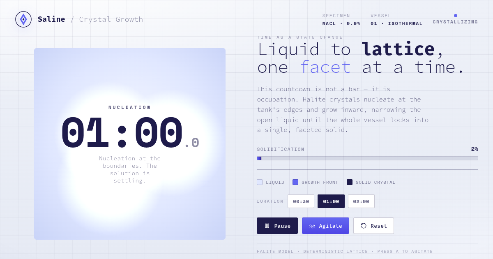 | `Qwen3.8-Flash-Next-UD-Q4_K_XL` | [gufo](https://github.com/gufo-org/gufo) | off | — | — | — | 349ms | 457s | 6 | [open](prompts/concepts/saline-crystal-growth-timer/runs/qwen3-8-flash-next-ud-q4-k-xl/demo/index.html) · default |

---

### Salt Flat Horizon Alignment

An interface where text and UI elements align to a distant, flat salt horizon, using extreme perspective and shadow length to convey scale and stillness.

**Status:** polished · `salt-flats` `horizon` `alignment` `ultra-wide` `perspective` `arid` `bone-white` `long-shadows` · brief by `Qwen3.8-Flash-Next-UD-Q4_K_XL`

[prompt](prompts/concepts/salt-flat-horizon-alignment/prompt.md) · [extended](prompts/concepts/salt-flat-horizon-alignment/prompt.full.md)

#### Model runs

| Preview | Model | Engine | Think | Ctx | In | Out | TTFT | Gen | Score | Demo |
|:-------:|-------|--------|:-----:|----:|---:|----:|-----:|----:|------:|------|
|  | `Qwen3.8-Flash-Next-UD-Q4_K_XL` | [gufo](https://github.com/gufo-org/gufo) | off | — | — | — | 1.6s | 145s | 2 | [open](prompts/concepts/salt-flat-horizon-alignment/runs/qwen3-8-flash-next-ud-q4-k-xl/demo/index.html) · default |

---

### Slaked Lime Cure Timer

A status indicator that visualizes the slow carbonation of slaked lime, where a rough grey patch transforms into smooth white stone over time.

**Status:** polished · `material` `time` `stone` `progress` `carbonation` `concrete` `calm` `ui-component` · brief by `qwen3.8-flash-next`

[prompt](prompts/concepts/slaked-lime-cure-timer/prompt.md) · [extended](prompts/concepts/slaked-lime-cure-timer/prompt.full.md)

#### Model runs

| Preview | Model | Engine | Think | Ctx | In | Out | TTFT | Gen | Score | Demo |
|:-------:|-------|--------|:-----:|----:|---:|----:|-----:|----:|------:|------|
|  | `Qwen3.8-Flash-Next-UD-Q4_K_XL` | [gufo](https://github.com/gufo-org/gufo) | off | — | — | — | — | 6.6s | 8 | [open](prompts/concepts/slaked-lime-cure-timer/runs/qwen3-8-flash-next-ud-q4-k-xl/demo/index.html) · default |

---

### Soft Industrial Toolkit

Design toolkit blending soft UI radii with industrial material cues — aluminum, porcelain, quiet warning stripes.

**Status:** draft · `system` `industrial` `soft` `product` `tokens`

[prompt](prompts/concepts/soft-industrial-toolkit/prompt.md) · [extended](prompts/concepts/soft-industrial-toolkit/prompt.full.md)

#### Model runs

| Preview | Model | Engine | Think | Ctx | In | Out | TTFT | Gen | Score | Demo |
|:-------:|-------|--------|:-----:|----:|---:|----:|-----:|----:|------:|------|
|  | `Qwen3.8-Flash-Next-UD-Q4_K_XL` | [gufo](https://github.com/gufo-org/gufo) | off | — | — | — | — | 5.8s | 9 | [open](prompts/concepts/soft-industrial-toolkit/runs/qwen3-8-flash-next-ud-q4-k-xl/demo/index.html) · default |

---

### Solar Flare Corona Visualization

Interactive solar corona visualization where magnetic field lines warp and plasma flares erupt, controlled by user-adjustable magnetic pressure.

**Status:** polished · `astronomy` `plasma-simulation` `data-visualization` `heat` `glow` `scientific` `dark-mode` · brief by `Qwen3.8-Flash-Next-UD-Q4_K_XL`

[prompt](prompts/concepts/solar-flare-corona-visualization/prompt.md) · [extended](prompts/concepts/solar-flare-corona-visualization/prompt.full.md)

#### Model runs

| Preview | Model | Engine | Think | Ctx | In | Out | TTFT | Gen | Score | Demo |
|:-------:|-------|--------|:-----:|----:|---:|----:|-----:|----:|------:|------|
| 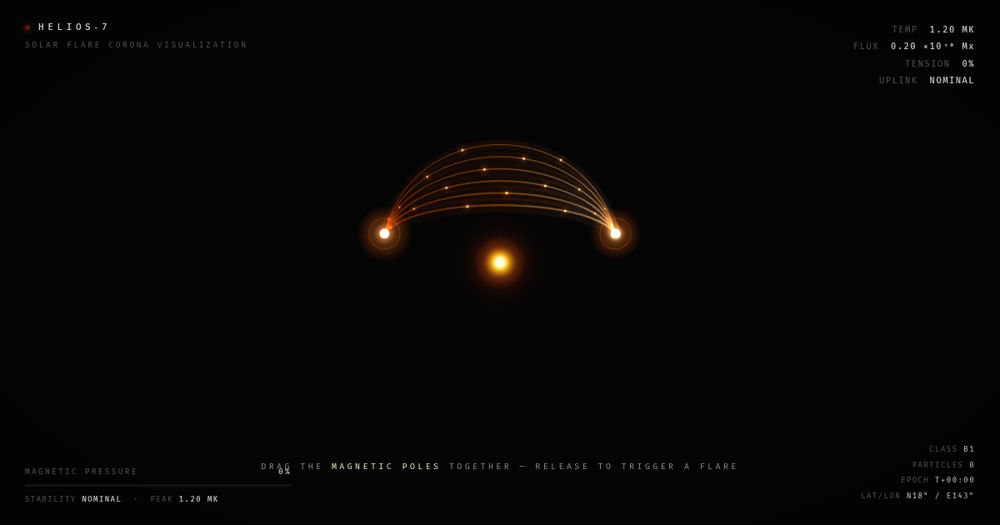 | `Qwen3.8-Flash-Next-UD-Q4_K_XL` | [gufo](https://github.com/gufo-org/gufo) | off | — | — | — | 1.5s | 327s | 9 | [open](prompts/concepts/solar-flare-corona-visualization/runs/qwen3-8-flash-next-ud-q4-k-xl/demo/index.html) · default |

---

### Stamped Manifest Alignment

A digital document verification interface where users must manually align and 'stamp' approval marks. The stamp leaves an imperfect, ink-bleeding impression on textured paper.

**Status:** draft · `rubber-stamp` `ink-bleed` `logistics` `paper-texture` `verification` `manual` `clerk` `audit` · brief by `qwen3.8-flash-next`

[prompt](prompts/concepts/stamped-manifest-alignment/prompt.md) · [extended](prompts/concepts/stamped-manifest-alignment/prompt.full.md)

#### Model runs

| Preview | Model | Engine | Think | Ctx | In | Out | TTFT | Gen | Score | Demo |
|:-------:|-------|--------|:-----:|----:|---:|----:|-----:|----:|------:|------|
| 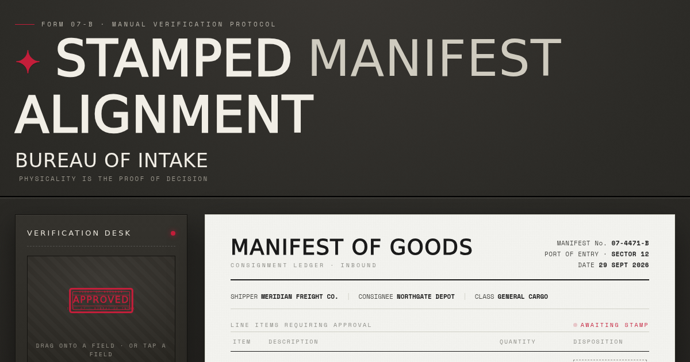 | `Qwen3.8-Flash-Next-UD-Q4_K_XL` | [gufo](https://github.com/gufo-org/gufo) | off | — | — | — | 1.2s | 184s | 8 | [open](prompts/concepts/stamped-manifest-alignment/runs/qwen3-8-flash-next-ud-q4-k-xl/demo/index.html) · default |

---

### Substation Relay Status Board

A utility dashboard mimicking physical relay panels. Status changes trigger mechanical relay clicks, LED matrix updates, and hazard stripe shifts.

**Status:** polished · `electrical-substation` `relay-logic` `status-indicator` `high-voltage` `utility-ui` `mono-type` `safety` `infrastructure` · brief by `Qwen3.8-Flash-Next-UD-Q4_K_XL`

[prompt](prompts/concepts/substation-relay-status-board/prompt.md) · [extended](prompts/concepts/substation-relay-status-board/prompt.full.md)

#### Model runs

| Preview | Model | Engine | Think | Ctx | In | Out | TTFT | Gen | Score | Demo |
|:-------:|-------|--------|:-----:|----:|---:|----:|-----:|----:|------:|------|
| 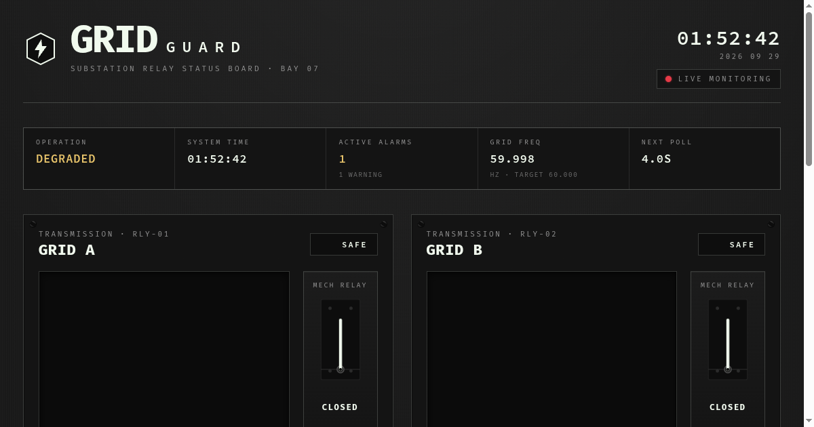 | `Qwen3.8-Flash-Next-UD-Q4_K_XL` | [gufo](https://github.com/gufo-org/gufo) | off | — | — | — | 3.8s | 337s | 8 | [open](prompts/concepts/substation-relay-status-board/runs/qwen3-8-flash-next-ud-q4-k-xl/demo/index.html) · default |

---

### Sun-Bleached Textile Swatches

A digital fabric swatch selector featuring high-res textures of desert-worn textiles, with long shadows and natural light simulation.

**Status:** polished · `textile` `material` `desaturated` `texture` `swatch` `fashion` `arid` `natural-light` · brief by `qwen3.8-flash-next`

[prompt](prompts/concepts/sun-bleached-textile-swatches/prompt.md) · [extended](prompts/concepts/sun-bleached-textile-swatches/prompt.full.md)

#### Model runs

| Preview | Model | Engine | Think | Ctx | In | Out | TTFT | Gen | Score | Demo |
|:-------:|-------|--------|:-----:|----:|---:|----:|-----:|----:|------:|------|
|  | `Qwen3.8-Flash-Next-UD-Q4_K_XL` | [gufo](https://github.com/gufo-org/gufo) | off | — | — | — | — | 6.3s | 8 | [open](prompts/concepts/sun-bleached-textile-swatches/runs/qwen3-8-flash-next-ud-q4-k-xl/demo/index.html) · default |

---

### Sushi Neta Freshness Grid

A data visualization dashboard for sushi chefs, tracking fish freshness via temperature, time, and texture degradation in a sterile blue-white interface.

**Status:** polished · `sushi` `freshness` `data-viz` `culinary` `precision` `blue-white` `minimalist` · brief by `Qwen3.8-Flash-Next-UD-Q4_K_XL`

[prompt](prompts/concepts/sushi-neta-freshness-grid/prompt.md) · [extended](prompts/concepts/sushi-neta-freshness-grid/prompt.full.md)

#### Model runs

| Preview | Model | Engine | Think | Ctx | In | Out | TTFT | Gen | Score | Demo |
|:-------:|-------|--------|:-----:|----:|---:|----:|-----:|----:|------:|------|
| 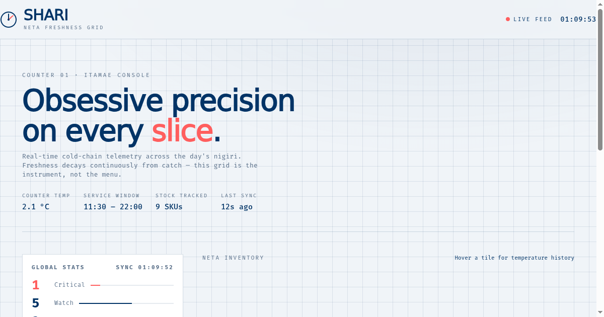 | `Qwen3.8-Flash-Next-UD-Q4_K_XL` | [gufo](https://github.com/gufo-org/gufo) | off | — | — | — | 1.7s | 347s | 6 | [open](prompts/concepts/sushi-neta-freshness-grid/runs/qwen3-8-flash-next-ud-q4-k-xl/demo/index.html) · default |

---

### Tidal Glass Horizon

A serene, abstract interface where a horizon line shifts like a tide, refracting text and imagery through a simulated curved glass lens. Quiet luxury aesthetic.

**Status:** polished · `horizon` `glass-refraction` `tide` `minimalist` `ambient` `luxury` `saline` `gradient` · brief by `Qwen3.8-Flash-Next-UD-Q4_K_XL`

[prompt](prompts/concepts/tidal-glass-horizon/prompt.md) · [extended](prompts/concepts/tidal-glass-horizon/prompt.full.md)

#### Model runs

| Preview | Model | Engine | Think | Ctx | In | Out | TTFT | Gen | Score | Demo |
|:-------:|-------|--------|:-----:|----:|---:|----:|-----:|----:|------:|------|
| 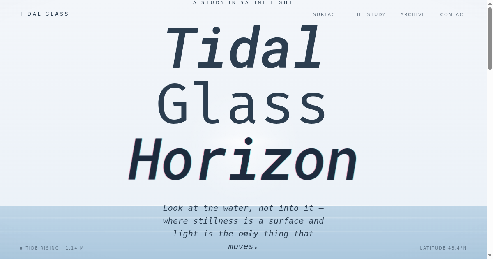 | `Qwen3.8-Flash-Next-UD-Q4_K_XL` | [gufo](https://github.com/gufo-org/gufo) | off | — | — | — | 1.7s | 378s | 8 | [open](prompts/concepts/tidal-glass-horizon/runs/qwen3-8-flash-next-ud-q4-k-xl/demo/index.html) · default |

---

### Tunnel Ventilation Baffle

An interactive visualization of a tunnel ventilation system. Airflow vectors push against metal baffles, which rotate to regulate flow. Tension between air pressure and mechanical resistance.

**Status:** polished · `civil-engineering` `airflow` `baffle` `industrial-design` `motion` `safety` `infrastructure` `metal` · brief by `Qwen3.8-Flash-Next-UD-Q4_K_XL`

[prompt](prompts/concepts/tunnel-ventilation-baffle/prompt.md) · [extended](prompts/concepts/tunnel-ventilation-baffle/prompt.full.md)

#### Model runs

| Preview | Model | Engine | Think | Ctx | In | Out | TTFT | Gen | Score | Demo |
|:-------:|-------|--------|:-----:|----:|---:|----:|-----:|----:|------:|------|
| 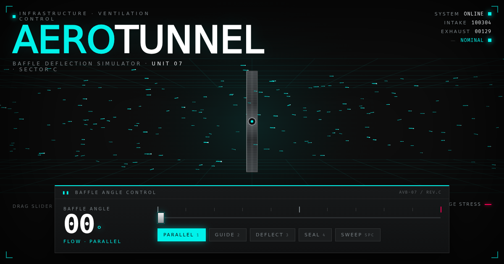 | `Qwen3.8-Flash-Next-UD-Q4_K_XL` | [gufo](https://github.com/gufo-org/gufo) | off | — | — | — | 1.1s | 326s | 9 | [open](prompts/concepts/tunnel-ventilation-baffle/runs/qwen3-8-flash-next-ud-q4-k-xl/demo/index.html) · default |

---

### Typographic Tidal Lock

Celestial mechanics meets typography. Text orbits a central point, with speed and scale dictated by simulated gravity wells. A study in circular motion and hierarchical focus.

**Status:** polished · `orbital` `kinetic-type` `circular-text` `planetary` `minimalist` `css-animation` `space` `gravity` · brief by `qwen3.8-flash-next`

[prompt](prompts/concepts/typographic-tidal-lock/prompt.md) · [extended](prompts/concepts/typographic-tidal-lock/prompt.full.md)

#### Model runs

| Preview | Model | Engine | Think | Ctx | In | Out | TTFT | Gen | Score | Demo |
|:-------:|-------|--------|:-----:|----:|---:|----:|-----:|----:|------:|------|
|  | `Qwen3.8-Flash-Next-UD-Q4_K_XL` | [gufo](https://github.com/gufo-org/gufo) | off | — | — | — | — | 7.7s | 8 | [open](prompts/concepts/typographic-tidal-lock/runs/qwen3-8-flash-next-ud-q4-k-xl/demo/index.html) · default |

---

### Volcanic Ash Layer Accumulator

A slow-motion visualization of volcanic ash falling and settling in distinct strata, creating a textured, gray-scale topography over time.

**Status:** draft · `volcanic` `particle-system` `accumulation` `gray-scale` `texture` `slow-motion` `geology` · brief by `Qwen3.8-Flash-Next-UD-Q4_K_XL`

[prompt](prompts/concepts/volcanic-ash-layer-accumulator/prompt.md) · [extended](prompts/concepts/volcanic-ash-layer-accumulator/prompt.full.md)

#### Model runs

| Preview | Model | Engine | Think | Ctx | In | Out | TTFT | Gen | Score | Demo |
|:-------:|-------|--------|:-----:|----:|---:|----:|-----:|----:|------:|------|
| — | `Qwen3.8-Flash-Next-UD-Q4_K_XL` | [gufo](https://github.com/gufo-org/gufo) | off | — | — | — | 411ms | 281s | — | — |

---

### Wet Leaf Surface Tension

Macro-view of dark, glossy leaves where water droplets form, merge, and roll off, revealing sharp reflections of moonlight and distorted background colors.

**Status:** polished · `surface-tension` `liquid` `botanical` `nocturnal` `reflection` `macro` `physics` `water` · brief by `qwen3.8-flash-next`

[prompt](prompts/concepts/wet-leaf-surface-tension/prompt.md) · [extended](prompts/concepts/wet-leaf-surface-tension/prompt.full.md)

#### Model runs

| Preview | Model | Engine | Think | Ctx | In | Out | TTFT | Gen | Score | Demo |
|:-------:|-------|--------|:-----:|----:|---:|----:|-----:|----:|------:|------|
|  | `Qwen3.8-Flash-Next-UD-Q4_K_XL` | [gufo](https://github.com/gufo-org/gufo) | off | — | — | — | — | 6.6s | 9 | [open](prompts/concepts/wet-leaf-surface-tension/runs/qwen3-8-flash-next-ud-q4-k-xl/demo/index.html) · default |

---

### Wood Type Incremental Heat

Heavy wooden letterpress blocks warp and expand under simulated cursor heat, revealing the grain and texture of the material beneath the ink.

**Status:** polished · `letterpress` `wood-type` `thermal-expansion` `texture` `craft` `kinetic-type` `analog` `heat-distortion` · brief by `Qwen3.8-Flash-Next-UD-Q4_K_XL`

[prompt](prompts/concepts/wood-type-incremental-heat/prompt.md) · [extended](prompts/concepts/wood-type-incremental-heat/prompt.full.md)

#### Model runs

| Preview | Model | Engine | Think | Ctx | In | Out | TTFT | Gen | Score | Demo |
|:-------:|-------|--------|:-----:|----:|---:|----:|-----:|----:|------:|------|
| 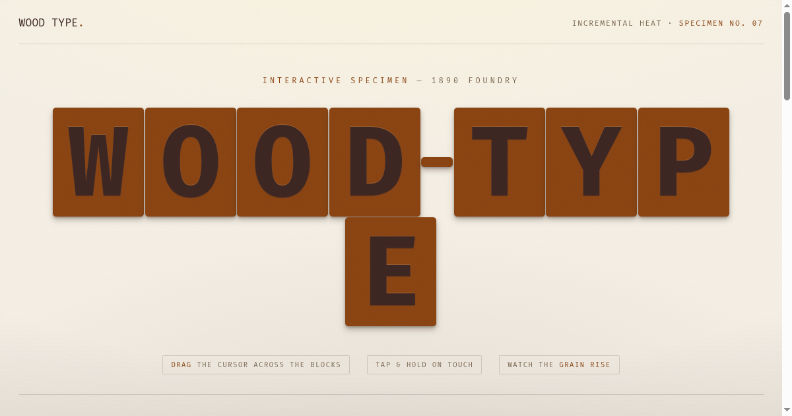 | `Qwen3.8-Flash-Next-UD-Q4_K_XL` | [gufo](https://github.com/gufo-org/gufo) | off | — | — | — | 352ms | 299s | 8 | [open](prompts/concepts/wood-type-incremental-heat/runs/qwen3-8-flash-next-ud-q4-k-xl/demo/index.html) · default |

---

### Woven Wire Loom Grid

A navigation grid where links are represented by taut steel wires that vibrate and weave over/under each other when hovered, mimicking a loom's tension.

**Status:** draft · `wire` `weave` `grid` `tactile` `interaction` `metal` `structure` `generative` · brief by `qwen3.8-flash-next`

[prompt](prompts/concepts/woven-wire-loom-grid/prompt.md) · [extended](prompts/concepts/woven-wire-loom-grid/prompt.full.md)

#### Model runs

| Preview | Model | Engine | Think | Ctx | In | Out | TTFT | Gen | Score | Demo |
|:-------:|-------|--------|:-----:|----:|---:|----:|-----:|----:|------:|------|
| — | `Qwen3.8-Flash-Next-UD-Q4_K_XL` | [gufo](https://github.com/gufo-org/gufo) | off | — | — | — | — | 190s | — | — |

---

## Repo layout

```
prompts/<category>/<id>/
  meta.yaml
  prompt.md / prompt.full.md
  preview: null until first shot
  runs/<model-slug>/
    meta.yaml                 # model + provider + timestamps
    demo/index.html           # implementation for THAT model
    preview.png               # screenshot for THAT model
```

## Automation

| Command | Purpose |
|---------|---------|
| `npm run ai:new` | New prompt briefs (stores `source_model`) |
| `npm run ai:build` | Build `runs/<model>/` demo (no overwrite across models) |
| `npm run shots` | Screenshot each run → README |
| `npm run review` | Vision score; below rebuild floor → drop demo + rebuild |
| `npm run pages` | Static site `site/dist` |
| `npm run pipeline` | build → shots → pages → index |
| `npm run build` | validate + regenerate README / index / catalog |

Other AIs should read `AGENTS.md` and write entries that pass `npm run build`.
