# Design Prompt Collection

High-refined prompts for **landing pages**, **animations**, and **design concepts**.

Each entry has a shared prompt brief; **model runs** live under `runs/<model-slug>/` (demo + screenshot) so models never overwrite each other.

| Entries | Model runs | Polished | Draft |
|--------:|-----------:|---------:|------:|
| 75 | 138 | 52 | 23 |

## Quick start

```bash
npm run ai:new -- -c landing-pages -n 3
npm run pipeline    # ai:build → shots → pages → README
```

README + `index.json` + `catalog.json` are **auto-generated** by `npm run build` / `shots` / `pipeline`.

Machine index: [`index.json`](./index.json) · Agents: [`AGENTS.md`](./AGENTS.md) · Automation: [`automation/README.md`](./automation/README.md)

---

## Landing Pages

### Beacon Signal Nav

A dark-mode navigation landing page using rotating light beams, radar-like interfaces, and high-visibility safety greens.

**Status:** polished · `maritime` `navigation` `signal` `light` `minimalist` · brief by `qwen3.8-flash-next`

[prompt](prompts/landing-pages/beacon-signal-nav/prompt.md) · [extended](prompts/landing-pages/beacon-signal-nav/prompt.full.md)

#### Model runs

| Preview | Model | Think | Ctx | Time | Score | Demo |
|:-------:|-------|:-----:|----:|-----:|------:|------|
| 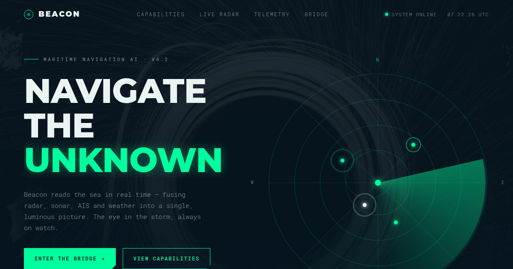 | `legacy` | — | — | — | — | — |
|  | `qwen3.8-flash-next`<br><sub>`chat`</sub> **(default)** | off | — | 6s | 9 | [open](prompts/landing-pages/beacon-signal-nav/runs/qwen3-8-flash-next/demo/index.html) |
| | _Excellent execution of the 'night-watch bridge' aesthetic with a strong, functional radar hero and perfect adherence to the color and typography constraints._ | | | | | |

---

### Cactus Core Eco

A landing page for 'Cactus Core', an eco-conscious product brand using cactus-based materials. Features organic shapes, vibrant cactus-green accents, and macro photography of plant textures on a clay background.

**Status:** polished · `botanical` `desert` `eco` `product` `nature` · brief by `qwen3.8-flash-next`

[prompt](prompts/landing-pages/cactus-core-eco/prompt.md) · [extended](prompts/landing-pages/cactus-core-eco/prompt.full.md)

#### Model runs

| Preview | Model | Think | Ctx | Time | Score | Demo |
|:-------:|-------|:-----:|----:|-----:|------:|------|
|  | `legacy` | — | — | — | — | — |
| 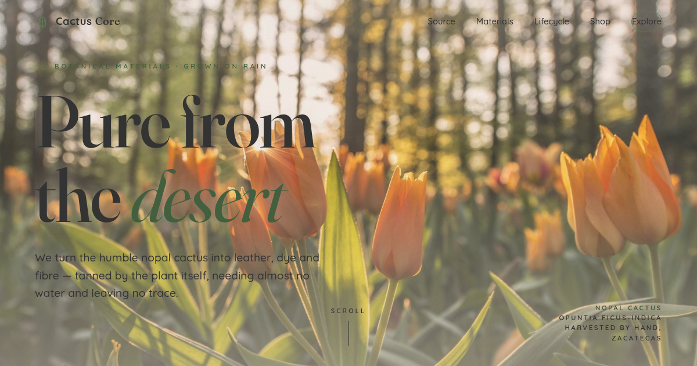 | `qwen3.8-flash-next`<br><sub>`chat`</sub> **(default)** | off | — | 8s | 6 | [open](prompts/landing-pages/cactus-core-eco/runs/qwen3-8-flash-next/demo/index.html) |
| | _A visually pleasing but generic landing page that fails to adhere to the specific 'cactus macro' and 'organic shapes' brief, relying on a standard template layout._ | | | | | |

---

### Chime Resonance Brand

A sonic branding landing page for Chime, where typography vibrates with audio frequencies and letters act as resonant chambers.

**Status:** polished · `audio` `haptic` `sonic` `identity` `landing` `kinetic-type` · brief by `qwen3.8-flash-next`

[prompt](prompts/landing-pages/chime-resonance-brand/prompt.md) · [extended](prompts/landing-pages/chime-resonance-brand/prompt.full.md)

#### Model runs

| Preview | Model | Think | Ctx | Time | Score | Demo |
|:-------:|-------|:-----:|----:|-----:|------:|------|
| 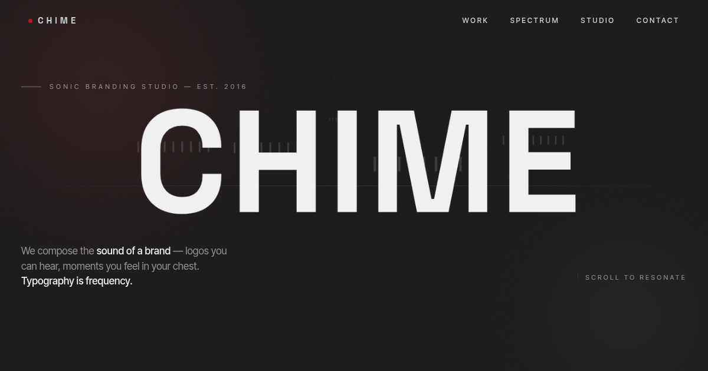 | `legacy` | — | — | — | — | — |
|  | `qwen3.8-flash-next`<br><sub>`chat`</sub> **(default)** | off | — | 8s | 9 | [open](prompts/landing-pages/chime-resonance-brand/runs/qwen3-8-flash-next/demo/index.html) |
| | _Excellent execution of the brief with a strong, kinetic hero composition that perfectly balances the massive typography with the subtle sound wave details._ | | | | | |

---

### Code Canvas Dev Tool

A landing page for 'Code Canvas', a new developer tool. The hero is a live code editor simulation where comments turn into UI elements.

**Status:** polished · `developer` `code` `monospace` `terminal` `landing` `dark-mode` · brief by `qwen3.8-flash-next`

[prompt](prompts/landing-pages/code-canvas-dev-tool/prompt.md) · [extended](prompts/landing-pages/code-canvas-dev-tool/prompt.full.md)

#### Model runs

| Preview | Model | Think | Ctx | Time | Score | Demo |
|:-------:|-------|:-----:|----:|-----:|------:|------|
|  | `legacy` | — | — | — | — | — |
| 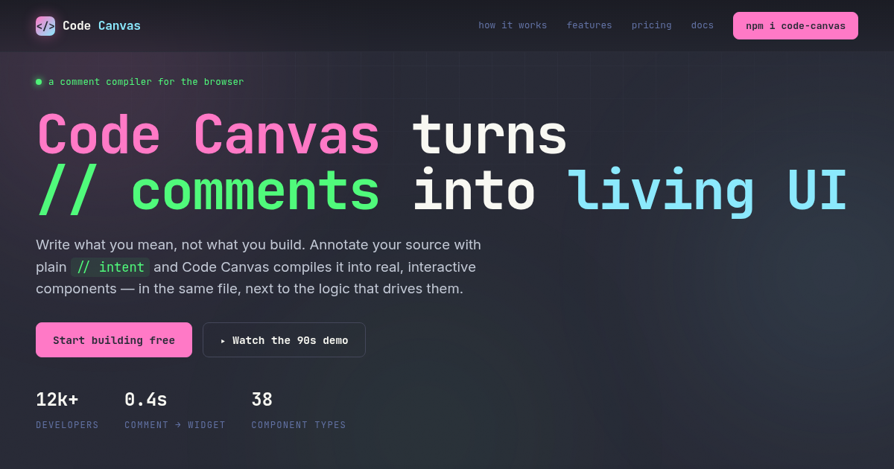 | `qwen3.8-flash-next`<br><sub>`chat`</sub> **(default)** | off | — | 7s | 6 | [open](prompts/landing-pages/code-canvas-dev-tool/runs/qwen3-8-flash-next/demo/index.html) |
| | _Strong typography and color palette, but the hero is a text block rather than the requested stylized code editor visual._ | | | | | |

---

### Codex Leaf Gold Illumination

A landing page for a digital manuscript archive, featuring gold-leaf drop caps, vellum textures, and static, dignified typography that evokes the permanence of handwritten records.

**Status:** polished · `illuminated-manuscript` `gold-leaf` `digital-archive` `historical-tech` `trust` `serif` `static` · brief by `qwen3.8-flash-next`

[prompt](prompts/landing-pages/codex-leaf-gold-illumination/prompt.md) · [extended](prompts/landing-pages/codex-leaf-gold-illumination/prompt.full.md)

#### Model runs

| Preview | Model | Think | Ctx | Time | Score | Demo |
|:-------:|-------|:-----:|----:|-----:|------:|------|
|  | `legacy` | — | — | — | — | — |
|  | `qwen3.8-flash-next`<br><sub>`chat`</sub> **(default)** | off | — | 6s | 9 | [open](prompts/landing-pages/codex-leaf-gold-illumination/runs/qwen3-8-flash-next/demo/index.html) |
| | _A faithful, elegant implementation that perfectly captures the 'quiet, reverent, academic' atmosphere with excellent typography and texture._ | | | | | |

---

### Cold Chain Logistics

A utility landing page for 'FrostLine', a temperature-sensitive logistics provider, using frost patterns, warning labels, and industrial stencil typography.

**Status:** polished · `logistics` `cold-chain` `utility` `warning` `infrastructure` `monospace` `stencil` · brief by `qwen3.8-flash-next`

[prompt](prompts/landing-pages/cold-chain-logistics/prompt.md) · [extended](prompts/landing-pages/cold-chain-logistics/prompt.full.md)

#### Model runs

| Preview | Model | Think | Ctx | Time | Score | Demo |
|:-------:|-------|:-----:|----:|-----:|------:|------|
|  | `legacy` | — | — | — | — | — |
|  | `qwen3.8-flash-next`<br><sub>`chat`</sub> **(default)** | off | — | 7s | 9 | [open](prompts/landing-pages/cold-chain-logistics/runs/qwen3-8-flash-next/demo/index.html) |
| | _Excellent execution of the industrial cold-chain aesthetic with perfect typography, layout, and atmospheric details._ | | | | | |

---

### Fermentation Vault

Landing page for 'Microbe & Time', a fermentation supply brand. Dark, mysterious aesthetic with glowing amber lights inside glass jars, emphasizing the slow, living process.

**Status:** polished · `fermentation` `kobo` `dark-mode` `time` `microbial` `craft` `amber` · brief by `qwen3.8-flash-next`

[prompt](prompts/landing-pages/fermentation-vault/prompt.md) · [extended](prompts/landing-pages/fermentation-vault/prompt.full.md)

#### Model runs

| Preview | Model | Think | Ctx | Time | Score | Demo |
|:-------:|-------|:-----:|----:|-----:|------:|------|
| 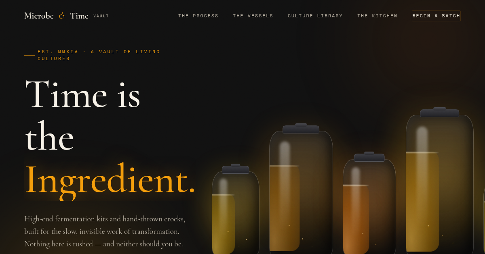 | `legacy` | — | — | — | — | — |
|  | `qwen3.8-flash-next`<br><sub>`chat`</sub> **(default)** | off | — | 6s | 9 | [open](prompts/landing-pages/fermentation-vault/runs/qwen3-8-flash-next/demo/index.html) |
| | _Excellent execution of the 'mysterious library' brief with perfect atmospheric lighting and typography._ | | | | | |

---

### Forge and Roast Coffee Lab

A dark, industrial coffee-roaster landing page with ember-red accents, hard grid rules, product close-ups, and a quiet scroll sequence.

**Status:** draft · `coffee` `retail` `product` `industrial` `landing`

[prompt](prompts/landing-pages/forge-and-roast-coffee-lab/prompt.md) · [extended](prompts/landing-pages/forge-and-roast-coffee-lab/prompt.full.md)

#### Model runs

| Preview | Model | Think | Ctx | Time | Score | Demo |
|:-------:|-------|:-----:|----:|-----:|------:|------|
|  | `legacy` | — | — | — | — | — |
|  | `qwen3.8-flash-next`<br><sub>`chat`</sub> **(default)** | off | — | 6s | 8 | [open](prompts/landing-pages/forge-and-roast-coffee-lab/runs/qwen3-8-flash-next/demo/index.html) |
| | _Strong, on-brief hero with matte black base, ember-red accents, and expressive oversized type._ | | | | | |

---

### Glyph Foundry Typespecimen

A typeface foundry landing page for 'Glyph', where the hero is a live, editable specimen. Users can change weight, width, and case in real-time.

**Status:** polished · `typography` `typeface` `editorial` `specimen` `landing` `minimalist` · brief by `qwen3.8-flash-next`

[prompt](prompts/landing-pages/glyph-foundry-typespecimen/prompt.md) · [extended](prompts/landing-pages/glyph-foundry-typespecimen/prompt.full.md)

#### Model runs

| Preview | Model | Think | Ctx | Time | Score | Demo |
|:-------:|-------|:-----:|----:|-----:|------:|------|
| 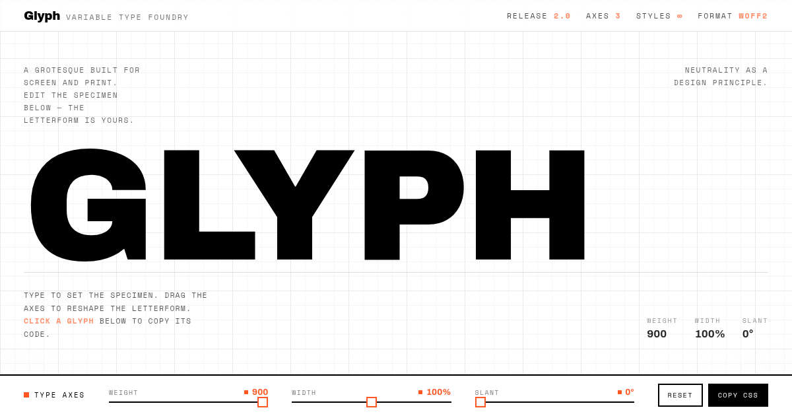 | `legacy` | — | — | — | — | — |
|  | `qwen3.8-flash-next`<br><sub>`chat`</sub> **(default)** | off | — | 6s | 9 | [open](prompts/landing-pages/glyph-foundry-typespecimen/runs/qwen3-8-flash-next/demo/index.html) |
| | _Excellent execution of the brief with a strong, brutalist layout that perfectly balances the hero typography with functional UI controls._ | | | | | |

---

### Gridlock Transit Alert

A high-contrast transit disruption landing page using hazard stripes, monospaced status labels, and urgent but calm signal logic.

**Status:** polished · `transit` `utility` `warning` `infrastructure` `high-contrast` · brief by `qwen3.8-flash-next`

[prompt](prompts/landing-pages/gridlock-transit-alert/prompt.md) · [extended](prompts/landing-pages/gridlock-transit-alert/prompt.full.md)

#### Model runs

| Preview | Model | Think | Ctx | Time | Score | Demo |
|:-------:|-------|:-----:|----:|-----:|------:|------|
|  | `legacy` | — | — | — | — | — |
| 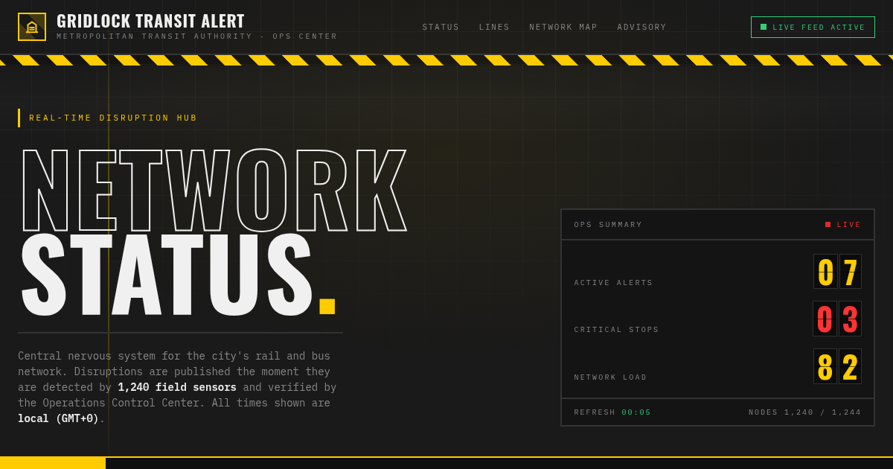 | `qwen3.8-flash-next`<br><sub>`chat`</sub> **(default)** | off | — | 4s | 9 | [open](prompts/landing-pages/gridlock-transit-alert/runs/qwen3-8-flash-next/demo/index.html) |
| | _Excellent execution of the utility aesthetic, perfectly matching the brief's requirements for typography, color, and layout._ | | | | | |

---

### Halyard Marine Forecast

A weather-intelligence landing page for Halyard, a marine routing startup, built around a live route ribbon and cold, technical typography.

**Status:** draft · `maritime` `weather` `data-viz` `landing` `motion`

[prompt](prompts/landing-pages/halyard-marine-forecast/prompt.md) · [extended](prompts/landing-pages/halyard-marine-forecast/prompt.full.md)

#### Model runs

| Preview | Model | Think | Ctx | Time | Score | Demo |
|:-------:|-------|:-----:|----:|-----:|------:|------|
|  | `legacy` | — | — | — | — | — |
|  | `qwen3.8-flash-next`<br><sub>`chat`</sub> **(default)** | off | — | 4s | 8 | [open](prompts/landing-pages/halyard-marine-forecast/runs/qwen3-8-flash-next/demo/index.html) |
| | _Strong atmospheric hero with excellent typography and data-viz integration, though the headline wrapping is slightly awkward._ | | | | | |

---

### High Voltage Grid

A landing page for 'VoltEdge', an energy grid management software, featuring hazard stripes, electrical warning icons, and a stark, high-contrast utility aesthetic.

**Status:** polished · `energy` `infrastructure` `warning` `hazard` `electric` `monospace` `stamps` · brief by `qwen3.8-flash-next`

[prompt](prompts/landing-pages/high-voltage-grid/prompt.md) · [extended](prompts/landing-pages/high-voltage-grid/prompt.full.md)

#### Model runs

| Preview | Model | Think | Ctx | Time | Score | Demo |
|:-------:|-------|:-----:|----:|-----:|------:|------|
| 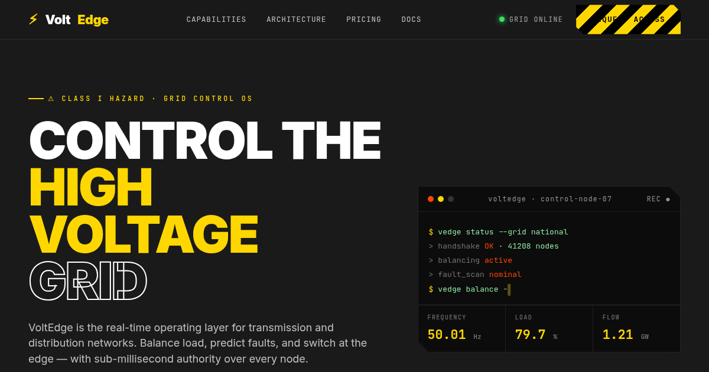 | `legacy` | — | — | — | — | — |
|  | `qwen3.8-flash-next`<br><sub>`chat`</sub> **(default)** | off | — | 7s | 8 | [open](prompts/landing-pages/high-voltage-grid/runs/qwen3-8-flash-next/demo/index.html) |
| | _Strong industrial aesthetic with excellent typography hierarchy and hazard branding, though the background lacks the requested animated electrical arcs._ | | | | | |

---

### Index Card Sort System

A landing page for \\\"SortWell,\\\" a research organization tool, using a stacked index card aesthetic, hand-drawn underlines, and a clean, paper-like background to evoke organized thinking.

**Status:** polished · `index-card` `research` `physical` `stack` `handwritten` `organization` `minimal` `trust` · brief by `qwen3.8-flash-next`

[prompt](prompts/landing-pages/index-card-sort-system/prompt.md) · [extended](prompts/landing-pages/index-card-sort-system/prompt.full.md)

#### Model runs

| Preview | Model | Think | Ctx | Time | Score | Demo |
|:-------:|-------|:-----:|----:|-----:|------:|------|
|  | `legacy` | — | — | — | — | — |
|  | `qwen3.8-flash-next`<br><sub>`chat`</sub> **(default)** | off | — | 7s | 9 | [open](prompts/landing-pages/index-card-sort-system/runs/qwen3-8-flash-next/demo/index.html) |
| | _Excellent execution of the 'physical index card' concept with perfect adherence to color, typography, and layout constraints._ | | | | | |

---

### Kiln Commerce Drop

Product-drop landing for Kiln ceramics: object as full-bleed hero, restrained type, one purchase CTA — craft heat without rustic cliché.

**Status:** draft · `commerce` `product` `warm` `craft` `launch`

[prompt](prompts/landing-pages/kiln-commerce-drop/prompt.md) · [extended](prompts/landing-pages/kiln-commerce-drop/prompt.full.md)

#### Model runs

| Preview | Model | Think | Ctx | Time | Score | Demo |
|:-------:|-------|:-----:|----:|-----:|------:|------|
|  | `legacy` | — | — | — | — | — |
| 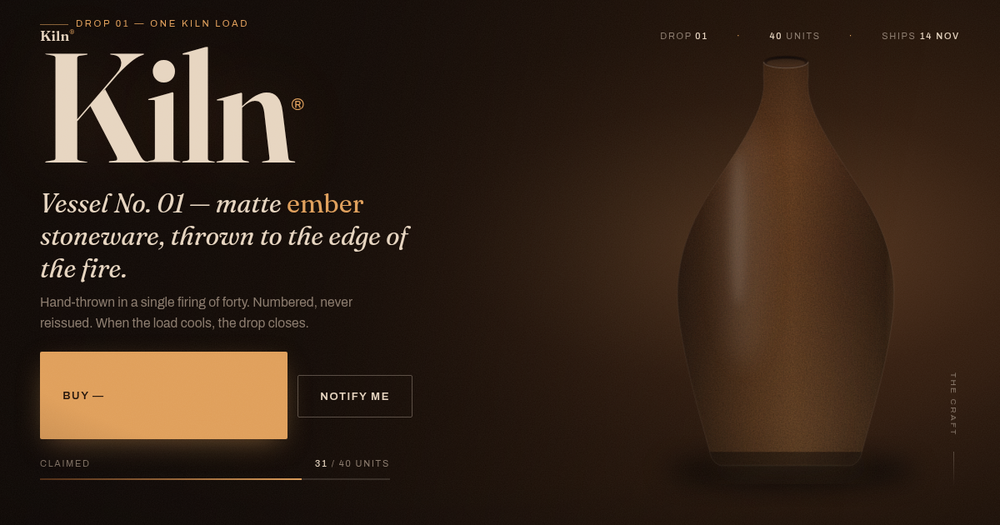 | `qwen3.8-flash-next`<br><sub>`chat`</sub> **(default)** | off | — | 5s | 9 | [open](prompts/landing-pages/kiln-commerce-drop/runs/qwen3-8-flash-next/demo/index.html) |
| | _Exceptional adherence to the brief with a strong, atmospheric hero that perfectly captures the 'kiln heat' mood._ | | | | | |

---

### Knife & Grit Surface

Landing page for 'Edge & Stone', a knife sharpening and blade care brand. Focuses on the tactile experience of steel and stone with high-contrast macro photography and sharp geometry.

**Status:** polished · `knife` `steel` `sharpening` `stone` `sharp` `craft` `monochrome` · brief by `qwen3.8-flash-next`

[prompt](prompts/landing-pages/knife-grit-surface/prompt.md) · [extended](prompts/landing-pages/knife-grit-surface/prompt.full.md)

#### Model runs

| Preview | Model | Think | Ctx | Time | Score | Demo |
|:-------:|-------|:-----:|----:|-----:|------:|------|
| 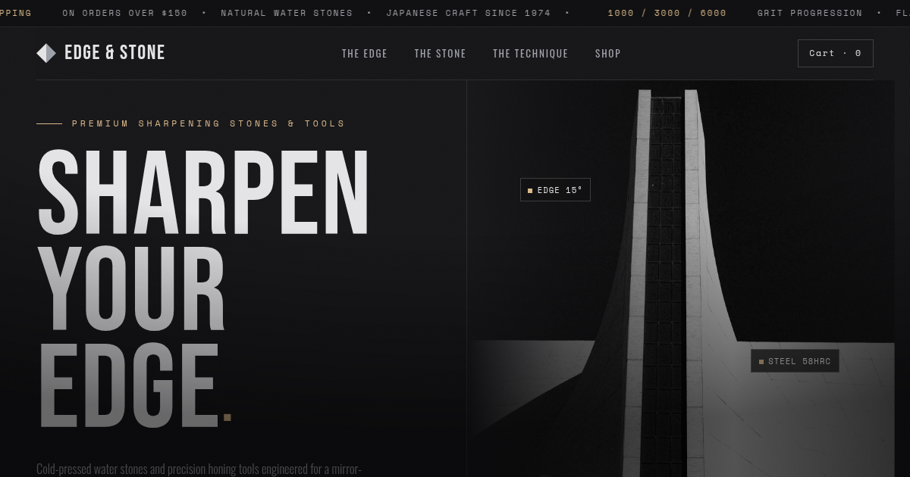 | `legacy` | — | — | — | — | — |
|  | `qwen3.8-flash-next`<br><sub>`chat`</sub> **(default)** | off | — | 7s | 8 | [open](prompts/landing-pages/knife-grit-surface/runs/qwen3-8-flash-next/demo/index.html) |
| | _Strong, atmospheric landing page with excellent typography and a high-contrast, industrial aesthetic that perfectly matches the brief._ | | | | | |

---

### Ledger Blueprint Reconciliation

A landing page for \\\"VeriLedger,\\\" an audit software platform, using blueprint grid lines, checkmark animations, and a clean, white-paper aesthetic to convey financial transparency.

**Status:** polished · `ledger` `blueprint` `accounting` `trust` `grid` `technical` `audit` `clarity` · brief by `qwen3.8-flash-next`

[prompt](prompts/landing-pages/ledger-blueprint-reconciliation/prompt.md) · [extended](prompts/landing-pages/ledger-blueprint-reconciliation/prompt.full.md)

#### Model runs

| Preview | Model | Think | Ctx | Time | Score | Demo |
|:-------:|-------|:-----:|----:|-----:|------:|------|
|  | `legacy` | — | — | — | — | — |
|  | `qwen3.8-flash-next`<br><sub>`chat`</sub> **(default)** | off | — | 8s | 6 | [open](prompts/landing-pages/ledger-blueprint-reconciliation/runs/qwen3-8-flash-next/demo/index.html) |
| | _A clean, on-brand hero section that nails the typography and grid aesthetic but lacks the specific 'reconciliation' visual metaphor requested._ | | | | | |

---

### Load Bearing Structure

An engineering firm landing page using blueprint aesthetics, visible grid systems, and annotated technical diagrams.

**Status:** polished · `construction` `engineering` `blueprint` `grid` `technical` · brief by `qwen3.8-flash-next`

[prompt](prompts/landing-pages/load-bearing-structure/prompt.md) · [extended](prompts/landing-pages/load-bearing-structure/prompt.full.md)

#### Model runs

| Preview | Model | Think | Ctx | Time | Score | Demo |
|:-------:|-------|:-----:|----:|-----:|------:|------|
| 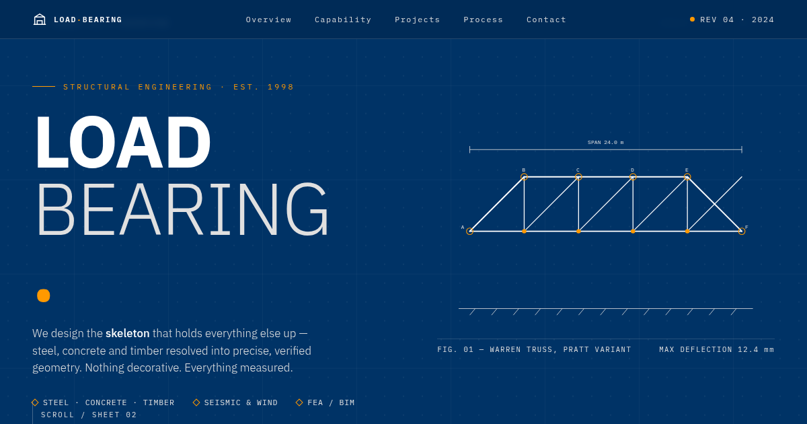 | `legacy` | — | — | — | — | — |
|  | `qwen3.8-flash-next`<br><sub>`chat`</sub> **(default)** | off | — | 6s | 9 | [open](prompts/landing-pages/load-bearing-structure/runs/qwen3-8-flash-next/demo/index.html) |
| | _Excellent adherence to the 'blueprint' aesthetic with precise execution of the visual rules, typography, and layout._ | | | | | |

---

### Microfiche Scan Archive

A landing page for \\\"MicroSearch,\\\" a digital archive service, using a high-contrast black-and-white aesthetic with scanline effects, search bars that mimic microfiche readers, and a sense of discovery.

**Status:** polished · `microfiche` `retro-tech` `library` `scanline` `high-contrast` `search` `noir` `access` · brief by `qwen3.8-flash-next`

[prompt](prompts/landing-pages/microfiche-scan-archive/prompt.md) · [extended](prompts/landing-pages/microfiche-scan-archive/prompt.full.md)

#### Model runs

| Preview | Model | Think | Ctx | Time | Score | Demo |
|:-------:|-------|:-----:|----:|-----:|------:|------|
| 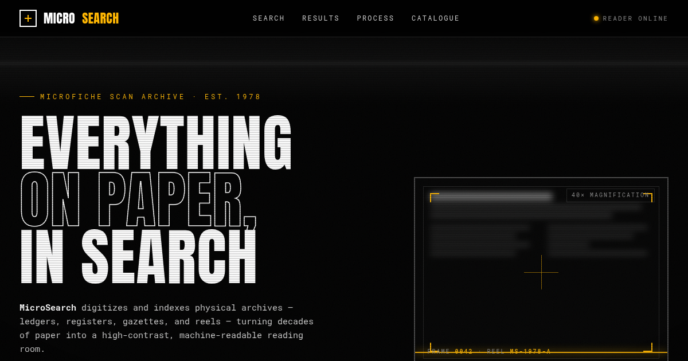 | `legacy` | — | — | — | — | — |
|  | `qwen3.8-flash-next`<br><sub>`chat`</sub> **(default)** | off | — | 8s | 9 | [open](prompts/landing-pages/microfiche-scan-archive/runs/qwen3-8-flash-next/demo/index.html) |
| | _Excellent execution of the retro-tech noir aesthetic with perfect adherence to the high-contrast and typography constraints._ | | | | | |

---

### Mirage Fabric Studio

A landing page for 'Mirage Fabric Studio', a luxury textile designer. Uses heat-haze effects, flowing fabric animations, and a palette of sand, sun-bleached white, and deep shadow to evoke desert fashion.

**Status:** polished · `textile` `fashion` `desert` `minimal` `texture` · brief by `qwen3.8-flash-next`

[prompt](prompts/landing-pages/mirage-fabric-studio/prompt.md) · [extended](prompts/landing-pages/mirage-fabric-studio/prompt.full.md)

#### Model runs

| Preview | Model | Think | Ctx | Time | Score | Demo |
|:-------:|-------|:-----:|----:|-----:|------:|------|
|  | `legacy` | — | — | — | — | — |
| 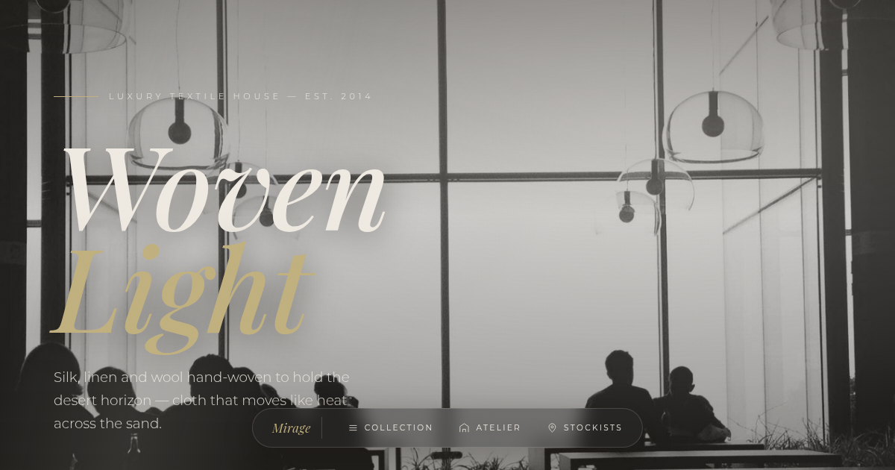 | `qwen3.8-flash-next`<br><sub>`chat`</sub> **(default)** | off | — | 8s | 8 | [open](prompts/landing-pages/mirage-fabric-studio/runs/qwen3-8-flash-next/demo/index.html) |
| | _A strong, atmospheric landing page that captures the luxury aesthetic and fluidity requested, though the background image is static rather than the requested video._ | | | | | |

---

### Northline Fintech Clarity

Trust-forward fintech landing: crisp north-light atmosphere, brand-led hero, one clarity promise — no purple glow, no dashboard soup.

**Status:** draft · `fintech` `clarity` `light` `trust` `saas`

[prompt](prompts/landing-pages/northline-fintech-clarity/prompt.md) · [extended](prompts/landing-pages/northline-fintech-clarity/prompt.full.md)

#### Model runs

| Preview | Model | Think | Ctx | Time | Score | Demo |
|:-------:|-------|:-----:|----:|-----:|------:|------|
|  | `legacy` | — | — | — | — | — |
|  | `qwen3.8-flash-next`<br><sub>`chat`</sub> **(default)** | off | — | 4s | 9 | [open](prompts/landing-pages/northline-fintech-clarity/runs/qwen3-8-flash-next/demo/index.html) |
| | _A masterful execution of the 'Northline' brief, perfectly capturing the 'paper precision' and 'calm authority' mood with a striking typographic hierarchy and atmospheric background._ | | | | | |

---

### PulseLane Urban Mobility

A city mobility landing page for PulseLane, featuring animated route paths, kinetic type, and a high-contrast asphalt palette.

**Status:** draft · `urban` `transit` `maps` `motion` `landing`

[prompt](prompts/landing-pages/pulselane-urban-mobility/prompt.md) · [extended](prompts/landing-pages/pulselane-urban-mobility/prompt.full.md)

#### Model runs

| Preview | Model | Think | Ctx | Time | Score | Demo |
|:-------:|-------|:-----:|----:|-----:|------:|------|
|  | `legacy` | — | — | — | — | — |
| 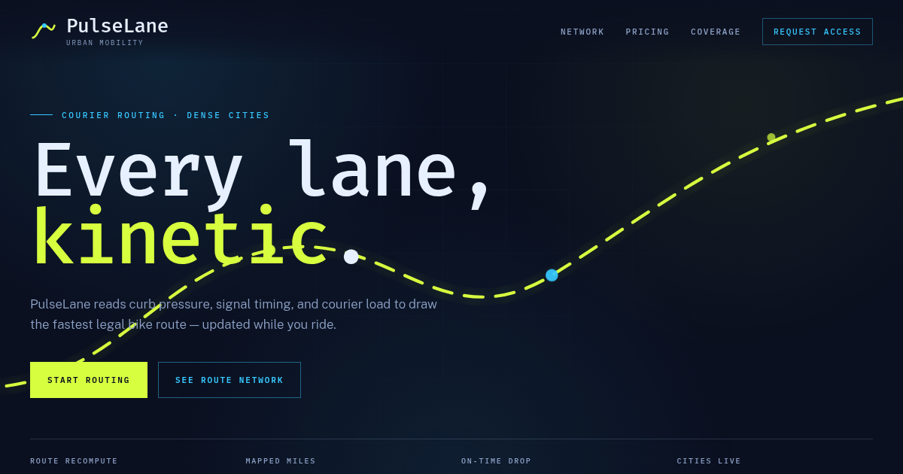 | `qwen3.8-flash-next`<br><sub>`chat`</sub> **(default)** | off | — | 6s | 9 | [open](prompts/landing-pages/pulselane-urban-mobility/runs/qwen3-8-flash-next/demo/index.html) |
| | _Excellent execution of the brief with a strong brand-first hero, perfect color palette, and a clean, atmospheric composition._ | | | | | |

---

### Radio Scan Archive

A landing page for 'ScanArchive', a digital radio signal archive, using CRT scanlines, tuning dials, and 'Signal Found' status indicators in a retro-utility style.

**Status:** polished · `radio` `archive` `signal` `warning` `monospace` `retro` `ui` · brief by `qwen3.8-flash-next`

[prompt](prompts/landing-pages/radio-scan-archive/prompt.md) · [extended](prompts/landing-pages/radio-scan-archive/prompt.full.md)

#### Model runs

| Preview | Model | Think | Ctx | Time | Score | Demo |
|:-------:|-------|:-----:|----:|-----:|------:|------|
|  | `legacy` | — | — | — | — | — |
|  | `qwen3.8-flash-next`<br><sub>`chat`</sub> **(default)** | off | — | 7s | 8 | [open](prompts/landing-pages/radio-scan-archive/runs/qwen3-8-flash-next/demo/index.html) |
| | _Strong execution of the retro-terminal aesthetic with excellent typography and color usage, though the layout feels slightly sparse in the first viewport._ | | | | | |

---

### Solaris Energy Dune

A landing page for Solaris Energy, a desert-focused solar power startup, using dune-like curves, bright solar-yellow accents, and data-driven visuals against a bone-white background.

**Status:** draft · `energy` `solar` `dune` `tech` `sustainable` · brief by `qwen3.8-flash-next`

[prompt](prompts/landing-pages/solaris-energy-dune/prompt.md) · [extended](prompts/landing-pages/solaris-energy-dune/prompt.full.md)

#### Model runs

| Preview | Model | Think | Ctx | Time | Score | Demo |
|:-------:|-------|:-----:|----:|-----:|------:|------|
| 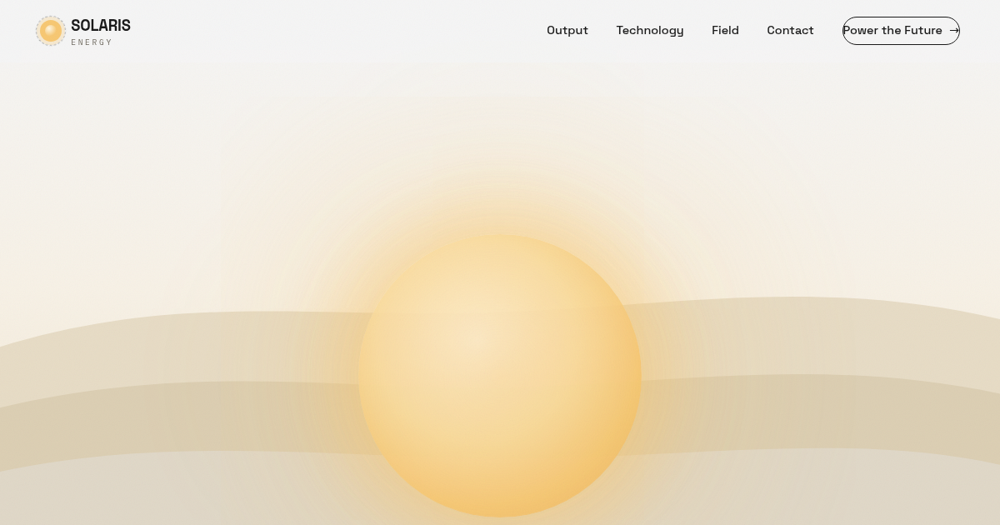 | `legacy` **(default)** | — | — | — | — | — |
| — | `qwen3.8-flash-next`<br><sub>`chat`</sub> | off | — | 329s | — | — |

---

### Sous-Vide Precision Lab

Landing page for 'Vapor & Steel', a sous-vide equipment brand. Features vacuum-sealed aesthetics, digital temperature overlays, and a sterile, high-tech kitchen atmosphere.

**Status:** polished · `culinary` `science` `sous-vide` `lab-glass` `precision` `chef-tools` `cyan` · brief by `qwen3.8-flash-next`

[prompt](prompts/landing-pages/sous-vide-precision-lab/prompt.md) · [extended](prompts/landing-pages/sous-vide-precision-lab/prompt.full.md)

#### Model runs

| Preview | Model | Think | Ctx | Time | Score | Demo |
|:-------:|-------|:-----:|----:|-----:|------:|------|
| 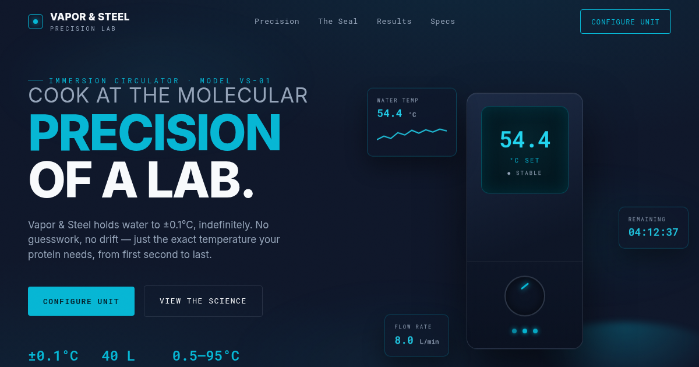 | `legacy` | — | — | — | — | — |
|  | `qwen3.8-flash-next`<br><sub>`chat`</sub> **(default)** | off | — | 7s | 8 | [open](prompts/landing-pages/sous-vide-precision-lab/runs/qwen3-8-flash-next/demo/index.html) |
| | _Strong execution of the 'lab' aesthetic with excellent typography hierarchy and atmospheric UI overlays._ | | | | | |

---

### Steam Circuit Kitchen

Landing page for 'Circuit & Steam', a modern steamboat restaurant. Merges traditional steam imagery with digital circuit board motifs, creating a 'network of heat' aesthetic.

**Status:** polished · `steam` `steamboat` `circuit` `digital` `hot` `minimal` `red` · brief by `qwen3.8-flash-next`

[prompt](prompts/landing-pages/steam-circuit-kitchen/prompt.md) · [extended](prompts/landing-pages/steam-circuit-kitchen/prompt.full.md)

#### Model runs

| Preview | Model | Think | Ctx | Time | Score | Demo |
|:-------:|-------|:-----:|----:|-----:|------:|------|
|  | `legacy` | — | — | — | — | — |
|  | `qwen3.8-flash-next`<br><sub>`chat`</sub> **(default)** | off | — | 5s | 9 | [open](prompts/landing-pages/steam-circuit-kitchen/runs/qwen3-8-flash-next/demo/index.html) |
| | _Excellent execution of the 'Steam Circuit' concept with a strong visual hierarchy, perfect color palette adherence, and a cohesive cyberpunk aesthetic._ | | | | | |

---

### Structural Load Report

A landing page for 'LoadSafe', a structural monitoring service, using blueprint grids, load-bearing warnings, and 'Approved' stamp aesthetics in a technical utility style.

**Status:** polished · `engineering` `warning` `infrastructure` `monospace` `stamps` `data` `utility` · brief by `qwen3.8-flash-next`

[prompt](prompts/landing-pages/structural-load-report/prompt.md) · [extended](prompts/landing-pages/structural-load-report/prompt.full.md)

#### Model runs

| Preview | Model | Think | Ctx | Time | Score | Demo |
|:-------:|-------|:-----:|----:|-----:|------:|------|
|  | `legacy` | — | — | — | — | — |
|  | `qwen3.8-flash-next`<br><sub>`chat`</sub> **(default)** | off | — | 6s | 9 | [open](prompts/landing-pages/structural-load-report/runs/qwen3-8-flash-next/demo/index.html) |
| | _Excellent execution of the 'engineering report' aesthetic with perfect adherence to the brief's visual and layout requirements._ | | | | | |

---

### Terra Forma Adobe

A landing page for Terra Forma, an adobe-brick architectural studio, using raw material textures, warm earth tones, and stark, geometric layouts inspired by desert vernacular.

**Status:** polished · `architecture` `adobe` `sustainable` `earthy` `minimal` · brief by `qwen3.8-flash-next`

[prompt](prompts/landing-pages/terra-forma-adobe/prompt.md) · [extended](prompts/landing-pages/terra-forma-adobe/prompt.full.md)

#### Model runs

| Preview | Model | Think | Ctx | Time | Score | Demo |
|:-------:|-------|:-----:|----:|-----:|------:|------|
| 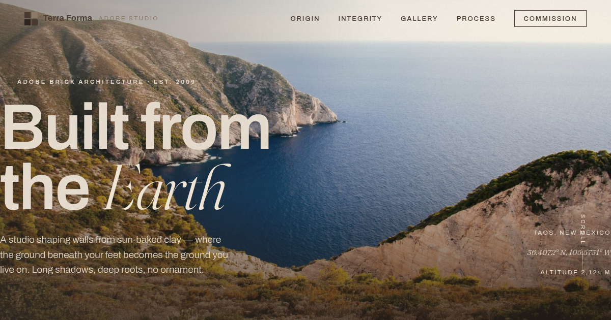 | `legacy` | — | — | — | — | — |
|  | `qwen3.8-flash-next`<br><sub>`chat`</sub> **(default)** | off | — | 6s | 9 | [open](prompts/landing-pages/terra-forma-adobe/runs/qwen3-8-flash-next/demo/index.html) |
| | _A visually stunning landing page that perfectly captures the 'Terra Forma' brand identity through its use of raw earth tones, expressive typography, and a cohesive atmospheric composition._ | | | | | |

---

### Tidal Studio Hero

Full-bleed coastal agency hero: brand-first, tide-line motion, no cards — only type, CTA, and water as the visual plane.

**Status:** polished · `agency` `hero` `ocean` `editorial` `motion`

[prompt](prompts/landing-pages/tidal-studio-hero/prompt.md) · [extended](prompts/landing-pages/tidal-studio-hero/prompt.full.md)

#### Model runs

| Preview | Model | Think | Ctx | Time | Score | Demo |
|:-------:|-------|:-----:|----:|-----:|------:|------|
|  | `legacy` **(default)** | — | — | — | — | [open](prompts/landing-pages/tidal-studio-hero/runs/legacy/demo/index.html) |
|  | `qwen3.8-flash-next`<br><sub>`chat`</sub> | off | — | 6s | 8 | [open](prompts/landing-pages/tidal-studio-hero/runs/qwen3-8-flash-next/demo/index.html) |
| | _A refined, atmospheric hero that nails the 'quiet luxury' mood with strong typography and a clean composition._ | | | | | |

---

### Vault Archive Stamp

A digital archive landing page featuring rubber-stamp aesthetics, paper-textured backgrounds, and stamped verification badges.

**Status:** polished · `archive` `document` `stamp` `bureaucracy` `retro-modern` · brief by `qwen3.8-flash-next`

[prompt](prompts/landing-pages/vault-archive-stamp/prompt.md) · [extended](prompts/landing-pages/vault-archive-stamp/prompt.full.md)

#### Model runs

| Preview | Model | Think | Ctx | Time | Score | Demo |
|:-------:|-------|:-----:|----:|-----:|------:|------|
|  | `legacy` | — | — | — | — | — |
| 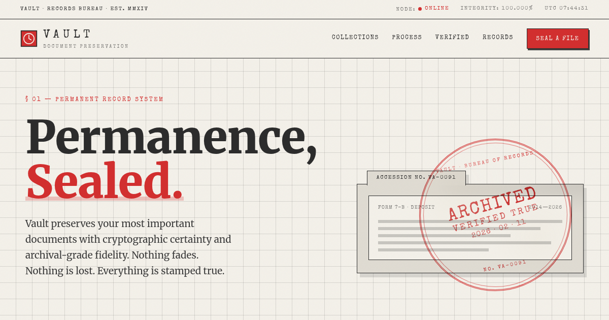 | `qwen3.8-flash-next`<br><sub>`chat`</sub> **(default)** | off | — | 5s | 9 | [open](prompts/landing-pages/vault-archive-stamp/runs/qwen3-8-flash-next/demo/index.html) |
| | _Exceptional execution of the 'bureaucratic retro-modern' brief with perfect adherence to visual rules, typography, and thematic elements._ | | | | | |

---

### Velour Cinema Poster

A movie release landing page for 'Velour', a noir film. The hero is a dynamic poster where title text interacts with light beams and shadows.

**Status:** polished · `cinema` `film` `poster` `noir` `kinetic-type` `landing` · brief by `qwen3.8-flash-next`

[prompt](prompts/landing-pages/velour-cinema-poster/prompt.md) · [extended](prompts/landing-pages/velour-cinema-poster/prompt.full.md)

#### Model runs

| Preview | Model | Think | Ctx | Time | Score | Demo |
|:-------:|-------|:-----:|----:|-----:|------:|------|
|  | `legacy` | — | — | — | — | — |
|  | `qwen3.8-flash-next`<br><sub>`chat`</sub> **(default)** | off | — | 8s | 9 | [open](prompts/landing-pages/velour-cinema-poster/runs/qwen3-8-flash-next/demo/index.html) |
| | _Excellent execution of the film noir aesthetic with strong typography and atmospheric lighting._ | | | | | |

---

## Animations

### Axiom Foundry Logo Morph

Brand motion for Axiom Foundry morphing a circular monogram into a wordmark with crisp SVG interpolation and metallic light sweep.

**Status:** draft · `logo-morph` `svg-animation` `brand-motion` `path-animation` `identity`

[prompt](prompts/animations/axiom-foundry-logo-morph/prompt.md) · [extended](prompts/animations/axiom-foundry-logo-morph/prompt.full.md)

#### Model runs

| Preview | Model | Think | Ctx | Time | Score | Demo |
|:-------:|-------|:-----:|----:|-----:|------:|------|
|  | `legacy` | — | — | — | — | — |
| 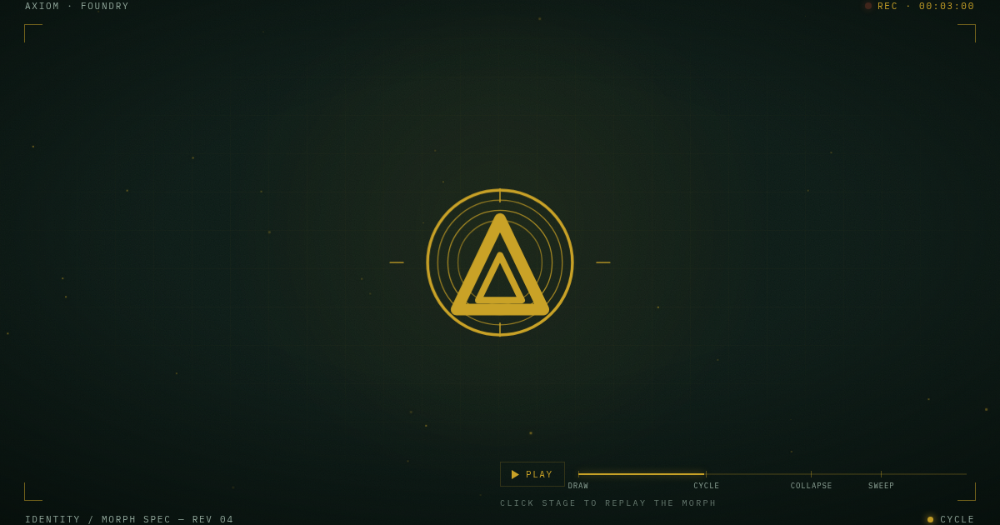 | `qwen3.8-flash-next`<br><sub>`chat`</sub> **(default)** | off | — | 6s | 8 | [open](prompts/animations/axiom-foundry-logo-morph/runs/qwen3-8-flash-next/demo/index.html) |
| | _Strong brand-motion composition with correct palette, expressive monogram, and a clean timeline UI that reads as a single intentional frame._ | | | | | |

---

### Bone Dust Spiral

Microscopic bone-white dust particles caught in a thermal updraft, spiraling upward in a dense, tactile column against a blurred dune background.

**Status:** draft · `dust` `particles` `wind` `arid` `micro-detail` `physics` `desert` · brief by `qwen3.8-flash-next`

[prompt](prompts/animations/bone-dust-spiral/prompt.md) · [extended](prompts/animations/bone-dust-spiral/prompt.full.md)

#### Model runs

| Preview | Model | Think | Ctx | Time | Score | Demo |
|:-------:|-------|:-----:|----:|-----:|------:|------|
| — | `qwen3.8-flash-next`<br><sub>`chat`</sub> **(default)** | off | — | 149s | — | [open](prompts/animations/bone-dust-spiral/runs/qwen3-8-flash-next/demo/index.html) |

---

### Fibrous Paper Tear

A heavy, textured paper layer tears open to reveal a hidden layer, emphasizing the fibrous, tactile nature of the tear edge.

**Status:** polished · `paper` `tear` `fiber` `stop-motion` `texture` `organic` `reveal` · brief by `qwen3.8-flash-next`

[prompt](prompts/animations/fibrous-paper-tear/prompt.md) · [extended](prompts/animations/fibrous-paper-tear/prompt.full.md)

#### Model runs

| Preview | Model | Think | Ctx | Time | Score | Demo |
|:-------:|-------|:-----:|----:|-----:|------:|------|
| 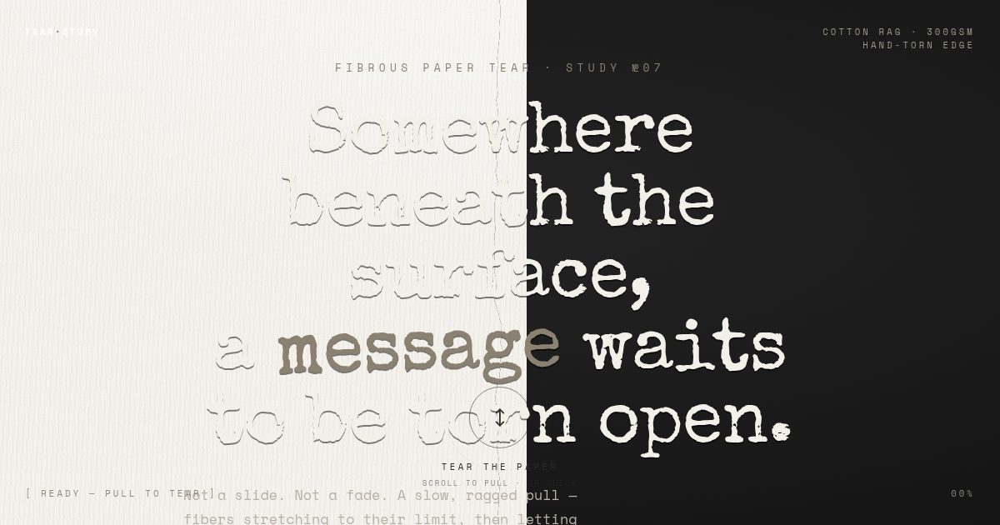 | `legacy` | — | — | — | — | — |
|  | `qwen3.8-flash-next`<br><sub>`chat`</sub> **(default)** | off | — | 7s | 9 | [open](prompts/animations/fibrous-paper-tear/runs/qwen3-8-flash-next/demo/index.html) |
| | _Excellent execution of the 'Fibrous Paper Tear' concept, with a convincing static representation of the tear line, paper texture, and depth._ | | | | | |

---

### Glazed Porcelain Crackle

Macro animation of white porcelain cooling, revealing intricate crackle glaze patterns with a shifting subsurface light reflection.

**Status:** draft · `porcelain` `crackle` `glaze` `texture-animation` `ceramic` `macro` `haptic` · brief by `qwen3.8-flash-next`

[prompt](prompts/animations/glazed-porcelain-crackle/prompt.md) · [extended](prompts/animations/glazed-porcelain-crackle/prompt.full.md)

#### Model runs

| Preview | Model | Think | Ctx | Time | Score | Demo |
|:-------:|-------|:-----:|----:|-----:|------:|------|
| 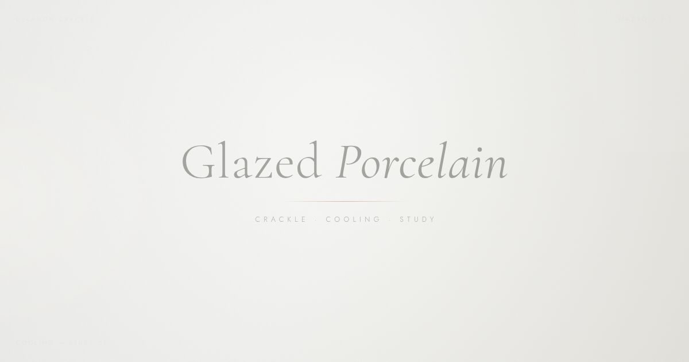 | `legacy` **(default)** | — | — | — | — | — |
| — | `qwen3.8-flash-next`<br><sub>`chat`</sub> | off | — | 96s | — | — |

---

### Halftone Moiré Scan

Overlapping CMYK halftone dot grids rotate slowly, creating hypnotic moiré interference patterns that resolve into a clear image or text.

**Status:** polished · `halftone` `moir-pattern` `rotational` `optical-art` `print-process` `cyan-magenta-yellow` `raster` · brief by `qwen3.8-flash-next`

[prompt](prompts/animations/halftone-moir-scan/prompt.md) · [extended](prompts/animations/halftone-moir-scan/prompt.full.md)

#### Model runs

| Preview | Model | Think | Ctx | Time | Score | Demo |
|:-------:|-------|:-----:|----:|-----:|------:|------|
|  | `legacy` | — | — | — | — | — |
|  | `qwen3.8-flash-next`<br><sub>`chat`</sub> **(default)** | off | — | 9s | 8 | [open](prompts/animations/halftone-moir-scan/runs/qwen3-8-flash-next/demo/index.html) |
| | _Strong execution of the brief with excellent typographic hierarchy and accurate color blending, though the background pattern is static rather than showing the requested circular/rotational moiré interference._ | | | | | |

---

### Hammered Copper Pulse

A sheet of hammered copper reacts to invisible forces, rippling with liquid-metal physics and catching warm, industrial light.

**Status:** polished · `copper` `metal` `hammered` `liquid-metal` `physics` `tactile` `industrial` · brief by `qwen3.8-flash-next`

[prompt](prompts/animations/hammered-copper-pulse/prompt.md) · [extended](prompts/animations/hammered-copper-pulse/prompt.full.md)

#### Model runs

| Preview | Model | Think | Ctx | Time | Score | Demo |
|:-------:|-------|:-----:|----:|-----:|------:|------|
| 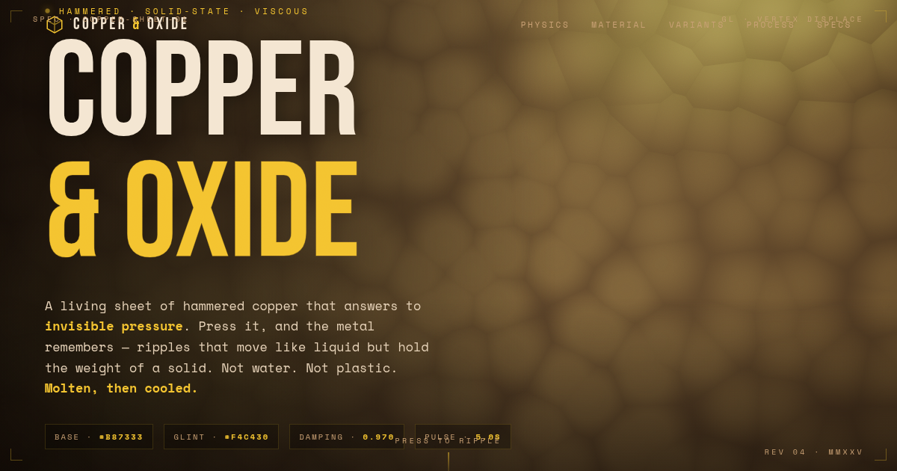 | `legacy` | — | — | — | — | — |
|  | `qwen3.8-flash-next`<br><sub>`chat`</sub> **(default)** | off | — | 6s | 8 | [open](prompts/animations/hammered-copper-pulse/runs/qwen3-8-flash-next/demo/index.html) |
| | _Strong industrial aesthetic with excellent typography and atmospheric background, though the copper texture appears somewhat soft/blurry rather than sharp._ | | | | | |

---

### Hammered Tin Hull

Close-up of soft tin sheet being hammered into a curved hull, showing progressive dents, stretching, and dull metallic sheen.

**Status:** polished · `tin` `metal-forming` `hammering` `soft-metal` `dents` `industrial-craft` `reflective` · brief by `qwen3.8-flash-next`

[prompt](prompts/animations/hammered-tin-hull/prompt.md) · [extended](prompts/animations/hammered-tin-hull/prompt.full.md)

#### Model runs

| Preview | Model | Think | Ctx | Time | Score | Demo |
|:-------:|-------|:-----:|----:|-----:|------:|------|
|  | `legacy` | — | — | — | — | — |
|  | `qwen3.8-flash-next`<br><sub>`chat`</sub> **(default)** | off | — | 8s | 9 | [open](prompts/animations/hammered-tin-hull/runs/qwen3-8-flash-next/demo/index.html) |
| | _Excellent execution of the 'cold working' concept with a realistic, dull silver material and a clear visual representation of the 'mosaic' facets._ | | | | | |

---

### Ink Brush Lifting

The precise moment an ink brush lifts from paper, showing the ink's viscosity, the thread-like strand breaking, and the wet texture of the stroke.

**Status:** polished · `calligraphy` `ink` `paper` `lifting` `viscosity` `traditional-art` `negative-space` · brief by `qwen3.8-flash-next`

[prompt](prompts/animations/ink-brush-lifting/prompt.md) · [extended](prompts/animations/ink-brush-lifting/prompt.full.md)

#### Model runs

| Preview | Model | Think | Ctx | Time | Score | Demo |
|:-------:|-------|:-----:|----:|-----:|------:|------|
| 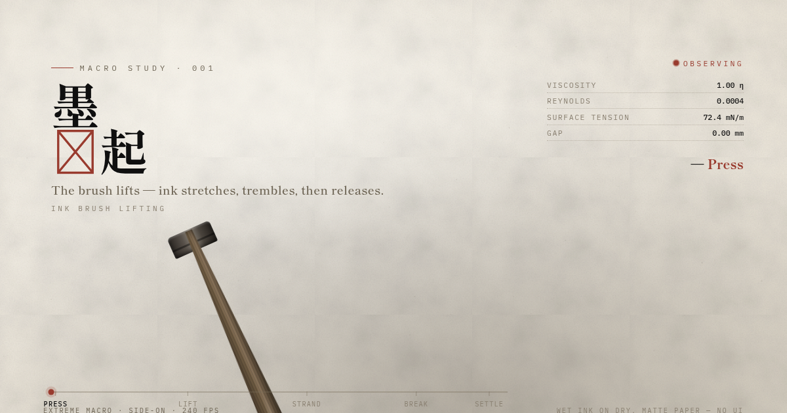 | `legacy` | — | — | — | — | — |
| 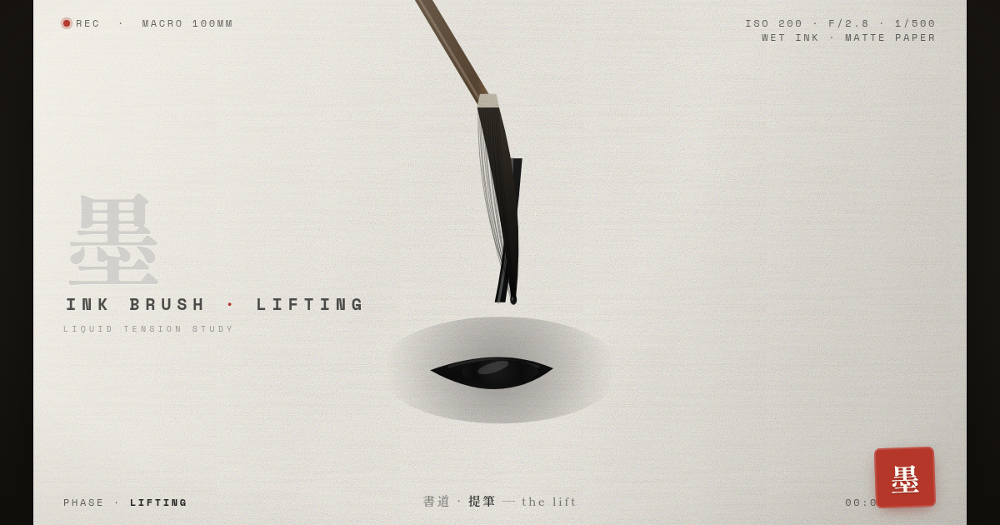 | `qwen3.8-flash-next`<br><sub>`chat`</sub> **(default)** | off | — | 9s | 6 | [open](prompts/animations/ink-brush-lifting/runs/qwen3-8-flash-next/demo/index.html) |
| | _A clean, minimalist composition that captures the mood well but lacks the requested photorealistic macro detail and material texture._ | | | | | |

---

### Letterpress Emboss Deform

Simulating the physical compression of paper under a heavy letterpress block. Text presses into the substrate, creating dynamic shadows and highlights.

**Status:** polished · `letterpress` `deboss` `emboss` `paper-compression` `tactile` `3d-transform` `shadow-play` · brief by `qwen3.8-flash-next`

[prompt](prompts/animations/letterpress-emboss-deform/prompt.md) · [extended](prompts/animations/letterpress-emboss-deform/prompt.full.md)

#### Model runs

| Preview | Model | Think | Ctx | Time | Score | Demo |
|:-------:|-------|:-----:|----:|-----:|------:|------|
|  | `legacy` | — | — | — | — | — |
| 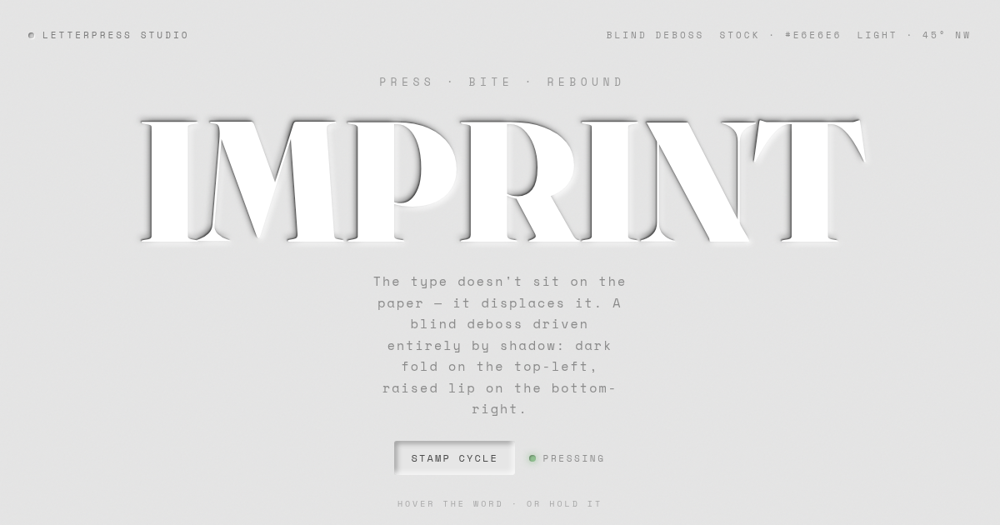 | `qwen3.8-flash-next`<br><sub>`chat`</sub> **(default)** | off | — | 5s | 9 | [open](prompts/animations/letterpress-emboss-deform/runs/qwen3-8-flash-next/demo/index.html) |
| | _Excellent execution of the letterpress effect with realistic shadow logic and a clean, tactile composition._ | | | | | |

---

### Linen Press Tension

A macro animation of high-thread-count linen being pressed by a clean, white ceramic plate. The fabric compresses, creating soft shadows and revealing the weave.

**Status:** polished · `fabric` `linen` `physics` `texture` `compression` `craft` `soft-body` · brief by `qwen3.8-flash-next`

[prompt](prompts/animations/linen-press-tension/prompt.md) · [extended](prompts/animations/linen-press-tension/prompt.full.md)

#### Model runs

| Preview | Model | Think | Ctx | Time | Score | Demo |
|:-------:|-------|:-----:|----:|-----:|------:|------|
|  | `legacy` | — | — | — | — | — |
|  | `qwen3.8-flash-next`<br><sub>`chat`</sub> **(default)** | off | — | 7s | 8 | [open](prompts/animations/linen-press-tension/runs/qwen3-8-flash-next/demo/index.html) |
| | _Excellent execution of the 'craft' aesthetic with a sophisticated, high-contrast typographic layout and a clean, well-rendered 3D plate._ | | | | | |

---

### Magnetic Cursor Orbit

Nav labels gently orbit/attract toward the cursor with spring damping — tactile, premium, never gimmicky.

**Status:** draft · `cursor` `magnetic` `microinteraction` `nav` `js`

[prompt](prompts/animations/magnetic-cursor-orbit/prompt.md) · [extended](prompts/animations/magnetic-cursor-orbit/prompt.full.md)

#### Model runs

| Preview | Model | Think | Ctx | Time | Score | Demo |
|:-------:|-------|:-----:|----:|-----:|------:|------|
|  | `legacy` | — | — | — | — | — |
|  | `qwen3.8-flash-next`<br><sub>`chat`</sub> **(default)** | off | — | 7s | 6 | [open](prompts/animations/magnetic-cursor-orbit/runs/qwen3-8-flash-next/demo/index.html) |
| | _Clean, premium dark editorial layout with a clear nav and spring-constant documentation, but the background is flat and the core magnetic/orbit interaction is invisible in a static shot._ | | | | | |

---

### Magnetic Nav Rail

Cursor-bound navigation rail for Vector Harbor where items lean, scale, and magnetically dock under the pointer with elastic easing.

**Status:** draft · `magnetic-nav` `cursor-interaction` `navigation` `ui-motion` `web-animation`

[prompt](prompts/animations/magnetic-nav-rail/prompt.md) · [extended](prompts/animations/magnetic-nav-rail/prompt.full.md)

#### Model runs

| Preview | Model | Think | Ctx | Time | Score | Demo |
|:-------:|-------|:-----:|----:|-----:|------:|------|
| 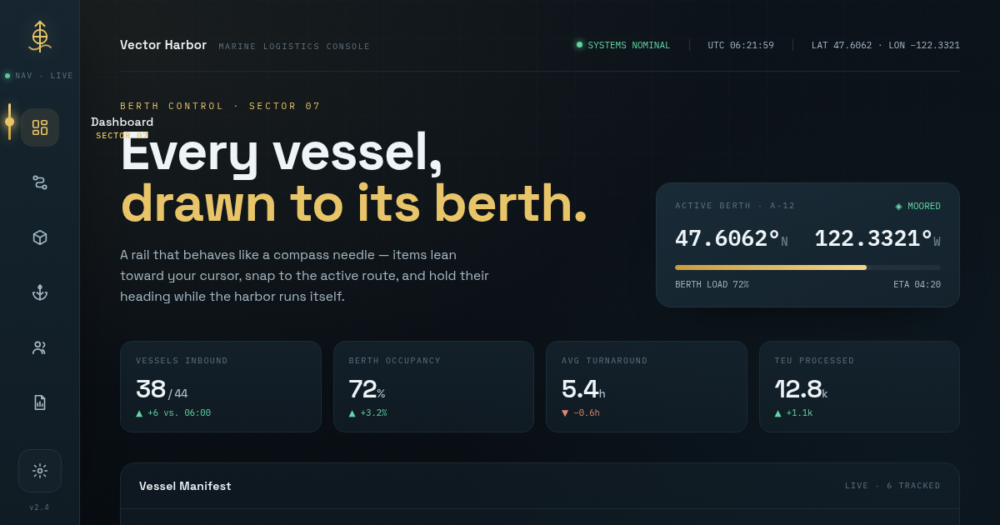 | `legacy` | — | — | — | — | — |
| 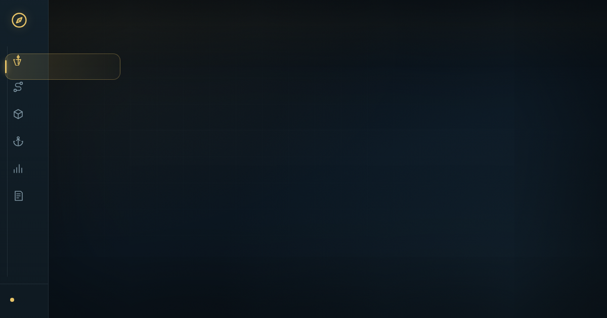 | `qwen3.8-flash-next`<br><sub>`chat`</sub> **(default)** | off | — | 9s | 6 | [open](prompts/animations/magnetic-nav-rail/runs/qwen3-8-flash-next/demo/index.html) |
| | _Clean, on-brief nav rail with correct palette and icons, but the brand name 'Vector Harbor' is absent and the page is mostly empty._ | | | | | |

---

### Molten Glass Pour

High-speed slow-motion visualization of molten glass pouring, emphasizing extreme viscosity, light refraction, and thermal glow.

**Status:** polished · `glass` `viscosity` `refraction` `fluid-sim` `transparency` `tactile` `slow-motion` · brief by `qwen3.8-flash-next`

[prompt](prompts/animations/molten-glass-pour/prompt.md) · [extended](prompts/animations/molten-glass-pour/prompt.full.md)

#### Model runs

| Preview | Model | Think | Ctx | Time | Score | Demo |
|:-------:|-------|:-----:|----:|-----:|------:|------|
| 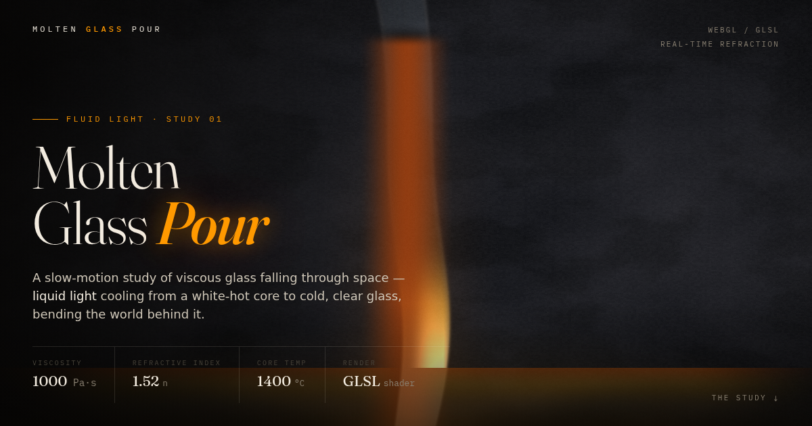 | `legacy` | — | — | — | — | — |
|  | `qwen3.8-flash-next`<br><sub>`chat`</sub> **(default)** | off | — | 7s | 9 | [open](prompts/animations/molten-glass-pour/runs/qwen3-8-flash-next/demo/index.html) |
| | _Excellent execution of the brief with a visually striking, realistic molten glass render and sophisticated typography._ | | | | | |

---

### Obsidian Loom Mask Reveal

Scroll-driven mask reveal for Obsidian Loom where woven headline strips unfold from dark ink bands into a high-contrast product story.

**Status:** draft · `mask-reveal` `scroll-reveal` `editorial` `typography` `web-animation`

[prompt](prompts/animations/obsidian-loom-mask-reveal/prompt.md) · [extended](prompts/animations/obsidian-loom-mask-reveal/prompt.full.md)

#### Model runs

| Preview | Model | Think | Ctx | Time | Score | Demo |
|:-------:|-------|:-----:|----:|-----:|------:|------|
| — | `qwen3.8-flash-next` **(default)** | — | — | — | — | — |

---

### Obsidian Sheer Slice

A block of obsidian fractures along conchoidal lines, revealing razor-sharp edges with high-contrast specular highlights and internal sheen.

**Status:** polished · `volcanic-glass` `fracture` `sharp-edge` `black-sheen` `conchoidal` `macro` `high-contrast` · brief by `qwen3.8-flash-next`

[prompt](prompts/animations/obsidian-sheer-slice/prompt.md) · [extended](prompts/animations/obsidian-sheer-slice/prompt.full.md)

#### Model runs

| Preview | Model | Think | Ctx | Time | Score | Demo |
|:-------:|-------|:-----:|----:|-----:|------:|------|
|  | `legacy` | — | — | — | — | — |
| 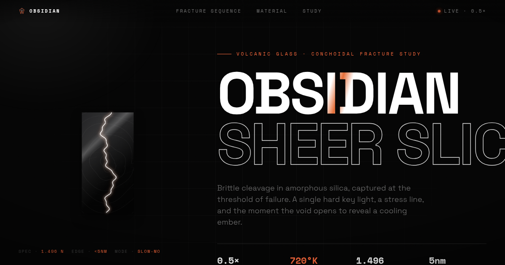 | `qwen3.8-flash-next`<br><sub>`chat`</sub> **(default)** | off | — | 7s | 6 | [open](prompts/animations/obsidian-sheer-slice/runs/qwen3-8-flash-next/demo/index.html) |
| | _Strong typographic composition and brand presence, but the visual focus is a generic lightning graphic rather than the requested macro obsidian fracture._ | | | | | |

---

### Oxidized Brass Tarnish

A time-lapse animation of polished brass tarnishing, where dark verdigris blooms across the surface in organic, liquid-like patterns.

**Status:** polished · `brass` `oxidation` `time-lapse` `material-aging` `surface-tension` `tactile` `patina` · brief by `qwen3.8-flash-next`

[prompt](prompts/animations/oxidized-brass-tarnish/prompt.md) · [extended](prompts/animations/oxidized-brass-tarnish/prompt.full.md)

#### Model runs

| Preview | Model | Think | Ctx | Time | Score | Demo |
|:-------:|-------|:-----:|----:|-----:|------:|------|
| 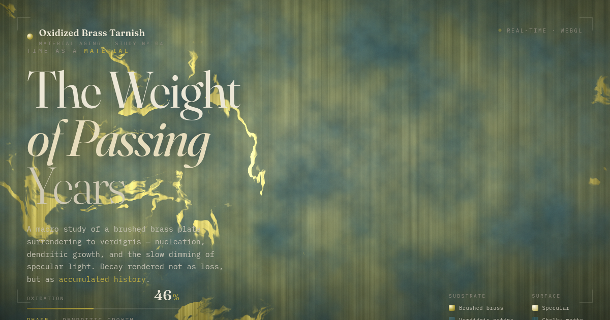 | `legacy` | — | — | — | — | — |
|  | `qwen3.8-flash-next`<br><sub>`chat`</sub> **(default)** | off | — | 7s | 8 | [open](prompts/animations/oxidized-brass-tarnish/runs/qwen3-8-flash-next/demo/index.html) |
| | _Excellent atmospheric execution of the brief with realistic verdigris textures, strong typography, and a cohesive material-aging aesthetic._ | | | | | |

---

### Parallax Depth Layers

Three-plane scroll parallax with depth fog — landscape storytelling that stays smooth and reduced-motion safe.

**Status:** draft · `parallax` `scroll` `depth` `landscape` `performance`

[prompt](prompts/animations/parallax-depth-layers/prompt.md) · [extended](prompts/animations/parallax-depth-layers/prompt.full.md)

#### Model runs

| Preview | Model | Think | Ctx | Time | Score | Demo |
|:-------:|-------|:-----:|----:|-----:|------:|------|
|  | `legacy` | — | — | — | — | — |
|  | `qwen3.8-flash-next`<br><sub>`chat`</sub> **(default)** | off | — | 5s | 8 | [open](prompts/animations/parallax-depth-layers/runs/qwen3-8-flash-next/demo/index.html) |
| | _Excellent atmospheric execution with clear depth layering and strong typography, though the foreground silhouette could be more distinct._ | | | | | |

---

### Riso Registration Shift

A continuous loop of two-color screen print shifting in and out of perfect registration, mimicking the tactile imperfection of Riso duplication.

**Status:** polished · `risograph` `print-misalignment` `duotone` `screen-print` `glitch-art` `editorial-print` `loop` · brief by `qwen3.8-flash-next`

[prompt](prompts/animations/riso-registration-shift/prompt.md) · [extended](prompts/animations/riso-registration-shift/prompt.full.md)

#### Model runs

| Preview | Model | Think | Ctx | Time | Score | Demo |
|:-------:|-------|:-----:|----:|-----:|------:|------|
|  | `legacy` | — | — | — | — | — |
|  | `qwen3.8-flash-next`<br><sub>`chat`</sub> **(default)** | off | — | 7s | 9 | [open](prompts/animations/riso-registration-shift/runs/qwen3-8-flash-next/demo/index.html) |
| | _Excellent execution of the Riso misregistration concept, perfectly capturing the mechanical aesthetic, color blending, and layout requirements._ | | | | | |

---

### Saffron Watercolor Bloom

A macro animation of saffron threads dissolving in clear water, creating intricate red and gold pigment blooms against a sterile white backdrop.

**Status:** polished · `fluid-sim` `spice` `color-theory` `macro` `culinary-art` `diffusion` `high-end` · brief by `qwen3.8-flash-next`

[prompt](prompts/animations/saffron-watercolor-bloom/prompt.md) · [extended](prompts/animations/saffron-watercolor-bloom/prompt.full.md)

#### Model runs

| Preview | Model | Think | Ctx | Time | Score | Demo |
|:-------:|-------|:-----:|----:|-----:|------:|------|
|  | `legacy` | — | — | — | — | — |
|  | `qwen3.8-flash-next`<br><sub>`chat`</sub> **(default)** | off | — | 8s | 8 | [open](prompts/animations/saffron-watercolor-bloom/runs/qwen3-8-flash-next/demo/index.html) |
| | _Excellent execution of the 'high-key studio' aesthetic with a sophisticated, editorial layout that perfectly balances typography and the fluid simulation._ | | | | | |

---

### Salt Pan Crystallization

A macro view of salt crystals rapidly forming from evaporating brine in a desert pan, creating sharp geometric spikes and white ridges.

**Status:** draft · `salt` `crystallization` `evaporation` `geometry` `white-desert` `loop` `arid` · brief by `qwen3.8-flash-next`

[prompt](prompts/animations/salt-pan-crystallization/prompt.md) · [extended](prompts/animations/salt-pan-crystallization/prompt.full.md)

_No shot preview yet._

_No model runs yet — `npm run ai:build` then `npm run shots`._

---

### Staggered Mask Reveal

Editorial headline reveal via line masks and stagger — cinematic entrance without cheap fade templates.

**Status:** draft · `typography` `mask` `scroll` `entrance` `editorial`

[prompt](prompts/animations/staggered-mask-reveal/prompt.md) · [extended](prompts/animations/staggered-mask-reveal/prompt.full.md)

#### Model runs

| Preview | Model | Think | Ctx | Time | Score | Demo |
|:-------:|-------|:-----:|----:|-----:|------:|------|
| 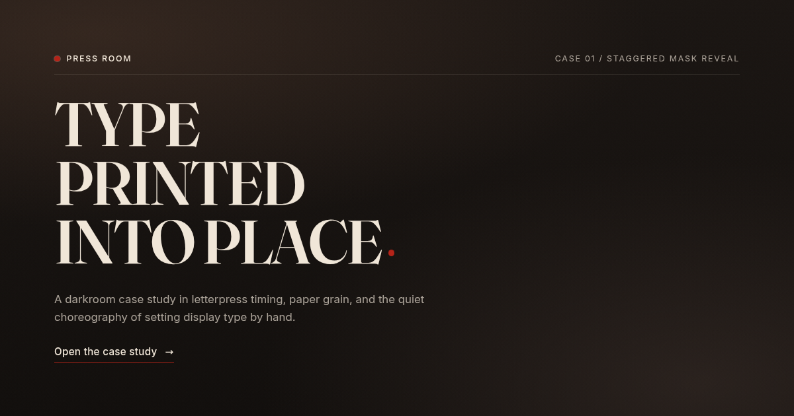 | `legacy` | — | — | — | — | — |
|  | `qwen3.8-flash-next`<br><sub>`chat`</sub> **(default)** | off | — | 6s | 8 | [open](prompts/animations/staggered-mask-reveal/runs/qwen3-8-flash-next/demo/index.html) |
| | _Strong editorial composition with a characterful display face, warm dark grade, and clean hierarchy that fits the darkroom/print-shop mood._ | | | | | |

---

### Stainless Brushed Light Sweep

A macro shot of a brushed stainless steel surface where a moving light source reveals the micro-texture and anisotropic reflections of the metal.

**Status:** polished · `metal` `brushed-steel` `lighting` `surface` `minimalist` `industrial` `specular` · brief by `qwen3.8-flash-next`

[prompt](prompts/animations/stainless-brushed-light-sweep/prompt.md) · [extended](prompts/animations/stainless-brushed-light-sweep/prompt.full.md)

#### Model runs

| Preview | Model | Think | Ctx | Time | Score | Demo |
|:-------:|-------|:-----:|----:|-----:|------:|------|
|  | `legacy` | — | — | — | — | — |
| 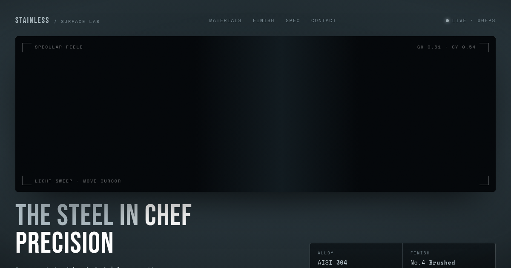 | `qwen3.8-flash-next`<br><sub>`chat`</sub> **(default)** | off | — | 7s | 6 | [open](prompts/animations/stainless-brushed-light-sweep/runs/qwen3-8-flash-next/demo/index.html) |
| | _The layout is clean and industrial, but the hero visual is too dark to demonstrate the requested brushed metal texture or light sweep effect._ | | | | | |

---

### Sun-Cracked Mud Heal

A reverse-animation of sun-baked mud cracking, where the fissures knit themselves back together, smoothing out into wet, pliable earth.

**Status:** draft · `mud` `cracks` `healing` `reverse` `earth` `texture` `arid` · brief by `qwen3.8-flash-next`

[prompt](prompts/animations/sun-cracked-mud-heal/prompt.md) · [extended](prompts/animations/sun-cracked-mud-heal/prompt.full.md)

_No shot preview yet._

_No model runs yet — `npm run ai:build` then `npm run shots`._

---

### Woven Reed Flex

A macro animation of woven reed strips bending under tension, showcasing the elasticity and interlocking tension of natural materials.

**Status:** polished · `wicker` `flexibility` `physics` `organic` `macro` `tactile` `structure` · brief by `qwen3.8-flash-next`

[prompt](prompts/animations/woven-reed-flex/prompt.md) · [extended](prompts/animations/woven-reed-flex/prompt.full.md)

#### Model runs

| Preview | Model | Think | Ctx | Time | Score | Demo |
|:-------:|-------|:-----:|----:|-----:|------:|------|
| 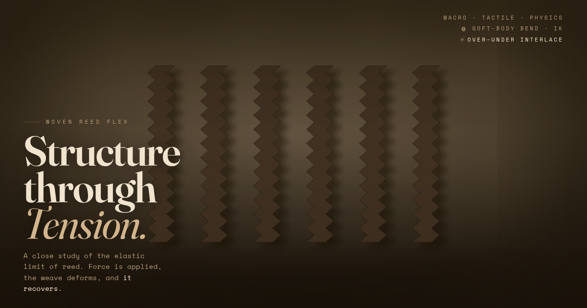 | `legacy` | — | — | — | — | — |
|  | `qwen3.8-flash-next`<br><sub>`chat`</sub> **(default)** | off | — | 8s | 6 | [open](prompts/animations/woven-reed-flex/runs/qwen3-8-flash-next/demo/index.html) |
| | _Strong typography and atmospheric background, but the 3D scene fails to render the actual 'woven' structure, appearing as disconnected floating pills._ | | | | | |

---

## Concepts

### Bioluminescent Spore Dispersion

A generative visual where bioluminescent spores drift upward in a dark void, reacting to mouse proximity with gentle repulsion and light scattering.

**Status:** polished · `bioluminescence` `spore` `particle-system` `nocturnal` `dispersion` `glow` `organic` `simulation` · brief by `qwen3.8-flash-next`

[prompt](prompts/concepts/bioluminescent-spore-dispersion/prompt.md) · [extended](prompts/concepts/bioluminescent-spore-dispersion/prompt.full.md)

#### Model runs

| Preview | Model | Think | Ctx | Time | Score | Demo |
|:-------:|-------|:-----:|----:|-----:|------:|------|
|  | `legacy` | — | — | — | — | — |
|  | `qwen3.8-flash-next`<br><sub>`chat`</sub> **(default)** | off | — | 7s | 8 | [open](prompts/concepts/bioluminescent-spore-dispersion/runs/qwen3-8-flash-next/demo/index.html) |
| | _A faithful, atmospheric execution of the brief with excellent color palette and particle variance, though the background lacks the requested 'foliage shadow' depth._ | | | | | |

---

### Carbon Fiber Weave Configurator

A product configurator where users change the layup of carbon fiber, with real-time texture shifts and directional light reflections indicating fiber orientation.

**Status:** polished · `carbon-fiber` `composite` `configurator` `tech` `tactile` `weave` `industrial` · brief by `qwen3.8-flash-next`

[prompt](prompts/concepts/carbon-fiber-weave-configurator/prompt.md) · [extended](prompts/concepts/carbon-fiber-weave-configurator/prompt.full.md)

#### Model runs

| Preview | Model | Think | Ctx | Time | Score | Demo |
|:-------:|-------|:-----:|----:|-----:|------:|------|
| 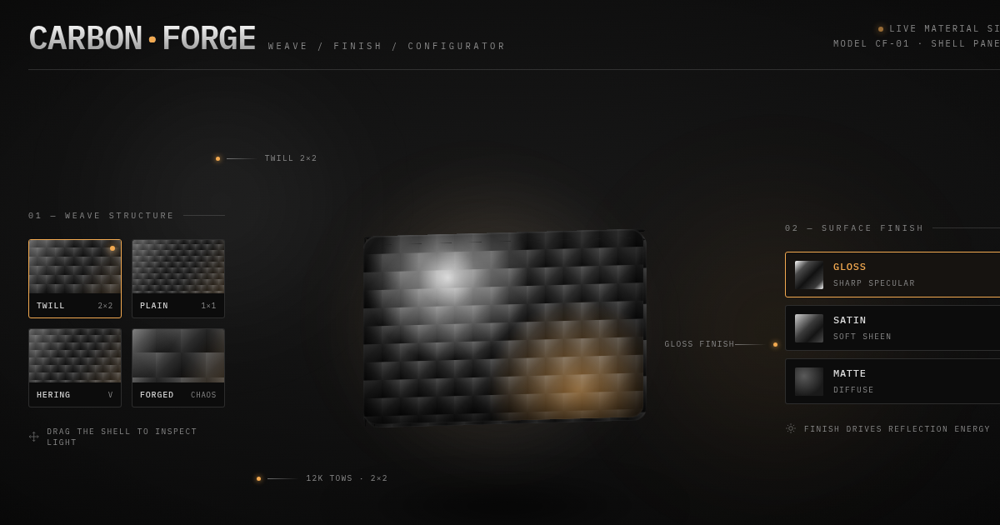 | `legacy` | — | — | — | — | — |
|  | `qwen3.8-flash-next`<br><sub>`chat`</sub> **(default)** | off | — | 7s | 9 | [open](prompts/concepts/carbon-fiber-weave-configurator/runs/qwen3-8-flash-next/demo/index.html) |
| | _Excellent execution of the brief with a strong central visual, accurate lighting simulation, and a clean, technical UI._ | | | | | |

---

### Dune Strata Geology Map

An interactive topographical visualization of desert strata, featuring long, sharp shadows and heat-haze distortion on a bone-white background.

**Status:** polished · `geology` `minimalist` `topography` `arid` `interactive-map` `data-visualization` `bone-white` `long-shadows` · brief by `qwen3.8-flash-next`

[prompt](prompts/concepts/dune-strata-geology-map/prompt.md) · [extended](prompts/concepts/dune-strata-geology-map/prompt.full.md)

#### Model runs

| Preview | Model | Think | Ctx | Time | Score | Demo |
|:-------:|-------|:-----:|----:|-----:|------:|------|
| 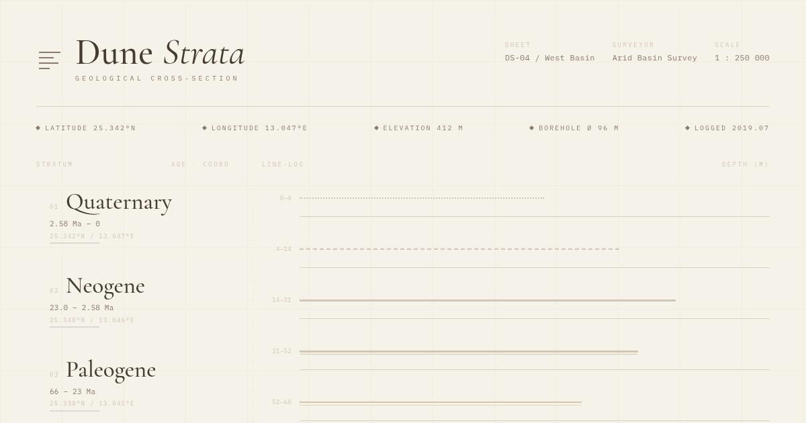 | `legacy` | — | — | — | — | — |
|  | `qwen3.8-flash-next`<br><sub>`chat`</sub> **(default)** | off | — | 6s | 9 | [open](prompts/concepts/dune-strata-geology-map/runs/qwen3-8-flash-next/demo/index.html) |
| | _Excellent execution of the 'data-as-art' brief, perfectly capturing the minimalist, arid, and technical aesthetic with high-fidelity typography and layout._ | | | | | |

---

### Editorial Brutalist System

Art-direction system: modular editorial brutalism — concrete grid, ink type, rules as structure, not decoration.

**Status:** draft · `system` `brutalist` `editorial` `type` `grid`

[prompt](prompts/concepts/editorial-brutalist-system/prompt.md) · [extended](prompts/concepts/editorial-brutalist-system/prompt.full.md)

#### Model runs

| Preview | Model | Think | Ctx | Time | Score | Demo |
|:-------:|-------|:-----:|----:|-----:|------:|------|
|  | `legacy` | — | — | — | — | — |
| 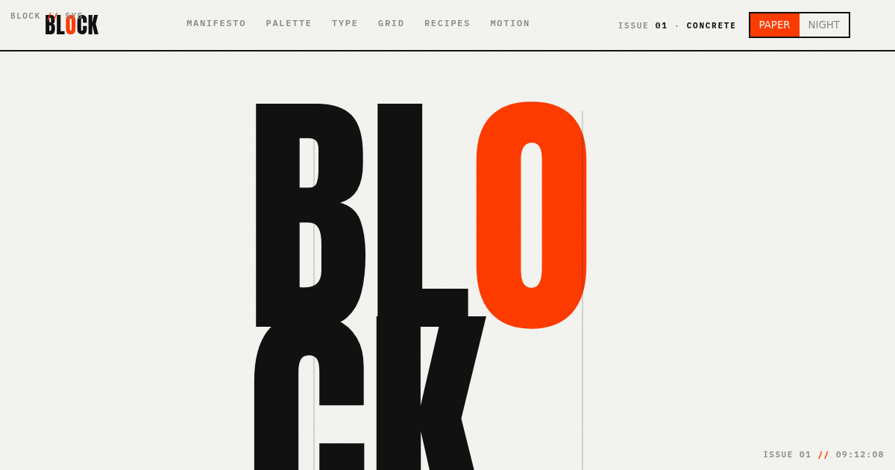 | `qwen3.8-flash-next`<br><sub>`chat`</sub> **(default)** | off | — | 12s | 8 | [open](prompts/concepts/editorial-brutalist-system/runs/qwen3-8-flash-next/demo/index.html) |
| | _Strong, confident brutalist-editorial hero with a monumental BLOCK wordmark and disciplined type, though the background is nearly flat._ | | | | | |

---

### Hazard Tape Peel Reveal

A UI layer covered in diagonal hazard tape that peels away to reveal safe, clean content underneath, emphasizing physical adhesive resistance and tearing physics.

**Status:** draft · `hazard-tape` `peel-motion` `construction` `sticky` `adhesive` `warning` `site-survey` `material-physics` · brief by `qwen3.8-flash-next`

[prompt](prompts/concepts/hazard-tape-peel-reveal/prompt.md) · [extended](prompts/concepts/hazard-tape-peel-reveal/prompt.full.md)

_No shot preview yet._

_No model runs yet — `npm run ai:build` then `npm run shots`._

---

### Kiln-Fired Glaze Sample

A color selection interface where hues are represented by physical ceramic glaze chips, with heat-warp transitions and kiln-lighting ambiance.

**Status:** polished · `ceramics` `glaze` `color-picker` `material` `tactile` `kiln` `sample` · brief by `qwen3.8-flash-next`

[prompt](prompts/concepts/kiln-fired-glaze-sample/prompt.md) · [extended](prompts/concepts/kiln-fired-glaze-sample/prompt.full.md)

#### Model runs

| Preview | Model | Think | Ctx | Time | Score | Demo |
|:-------:|-------|:-----:|----:|-----:|------:|------|
|  | `legacy` | — | — | — | — | — |
| 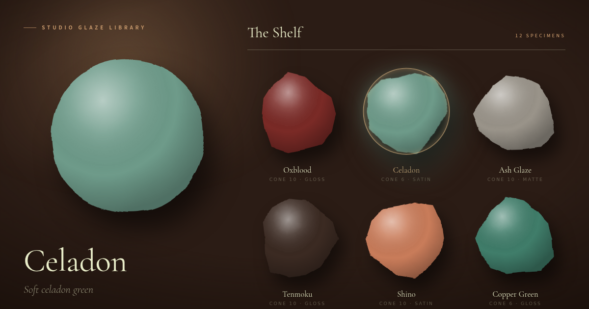 | `qwen3.8-flash-next`<br><sub>`chat`</sub> **(default)** | off | — | 8s | 8 | [open](prompts/concepts/kiln-fired-glaze-sample/runs/qwen3-8-flash-next/demo/index.html) |
| | _A highly atmospheric and tactile interface that perfectly captures the 'potter's shelf' metaphor through excellent lighting and 3D rendering._ | | | | | |

---

### Linen Fold Typography

Typography that behaves like folded linen. Text is printed on fabric that creases, folds, and drapes, creating soft shadows and depth.

**Status:** polished · `linen` `textile` `typography` `fold` `soft` `texture` `organic` · brief by `qwen3.8-flash-next`

[prompt](prompts/concepts/linen-fold-typography/prompt.md) · [extended](prompts/concepts/linen-fold-typography/prompt.full.md)

#### Model runs

| Preview | Model | Think | Ctx | Time | Score | Demo |
|:-------:|-------|:-----:|----:|-----:|------:|------|
| 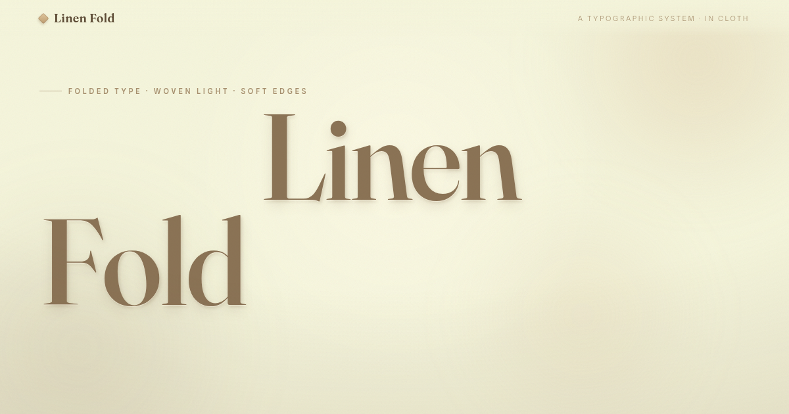 | `legacy` | — | — | — | — | — |
|  | `qwen3.8-flash-next`<br><sub>`chat`</sub> **(default)** | off | — | 9s | 6 | [open](prompts/concepts/linen-fold-typography/runs/qwen3-8-flash-next/demo/index.html) |
| | _A clean, atmospheric composition that captures the mood but fails to render the core 'folded fabric' metaphor, looking more like standard serif typography with a drop shadow._ | | | | | |

---

### Magnetic Morph Wordmark

A brand wordmark where letters act like magnetic poles. On hover, adjacent letters are pulled toward the cursor, distorting the geometry before snapping back into perfect alignment.

**Status:** polished · `logo-motion` `svg-morphing` `magnetic-interaction` `branding` `fluid` `interactive` `vector` `identity` · brief by `qwen3.8-flash-next`

[prompt](prompts/concepts/magnetic-morph-wordmark/prompt.md) · [extended](prompts/concepts/magnetic-morph-wordmark/prompt.full.md)

#### Model runs

| Preview | Model | Think | Ctx | Time | Score | Demo |
|:-------:|-------|:-----:|----:|-----:|------:|------|
|  | `legacy` | — | — | — | — | — |
|  | `qwen3.8-flash-next`<br><sub>`chat`</sub> **(default)** | off | — | 6s | 9 | [open](prompts/concepts/magnetic-morph-wordmark/runs/qwen3-8-flash-next/demo/index.html) |
| | _Excellent execution of the brief with a bold, high-contrast wordmark and clean technical UI elements._ | | | | | |

---

### Mirage Optical Illusion Kit

A UI component library where elements appear to dissolve or warp due to simulated heat haze and optical refraction on a sun-bleached canvas.

**Status:** polished · `optical-illusion` `minimalist` `interactive` `desert` `heat-haze` `ui-kit` `experimental` `perspective` · brief by `qwen3.8-flash-next`

[prompt](prompts/concepts/mirage-optical-illusion-kit/prompt.md) · [extended](prompts/concepts/mirage-optical-illusion-kit/prompt.full.md)

#### Model runs

| Preview | Model | Think | Ctx | Time | Score | Demo |
|:-------:|-------|:-----:|----:|-----:|------:|------|
|  | `legacy` | — | — | — | — | — |
|  | `qwen3.8-flash-next`<br><sub>`chat`</sub> **(default)** | off | — | 7s | 6 | [open](prompts/concepts/mirage-optical-illusion-kit/runs/qwen3-8-flash-next/demo/index.html) |
| | _Captures the minimalist aesthetic and typography well, but fails to show the actual UI components (Input, Button, Toggle) requested in the brief._ | | | | | |

---

### Night Blooming Time-Lapse

A seamless loop animation of a night-blooming flower (like a Moonflower) unfurling under a moonlit sky, with soft focus and slow, deliberate motion.

**Status:** polished · `time-lapse` `botanical` `night-blooming` `animation` `nocturnal` `unfurl` `moonlight` `organic` · brief by `qwen3.8-flash-next`

[prompt](prompts/concepts/night-blooming-time-lapse/prompt.md) · [extended](prompts/concepts/night-blooming-time-lapse/prompt.full.md)

#### Model runs

| Preview | Model | Think | Ctx | Time | Score | Demo |
|:-------:|-------|:-----:|----:|-----:|------:|------|
| 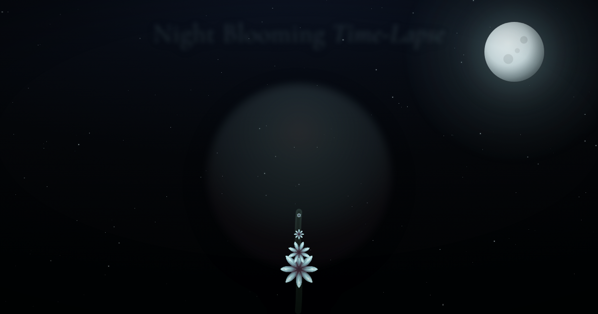 | `legacy` | — | — | — | — | — |
|  | `qwen3.8-flash-next`<br><sub>`chat`</sub> **(default)** | off | — | 9s | 6 | [open](prompts/concepts/night-blooming-time-lapse/runs/qwen3-8-flash-next/demo/index.html) |
| | _Captures the correct mood and color palette, but the flower subject looks like a generic 3D spiral or cookie rather than a realistic botanical bloom._ | | | | | |

---

### Nocturnal Garden Moodboard

Night-garden brand moodboard for Lumenflora: bioluminescent botanicals, velvet dark, restrained type specimens.

**Status:** draft · `moodboard` `garden` `nocturnal` `atmosphere` `brand`

[prompt](prompts/concepts/nocturnal-garden-moodboard/prompt.md) · [extended](prompts/concepts/nocturnal-garden-moodboard/prompt.full.md)

#### Model runs

| Preview | Model | Think | Ctx | Time | Score | Demo |
|:-------:|-------|:-----:|----:|-----:|------:|------|
|  | `legacy` | — | — | — | — | — |
|  | `qwen3.8-flash-next`<br><sub>`chat`</sub> **(default)** | off | — | 6s | 8 | [open](prompts/concepts/nocturnal-garden-moodboard/runs/qwen3-8-flash-next/demo/index.html) |
| | _Strong atmospheric moodboard hero with expressive serif type and bioluminescent glow that perfectly captures the 'nocturnal botanicals' brief._ | | | | | |

---

### Oxidized Coin Valuation

A data card where the 'value' is revealed by cleaning a tarnished coin. Scrubbing the patina reveals the underlying metal and a numerical value.

**Status:** polished · `coin` `oxidation` `data` `finance` `texture` `patina` `interaction` `haptic` · brief by `qwen3.8-flash-next`

[prompt](prompts/concepts/oxidized-coin-valuation/prompt.md) · [extended](prompts/concepts/oxidized-coin-valuation/prompt.full.md)

#### Model runs

| Preview | Model | Think | Ctx | Time | Score | Demo |
|:-------:|-------|:-----:|----:|-----:|------:|------|
|  | `legacy` | — | — | — | — | — |
| 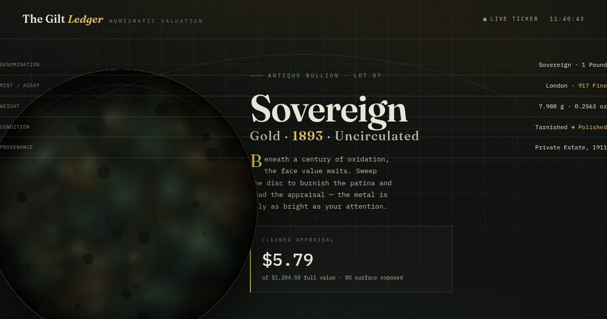 | `qwen3.8-flash-next`<br><sub>`chat`</sub> **(default)** | off | — | 8s | 8 | [open](prompts/concepts/oxidized-coin-valuation/runs/qwen3-8-flash-next/demo/index.html) |
| | _Excellent atmospheric execution of the 'oxidized' concept with a strong, moody aesthetic and clear data integration._ | | | | | |

---

### Pressure Gauge Needle Sync

A multi-gauge dashboard where mechanical needles vibrate and sync based on simulated pressure loads. Steam bursts occur at critical thresholds, shaking the UI.

**Status:** draft · `analog-gauge` `pressure` `steam` `mechanical` `sync` `industrial` `steam` `vibration` · brief by `qwen3.8-flash-next`

[prompt](prompts/concepts/pressure-gauge-needle-sync/prompt.md) · [extended](prompts/concepts/pressure-gauge-needle-sync/prompt.full.md)

_No shot preview yet._

_No model runs yet — `npm run ai:build` then `npm run shots`._

---

### Resonant Vowel Visualizer

Typography that reacts to vocal frequency. Letters expand, contract, and distort based on real-time audio input, visualizing the physics of sound through kinetic type.

**Status:** polished · `acoustic` `kinetic-type` `audio-reactive` `generative` `linguistics` `spring-physics` `dark-ui` `experimental` · brief by `qwen3.8-flash-next`

[prompt](prompts/concepts/resonant-vowel-visualizer/prompt.md) · [extended](prompts/concepts/resonant-vowel-visualizer/prompt.full.md)

#### Model runs

| Preview | Model | Think | Ctx | Time | Score | Demo |
|:-------:|-------|:-----:|----:|-----:|------:|------|
| 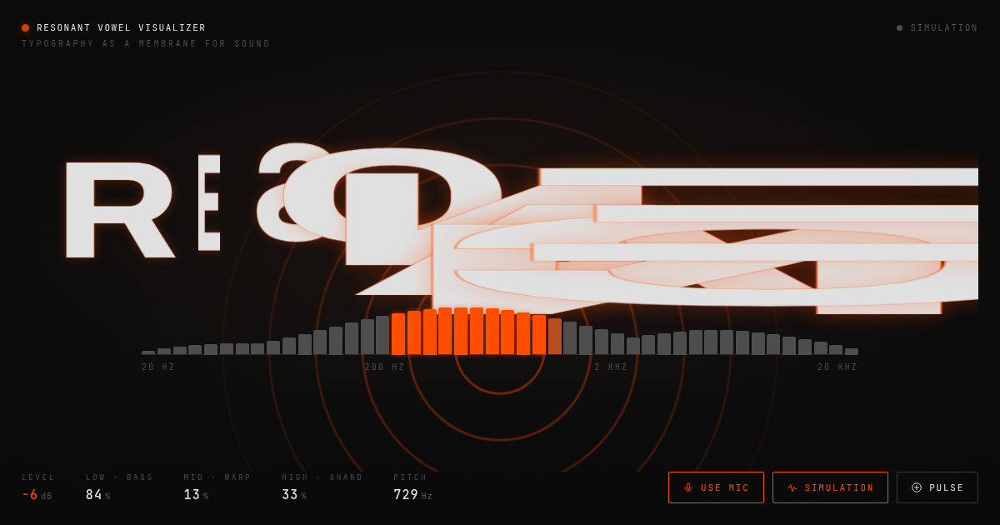 | `legacy` | — | — | — | — | — |
|  | `qwen3.8-flash-next`<br><sub>`chat`</sub> **(default)** | off | — | 7s | 9 | [open](prompts/concepts/resonant-vowel-visualizer/runs/qwen3-8-flash-next/demo/index.html) |
| | _Excellent execution of the 'membrane' concept, perfectly visualizing the kinetic typography rules with a strong atmospheric background and clear data visualization._ | | | | | |

---

### Slaked Lime Cure Timer

A status indicator that visualizes the slow carbonation of slaked lime, where a rough grey patch transforms into smooth white stone over time.

**Status:** polished · `material` `time` `stone` `progress` `carbonation` `concrete` `calm` `ui-component` · brief by `qwen3.8-flash-next`

[prompt](prompts/concepts/slaked-lime-cure-timer/prompt.md) · [extended](prompts/concepts/slaked-lime-cure-timer/prompt.full.md)

#### Model runs

| Preview | Model | Think | Ctx | Time | Score | Demo |
|:-------:|-------|:-----:|----:|-----:|------:|------|
| 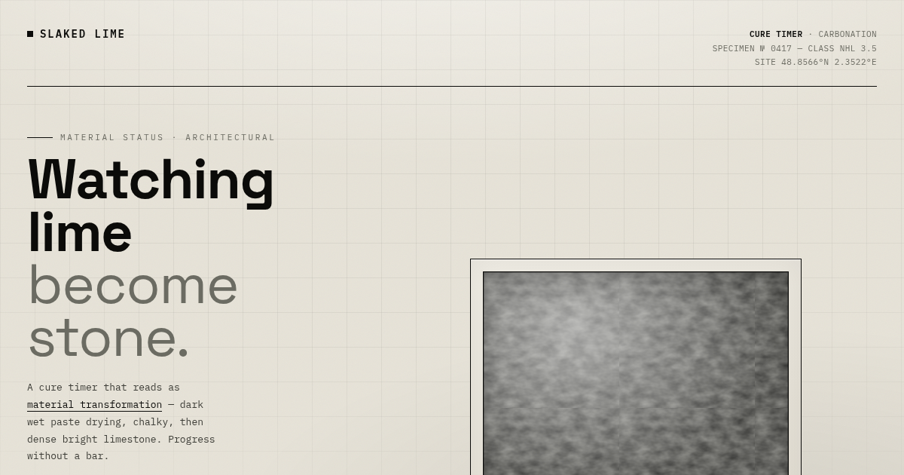 | `legacy` | — | — | — | — | — |
|  | `qwen3.8-flash-next`<br><sub>`chat`</sub> **(default)** | off | — | 7s | 8 | [open](prompts/concepts/slaked-lime-cure-timer/runs/qwen3-8-flash-next/demo/index.html) |
| | _Excellent execution of the 'material transformation' metaphor with a strong brutalist aesthetic and appropriate typography._ | | | | | |

---

### Soft Industrial Toolkit

Design toolkit blending soft UI radii with industrial material cues — aluminum, porcelain, quiet warning stripes.

**Status:** draft · `system` `industrial` `soft` `product` `tokens`

[prompt](prompts/concepts/soft-industrial-toolkit/prompt.md) · [extended](prompts/concepts/soft-industrial-toolkit/prompt.full.md)

#### Model runs

| Preview | Model | Think | Ctx | Time | Score | Demo |
|:-------:|-------|:-----:|----:|-----:|------:|------|
|  | `legacy` | — | — | — | — | — |
| 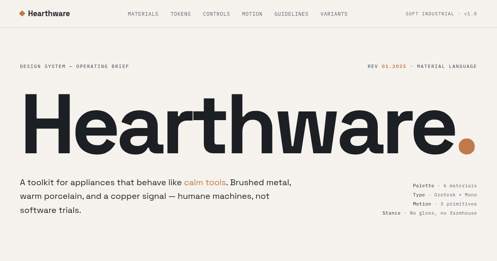 | `qwen3.8-flash-next`<br><sub>`chat`</sub> **(default)** | off | — | 6s | 9 | [open](prompts/concepts/soft-industrial-toolkit/runs/qwen3-8-flash-next/demo/index.html) |
| | _Excellent execution of the 'soft industrial' brief with a strong, machine-true typographic hero and a clean, token-focused layout._ | | | | | |

---

### Stamped Manifest Alignment

A digital document verification interface where users must manually align and 'stamp' approval marks. The stamp leaves an imperfect, ink-bleeding impression on textured paper.

**Status:** draft · `rubber-stamp` `ink-bleed` `logistics` `paper-texture` `verification` `manual` `clerk` `audit` · brief by `qwen3.8-flash-next`

[prompt](prompts/concepts/stamped-manifest-alignment/prompt.md) · [extended](prompts/concepts/stamped-manifest-alignment/prompt.full.md)

_No shot preview yet._

_No model runs yet — `npm run ai:build` then `npm run shots`._

---

### Sun-Bleached Textile Swatches

A digital fabric swatch selector featuring high-res textures of desert-worn textiles, with long shadows and natural light simulation.

**Status:** polished · `textile` `material` `desaturated` `texture` `swatch` `fashion` `arid` `natural-light` · brief by `qwen3.8-flash-next`

[prompt](prompts/concepts/sun-bleached-textile-swatches/prompt.md) · [extended](prompts/concepts/sun-bleached-textile-swatches/prompt.full.md)

#### Model runs

| Preview | Model | Think | Ctx | Time | Score | Demo |
|:-------:|-------|:-----:|----:|-----:|------:|------|
|  | `legacy` | — | — | — | — | — |
| 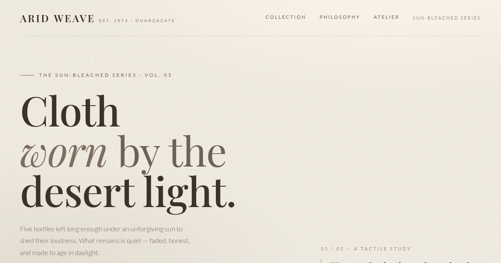 | `qwen3.8-flash-next`<br><sub>`chat`</sub> **(default)** | off | — | 6s | 8 | [open](prompts/concepts/sun-bleached-textile-swatches/runs/qwen3-8-flash-next/demo/index.html) |
| | _Excellent adherence to the 'sun-bleached' aesthetic with a sophisticated, editorial layout and perfect typography choices._ | | | | | |

---

### Typographic Tidal Lock

Celestial mechanics meets typography. Text orbits a central point, with speed and scale dictated by simulated gravity wells. A study in circular motion and hierarchical focus.

**Status:** polished · `orbital` `kinetic-type` `circular-text` `planetary` `minimalist` `css-animation` `space` `gravity` · brief by `qwen3.8-flash-next`

[prompt](prompts/concepts/typographic-tidal-lock/prompt.md) · [extended](prompts/concepts/typographic-tidal-lock/prompt.full.md)

#### Model runs

| Preview | Model | Think | Ctx | Time | Score | Demo |
|:-------:|-------|:-----:|----:|-----:|------:|------|
| 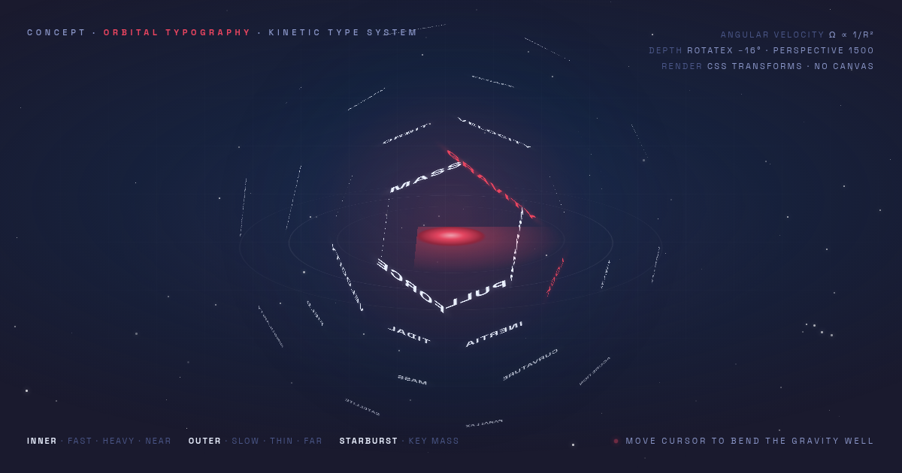 | `legacy` | — | — | — | — | — |
|  | `qwen3.8-flash-next`<br><sub>`chat`</sub> **(default)** | off | — | 8s | 8 | [open](prompts/concepts/typographic-tidal-lock/runs/qwen3-8-flash-next/demo/index.html) |
| | _A strong, atmospheric execution of the brief that successfully renders 3D orbital typography with depth and perspective._ | | | | | |

---

### Wet Leaf Surface Tension

Macro-view of dark, glossy leaves where water droplets form, merge, and roll off, revealing sharp reflections of moonlight and distorted background colors.

**Status:** polished · `surface-tension` `liquid` `botanical` `nocturnal` `reflection` `macro` `physics` `water` · brief by `qwen3.8-flash-next`

[prompt](prompts/concepts/wet-leaf-surface-tension/prompt.md) · [extended](prompts/concepts/wet-leaf-surface-tension/prompt.full.md)

#### Model runs

| Preview | Model | Think | Ctx | Time | Score | Demo |
|:-------:|-------|:-----:|----:|-----:|------:|------|
|  | `legacy` | — | — | — | — | — |
| 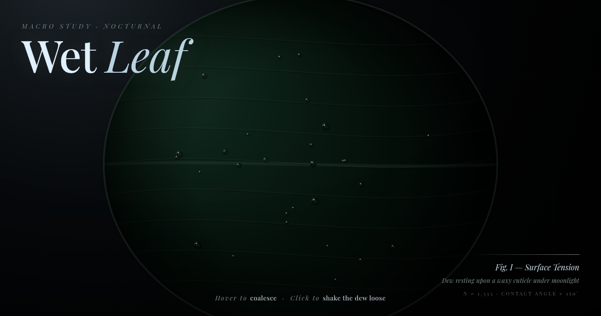 | `qwen3.8-flash-next`<br><sub>`chat`</sub> **(default)** | off | — | 7s | 9 | [open](prompts/concepts/wet-leaf-surface-tension/runs/qwen3-8-flash-next/demo/index.html) |
| | _Excellent adherence to the 'nocturnal macro' brief with realistic physics, atmospheric lighting, and sophisticated typography._ | | | | | |

---

### Woven Wire Loom Grid

A navigation grid where links are represented by taut steel wires that vibrate and weave over/under each other when hovered, mimicking a loom's tension.

**Status:** draft · `wire` `weave` `grid` `tactile` `interaction` `metal` `structure` `generative` · brief by `qwen3.8-flash-next`

[prompt](prompts/concepts/woven-wire-loom-grid/prompt.md) · [extended](prompts/concepts/woven-wire-loom-grid/prompt.full.md)

#### Model runs

| Preview | Model | Think | Ctx | Time | Score | Demo |
|:-------:|-------|:-----:|----:|-----:|------:|------|
| 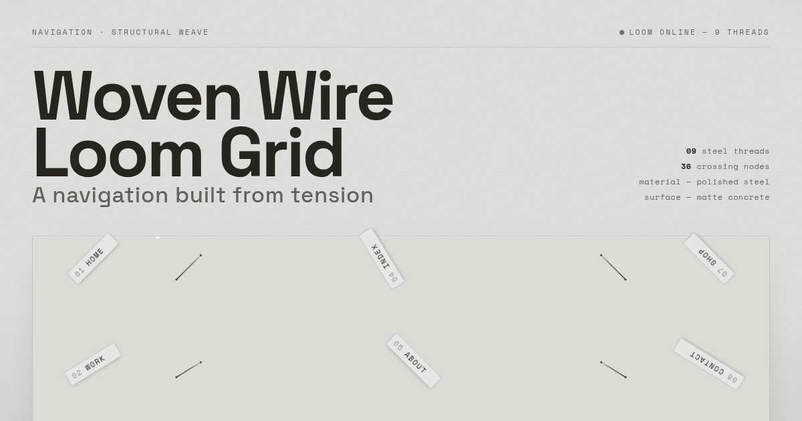 | `legacy` **(default)** | — | — | — | — | — |
| — | `qwen3.8-flash-next`<br><sub>`chat`</sub> | off | — | 190s | — | — |

---

## Repo layout

```
prompts/<category>/<id>/
  meta.yaml
  prompt.md / prompt.full.md
  preview: null until first shot
  runs/<model-slug>/
    meta.yaml                 # model + provider + timestamps
    demo/index.html           # implementation for THAT model
    preview.png               # screenshot for THAT model
```

## Automation

| Command | Purpose |
|---------|---------|
| `npm run ai:new` | New prompt briefs (stores `source_model`) |
| `npm run ai:build` | Build `runs/<model>/` demo (no overwrite across models) |
| `npm run shots` | Screenshot each run → README |
| `npm run review` | Vision score; below rebuild floor → drop demo + rebuild |
| `npm run pages` | Static site `site/dist` |
| `npm run pipeline` | build → shots → pages → index |
| `npm run build` | validate + regenerate README / index / catalog |

Other AIs should read `AGENTS.md` and write entries that pass `npm run build`.
